# Professional Forex Trading

You might have noticed that soo much of time you have accurate signals provided by your strategy but your trade doesnt works out, Its because 90% of retail traders rely heavily on the technical analysis.

What makes a professional trader different from retail trader is sentimental analysis, intermarket analysis, Fundamental analysis & Technical analysis etc.

Professional traders doesnt dedice the bias of trade with technicals but they get idea which side and asset to trade through the sentimental & intermarket analysis, they just use technical analysis for efficient entries & exists, despite any purpose for dedicing direction of the market or asset class.

### Analysis System (3 Step System)

1. **Market Overview (Sentimental & Intermarket Analysis) :-** We need to get high level overview of market with the help of sentimental & intermarket analysis which tells us what factors of forex market how they should be moving.
    
2. **Country Level Fundamentals (Fundamental, Policits & Society) :-** When we have soft bias with our sentimental analysis we need to have deep down look into the specifics of currency pairs or the fundamental factors which drives it to get clarity on trade idea which currency pair to trade, what side trade we are looking for etc.
   
3. **High Probability Technical Analysis :-** We should only use technical analysis to get efficient entries which doesnt have any relations to dedicing the direction of the market, that should come from step 1 & 2.

## Sentimental Analysis
How are the traders & investors feeling about the current & future economic enviornment which determines future direction of the market is called as sentimental analysis.

### Sentimental Enviornments

There is a scenario in finance for `risk-on` & `risk-off`, in the risk on situation people wants to take risk & grow their capital but in risk off enviornment people dont want to risk their money and preserve it as much as possible such as recession, pandemic etc.

There is state for uncentanity in sentimental analysis where people are not sure whats going to happen next, shall they risk or not and they are not having any idea about the future of the asset class thats called as uncertain enviornment.

### Why Sentimental Analysis matters?

Sentimental analysis is used by hedge funds & professional traders working in banks & it moves the market in short & long term.

FA & TA are usefull when the market conditions are normal but when market conditions are not normal, uncertain etc then sentimental analysis plays a huge role.

Its sometime not logical but it based on what kind of sentiments investors & traders are having at certain market condition is all about sentimental analysis.

IE

You can notice when earthquake hit in japan we might have thought that USDJPY will fall down due to destruction there but you can see price not went down, instead it went up. That's because sentimental issues in japan which made price move bullish where bearish was expected.

If we dont focus on SA we can get into so much silly trades.

It overrides FA & TA in such market conditions so we need to have idea of sentimental analysis as well, but we dont use FA & TA analysis we should only use it for confirmation.

### Factors affecting sentiments

In this section we will be understanding sudden changes in trend or what it takes to change the current direction of the market in the sentiment analysis.

**List of factors :-**

- **Major macro factors :-** This factors include the things of which everywhere the discussions are going on like War, Terrorism, elections, oil price surge, central bank unexpected actions which was not planned or predicted or pandemic etc. Things are in discussion in whole world due to unexpected event effects on sentiment sometimes which can cause reversals or change in the direction of assets.

- **Stage of economic cycle :-** (Expansion, Peak, Recession, Through phases)
  
  ---Need to learn from another tutorial---

- **Tweet from news source or big influencer :-** Any tweet from financial institutions or individual big influencer also cause shift in sentiments in the market.

### Sentimental Analysis Indicator

We can simply understand the market sentimentals by analysing S&P 500 but there is index which measures it called as `Fear Index (CBOE)`.

When the fear `index is below 20 people invest on risk on assets and those rally & risk off assets purges` & when `index is above 80 there is huge fear in market & people invest in risk off assets so it rallies & risk on assets purges`.

As you can see the above mentioned example risk index went above 80 in 2008 downfall as mentioned below.

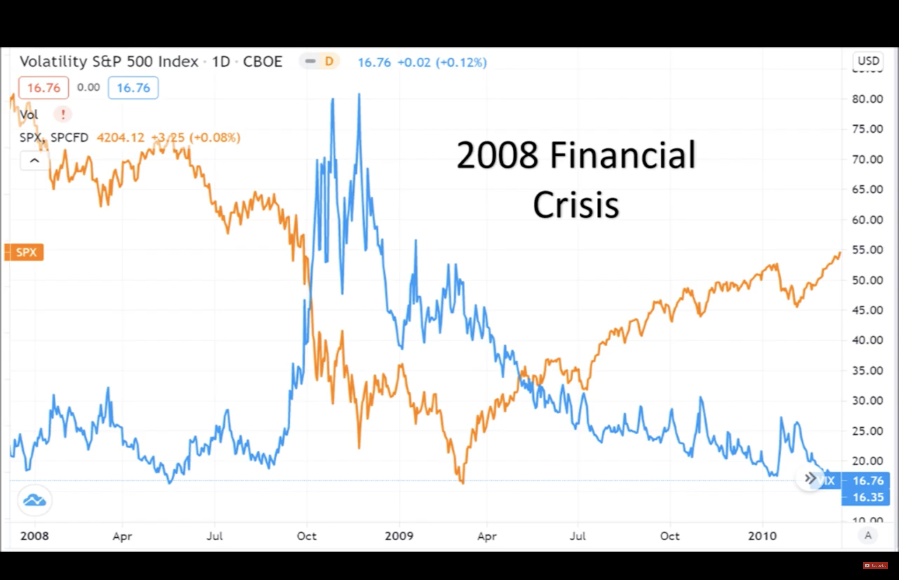

Which means there is inverse corelation between fear index & S&P500 as mentioned above.

You can notice this thorugh major events such as recession, elections, wars etc.

### COT Reports

It tells us what hedge funds & company commercials holding right now.

In the COT Index we look for non-commercial activities which represents activites of hedge funds which uses currencies for speculations whereas commercial hedge the currency futures to prevent their losses due to fluctuations in conversion rate.

We need to give attention to extreme spikes in cot report, % changes in positions & difference between short - long positions which gives us soft intimation if hedge funds are short or long.

### Leading Indicator

Stock markets leads the economy & bonds leads the stock market which gives us idea about the recession etc.

We focus on Inverted indicator which have predicted the recession about to come from past 50 years, we can prepare to buy undervalued currencies.

### How Forex Investors Works?

Investors in forex market borrow lower yeild currency to buy higher yield currencies or higher intrest rate differential.

Lets consider `AUD/JPY` in which AUD is higher yeild & higher risk currency as australia uses aud for exporting gold & metals and lower yeild OR lower risk currency as JPY.

If you can observe AUDJPY & S&P500 are having similar movements, when S&P500 surges AUDJPY also too vice versa, and by now you might have got idea that its not good idea to sell AUDJPY where S&P500 is surging already.

## Intermarket analysis

Intermarket analysis is defined as we comparing the forex market with bond, stocks markets is called as intermarket analysis.

Its just co-relation between the different markets with relative assets.

This co-relations can be short term of long term as well and we dont need to forget there can be break in co-relation if any event occurs, And it changes and doesnt last for longer, its mostly changes after deflation.

Hedge funds run algorithms which tracks the relationships for this relative indexes and trade based on it.

### Co-relations

**Types of co-relations :-**
There are types of co-relations whihc we need to understand before referring to any co-relations for any kind of our trade.

**Direction :-**
There are directionl co-relatinos such positive means same direction movement, negative means opposite direction movement and there is one more directional type which is random, but we only need to focus on positive & negative.

**Strength :-**

There are strength co-relations like strong likewise movement, weakly movement with co-related assets & medium movements with relative asset classes but we need to focus on strong & weak co-relations.

### 3 Ways to analyse the co-relations

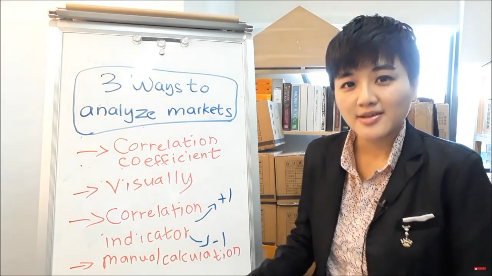

- **Co-relation coefficient :-**
  Co-relation coeficcient is the nubmer represented by mathematical calculations between 2 co-related asset classes and returns the values between `-1, 0 to +1`.

  - **Visually :-**
    We can have look on co-relative pairs visually about their movements through charts.

  - **Co-relation indicator :-**
    We can insert co-relation indicator in trading view which will represent the same visually.

    

  - **Manual Calculations :-**
    We can calculate it in excel by listing closing price of every day and using an `corelation` excel function which also returns the value between `-1, 0 to +1`.

### Strong Co-relations

When the co-relations are more than 80% postive & anything less than -80% is means its strong co-relation.

Not any assets are 100% co-related, so if we refer above example of 75/25 means this co-relative assets are 75% of times are co-related but 25% of times they are not.

### Co-relations to forex market
When we talk about the co-relatios to currency market we follow the below hirarchy between the asset classes.

1. **Other currency pairs :-** We give first priority to other currency paris itself, like if we consider the US & Canadian market, they trade together & if us economy is down it will impact the canadian market as well likewise with other pairs.
   
2. **Stock Market :-** The second priority we give to stock market, in the stock market we dont specifically look for specifc stocks but the dow jones which represents the stock market.

3. **Bond Market :-** The third priority we gives to bond market because due to its short term or long term yeild in risk-off or risk-on environment we can get idea of currency movements or projection as well.
   
4. **Commodities Market :-** At last we give priority to commodity market as well.

### Co-relations between currency pairs
Sometimes if we open positions in multiple currency pairs, we might expose more riks unknowingly because those co-related currency pairs moves relative same. 

If you want to hedge the positions you need to size in with efficient capital allocation in inversly co-related currency pairs.

**AUDJPY & CADJPY :-**

Now lets consider the example of `AUDJPY & CADJPY` AUD is higher risk currency pairs due to its intrest rates & australia is maojor exporter of commodities such as gold, iron & copper & jpy is safe heaven, similarly CAD is higher risk currency pair due to its intrest rate & jpy is safe heaven and moreover canada is major exporter of oil as well. `Important :-These currency pair moves up when market conditions are good & down when market conditions are bad and moves relatively similar & their corelation index is more than 80%`

**EURUSD, GBPUSD :-**

USD Index represents the strength of USD & quite US market economy, if its strong like bullish `EURUSD / GBPUSD` like currency paris are move weakly like bearish.

Mainly the currency pairs having USD as quote currency are inversly co-related to USD index.

**USDJPY, USDCHF :-**

The currency paris are having USD as base currency are relative co-related to USD index.

**Contradictory Position Mistake :-**
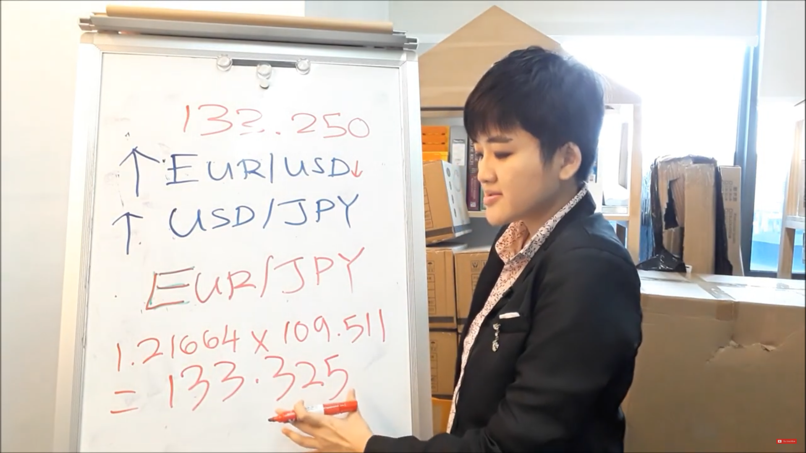

As mentinoed in above example if you are planing to long `EURUSD & USDJPY` is not good idea, because this 2 pairs are inversely corlated and we can see usd is at base currency in one pair & at quote currency in anther one.

But if you want to go with such position due to some reason like `sentimental analysis, intermarket analysis & fundamental analysis` you can go ahead with `EURJPY` so you dont need to open 2 different position, and `EURJPY = EURUSD + USDJPY` prices.

### Co-relation between currency & stock, bonds & commodities

The co-relation between currency, stock & bonds is quite similar & postive, it moves in same direction of these specific to the currency pair.

If we take example of `AUDJPY` if the economy & market conditions are good then stocks, bonds will grow togeter and also the currency pair `AUDJPY` will grow together too, But as australia exports the hold itself comodity prices will follow along togeter because comoddoties exported by country and its currency pair follow along together.

**How Bond leads stock market & commodities** :-

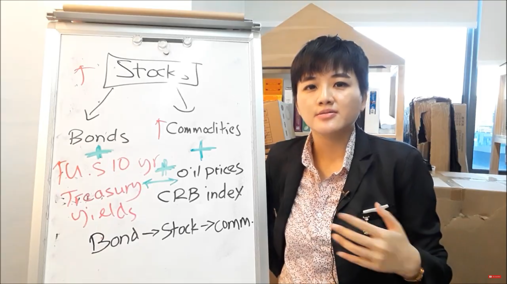
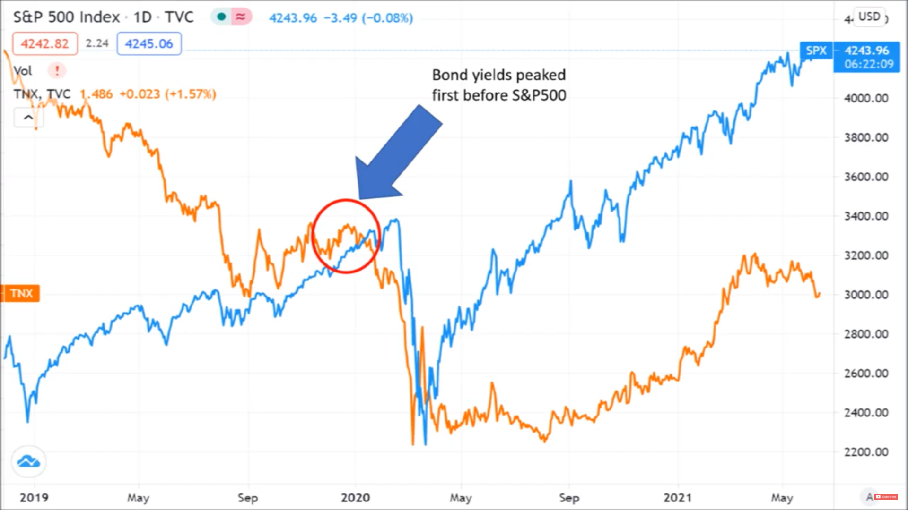

Usually bond market leads the us stock market & there is important thing we should take note of is `in the recession time bonds take u turn first and then the stock market follows and commodity market follow along with stock market`

### Co-relation between DAX & CRB Index

When USD gets stronger commodities gets cheaper and as USD is their quote currency they move in opposite direction, which means CRB Index which is commodities index is inversely co-related to DAX.

### Co-relation between NZD/JPY to S&P500

As NZD/JPY is higher yeild currency & commodity expiring currency when it will be bullish it will drag the commodity market with it & stocks market will follow the commodity market in this situatoin.

### Co-relation between CRB Index & EURUSD

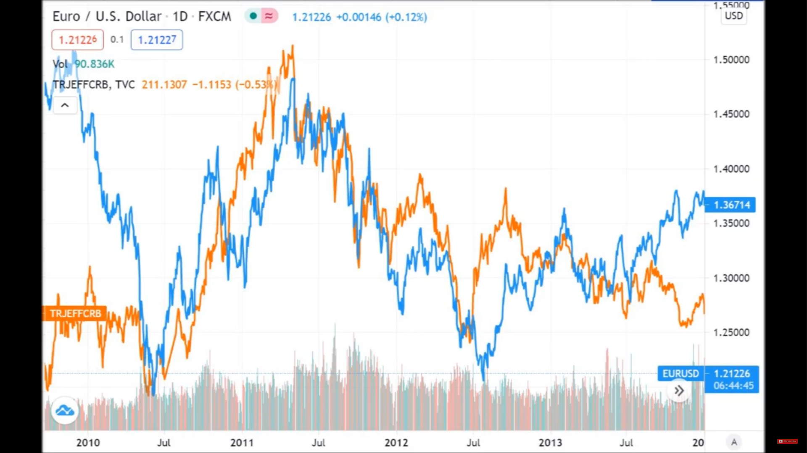

The co-relation between this ones is positive because CRB Index is inversely co-related with USD which is quote currency of EURUSD whcih make it positively corelated with CRB Index.

### Co-relation between US Tresury bond, OIL & Golds

The co-relation between us 10 years tresury bond & oil is positive as bonds drives teh stock market which drives the commodity market with it.

But when it comes to gold, gold is safe heaven for investors when the bond market & stock market are down, where the investors gonna park their money???? Its Gold so gold is inversely corelated to stock market & bond market due to its safe heaven charecteristics.

### Co-relation between GBPUSD & UK Oil

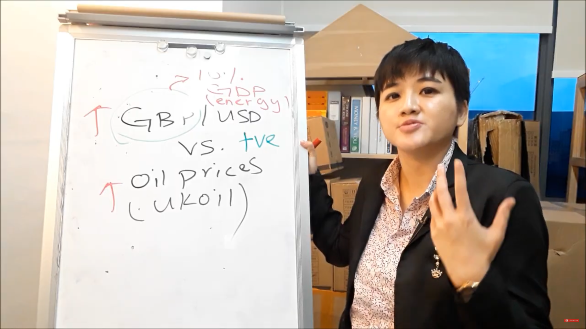

As you know UK exports the oil & we are looking for the same currency pairs so rising crude oil prices of brent benifits the countries economy & these 2 are positively co-related.

## Fundamental Analysis

### Factors that drives forex market

In this section we will understand the fundamental factors that drives the forex market.

- Economic Data (NFP, Intrest rates, Inflation etc.) :-
- Political Events (Elections) :-
- Commodity prices :-
- Central Banks :-
- Technical Levels :-
- Society & Ad-hoc events :-
- Stock Market :-
- Natural disasters & foreign affairs :-
- Supply & demand :-
- Currency Regimes :-
- Technical Levels :-
- Market Sentiment :-

### How to become good fundamental analyst

- **Have a long term trading horizon (Weeks, Months) :-** Short term moves comes in the market due to speculators & emotional trading but in long term fundamentals moves the price. Even if you are scalper, day trader you need to understand the big picture.

- **Use Fundamental factors to generate ideas :-** Our basis of direction should come from fundamental analysis.

- **Investor Mindset :-** We might need to hold our trades to weeks, months in terms of longer moves.

- **Understand the factors that drive the market :-**

- **Delta of fundamentals matter more than absolute numbers :-** Retail traders make mistake for trading based on absolute numbers like its positive or negative but if number is positive but if its less than last month currency can still go down, so we need to focus more on % change and as compared to its past values.

- **Take note of market expections :-** We need to keep eye on news which can drive the traders sentimate it can move the markets.

### Forex Regimes (Exchange Rate Regimes)
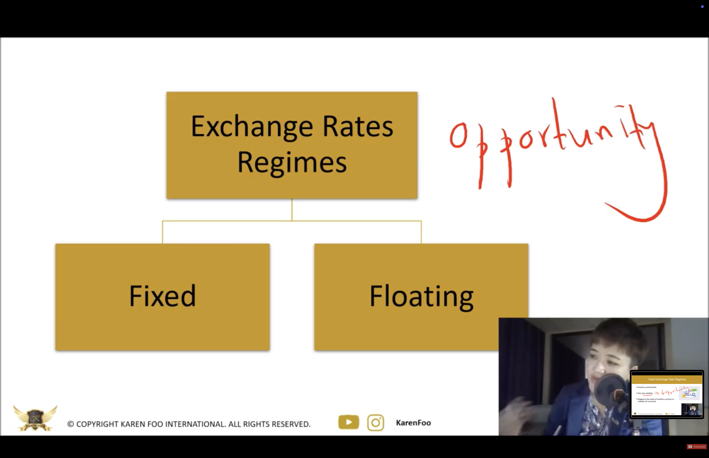

Basically there are 2 types of regimes such as fixed regimes & floating regimes based on which we get to know about the opportunities in forex pairs & we can get to know is there any opportunities or not.

- **Fixes Regime :-** 
  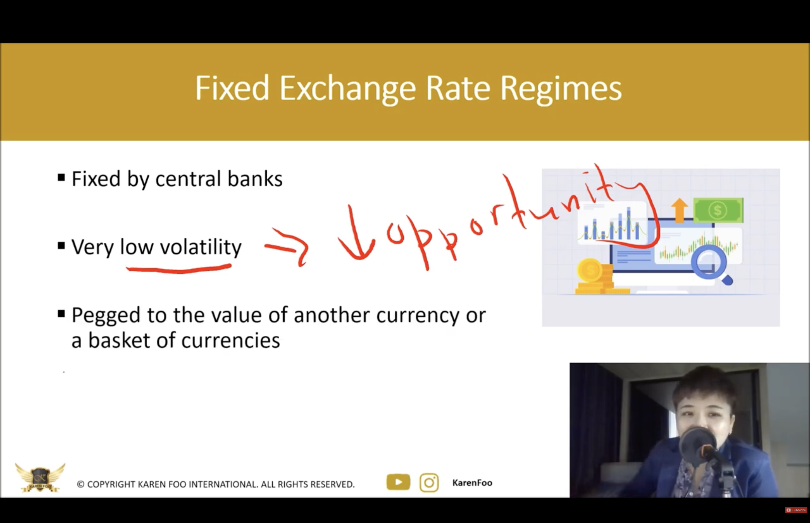
  

  Fixed regime currency is not the good choice for trading because they are mostly very less volatile & very less probability of speculative opportunities in it due to it. Exchange rate is usually fixed by central banks.

  Its only provides the advantage if we are in imports/exports business, its very expensive to maintain as central banks needs to buy it in billions.

  Ex : Chinese Yen, Honkong Dollar & Singapore Dollar.

- **Flating Regime :-**
  

  Floating regieme currency paris moves freely according to market drivers, We can say these floats depends on market conditions, macro events etc.

  Invervention is still possible for this regieme by central banks. Intervations is moving the currency pairs.

### Economic & Financial Theories

Currency drives floating regieme currencies based on economic factors.

**Purchasing power parity (PPP) :-**
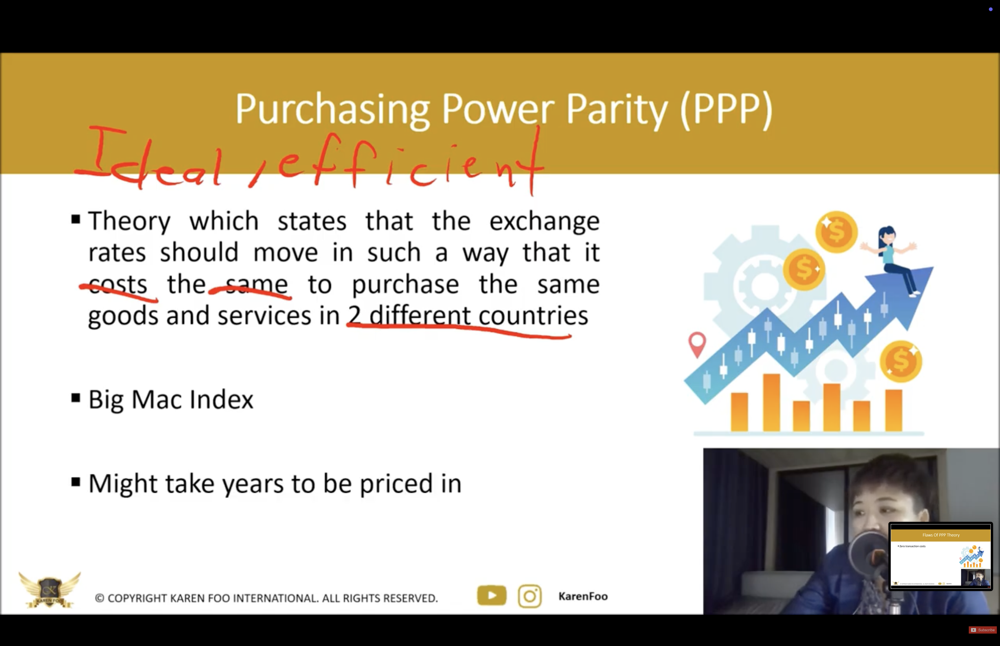
Purchasing power parity which staets exchange rates should move in such way that it costs the same to purchase the same goods and services in 2 different countries.

Ex : Hamburger should cost the same in 2 countries.

We follow the Big Mac Index for the same, It takes years to price in.

But in reality it doesnt operate, people get goods at cheap from china & vietnam & sell in other countries but we need to focus on PPP as it helps t forcast the price in long term. 

**Assumptions about PPP :-**
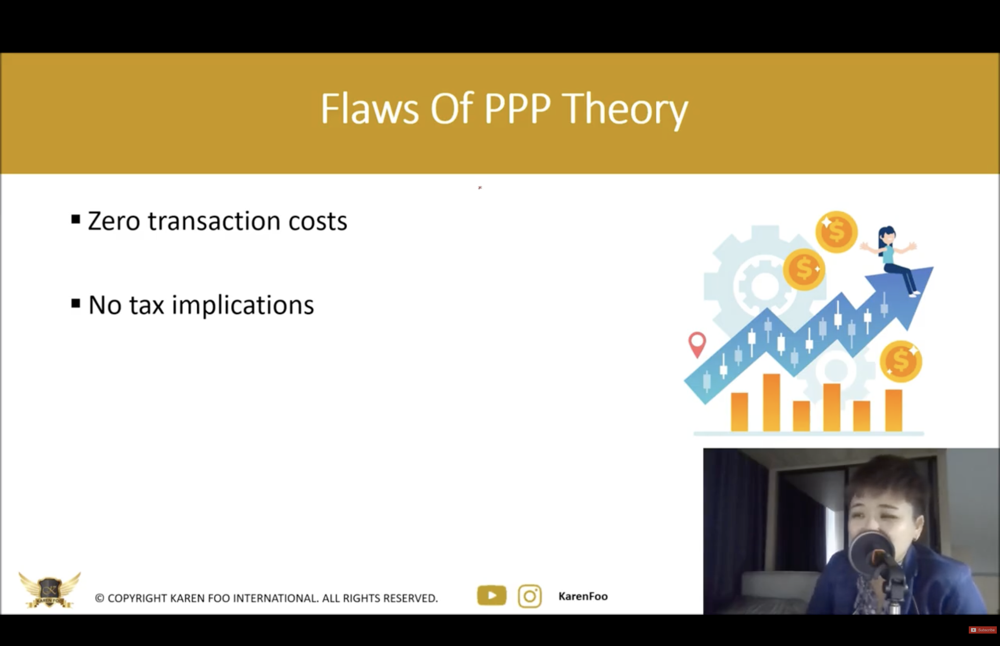
- Zero implication costs which is not practical because we incur the shipping cost.
- No tax implication but whenver we buy & sell we need to pay the taxes.

- **Intrest Rate Parity :-** 
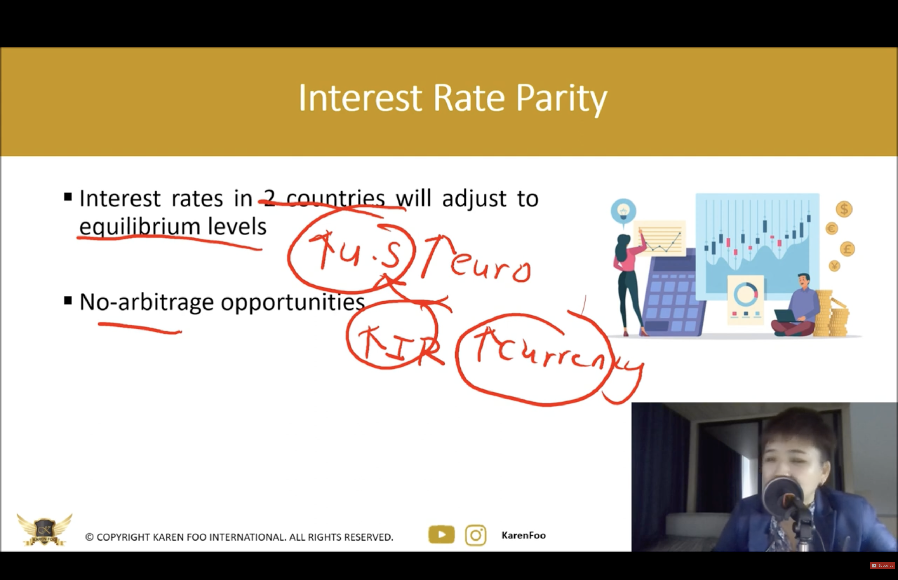

It defined as Intrest rates in 2 countries will adjust to equilibrium levels as there should be any arbitrade opportunitites.

For Ex IF USD/EUR in this USD have higher intrest rate eurusd will adjust to the equilibrium & countries with higher intrest depecriates but in the real world countries wiht higher intrest rate appriciates.

### Impacts of intrest rate on economics

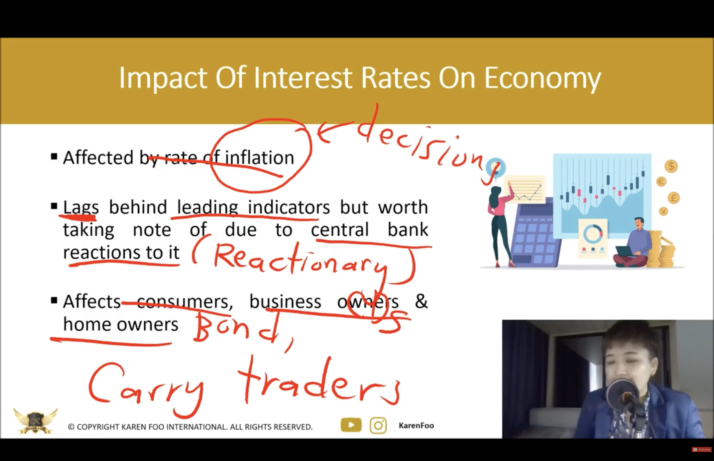

Intrest rates get impacted based on inflation numbers because central banks adjust it based on it. 

Intrest Rates, CPI, PPI are lagging indicators but we should consider the chnages it as central banks reacts to it.

Its generally impacts everyone in the economy, for the consumer who opt for the loans it impacts negatively but postively to the investors as they invest into bonds such as fixed deposit bonds etc & good for long term forex traders.

### What traders should look at in fundamentals

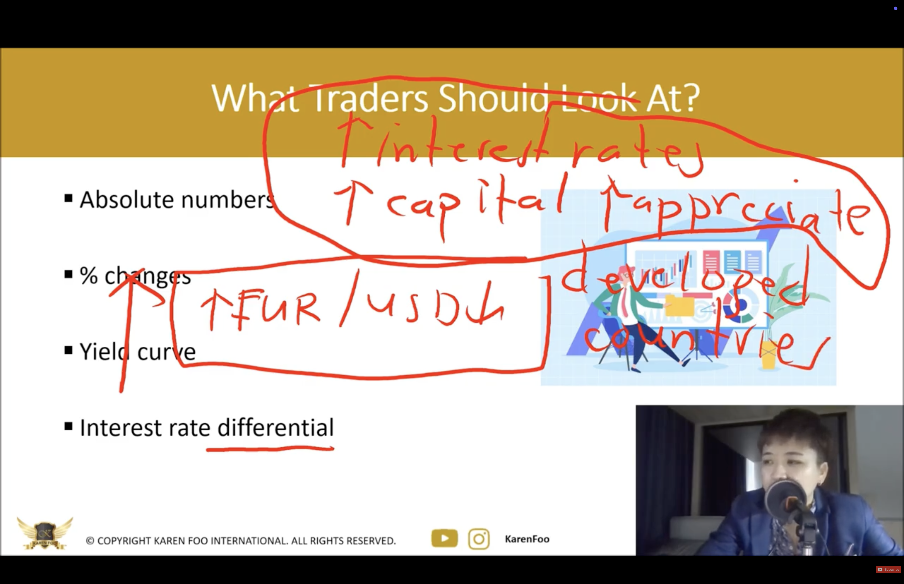

When we are observing the data such as PPI, CPI or intrest rates we should not much give attention to absolute nubmers but the % chnages from last numbers.

As we have considered example of `EUR/USD` if EUR intrest rates are higher than more people will invest money into it & it will bullish or value for its conversion will increase in long term.

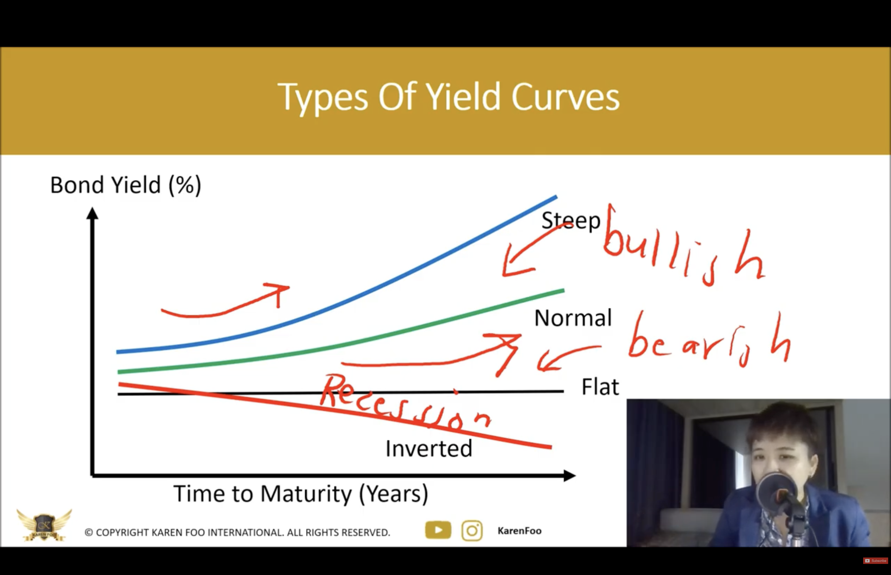

We should focus on Bond Yeild curve, normally long term bond yeilds are more than short term bond yeilds but when short term bond yeilds are more than long term or when we see inverted yeild curve we are entering into recession which we get to know before it comes.

**Intrest Rate Differential :-**

We should focus on 2 countries debt instruments like government bonds & we should focus on the intrest rate differntial.

If the intrest rates are differential is positive currency pairs tend to follow it & move upwards, if its negative then it tends to follow & move donwards.

`GBP/USD` follows the movement strongly, like if the intrest rate differential between UK & USD GBPUSD will tend to move according to it in midium term & long term.

`USDJPY` also tends to follow the intrest rate differential in medium & long terms.

`Note :- Based on intrest rate differential we can predict the upcoming movement in currency pair & Its leading indicator in forex market.`

### Inflation Differential

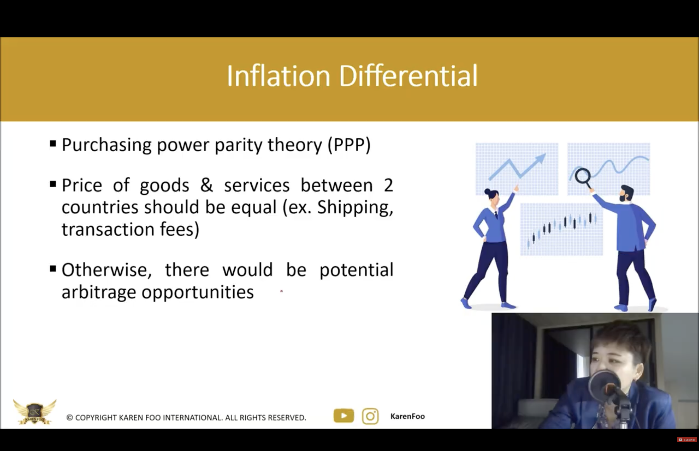
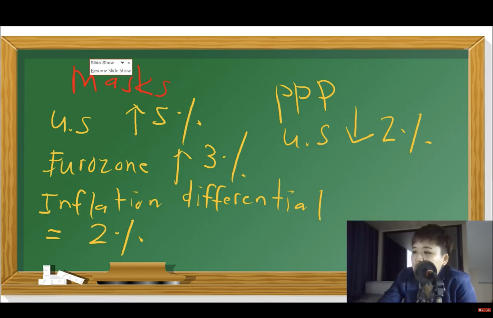

As we have studied about the PPP inflation differential is the same, if the inflation in one country is higher than other it should equilibrium or adjust to equal But in reality it doesnt work like that, its just the theory.

For Ex If we see the example of mask prices in US & EURO IN US if its 5% & in EUR its 3% then according to PPP US % should come down by 2% but it doesnt happen reality. The difference between this 2 countries price is called as inflation differential.

### Balance of Payment (BOP Model)

According to this theory If the BOP for country is positive currency should be positive in movement & if its negative currnecy prices should be negative.

The BOP is calculated based on SUM of Capital Account + Current Account.

We get to know here the `Trade Surplus & Trade Deficit` where trade surplus is the scneario where exports are more than the imports in the country & Trade deficit is the scenario where the imports are more than the exports.

According to theory Current Account should be equal to Capital account but in the real world things are different & more flexible and far from the theory.

**Impacts of BOP on Forex market & exchange rate :-**

As we have saw earlier if BOP is postive currency moves bullish & bearish if BOP is negative but We should more focus on relative % or numbers.

Which means if the BOP last month was positive but this month it doest meet the expected numbers or comes less that that despite being positive BOP currency can move downside. because it mostly depend on how the actual numbers are as compared to the expected outputs.

### Impacts of Policies on Exchange Rates

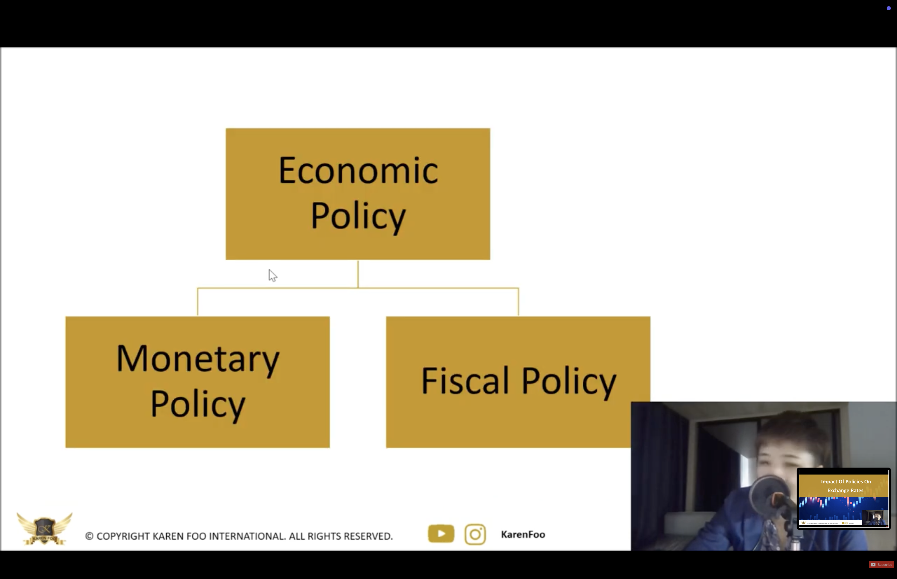

In this section we will see the impact of economic policies on exchange rates of currencies.

**Types of Economic Policies :-**

- **Monetary Policy :-**
  
  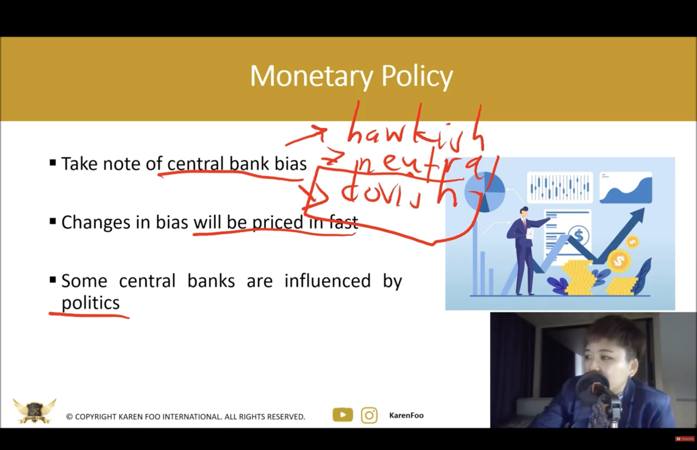

  Monetory policy decides cost of factors around the money like intrest rates, savings rates, morgates rates etc , as we have studied earlier the more intrest rates country will have more investors will comes in and more capital will flow into that country.

  Its basically reflection of growth & inflation, Central banks takes certain actions towards the growth & inflation like they can change their reserve requirement which is minimum amount of reserve commercial banks should have.

  Normally we should take notes of central bank bias through speeches or conferences in which they put some hints in it, as soon as traders or instituation get hints about it they capitalize in it already. Thats why sometimes even after the intrest rates announced we dont see much of the movements in exchange rates.

  Some central banks are influenced by politics because politics in the country wants central banks to keep the intrest rates as low as possible so policitical leaders can borrow more money. But some countries have independant central banks on which politics dont have any influence on them.
  
- **Fiscal Policy :-**
  In this section we will not be talking about FISCAL Policies.

**Types of Monetory Policies :-**
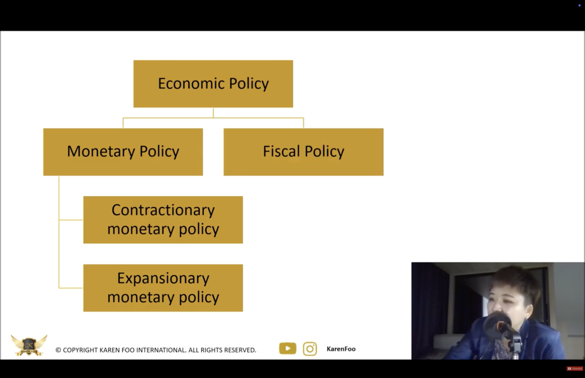

- **Expansionary Economic Policies :-**
  

  Expansionary monetory policies are policies through which central banks stimulates the economy for encouraging spending, borrowing & investment by cutting the intrest rates.

  When they cut the intrest rates people borrows more money & spend more.

  This kind of policies are made in recessions due to increase the spending elevate the economy.

- **Contractionary Economic Policies :-**
  
  
  Contractionary monetory policies are opposite of expansionary monetory policies, When the inflation is growing faster than normal rate the scneario is called as overheating economy or fast economy growth.

  Central banks tighens the borrowing restrictions, increase the intrest rates due to which there would be less money supply in economy which reduces inflation due to less demand, less money, less spending.

**Functions of monetory policies :-**

The main functions of monetory policies are Controlling inflations, Improve the employement rate, correcting the balance of payment & Achieve higher economic growth by tightening monetory policies, Because the country have higher inflation rate reduces the amount of profit & profits gets eaten by inflation, if its less then more money flows into the countries as it will serve more profits to the investors.

**Monetory Policy Tools :-**

Reserve Ratio, Changing discount Rates, Influencing Commercial banks, Fed funds rate, Quantitative Easing(Buying government bonds with printed cash) are the major tools central banks uses for monetory policies.

### FED (Federal Reserve System) 

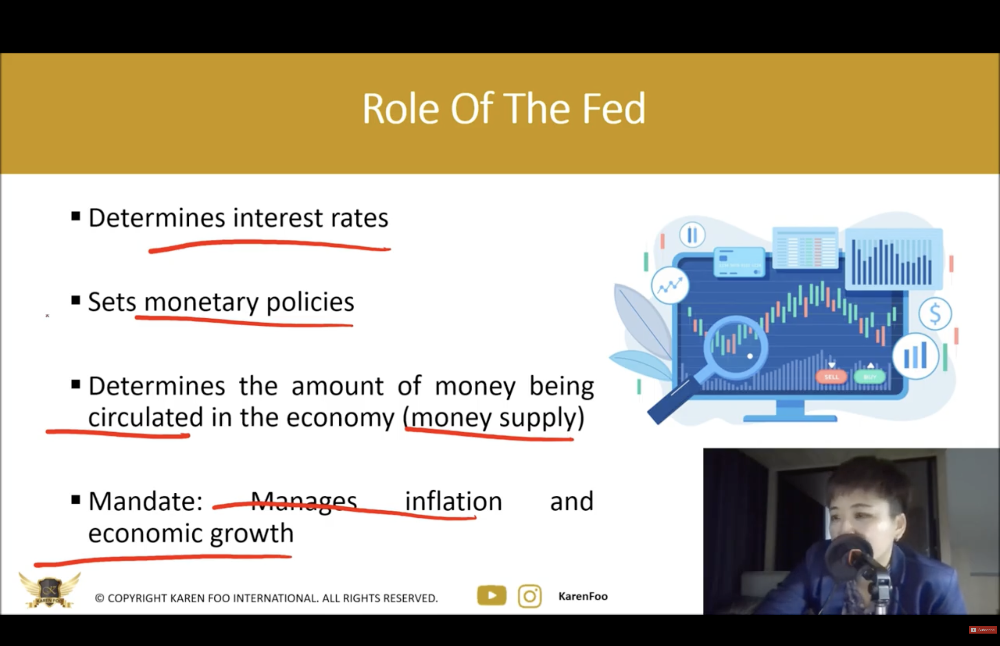

FED is one of the most important central banks which have responsibilities to manage the intrest rates, keep inflation in control, determines the money supply in economy & manages mostly inflation & economic growth by setting monetory policies.

### Centrak Bank Intervention

Its unconventional form of monetory policies.

Centrla bank intervention is the scneario in which central banks prints money & purchases the government-corporate bonds, mortgage-backed securities and other assets to inject money in the economy & increase the supply of money in the economy.

**Effects on interventions :-**

  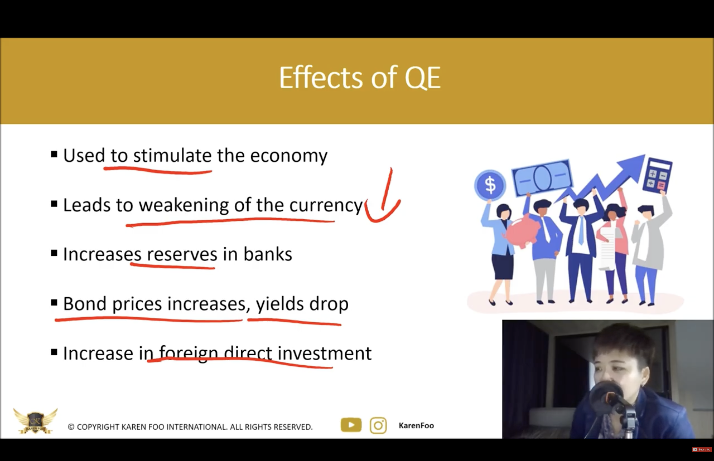

  `Whenever the intervention happens it leads to weakning of currency & currency prices drop.`

  As it purchases the bonds from the open market, bond prices increases & yeidls drop as it becomes more expensive less people will buy the bonds.

  It increases in direct foreign investments as they have surplus cash with them due to interventions.

### Market moving economic indicators

As you can see earlier we need to understand that Consumer Confidence Increases They purchase more products from businesses whcih increases the production acvities & for increasing production companies hire more. Due to hiring people have good salary or money in their hands which they can invest in stocks, currencies & they tend to rally due to it.

Countries have differnt contribution their GDP from manifacturing acvities ie Manifacturing sector contributes more in Japan but less in US so we the importance of any fundamental indciators & its impacts on countries depends on the contribution of that specific fundamental in their countries GDP.

- **NFP (Lagging Indicator):-**
  

  Non-farm payroll is the very popular fundamental indicator in retail forex traders, Its no of people getting employeed & unemployeed in the prior month.

  It excludes the workers in farms, government employees, private household employees, non-profit organization employees etc.

  Its released first friday of every month at ET 8:30AM & IST 6:00PM.

  Its lagging indicator, If we trade based on it we might win once in while if we are lucky but we will loose in the long term.

  It contributes 80% of US GDP due to which its very volatile & majority of forex traders & investors speculate on this opportunities.

  `If NFP numbers are greater than forecast its positive for currency & if its less than forecast its negative for it`

  

  NFP is very volatile & its better to avoid trading in this enviornment, Very few traders can make profits out of it. 

  Its not leading indicator but FED reacts to it so we need to keep look on it & Higher NFP indicates economic growth or potential inflation.

- **Purchasing Manager Index (Leading Indicator) :-**

  - **Manifacturing Sector :-**
  
    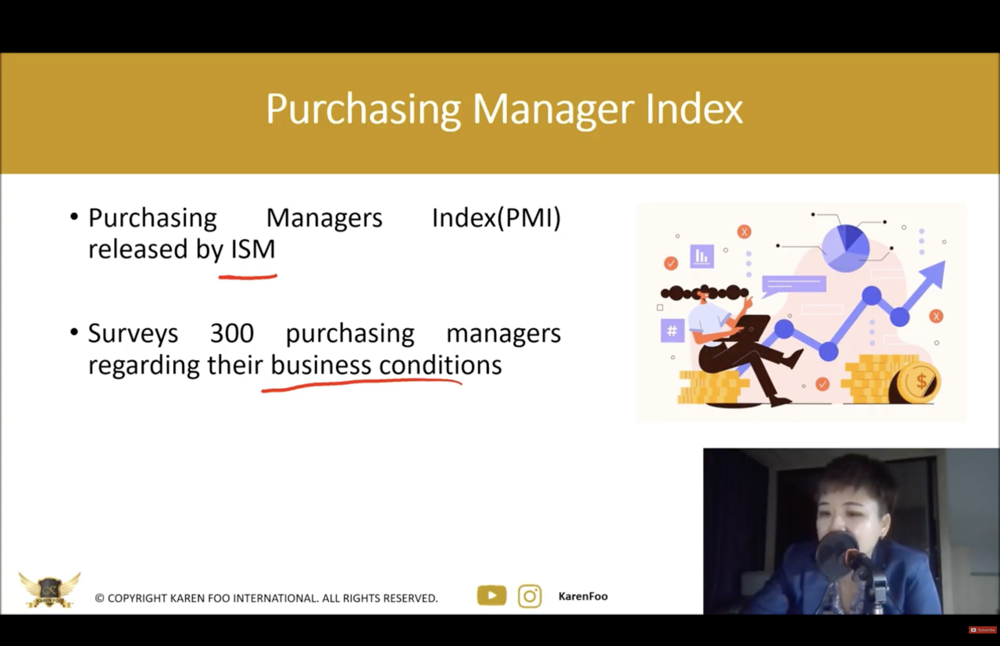
    

    Purchasing manager index is the report of survey of 300 purchasing managers regarding their busines conditions. It lot more depends on retailer, if retailers are ordering more their busienss grows & when retailers arent doing good then its impacts the businesses.

    Its published by ISM & Released `ET 10AM & IST 7:30PM on first working day of the month`.

    It contributes 20% of US GDP & its usefull leading indicator for future economic growth. If ISM > 50 shows the industrial expansion & ISM < 50 Industrial contraction and we can keep note on PMI for projecting future price of currency paris as its leading indecator.

  - **Non-Manifacturing Sector :-**
  
    Its same as PMI which we earlier saw but in this case survey of 300 manager happens in services sector for their business condition & Its less cyclic as compared to Manifacturing PMI.

     Its published by ISM & Released `ET 10AM & IST 7:30PM on first Wednesday day of the month for prelim figures & Final reports are published at end of the month`.

     We need to keep one thing in mind that It contributes 80% of the US GDP.

  `If PMI numbers are greater than forecast its positive for currency & if its less than forecast its negative for it`

- **Retail Sales (Leading Indicator) :-**
  
  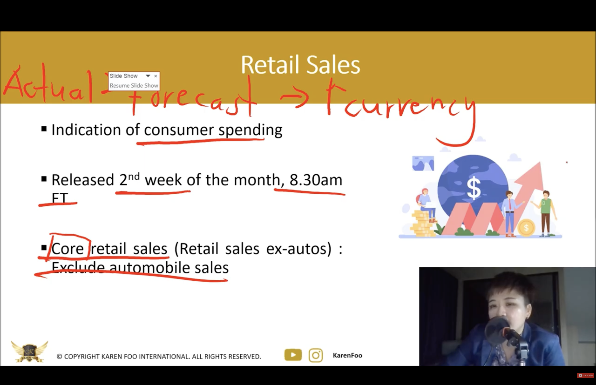

  Retail Sales numbers indicates consumer spending, As consumer sentimate drives economy, drives spending & business. It also gives idea of job market because if people have jobs more spending would be there.

  Its released `2nd Week of the month ET 8:30AM & IST 6:00PM`.
  
  When we core retail sales its not including automobile sales & factors like weather, crisis & gas prices can affect the retail sales as people wont got out for purchasing goods.

  Too much of retail sales is also not good because if lots of stuff imported is being sold then it harms the USD than benifits the USD as us importing the good from outside & spending USD on it.

   `If Retail Sales numbers are greater than forecast its positive for currency & if its less than forecast its negative for it`

- **Gross Domestic Products :-**
  
  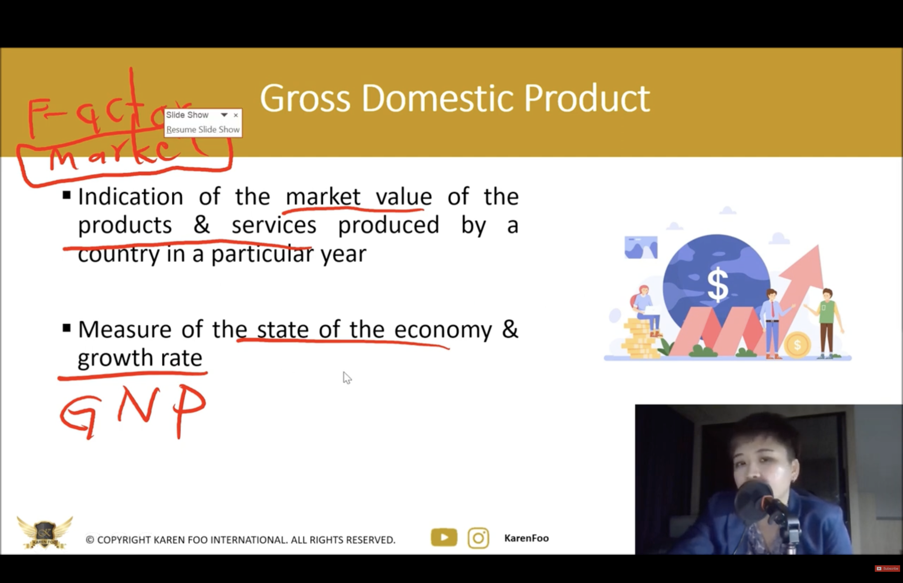
  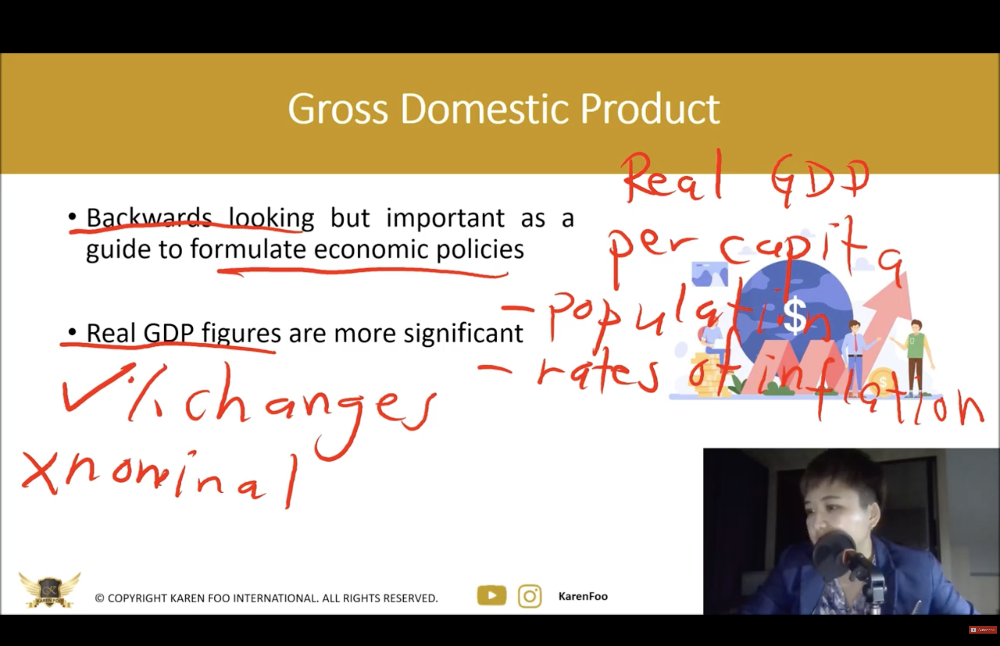

  GDP is nothing but the market value of total goods & services produced by a country in perticular year. There are different types of GDP like GDP based on factor prices & market prices to make things simple lets focus on market price GDP.

  Basically it tells us how the economy doing in perticular country within that perticular year & its growth rate.

  Its a backward looking data what has been done in the country in past year but its important because its considered to formulate economic policies. 

  Real GDP figure are good but we need to look into % changes rather than exact values, whenever we are comparing the GPD among the countries we need to focus on GDP income per capita because no of factors effect gdp like population, earning descripencies between individuals etc.

- **University of Michegan Consumer Sentiment Index (UMCSI) :-**

   Its measure of financial confidence of 500 consumers which provides ideas on future spending behaviour & It have medium to high impact on forex market.

   It released in 2 chunks, `ET 10AM & IST 7:30PM on second friday of the month & last friday of the month on same timings.`

   `If UMCSI numbers are greater than forecast its positive for currency & if its less than forecast its negative for it`

   

- **Trade Balance :-**
  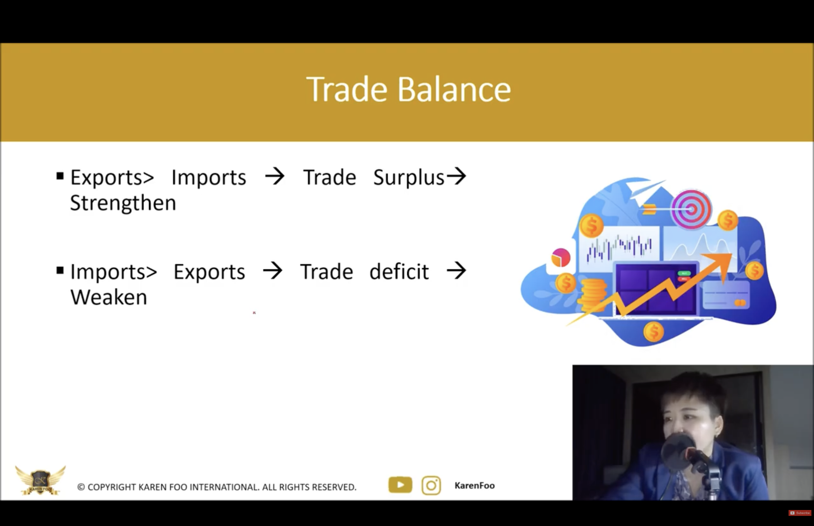

  As we have saw earlier When exports are more than imports we have trade surplus & When imports are more than imports then we have trade deficit.

  In Trade surplus condition currency strengths & in trade deficit Currency weakens.

  In real world when sometimes trade balance decreases currency can still go up so we need to focus on other factors calculatively before making any decisions.

- **Fiscal Balance :-**
  

  Fiscal also known as government budget, Its the difference between the revenue government gets from the taxes & its expenses.

  When the spending is more than revenue its fiscal deficit & when the revenue is more than spending then its fiscal surplus.

  `Pay attention to this one because it was major factors in financial crisis in past like 2008 market crash or financial debt crisis in europe`

### How to Master Fundamental Analysis

  

