# FOREX
If we breakdown the word For Ex stands for For Exchange which menas exchange of currencies from one to another. In the forex we trade in currencies and its pairs.

**Benifits Over other markets :-**
- 24 x 5 market timings means 24hours we can trade on weekdays.
- Highest liquidity market in the world.
- Most Volatile market in the world.
- Low trading costs as per equity markets.

## Basics
### Currency Structure

In the currency symbol the world have standard to represent their currencies in 3 letters which followed by all countries.

`Ex : - USD, GBP. EUR`

In the currency symbol the first letter indicates to country name and last letter represents the currency which is dollar, euro, yen etc.

### Major currencies

In the forex market there are 180+ currencies but we should only trade in major currencies due to their high liquidity and low swap. If you trade in another currencies you can blow up your account due to high swap, expensive charges and due to not that much liquidity.

We should only trade in majour currencies in the market as like mentioned below.'

**Currencies :-**
1. USD - Us dollar
2. EUR - European euro
3. GBP - Great britan pound
4. CHF - Swiss Franc
5. AUD - Australian Dollar 
6. CAD - Canadian Dollar
7. NZD - New Zealand Dollar
8. JPY - Japanese Yen


The forex traders as welll have their Nicknames to not other people know about their talkings bro. So the code words for the currencies would be as like mentioned below.

**Currencies with Nick names :-**
1. USD - Buck
2. EUR - Fibre
3. GBP - Cable
4. CHF - Swissy
5. AUD - Aussie
6. CAD - Loonie
7. NZD - Kiwi
8. JPY - Yen

### Currency Pair
Its combination of 2 different currencies, The exchange rate between currencies is between `first(base)` and `second currency(quoted)`.


### Difference between currency structure and currency pair structure

In the currency symbol like `USD` first 2 charecters are the country and last character is its currency.

But in the currency Pair symbol first currency called as base currency, and the second currency called as quoted currency.

Buying and selling currency pair is the buying one currency and selling another or selling one currency and buying other. Currency transaction can't be unidireactional so we can only trade in currency pairs due to bidirectional transaction in between 2 currencies.

**EURUSD**

- `Buy :-` In the EURUSD buying means buying EUR and selling USD.

- `Sell :-` In the EURUSD selling means selling EUR and buying USD.

### Major Currency Pairs

Major currency pairs are the most commonly traded currency pairs in the forex market. They consist of the currencies of the world's largest economies and are highly liquid, with tight bid-ask spreads and low volatility compared to exotic currency pairs. The major currency pairs are:


**Major Currency Pairs :-**
- EUR/USD (Euro/U.S. Dollar)
- USD/JPY (U.S. Dollar/Japanese Yen)
- GBP/USD (Great British Pound/U.S. Dollar)
- USD/CHF (U.S. Dollar/Swiss Franc)
- AUD/USD (Australian Dollar/U.S. Dollar)
- USD/CAD (U.S. Dollar/Canadian Dollar)
- NZD/USD (New Zealand Dollar/U.S. Dollar)

These currency pairs are widely traded by forex traders and are often used as a benchmark to compare the performance of other currency pairs. 

### Cross Currency Pairs
Cross currency pairs, also known as minor currency pairs, are currency pairs that do not involve the U.S. dollar as either the base or quote currency. In other words, they represent the exchange rate between two non-U.S. dollar currencies.

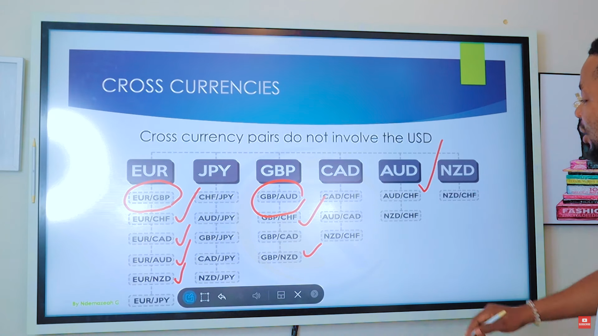

**Examples of Cross Currency Pairs :-**

- EUR/GBP (Euro/Great British Pound)
- GBP/JPY (Great British Pound/Japanese Yen)
- EUR/JPY (Euro/Japanese Yen)
- AUD/CAD (Australian Dollar/Canadian Dollar)
- NZD/JPY (New Zealand Dollar/Japanese Yen)
- CAD/CHF (Canadian Dollar/Swiss Franc)

Cross currency pairs tend to have wider bid-ask spreads and higher volatility compared to major currency pairs, due to their lower liquidity and market depth. 

### Exotic Currency Pairs
Exotic currency pairs are currency pairs that include one major currency and one currency from an emerging or less developed economy. These currency pairs are less frequently traded in the forex market compared to major currency pairs, and they typically have wider bid-ask spreads and higher volatility.

**Examples of exotic currency pairs include :-**

- USD/MXN (U.S. dollar/Mexican peso)
- USD/BRL (U.S. dollar/Brazilian real)
- USD/ZAR (U.S. dollar/South African rand)
- USD/TRY (U.S. dollar/Turkish lira)
- USD/HKD (U.S. dollar/Hong Kong dollar)

Exotic currency pairs can offer higher potential returns, but they also come with greater risk due to their lower liquidity and higher volatility. As a result, traders should exercise caution when trading exotic currency pairs and should carefully manage their risk exposure.

### Exchange Rate

Exchange rates are the rates which we need to pay for purchasing one instance of a currency.

**Ex :-** 

- If we want to buy one USD with the payment in euro and exchange rate is `1.212` then we need to pay `1.212` Euro for purchasing 1 USD, which means exchnage rate is the price which we need to pay to buy or sell once instance of an currency.

**How Exchange rate determines and how it moves :-**

The exchange rates are determined by the demans and supply of currencies. In the currency pairs price movements totally depends on base currency.

**Ex :-** 

- `USDCHF` if usd's demand is increasing then the exchange rates would be increased and if supply would be increased then the exchange rates would be decreased.

**Fixed Exchange Rate :-**

Some of the currencies have their fixed exchange rates like zimbwaain dollar is having `100 trillion` on its single note and its exchange rate supposed to be 1 billion then no matter how demand or supply gets increased, The exchange rate would be still same.

### Fun facts of exchange rates

There are some unlogical fun facts as well regarding the exchange rates are as mentioned below.

- The Most valuable currency in the world is `KWD (kuwaiti dinar)` where `1 KWD` worth of `$3.30`.

- `GBP (British Pound)` Even after being used most currencies is USD which is most demanded currency in the world is worlds's is 10th strongest currency.

- The least valuable currency in the world is Iranian Rial, where `1 USD = 43000 IRR`

- The British pound sterling is the oldest currency in the world.


### 90/90/90 Rule

90% of people loose their 90% of account balance in first 90 days.
BID PRICE.  
### Fundamentals of forex

There are some terminologies used in forex market for different concepts as follwing.

- **Quote :-**

    Quote is the exchange rate to exchage quote currency into base currency.

    In simple words How much we need to pay of quote currency to purchase 1 instance of base currency as like mentioned below.

    `USDCAD = 1.20300` In this quote For purchasing 1 USD we need to pay 1.20300 times of CAD and thats called as quote of USDCAD.

- **BID Price & ASK Price :-**

    The price on which buyers want to buy the currency pair is called as `BID PRICE.`

    The price on on which sellers want to sell the currency pair is called as `ASK PRICE`.


    ```
    Symbol     Quote     Bid price  Ask price
    USDEUR     1.20323   1.20320    1.20325
    ```

    In the above Quote current exchange rate is `1.20323` but liquidity is present on `1.20320` and `1.20325`.

    When you will market buy you will buy the currency Market price rate you will end up buying on the current bid price rather than current exchange rage, And when you sell the currency pair you will be selling at the current ask price which would be the current exchange rate most probably.

- **Spread :-**

    The difference between the bid price and the ask price is called as `spread` which is in terms of `PIPS`.

- **Pips :-**

    Pips are the smallest price movement in exchange rate of currency pair.

    Its the unit of denoting movement in the currency pair.


**Positions :-**

- **Long position :-**

    When you buy the currency pair then you are holding will be called as `Long position`.

- **Short position :-**

    When you sell the currency pair then you are holding will be called as `Short position`.

- **Flat position :-**

    When you not holding any position like buying or selling in trade is called as `Flat position`.

### Pips and points (Pippets or Fractional Pips)

Pips are the smallest price movement in exchange rate of currency pair which is used to denote the movement in exchange rate in quote.

`Ex : 1.2012 or 1123.20`

In the above example pips breakdown is as follwing.

**1.2012 :-**

Below order we taken from last decimal.
- **2** - 2 pips
- **1 :-** 10 pips
- **0 :-** 100 pips
- **2 :-** 2000 pips
- **1 :-** 10000 pips

**1123.20 :-**

Below order we taken from last decimal.

- **0 :-** 0 pips
- **2 :-** 20 pips
- **3 :-** 300 pips
- **2 :-** 2000 pips
- **1 :-** 10000 pips
- **1 :-** 100000 pips


**Points (Fractional Pips or Pippets) :-**

When the smallest movement in the quote exchange rate is not in the pips its even smaller than pip then its called as Points which moves on ever tick.

`Ex : 240.123 or 1.42567`

**240.123 :-**

Below order we taken from last decimal.

- **3 :-** 3 points or 0.3 pips
- **2 :-** 2 pips
- **1 :-** 10 pips
- **0 :-** 100 pips
- **4 :-** 4000 pips
- **2 :-** 20000 pips


**1.42567 :-**

Below order we taken from last decimal.

- **7 :-** 7 points or 0.3 pips
- **6 :-** 6 pips
- **5 :-** 50 pips
- **2 :-** 200 pips
- **4 :-** 4000 pips
- **1 :-** 10000 pips


**How to calculate pips over points :-**

`Pips = points / 10` 

EX : `10 Pips = 100 points / 10 `


**How to calculate points over pips :-**

`Points = pips * 10` 

EX : `100 points = 10 pips * 10 `

There is `1:10 Ratio for Pips to points` and `10:1 Ratio for points to pip`

### Forex Lot Sizes
Forex get traded in lot's, We cant buy the single `USD` or `EUR` we need to buy and sell the currency pairs in lots.

**Lot sizes in forex :-**

- `Nano (0.001) :-` Nano lot have size of `100` units of base currency.

- `Micro (0.01) :-` Micro lot have size of `1,000` units of base currency.

- `Mini (0.1):-` Mini lot have size of `10,000` units of base currency.

- `Standerd (1):-` Standerd lot have size of `1,00,000` units of base currency.

### Levarge

As we have seen above the lot sizes of forex we will need huge amount of money around `1,00,000` dollar to buy even an standerd lot which is not possible for an normal people so forex brokers provide leaverage with which you can take bigger amount trades with minimum amount of money. 

Normally brokers provide the leaverage of `1:500` which means we can trade with `5,00,000` around with `5 standerd lot's` with the just the amount of `1,000` dollars in your account.


As we can take bigger trades with the less monet we need to keep the thing in the mind that the bigger lot would be we would be able to achieve more profits with even small movements but we need to keep in the mind that we will have bigger losses too, the leaverage is 2 facing sword so until having experience and risk management we should not trade with leavarge.

### Price drivers in forex
As we know forex market moves upward or downward on the basis of demand and supply ideally, If the demand would be more than supply it will move upward and if supply is more than the demand it will move downward in the terms of currency pairs or any forex entity.


**Important Forex Drivers :-**

- `Demand and Supply :-`

    Most important forex drivers are the demand and supply for that forex entity.

- `Fundamentals :-`

    Most probably forex market is driven with the help of demand and supply but after that `Fundamentals` is the most important factors like `CPI` `GDP` based on the events.

- `Speculative (Central banks and hedge funds):-`

- `Monetary Policy (Currency Intervation):-`


### Risk Management
In every kind of trading we need to have an risk management stratgy which we need to follow throughout the process to not let you blow up your accounts in such short period of times.

With the risk management we can achieve our short term as well as long term trading goals.

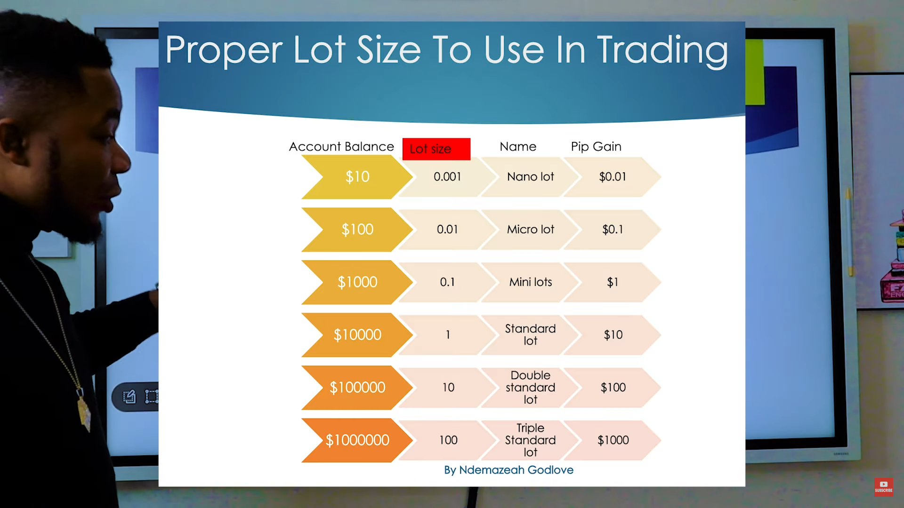

**Right Lot sizes for capital's :-**

- **10$ :-** `0.001 Lot` Nano Lot is the best lot to trade on this capital.

- **100$ :-** `0.01 Lot` Micro Lot is the best lot to trade on this capital.

- **1000$ :-** `0.1 Lot` Mini Lot is the best lot to trade on this capital.

- **10000$ :-** `1 Lot` Standard Lot is the best lot to trade on this capital.

- **100000$ :-**  `10 Lot` Double digit Standard Lot is the best lot to trade on this capital.

- **1000000$ :-** `100 Lot` Triple digit Standard Lot is the best lot to trade on this capital.


**Loss Management:-**

Ideally we should take `2%` risk of our account capital per trade, But if we have huge budget and our risk apetite is more for the good trade then we can increase it till `5%` of the capital amount.


### Order Types
We have different order types in the forex market for executing the trade and  managin the trade as well.

Order Types are defined in the 2 types of category as like mentioned below.

1. **Trade Execution Order Types :-**

    Trade execution order are the types of order by which you can execute the orders on the different scenarios as like mentioned below.

    - **Buy & Sell Market Orders:-**

        We take the positon at the curent price in the market, In the market we some times we want to take position at current market price or earliest available price for execution of the trade.

        With the help of market orders we can take entry in trade anytime and we can exit our trades if we get to know its not going the way we expects.

    - **Buy Limit & Sell Limit:-**

        Limit orders are the types of orders to take entry at perticular levels of the price from where there is possiblity of reversal. 

        We cant place the buy limit order higher than the current price with buy limit or we cant place the sell limit order lower then current price.

        To achive that we need to place buy stop or sell stop orders for that purpose.

        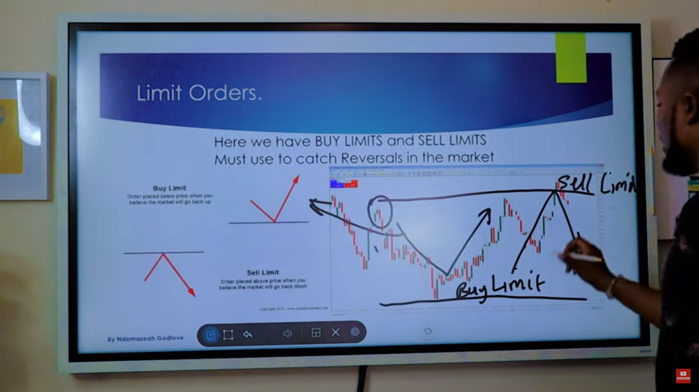

        With the help of `Buy and Sell Limit` we can choose the price levels on support or resistance for the reversal of market and we can take the entry on that exact price point in the trade.

    - **Buy Stop & Sell Stop :-**

        Stop orders are the types of order to take entry at perticular levels of price if trend continues beyond that level. This

        We cant place the buy stop order lower than the current price or we cant place the sell stop order higher then current price.

        To achieve that we need to place sell limit and buy limit orders for that purpose.

        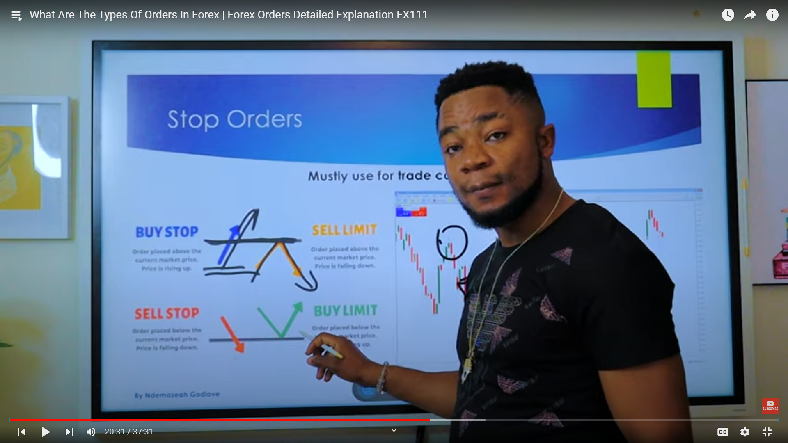

        With the help of `Buy & Sell Stop` we can choose to enter in trade if some price levels crosses while continuation of trend, and we can make money with the continuation trend.

2. **Trade Management Order Types :-**

    Trade management are the order types in which we manage the trade moreover rather than executing the trade or taking position at some price point in the market.
    - **Stop Loss:-**

        Stop loss is the order type in which we can prevent our losses as per our risk apetite if trade doesn't goes the way we think.

        We have to place stop loss for each and every order in the forex market due to its high volatility and volume of the global market.

    - **Trailing Stop Loss :-**

        Trailing Stop loss is the order type to prevent our profits if trade goes right first but after making some profit it goes against us, In that case it will prevent your profit by taking your stop loss above of your previous levels so you will be remaining with some profit atleast rather than hitting oss and blowing up the account.

        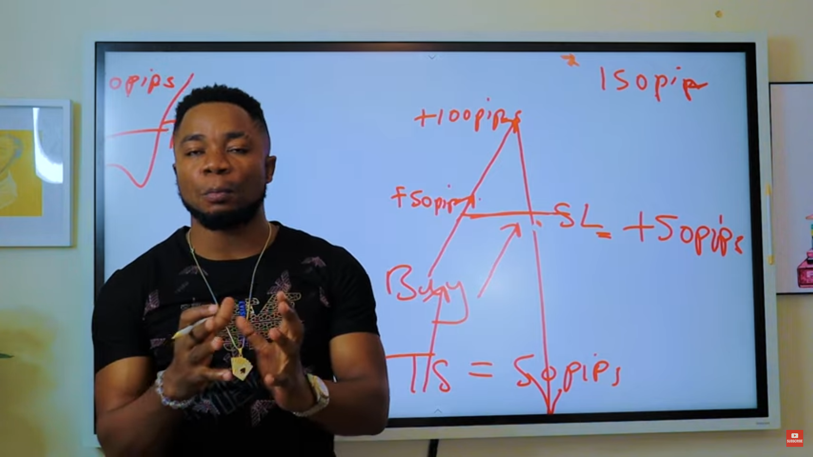

        We should figure out the number of pips to trail the stop loss first then only we should provide the input value in the terms of pips. 

## Intermediator

### FX Quadrant for being an profitable trader

You can become professional trader by learning a lot about the forex which would not be necessarily profitable but for being an profitable trader is our goal.

In the journey of being an profitable trader we need to keep in the mind about the forex quardrants before starting live trading.


**4 Parts of Quadrants :-**

1. **S (Skills) :-** 
    First we need to Focus on basics of forex trading including what is forex, currency pairs, Currency Structure etc.

    We need to be introduced to history of forex markets as well and most importantly the standards like what are market movers, industry leaders etc.

2. **S (Strategy):-** 

    Strategy quardrant plays major role about our actions. Strategies can be divided in to 4 parts as followed.

    - **R (Reason):-**  Reason to enter the trade like to catch bearish, bullish momentum, falldown due to news etc.
    - **E (Entry):-**  Whats the points of our entry in trade like supports, moving averages, double bottoms etc. 
    - **S (Stops):-** We should be predetermine the placement of stop loss as well along with strategy before executing trade.
    - **T (Targets):-**  Targets with the strategy should be clear enough in the terms of pips before entering the trade.

    Before using or while learning any strategy we should be clear about the rest parameters about that stragy which gives us the clarity of trade.

3. **R (Risk Management):-** 

    Risk Management defines about our risk management of our trading capital, like how many trades we want to take within that capital.

    **Risk Capital :-** How much percentage of capital we can risk on that perticular trade which wont affects our psychologically, emotionally or mentally.

    **Risk per trade :-** Before starting live trading we should be clear about the risk management deines the risk and reward per trade.

4. **P (Trading Psychology):-** 

    Trading psychology is crucial part of trading journey. As human beings whenever we risk our hard earned money on the line then our emotions gets involved which can make us take entry or exit the trades due to emotions.

    We need to control our emotions in such situations and we need to stick the process, strategy and fundamentals purely by keeping calm and keeping emotions under control.

### Forex Sessions

Even though forex market is open 24 hours in which it consists of 4 region sessions which porvided combine 24 hours of trading capabilities.

We are going to study the trading sessions according to indian time zone which is `GMT+5:30` as following.

**Trading Sessions :-**

1. **Australian Session (Sydney) :-**

    Sydney session starts at early morning `5:30AM` to afternoon `12:00PM`.

2. **Asian Session (Tokyo) :-**

    Tokyo session starts at early morning `5:30AM` to afternoon `2:30PM`.

3. **Europian Session (London) :-**

    London session starts at afternoon `12:30PM` to `8:30PM`.

4. **American Session (New York) :-**

    New Yoru session starts at evening `5:30PM` to mignight `2:30PM`


### Trading Sessions Overlapping

The best timings to trade in forex when 2 trading sessions overlap & we can define the best currency pairs as well according to overlaps to trade in which would have highest liquidity & volume moreover active trading sessions.

**Trading Session Overlaps :-**

- **Australian-Asian overlap (Sydney-Tokyo):-**

    It happens at early morning `6:00AM` to `8:00PM`.

    In this overlap sydney session is starts to winding down and tokyo session is starting this increases trading activity `JPY` consisting currency pairs.

    **Active Currency Pairs :-**

    1. AUDJPY
    2. AUDNZD
    3. AUDCHF

- **Asian-Europian overlap (London-Tokyo):-**

    It happens at afternoon `12:30PM`  to `2:30PM`.

    In this overlap london session is starting & tokyo session is still active which increases trading activity in `GBP` & `JPY` consisting currency pairs.

    **Active Currency Pairs :-**

    1. GBPJPY

- **Europian-American overlap overlap (London-New York):-**

    It Happens at evening `5:30PM` to early night `9:30PM`.

    In this overlap Both of the major markets overlaps due to starting of New york session and winding up of london session which increases trading activity in `USD`,`CAD` & `GBP` consisting pairs.

    **Active Currency Pairs :-**

    1. GBPUSD
    2. USDCAD   
    3. GBPCAD

### Key Charecteristics of trading sessions

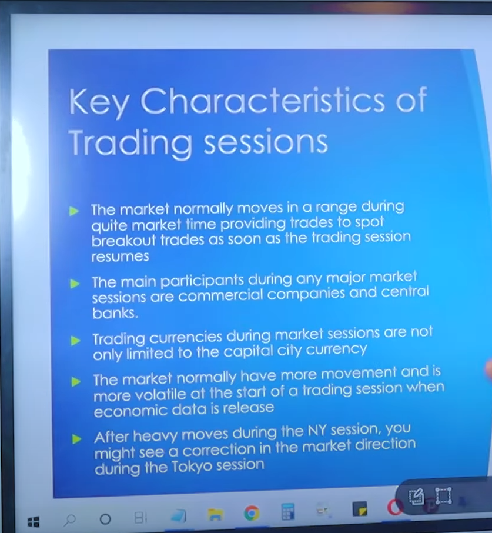

1. The market moves in a range during quite market sessions but we can spot breakouts & breakdowns when session overlapping happens due to hight volatility.

2. In the major forex overlaps the main participants are commercial companies and central banks.

3. Trading currencies are not only limited to capital currencies.

4. The market have more movement & volatility at the start of the trading session when economic data is released like NFP etc.

5. After heavy moves in new york sessions market tends to make corrections in market-direction in tokyo session.


### Best Days of week for forex trading IST

As we have studied about the best time to trade forex according to IST we have best days of week to trade in forex as well.

Which means on those days you will get the activity & volatility in the trading pairs.

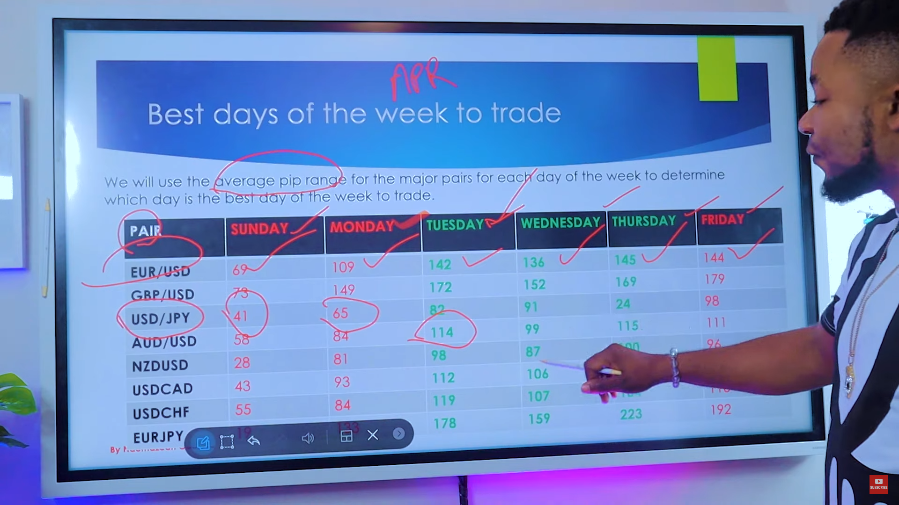

On sunday & monday due to inactivity of new york session on weekend & most of the banks are still maintain their balance sheets, payouts and all other other stuff so the major banks and leaders are not much active on sundays & mondays normally.

In the forex trading no one likes to hold the currency pairs and get charged with sweep charges, and also banks and all major firms wrap up their accountings on the friday before the buissness to calculate their weekly profit and their other financial activies so due to all of this friday are also not great day to trade in forex.

**Best Days of week to trade forex :-**

1. Tuesday
2. Wednsday
3. Thursday

### Worst time to trade (Avoid the market)

As we have best times to trade with sessions and days of week we need take precaution of the worst times as well. 

such worst times can lead us blowing up our account.

**Worst Times to trade :-**

- **News events :-**

    After the news gets released on perticular events which can impact currency pairs it brings huge volatility in the market, untill and unless you have learned the news trading along with strategies you should avoid the market in this times.

- **Quiet market :-**

    There are some times when the forex markets are totally quite and not major markets are active then market have highest spreads like `10 to 50 PIPS` which is totally `500 Points` which is enough to blow up your accounts. This

    At such times even if you enter in trade by leaveraging the account & due to high spreads `just by clicking buy & sell` can blow up our account.

    After our account balance gets 0, trades get automatically get closed, and you will end up loosing all the money.

- **Holidays :-**

    During holidays we shouldnt be trading in the market due to inactivity and low volumes.

    Forex markets are only have 2 official holidays in which there is no movements in the market. `Christmas & New Year` are this 2 holidays in forex market.


### How To Manage Your Time As Forex Trader

As being as forex trader descipline is most improtant thing in trading, our real life personality reflects in our trading lifestyle and `descipline` is the key to become an profitable trader.

**Key Points to manage our time & build descipline :-**

1. Every forex trader should know when to trade & when not to trade, when there is not much activity in the market then we also should focus on our personal lives.

2. Have a good `Peacefull` sleep, which will lead us to good health. You should not end up having knowledge about the forex but with unhealthy lifestyle which will also cause our psychology & emotions.

3. Setting Goals, Targets day, week, month based will lead us to achieve our goals & will give us the clarity of path to achieve those goals.

4. Prioritize your time to chart studies & also fundamental learnings. Consistantly learning and improving yourself day by day only can lead us profitablity.

5. Take some time off from trading after your huge profits to reset your psychology & emotions to live and balance your life.

6. If you have day job stick to the market in your free time, where you can totally focus your trading and master the currencies along with market session falls in your free time.

### Forex Accounting

Its very important to understand the forex accounting which consists of some important terms as like account balance, margin call, floating profits/losses, margin level etc as like menitoned below.

**Terimonologies :-**

- **Account Balance :-** 
    
    The available balance for trading out of amount deposited in your account is called as Account Balance.

- **Floating Profit/Loss :-** 
    
    The floating term defines unrealized which is not booked yet eithr loos or profit is called as Floating profit/ loss. In simple words when we have open trades some of in profits or some of in loss then that profits and losses for those oepn orders are called floating(Unrealised) Profit/Loss.

- **Leaverage :-** 
    
    The amount which provided by the broker itself to be able to trade in forex even with such low deposits by mulitiplying that money 100-500 times as ratio of `1:100 - 1:500` is called as leaverage.

- **Margin :-** 
    
    As we discussed earlier forex brokers provides leaverage on our deposited amount which totally depends on brokers. `deposit amount x leaverage = margin` margin is just multplicaiton of deposit amount with leaverage is called as margin.

    1. **Used Margin :-** The margin amount which we have already used in ongoing trades is called as Used margin.

    2. **Free Margin :-** The margin amount which we have left after margin is used in ongoing trades is called as Free margin.

    3. **Margin Level :-** The free margin calculated in terms of percentage is called as margin level.

    4. **Margin Call :-**


- **Stop Out Level :-**

    It is predefined margin level to auto close all the trades for preventing user balance being negative in the terms of percentage is called as stop out level.

    If we place such a trade and we are having loss out of it, and your margin is used already 50% so that `50%` called as stop out level.

- **Margin Call :-**

    Margin call is the term when we directly recieve call from our broker when we have already used `50%` of margin or the broker specific for closing the trades or to add the funds thats called as Margin Call.

### Types of forex charts

Forex Charts are just graphical representation of different currency pairs over specific period of time. It represents the trend of the market & market technicals.

The `Y(Axis)` represents exchange rate and `X (Axis)` represents the time period.

Forex Charts represents the **demand & supply of base currency** towards the quote currency, Any kind of analysis like charts, news, events and all only represents the data for that perticular currency in terms of demand and supply itself.

We have 3 types of charts in forex as follwing.

**Types of Charts :-**

1. **Line chart :-**

    It shows the movement of price over the period of time. Its the most inefficient type of chart which does not indicate any open,close prices as well as high low etc which are crucial for technical analysis.

    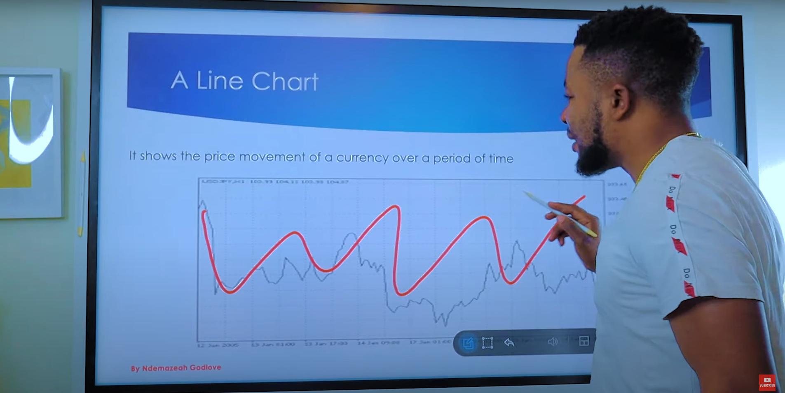


2. **Bar chart :-**

    It shows Opening and Closing prices of currency pair as well as High & Low for the selected time frame. 

    Single bar gets formed afte the selected time frame, if we select the time frame of 1 hour then 1 candle will represent the data of that 1 hour about its opening, closing and its hight low.

    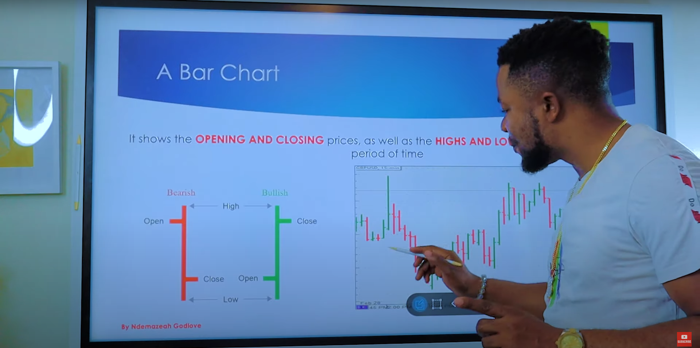


3. **Candlestick chart :-**

    It shows same information as bar charts which was able to open, close price along with high & low but in more readable format thats why candle stick charts are the widely used worldwide.

    Single candle gets formed afte the selected time frame, if we select the time frame of 1 hour then 1 candle will represent the data of that 1 hour about its opening, closing and its hight low.

     

### The Forward Journey

**Key Points :-**

- **Keep your trading simple as possible :-**

    When we put more information on the charts, RSI, pivots, Fibbonaci and all too much information will paralise our decisions due to overwhelming informaiton.


- **The best charts to stick with (Candlestick):-**

    Candle stick charts are the simpletest form of data visualtion among the all avaible charts types, we are going to use candle sticks charts type itself.

- **Find a system which works for you :-**

    Find a system which menas the combination of minimal forms of data which complements each other & works perfectly together which will lead us to take the decision quickly and simply as possible.

    Stick with that system and strategy and master and stick to that strategy in your trading journey while exploring and continuesly learning.


### Types of Forex Analysis

There are 4 types of analysis in the forex market which are equally important for your inform decision.

We can say that these 4 types of analysis are the 4 legs of table, either of 1 leg is missing your table going to collapse. So before making any decision for trade all types of analysis should be going in same direction which would lead to inform decision and that would be the stable trade.

**Types of Analysis:-**

- **Technical Analysis :-**

    Technical analysis is the analysis of historical data to determine the probability of market direction for present or future.

    Technical traders are called as chartists as well, Technical traders belives `history tends to repeat itself` and with that belief they look for repeted chart patterns to make the trading decision.

    Technical analyst studies about the technical indicators like moving averages, fibbonaci retracements, bollinger bands etc in the simple words they use multiple technical factors to form a pattern which defines probablity.
    
- **Fundamental Analysis (NEWS):-**

    Fundamental analysis can be also called as news analysis, Its the analysis of `Economic, Social & Policitical` events and news to predict the present or future movements.

    Fundamenal analyst needs to know the degree of importance of some event or news to form a decision which can include the factors like NFP, CPI, GDP etc.

    NFP is the biggest news when it comes to forex trading as compared to CPI, GDP, MPMI, As fundamental analysis we need to find out which fundamental impacts in how much degree to perticular currncy.
 
- **Sentimental Analysis :-**

    The analysis based on individual sentiments and judgements is called as sentimental analysis.

    Sentiments and judgements can be different for every individual, Every trader have their own perception and reasons for the market direction along with their past experiences.

    Its advisable to not follow the majority of the people becuase as per `90/90/90` Rule 90% of people loose their 90% of trading capital in first 90 days which clearly shows that to not be the part of that 90% people who blows up their account. Even the brokers are sitting their to eat up dump money of peoples money the `stop loss levels` by `stop loss hunting` and they knock out the most of the positions.

    For an example at certain support level 90% of people going to buy the currency and will keep the stop loss of 10-15 pips even the brokers know this so they move the currency below by 15-20 pips and eatup the stop losses of most people and recover the movement which will bring huge volatility in the market and thats the time the 10% of traders enter into traders and make money.
    

- **Situational Analysis :-**

    The situational analysis is not known by the most of the people but which plays very important role to individual to learn from their mistakes. There is no lossing in forex, either its winning or learining.

    Its the analysis of perticular patterns, events, and most importantly your past experience for that currency pairs and did it turned into profitable trade or blown up your account and the reason why it didnt worked out or the reason of your huge profits which helps us to make the inform decision along with other factors.

    **Key Factors of Situational Analysis :-**  

    - Your Trading history & experience.
    - The behaviour of perticular currency pairs in some circumstances.
    - The impact of certain news on events in your past trades.
    - Most importantly your pains due to losses & joys due to huge profits.


**Most Importany Factor (BALANCE) :-**

Now you have understood the all types of forex analysis but you need to keep 1 thing in mind that you cant trade solely depneding on any single factor, Its like an chair with 4 legs which represents the types of analysis. If you want the balance of that chair then you need make sure about the all 4 legs of it.

For Example if you got an supreb entry with the technical analysis you know it will gives you profit and you are dammn sure about that but unfortunately an news event happens like Release of NFP, GDP etc which brought huge volatility in market and trade went against you and blown up your account. 

Rather than lossing your money by depnding on single type of analysis checkout for the all factors and analysis & if all the analysis gives you probality in the same direction then there is very high probability to get that trade works out.


### Japnese Candlestick Patterns

The japnese candlestick called as japnese because it got invented in japan, When in the history rice was the heavily traded thing, to identify its prices its invented by `Steve Nison`.

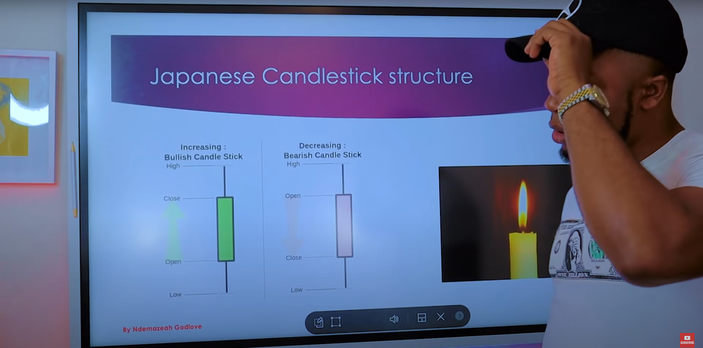

**Types of Major candles :-**

- **Bullish Candle :-**

    When the close price is higher than open price then the candlestick is called as bullish candle.

- **Bearish Candle :-**

    When the close price is lower than open price then the candlestick is called as bullish candle.

**Candlestick Patterns :-**

Candlestick patterns are the first indications of market-trend,its continuation, its reversal etc. There are serval types of candle stick patterns which defines meaningfull message about the market-direction with the help of their unique design.

When multiple candlestick patterns are form togher then it clarifies and the degree of importance of their message for market-direction get increases as well as their accuracy.

**Basic Candlestick patterns :-**

1. **Spinning Top/Bottom :-**
    
    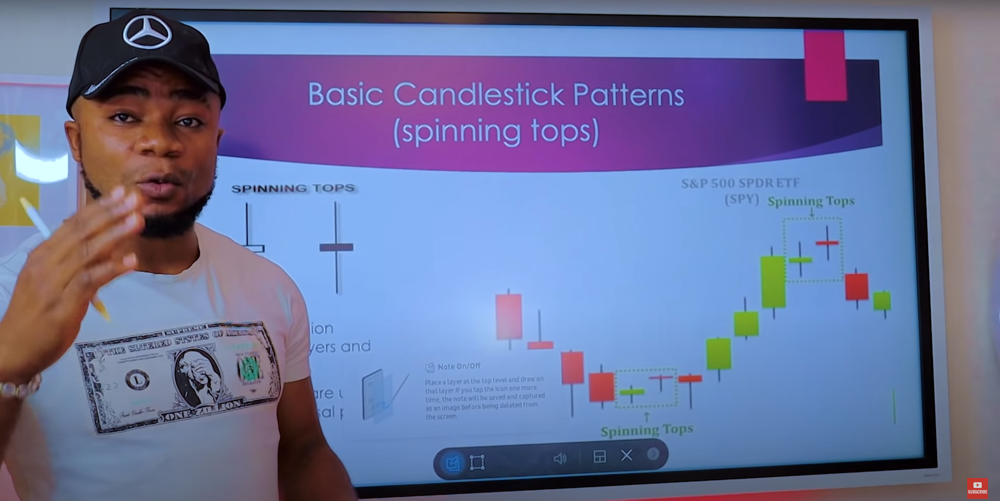

    Spinning top & bottom candle is very unique type of candle which have equal amount of wicks with the small body.

    It indicates that buyers buyers & sellers both are firm on their sides and marketd-direction is in decision.

    If it follows by any bullish or bullish reversal candle in falling market or on some important levels then it means market going to be bullish.

    If it follows by any bearish or bearish reversal candle in rising market or on some important levels then it means market going to be bearish.

    **Note :- The market direction is totally decided by its following candle, either market going to be bullish or bearish. Its strictly advised to not take decision based on only this single candle.**

2. **Marubozu Candle (Bearish / Bullish):-**

    

    Marubozu candle is the candle with no wicks on both of sides. Its a candle with only body.

    In indicates that when the market is opened buyers or sellers was so strong that they didnt gave even single chance to their rivals to create the high's or low's. Basically it indiecates the trend continuation or reversal depending where it formed.

    If the market is rising & if bullish marubozy formed then its the confirmation that market will continue rising. Same if the market is falling and bearish marubozu forms then it confirms that market will continue falling.

    If the market is falling & if bullish marubozy forms with any reversal candle and follows with bullish candles then it means market direction will reverse to uptrend. Same if market is rising & if bearish marubozu forms with an reversal candle along with bearish candles then it means market direction will reverse to downtrend. 

    **Note :- This candle is can not be used standlalone for taking the decision, it has be more indications with following candles then only we should enter in the trde.**

3. **Doji Candle :-**

    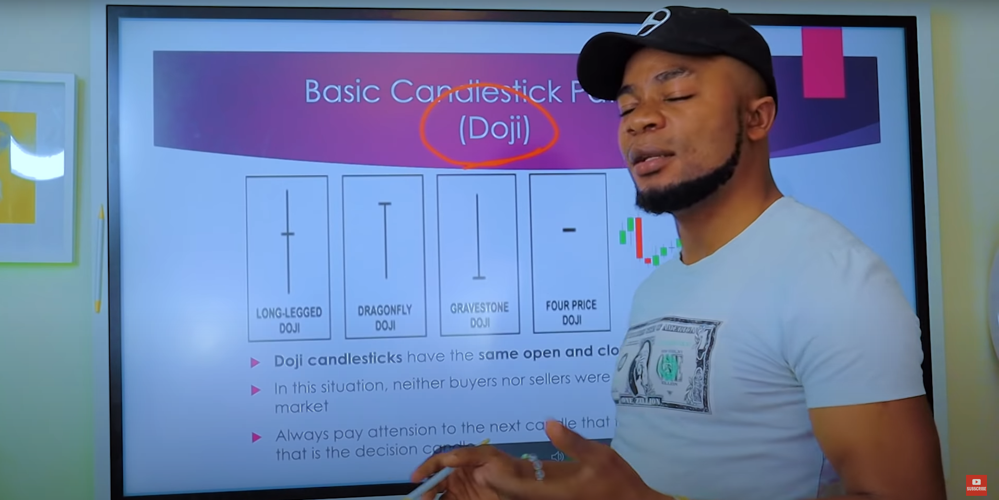

    The doji candle have same opening & closing price, It dont have any candle stick body to it.

    It indicates that buyers and sellers are pushing in opposite ways with equal amount of force, and at the conslusion neither buyers or sellers wasnt able to gain control on market-direction through it.

    The candlestick pattern follwing the doji candle decides the market-direction either bullish or bearish.

**Single Candlestick patterns :-**

1. **Hammer & Handing Man :-**

    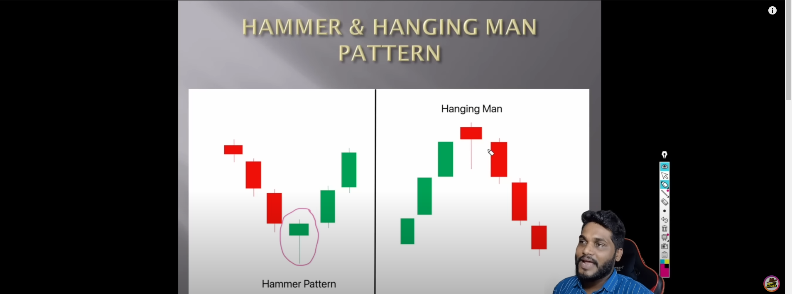

    Hammer & hanging man candle can be identified by their low wick which is 2-3x of their body.

    When such bullish candle forms after falling market then its called as hammer candlestick pattern.

    When such bearish candle forms after rising market then its called as hammer candlestick pattern.

    This both are the trend reversal patterns which indicates the reveral of trend. If it forms in consolidating market then there is no use of this candle stick pattern.

    **Note :- Even if you identify this candlestick pattern wait for the follwing candle for the confirmation & then only enter into trade.**

2. **Inverted Hammer & Shooting star :-**

    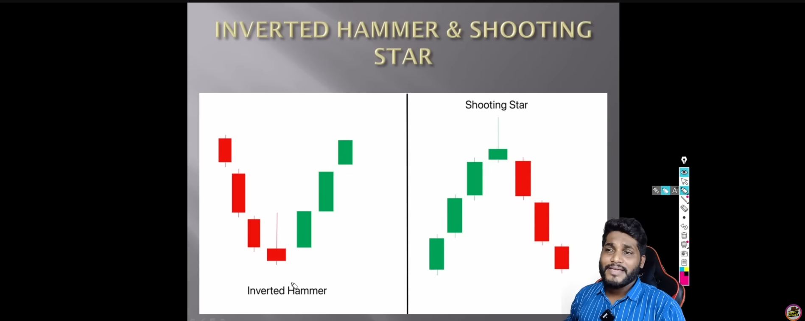

    Inverted Hammer & Shooting start candlestick pattern can be identified by their high wick which would e 2-3x of their body.

    When such candle forms after falling market then its called as inverted hammer candlestick pattern.

    When such candle forms after rising market then its called as shooting start candlestick pattern.

    This both also are the are the trend reversals patterns which indicates the reversal of trend. If it forms in consolidating market then there is no such use of this candlestick patterns.

    **Note :- Even if you identify this candlestick pattern wait for the follwing candle for the confirmation & then only enter into trade.**

**Dual Candlestick Patterns :-**

1. **Engulfing (Bullish / Bearish):-**

    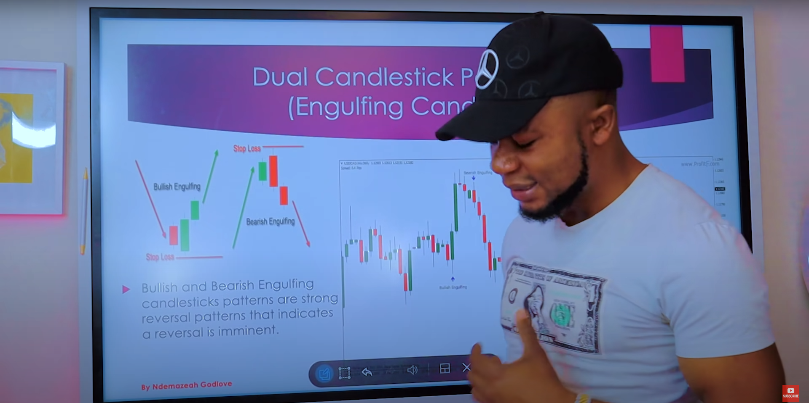
    
    Engulfing candlestick pattern can be identify by a candle coverved by another bullish or bearish candle totally body wicks everything and its follwing candle opens above the engulfing candle closing at important levels like support & resistance.

    The follwing candle plays important role in engullfing pattern. If follwing candle opens at above the engulfing candles closing on important levels than its indication of reversal of markets.

    If engulfing pattern appears at support levels after falling market then its called as bullish engulfing pattern.

    If engulfing pattern appears at resistance levels after rising market then its called as bearish engulfing pattern.

2. **Tweezer (Tops / Bottoms)**

    
    
    Tweezer candlestick patterns can be identified by with same amount of body & wick.

    In the falling market at the important levels such like support if 2 candles forms together bearish follwing with bullsih with same amount of body and wick then its called as tweezer bottoms.

    In the rising market at the important levels such like rssistance if 2 candles forms together bullish follwing with bearish with same amount of body and wick then its called as tweezer tops.

    When tweezer tops or bottoms forms its follwing candle gives the confirmation about the reversal of trend, we after getting the confiremation only we should open the trade.

    When this pattern forms it means that the trend is exhausted and new trend is starting.

**Triple Candlestick patterns :-**

1. **Bearish Evening & Bullish Morning star :-**

    

    Morning start candlestick pattern can be identified by 3 candles in which first candle would be origanal trend direction indicating candle, middle candle is indicision spinning top candle & third candle is trend reversal candles.

    It defines that there was ongoing trend & at some important levels an indicision candle came up with follwing trend reversal candle which indicates the reversal of trend.

    When such candlestick pattern forms after falling market then its called as Bullish Morning Star.

    When such candlestick pattern forms after rising market then its called as Bearish Evening Star.

    when this pattern forms it means the confirmation of reversal of the trend.

2. **3 White soldiers & Three Black crows :-**

    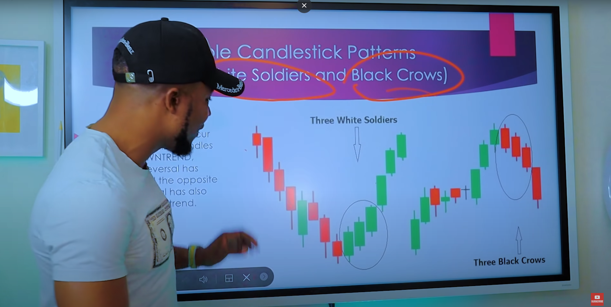

    When Market is in downtrend and 3 big candles bullish candles appears subsequently indicating up trend at some important levels like support then its called as 3 white soldiers.

    When Market is in uptrend and 3 big bearish candles appears subsequently indicating down trend at some important levels like resistance then its called as 3 black crows.

    This candlestick pattern indicates consistantly increating strenth of buyers in white soldiers and strength of sellers in black crows.

    Which straight forwardly means buyers or sellers camp in huge quantiy at some levels which will result into the trend reversal.

    When this pattern forms it confirms the end of previous trend and new trend has been started.


Above we saw most of the important candle stick patterns to identify the trend reversals, we just need to practice on this candlesticks a lot until we get to know the patterns just by looking on charts.

**Important Note :- For generating any signal in forex we need `Structure,Sign,Confirmation` if this 3 things coming up together then we can think for entering into trade.**


### Self Tested Candlestck patterns

**Strong Proved Reversals :-**
- `Hammer`
- `Shooting star`
- `Bullish Engulfing`
- `Bearish Engulfing`
- `Tweezer Tops`
- `Tweezer Bottoms`
- `3 Black crows`

### Deadly Japnese Candlestick Mistakes

As we have understood previously about he japnese candlestick patterns but those candlestick patterns should be identified in some perticular circumstances itself & by taking care of other things like system, its observation etc as follows.

**Key Points For Using Candlestick pattern analysis :-**

- **Pick candlestick patterns that work for you :-**

    There are 100's of candlestick patterns exists in the charts, but you need to focus on candlestick patterns appears frequently in your charts and the patterns those works for you.

    Before taking trade depending on any candlestick patterns backtest the candlestick patterns and checkout for its accurancy along with your setup. then only try to take trades on those.

- **Always trade candlestick patterns with structure :-**

    We should only trade the candlestick patters with structures.

    Structure stands for support, resistance, some important levels then only those will have some meaning for them, it can indicates the trend reversals.

    When you combine candlestick patterns with your setup or with some important levels like supports & resistances then its accuracy gets increased.

- **Always wait for candlestick confirmations :-**

    Even if you find an candlestick patterns likes single, double & triple candlestick patterns always wait for follwing candle which gives us confirmaiton about the reversals.

    Until & unless you get the data about the confirmation candle you should not enter in trade.

- **Stick with the timeframes in throughout analysis :-**
    
    If we analyze the charts in specific timeframes like `5-10-15 mins` then we should take the entries on that timeframes itself.

    We should set our stoploss & targets with that same timeframe itself. Because a single candle of bigger timeframe can be a whole trend in small timeframes so you should stick with your familier timefrmaes which works for you.

- **Always understand price action behind every candle :-**

    Whenever we are analyzing a candlestick patterns try to understand the price action behind the candles, what story its trying to convey.

    When you are able to understand the price action behind the candles you would be able understand whats going on in the market exactly about the situation of demand and supply.

    Even if you are not able to figure out candlestick pattern through candle you still would be able to understnad the story about it and you would be able to trade on that.

- **Dont try to find meaning on every candle :-**   
    
    As we have studied earlier the importance of understanding about the meaning of candlestick patterns, It is alos important that to analyze the candles only at some important levels.

    There are lot of candles in chart so you will not be able to focus on your system and trades if you wish to understand the meaning of each & every candle.

    Focus on important candles on some important levels and try to understand the meaning of it and enter into trades if everything seems to be in our favor.

### Support & Resistance (Levels)

Support & Resistance are the zones form where there is high probablity of the trend reversal or breaking out those zone by continuing the trades due to hight volatility.


Support zones occur where in some zones where falling prices stop & change directions and begin to rise more than 1-2 time in same zones called as `Support zones`.

Resistance zones occur where in some zones where rising prices stop and begn to fall again more than 1-2 time in same zone called as `Resistance zones`.

We should not indicate support & resistance levels with just single line on some price points which leads to fake breakouts. Always draw the zones for getting more accuracy.

**Types of Support & Resistance zones :-**

Most of the resources indicate the support & resistances in straight and linear horizonal lines which are moreover sideways markets But most of the accurate signals comes from trending market support & resistance.

- **Sideways markets Support & Resistances :-**

    
    
    Determine the price points where price has touched or reversed from price point more than 2 times then its called as support levels.

    There is high probability of direction reversals or support on resistance levels.

    In such zones we should buy at support levels & sell at resistance levels to get maximum benifits out of it.

    **Note :- For sniper accuracy about the support & resistance levels use the line chart to confirm if the same support & resistance levels are getting respected with same timeframe.**

- **Trending markets Support & Resistances :-**

    

    70% of the time market is trending so the trending support & resistance are so important in analysis & price points where price has touched or reversed from price point more than 2 times then its called as support levels..

    There is high probability of direction reversals or support on resistance levels.

    In such zones we should buy at support levels & sell at resistance levels to get maximum benifits out of it.

    Dont ever try to against the trend in the trading market, It will be equivalent to catching the falling market. Always trade with trend, never try to go against the trend. it will lead you to blowing up your account.

    **Note :- For sniper accuracy about the support & resistance levels use the line chart to confirm if the same support & resistance levels are getting respected with same timeframe.**

**Master the change of price action structure :-**

Sideways market can brake the support & resistance levels and can turn into trending market, In these cases strategies that we were using in consolidated & sideways market would not work here.

Remember one thing, `YOUR TREND IS YOUR FRIEND`.

80% of the profitable trades comes from trending market.

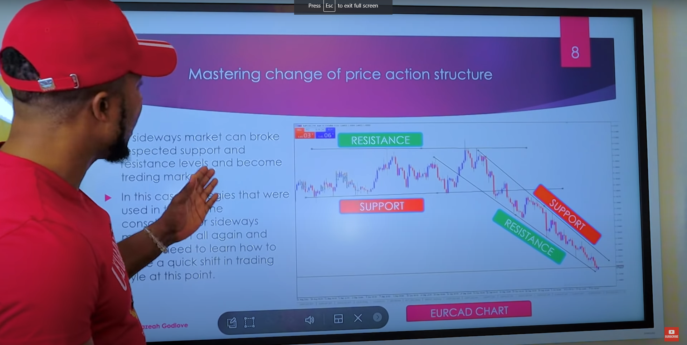

In such scenarios we need to go with the trend, if the market-trending is bullish we need to buy at support levels & sell & resistance levels. When we take trades in the terms of trend our swing and range gets bigger with trend.

For example if the trend is downtrend & we are buying at support levels then it would have less range till the resistance but if we sell at the momoment the range & swing gets bigger with ongoing trend which will lead us to big profits.

**Major & Minor support and resistance :-**

In any timeframe there would be major support resistances which are getting follwed & there could be minor support & resistances as well which are continouesly breaking.

We should not get overwhelmed with multiple support & resistance, Instead we should get help from minor supports & resistance to manage our trades as meintioned below.


On the Major support & Resistances we should take our entries & on the breakouts or breakdowns or minor supports or resistance we should trail our stop losses.

Minor support & resistances are also the struggles between buyers & sellers in the market where anyone can win & take lead. There could be the chances of getting reversals which would eatup our profits, To prevent that we should trail our stoplosses when the minor supports or resistances got braked and thats how we would be able to presever our profits.

### Forex Trends

We can identify the forex trends without any indicators with simple formula.

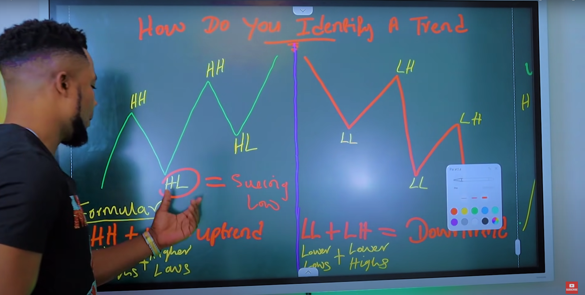

As we konw that a candle have 4 charecteristics, open, close, hight & low. high & low represented by wick if candles have any.

**Trend Fundamentals :-**

- **Higher High :-** 
    
    If candlestick high is higher than previous candles high then its called as `Higher high`.

- **Higher Low :-**
    If candlestick low is higher than previous candles low then its called as `Higher Low`.

- **Lower High :-**

    If candlestick high is lower than previous candles high then its called as `Lower High`.

- **Lower Lows :-**
    
    If candlestick low is lower than previous candles low then its called as `Lower High`.

**Formula's :-**

1. **UPTREND :-** `Higher High's + Higher Low's`
1. **DOWNTREND :-** `Lower High's + Lower Low's`

**Types Of Trends :-**

Types of trends in forex can be classified in 2 categories, Each category contains 3 trends.

There are total 6 trends in forex as follows.

- **Technical Trends :-**

    1. **Uptrend :-** 

        If the chart is making new `Higher highs + Higher lows` then the trend is uptrend.

        We only look for buy signals in uptrend market at support levels or we wait for the price to come at support level.

    2. **Downtrend :-**

        If the chart is making new `Lower highs + Lower lows` then the trend is downtrend.

        We only look for sell signals in downtrend market at resistance levels or we wait for the price to come at resistance level.

    3. **Consolidation, Ranging Or Sideways :-**

        If the chart is not making any higher highs or higher lows & chart is moving up & down in perticular range then its called as Ranging or consodilation market.

- **Momentum Trends :-**

    

    1. **Long Term trend :-**

        If the price is not breaking the uptrend structure for a longer time period on the time frames like `4 hours`, `8 hours` or `daily` then the trend is called as `Long Term trend`.

        We can do swing trading & strategies.
    
    2. **Intermediatary trend :-**

        If the price is in up or downtrend & it breaks the structure and reverses the trend in intermediate time period then its called as Intermediatary trend.

        We use traditional trading strategies here.
     
    3. **Short term trend :-**

        If the market keeps breaking structures like uptrend then downtrend a bit of conolidation & again up or downtrend then the trend is called as short terms trend.

        We use scalping strategies for trading in short term trends.

**Best Trend indicator in forex :-**


`NO INDICATOR`
There is no indicator which indicates you about the forex trend, all the indicators available there are lagging.

Every indicator tells you what was happend in past events but there is no indicator accurate such as to tell the market direction.

`PRICE ACTION` is the best thing which indicates you the future market direction.


We need to keep only thing in mind that `TREND IS YOUR FRIEND` figure out the trends first with the help of `Higher Highs` & `Higher Lows` and `if the trend is UPTREND then buy on support levels & sell at resistance levels.` `if the trend is DOWNTREND then buy & resistance levels and sell at support levels.`

**Trend Strengths :-**


When the `higher high's or lower low's` are respecting the trend-lines & the structure then there is strong trend there.

When the trend lines are not getting respected anymore & the travel time and range is less in between support & resistance it means that trend is dying and there reversal can happen.

When trend lines get braked & price retests and we get any candlestick reversal pattern which will indicatesd the reversal after the breakdown & breakout it clearly means that the previous trend is died already and new trend has been started in reverse direction.

**How to identify the trend reversal :-**

Trend reversal can be identified by 2 things as following :-

1. **When there is change in structure : -**
    
    If the price action is no more respecting the trend-lines.

    For example if the trend is uptrend & price stop making higher high's & low's and no more higher highs & lows are not getting created and it breakes the struture by breaking down the support line then there is possible trend reversal which can be confirmed with reversal candlestick patterns & retest after breakdowns.
    
2. **When there is change in momentum :-**
    
    When market is getting consolidated, There is possbile trend reversal. 

    For example After a strong uptrend if price is not making more higher highs and lows & price is moving in certain range and momentum is getting decreased then it means buying or trend strength is getting reduced due to which market is getting consolidation. 

    At that point when the seller will enter the market it will give reversal in trend whenever there is consolidation after strong uptrend or downtrend it can possibly reverse the direction due to its dying strength.

**Important Tips to trend trading (Summary):-**

- Always trade along with trend, trading aginst the trend would be equivalent to cathing a falling knife.

- Be Alert to know when trend strength is dying and spot the break in structure or change in momentum to spot the reversals.
  
- Plan a proper risk management about your trade by keeping system stop losses becasue at any fraction of second anything can happen in market, even if market goes against you then it should hit the stop loss & exit the trade rather than blowing up your account.


### Methods for trading supports & Resistance

There are serval methods for trading support & resistance as following.

**Method for trading supports & resistance :-**

- **Bounce :-**

    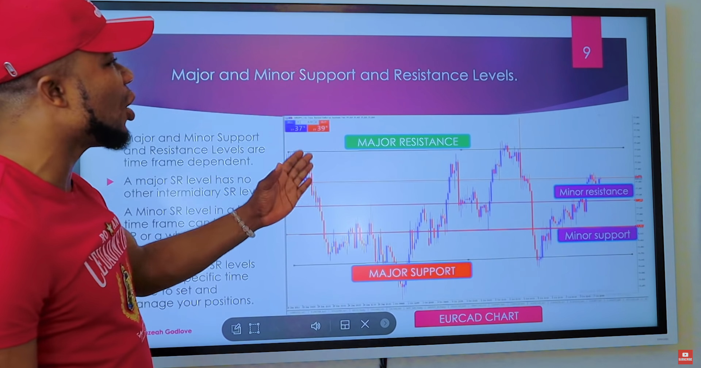

    Bounce method is simple enoough as the word bounce states. 

    We buy at support & sell & resistance in uptrend and vice versa about downtrend.

- **Break & Retest:-**

    
    
    Break & Retest method in which we identify for the breakdowns or breakouts and wait for the confirmations for its retesting. If it retests then it means there is trend reversal.

    In uptrend if there is breakdown and retest then the trade is reversed to downtrend and we sell at retest or resistance levels and set the take profits on its trend support levels.

    In downtrend if there is breakout and retest then the trade is reversed to uptrend and we buy at retest or support levels and set the take profits on its trend resistance levels.

### How to determine fake breakouts & breakdowns

As we have learned about the breakouts & breakdowns in the market, there are lot fake breakdowns & breakouts happen as mentioned in image below.


Treat the supports & resistances as zones rather than single lines by which you would be able to understand the real breakouts.

Whenever you identify any breakout please checkout its closing price along with following candle which represents its confirmation. And Most importantly wait patiently and checkout for retesting so if restesting happens then there is confirmed reversals.

You can take entries through follwing candles & retesting confirmations.

**Note :- Fake breakouts made by market-makers becasue they know very well where beginner traders put their stop losses & they get counter gains through it. You can secure your trade with giving wide stoplosses rather than normal people. Give sufficient room to trade so you will not be out of the trade prematurely.**

### Setting Targets

Till the time we had studied a lot about the taking entries where we can identify the reversals, confirmaitons and signals on the basis of it we are able to identify the entries in trades.

Now we will move ahead futhter in trade management, setting appropriate targets with risk to reward ratio is crucial part to make you profitable trader.

**Checklist for Setting targets at resistance level :-**

1. Determine the Support & Resistance zones not as lines which can give indications of fakeouts or fake breakouts.
2. Get Estimate of the target SL and TP.
3. Calculate if the risk to reward is atleast `1:2` if its `1:2` or greater than it then its valid or its invalid trade.
4. Wait for candlestick confirmation then only book the profits.

**Plot Support & Resistane as zones :-**

Whenever we are plotting support & resistance levels for the ongoin trend we should plot the zones including the upper circuit & lower circuit of resistance or support.

Even if market gives fake breakout we would be aware that there can be possibility of price going beyond the minor support to major ones & thats how we can prevent ourselves from stop loss hunting.

**Give your trade room to breath :-**

Dont keep your stop loss so tight so if market goes against you even little bit then it will eat up your stop loss.

Keep the stop loss bit far from the important levels so even if there any fake breakouts happen you can still survive in trade.

**Setting targets in trending markets :-**

Normally we draw the trendlines in terms of trends not the support & resistance zones in which case we dont get hit on resistance & support levels. Draw always the zones rather than trend lines even in terms of trending market.

Make sure the trend travel from support & resistance is enough to validate your trade for at least of `1:2` risk to reward ratio.

### Forex Chart Patterns

As we seen previously about the candlestick pattern which indicates about the buyers and sellers strength at specific period of time. 

Chart patterns indicates about the trend-continuation, trend reversals with the help of momentum, structures and liquidity or volatility.

We have serval important chart patterns like double bottom, double top, head & shoulder, inverted head & shoulder, rising wedge & falling wedge etc which we will look futher in details.

**Importance of chart patterns :-**

- Helps us to identify the entry points in trades.

- Helps us to create potential entry signals.

- Helps us to get out of the trade with profits if pattern works out or if chart pattern fails with no or minimal loss.

**Types of Fundamental Chart Patterns :-**

- Double Bottom & Double Top.

- Triple Bottom & Double Top.

- Head & Shoulder and Inverted Head & Shoulder

- Rising & falling wedges

- Bullish & Bearish Rectangles.

- Bullish & Bearish Pennants.
  
- Triangles (Symmetrical, Ascending and descending)
  

**Chart Patterns VS Price Action :-**

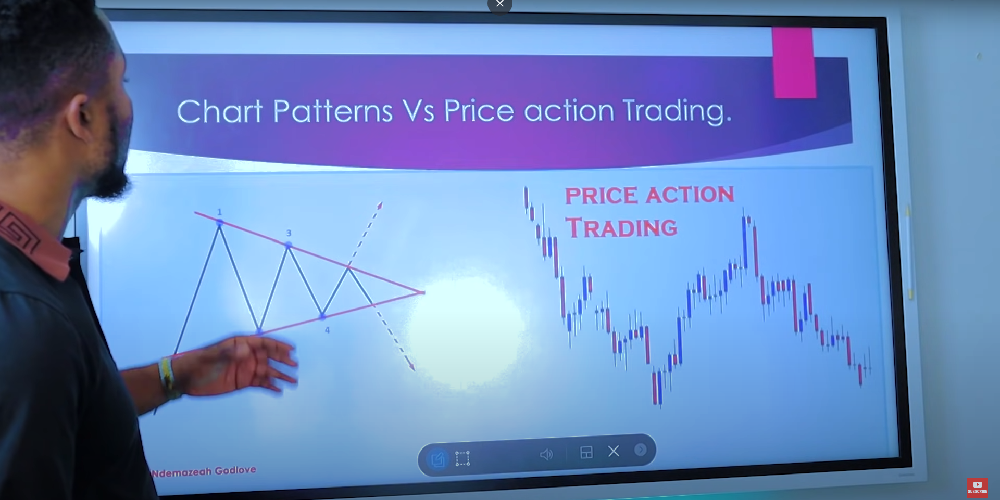

Price action is a big envolupe itself in which all this comes like trading support & resistance, trading Break & retest, Chart patterns etc. 

The more we dig into price action the more clarity we get with learning the subtopics of it step by step.

**Chart Patterns VS Candlestick Patterns :-**

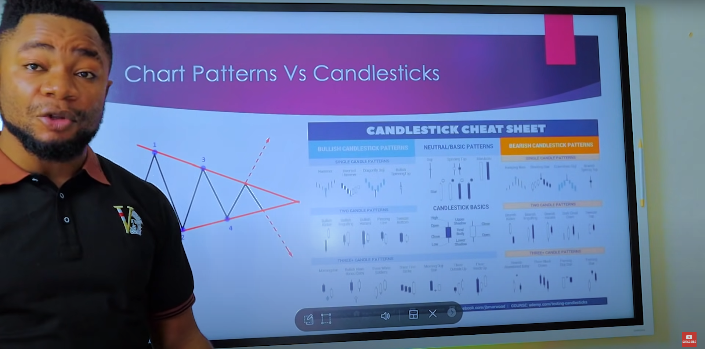

We can combine the candlestick patterns with chart patterns to get the sniper accuracy of entries and exists from the formed structure.

For example as mentioned above we have triangle pattern where we are able to see that market is getting consolidated and a big upward or downward move can occur but where it will be? Yes that can be identified with candlestick patterns. 

If any pattern happens at its neck level like 3 white soldiers or 3 black crows then we get the clarity about its movement as well weather it will be upward or downward. 

**Double Bottom/Double Top & Triple Bottom/Triple Top:-**

These Patterns are the typical reversal patterns where we dont need confirmaitons like candlesticks confirmation. We can enter into trade after break of neckline.

- **Double Bottom :-**

    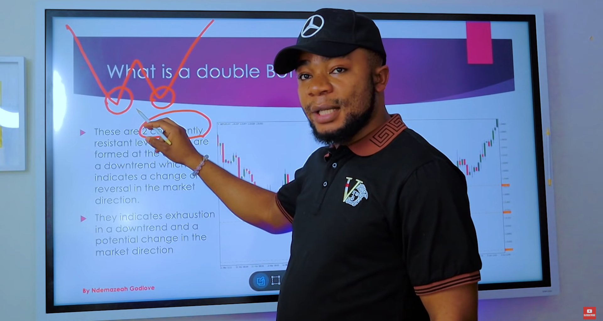
  
    These are 2 consistant resistant levels formed at the end of downtrend, called as double bottom. It indicates the exhaustion of downtrend and potential trend reversal.

    In double bottom support level get touched atlease 2 times and forms the neckline, If that neckline breakbout you get entry into trade by keeping the support levels as stop loss.

    We can set the take profit at minimum RTR ratio of `1:2` till potential trend reversal indication.

- **Double Top :-**

    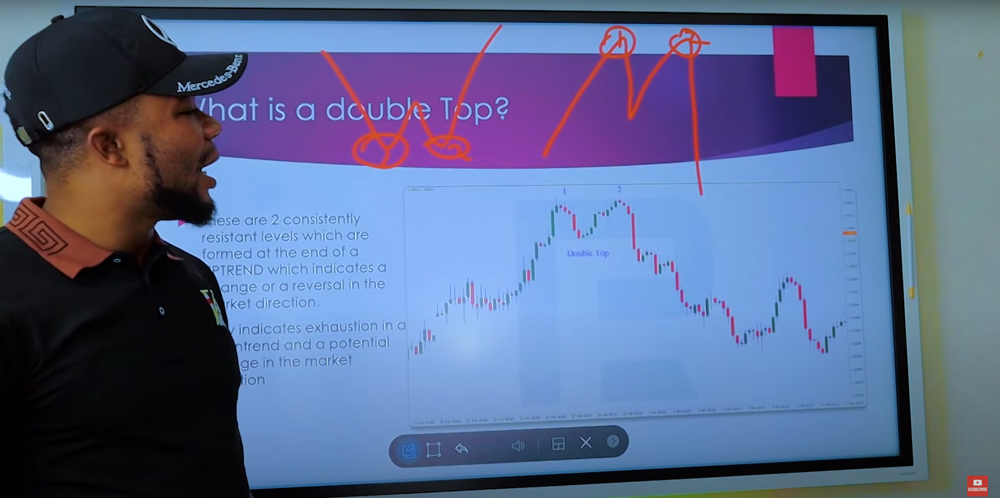
    
    These are 2 consistant resistant levels formed at the end of uptrend, called as double bottom. It indicates the exhaustion of uptrend and potential trend reversal.

    In double top resistant level get touched atlease 2 times and forms the neckline at downside, If that neckline breakedown down then you get entry into trade by keeping the resistance levels as stop loss.

    We can set the take profit at minimum RTR ratio of `1:2` till potential trend reversal indication.

- **Triple Bottom :-**

    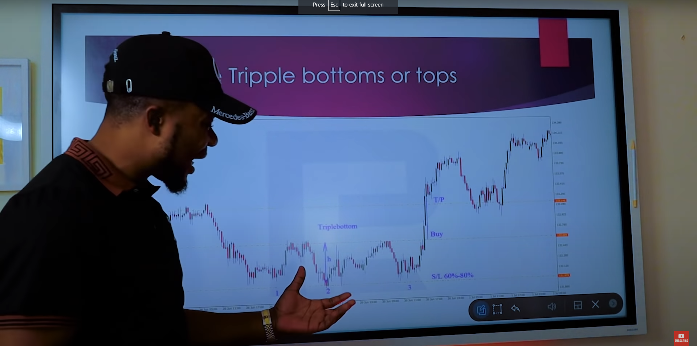

    Triple bottom are nothing different than double bottoms, even triple bottoms are even more stronger signal of exhaustion of continious downtrend.

    It triple bottom resistant level get touched 3 times and it can be called as good demand zones as well, we take entry on breakout of neckline & keep the stoploss below the support zone.

    We can set the take profit at minimum RTR ratio of `1:2` till potential trend reversal indication.

- **Triple Top :-**
  
    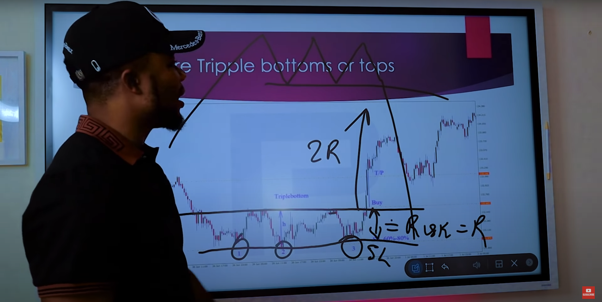

    Triple tops are nothing different than double tops, even triple tops are even more stronger signal of exhaustion of continious uptrend.

    It triple top resistant level get touched 3 times and it can be called as good supply zones as well, we take entry on breakdown of neckline & keep the stoploss above the resistance zone.

    We can set the take profit at minimum RTR ratio of `1:2` till potential trend reversal indication.

**Rules for trading double/ triple tops/bottoms :-**

- This are typically reversal patterns, as we used to need wait for another confirmatoin to enter in trade but in this chart patterns we dont need to wait for confirmaitons.

- They normally indicates exhaution in the current trends.

- They can be used to either trake entry in trade or you already have entry then you can use this patterns to manage the trades.

- Double bottoms forms `W shape` & Double tops forms `M` shape.

- This patterns are most effective after the long uptrend or downtrend.

**Head And Shoulder & Inverse Head And Shoulder :-**

This Patterns are typical reversal patterns with higher accuracy where we dont need confirmation like candlestick patterns, we can enter in trade on the break of neckline.

- **Head & Shoulder :-**
    
    

    Head & Shoulder pattern can be identified by above structure where in uptrend we get left & right shoulders at around same levels & head forms above the shoulder levels.

    When the neckline formed by head & shoulders get breakdown then we can enter into trade by keeping stoploss above the right shoulder levels.

    We can set the take profit at minimum RTR ratio of `1:2` till potential trend reversal indication.

- **Inverse Head & Shoulder :-**

    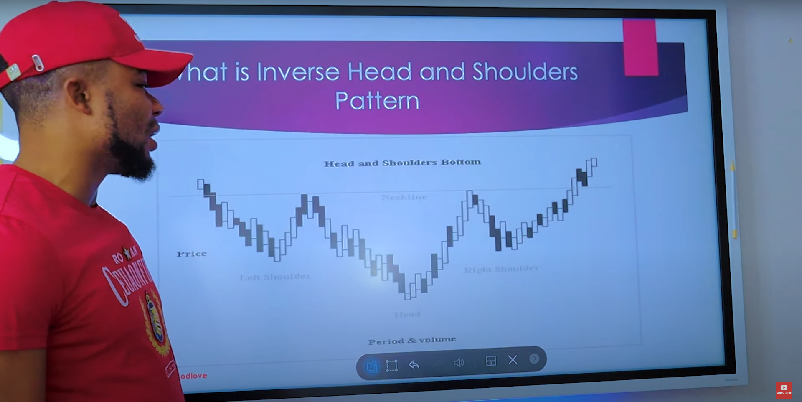

    Inverse head & shoulder can be identified by above structure where in downtrend we get left & right shoulders around at same levels & head forms below the shoulder levels.

    When neckline formed by head & shoulders gets the breakout then we can enter into trade by keeping stoploss below the right shoulder levels.

    We can set the take profit at minimum RTR ratio of `1:2` till potential trend reversal indication.

**Raising wedge & Falling wedge :-**

Raising wedge & falling wedge can indicate the trend continuation & trend reversal as well as mentioned below in details.

It can be identified with converging trend lines which indicates the pause in current trend and there is possbility of reversal.


- **Raising Wedge :-**
  
    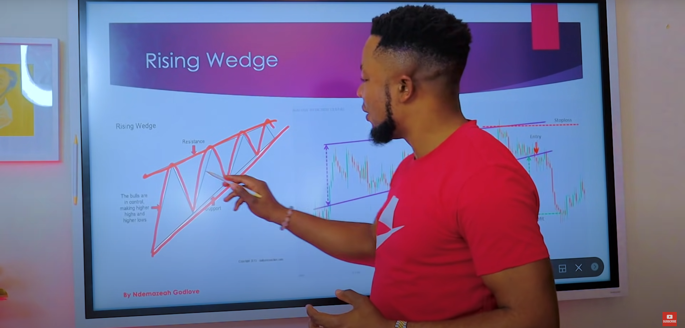

    Rising wedge can be identified in uptrend where support & resistance lines forms in converging manner.

    If it gives brekdown means current uptrend momentum is died off and new downtrend has been started. We can take entry on its breakdown by keeping stoploss above its resistance levels of uptrend.

    If it gives breakout means there was a pause in current trend which has been resumed and it will continue to rise up. We can take entry on its breakout by keeping the stoploss on its support levels of uptrend.

    We can set out targets by RTR ratio of atlease `1:2` till we get any potential signal of reversal.

- **Falling Wedge :-**
    
    

    Falling wedge can be identified in downtrend market where support & resistance levels forms in converging manner.

    If it gives breakout means current trend momentum has died off and new uptrend has been started. We can take entry on its breakout with the confirmation of retest & keeping the stoploss at its support levels of downtrend.

    If it gives breakdown means there was a pause in current trend which has been resumed and it will continue to fall down. We can take entry on its breakdown with the confirmation of retest & keeping the stoploss at its resistance levels of downtrend.

    We can set out targets by RTR ratio of atlease `1:2` till we get any potential signal of reversal.

**Rectangular Pattern :-**

Rectangular patterns indicates the consolidation & indicision between buyers & sellers. Its not the reversal pattern, so market can give either breakout or breakdown.


Square pattern can be traded with inner pattern trading as well as outer pattern trading. When the market is moving in that range you can buy & support levels & sell & resistance & you can keep the stop loss below your support levels if you have went long or you can put your stoploss above resistance levels if you went short.

You can trade change in strucutre as well which means if square pattern gives breakout & breakdown then you can wait for retest for confirmation and you can enter in trade by keeping stoploss of your support levels if there is breakdown or resistance levels if there is any breakout.

To prevent the stop loss hunting always wait for the retest after breakout & then only enter into trade.


### Fibonacci 

fibonacci numbers are the series of number which represents the basic phenomena's in the universe. Its discovered by leonardo fibbonacci.

Its the series of numbers starting from 0 & summation of 2 consecutive numbers like 0,,1,2,3,5,8,13,21... etc.

When we divide 2 consecutive numbers in fibbonacci serries we get `0.618` all the times & when we divide alternate numbers then we get `0.382` all the time.

`38.02, 50, 61.8` are the most significant levels of fibbonacci and also called as golden numbers.


**Fibbonacci Extension & Retracements :-**

There are 2 types of fibbonacci tools in market, which have different purpose in itself.

Fibbonacci extension levels are used for profit taking levels & fibbonacci retracement levels are used as retracement levels on which price mostly tends to retrace on fibbonacci levels after big price move.

fibbonacci retracements used for taking entries in trade & extension is used for setting your profit levels.

**Fibonacci retracement levels :-**
- 0.235
- 0.382
- 0.618
- 0.764

**Fibonacci extension levels :-**
- 0
- 0.382
- 0.618
- 1.000
- 1.382
- 1.618

**Fibbonacci retracements on charts :-**

**For Uptrend Market :-**

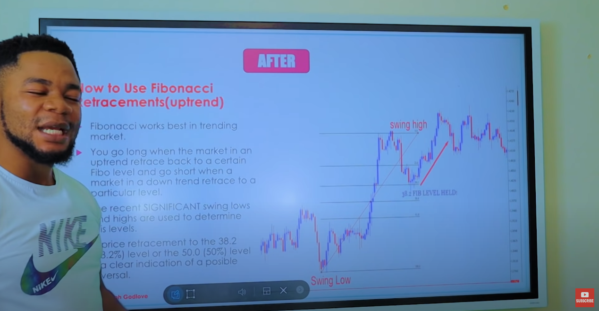

Fibbonacci retracement mostly effective in trending markets, and advised to use in trending market.

We can plot the fibbonacci levels by selecting recent Significant swing low and dragging it to its swing low.

The price retracement to the `38.2% or 0.382` or the `50% or 0.50` & `0.618` is clear indication of reversals.

We can wait for the price to retrace in fib golden zones like `38.2 or 50 or 61.8` and if price does retrace on any of the levels we take entry in trade by keeping stop loss of on `100% or below 100%` & you can place your target `2R or RTR ratio of atleast 1:2`.

**For Downtrend Market :-**


Fibonacci retracement can be used for downtrend as well, We need to plot the fib point on recent swing high and need to drag it till its low.


We plot the fibonacci levels for downtrend only if there is downtrend & after plotting fibonacci levels we need to wait for price to retrace to our `0.382 or 0.5 or 0.618` levels as they are most significant levels.

When price comes to those levels you can take entry for sell side by keeping stop loss above the `100%` levels & target of RTR ratio of minimum `1:2`.

### Forex Enviornments

There are 2 types of enviornmentes in the forex market, First is trending enviornment& another is consolidating enviornment.

When you think of taking trades you should start with identifying the market nature & its enviornment first & decide what strategies you can use for it.

**Strategies for trending market :-**

1. We can use fibonacci with trendlines in trending market for identifying trend with trendlines & find the retracement levels wiht the help of fibbonacci and enter in trending market with good RTR ratio.

2. We can use trend stragies like bounce stragey inside the trendlines, break & retest strategy & candlestick patterns with trendlines you can use any of these.


**Strategies for consolidating market :-**

1. We can use the support & resistance bounce strategy with candlestick pattern with confirmaitions for ranging market.

2. We can use break & retest strategy with candlestick confirmations for entering in trades when structure is broken or changed.


### Types of Breakouts

There are 3 types of breakouts in forex marekts, continuation breakout, reversal breakout & fake breakouts as follows.

**Continuation Breakout :-**
Continuation breakout forms when there is a pause in current trend and the trend resumes in same direction.

There is no break of structure occurs in trend-continuation breakout.

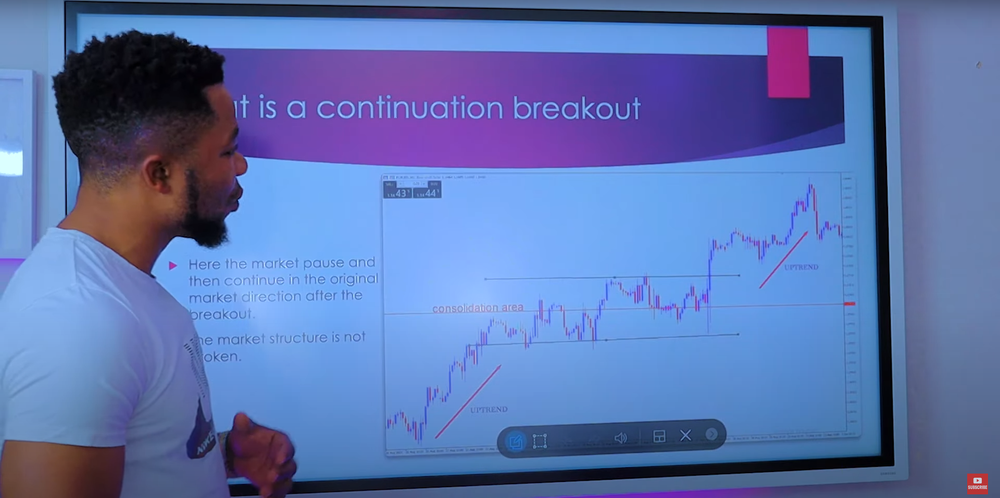

**Reversal Breakout :-**
Reversal breakout forms when current trend is exhausted & new trend is going to start then the reversal breakout happens.

Reversal breakout can be identified by break of structure & break of trendline both.


**False Breakout :-**

False breakout forms for stop loss hunting of beginner traders & there is no break of structure properly, it just plays around support & resistance levels by penitrating it but next candle doesnt support its breakout.

Reversal breakout can be indentified by trendline break but follwing candle or it doesnt break the structure properly.

We can only deal with fake breakouts with the help of plotting support & resistance zones rather than just lines.


### Retracement & Reversals

Retracement & reversals are most important terminologies which needs to be crystal clear for their huge role in decision making of entering into trade.

**Retracement :-**

Retracement is bounce of price on the trendline or support & resistance levels for supporting current trend.

In the retracement support & resistance levels are get followed and there is no break of structure present here.

We can use the retracement for partial profit booking or adding the more quantity to our positons. Its mostly used for moving stop loss & take profit levels to its next levels.


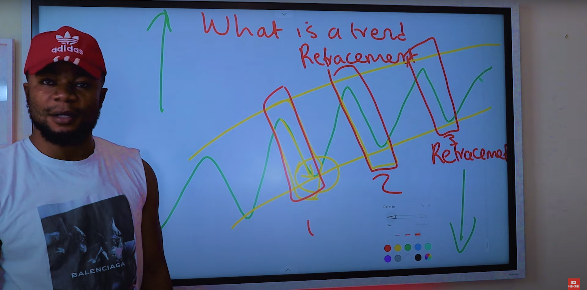

**Reversals :-**

Reversal is break of current structure or trend, it normally occurs with the help of breakouts & breakdowns at important support & resistance levels or trendlines.

In the reversals support & resistance levels or trendlines get breaks & break of structure forms with retesting.

We can confirm the reversals with the help of fibonacci tool as well by plotting fibonacci levels in current swing high & low, if there is levels break of golden levels such as `0.312,0.5,0.682` and crosses `0 or 100` levels then there no retracement gonna be form and its sign of reversal.

We can use the reversals for catching big moves & trade entries for booking huge profits with the possible confirmaitons for reversals.

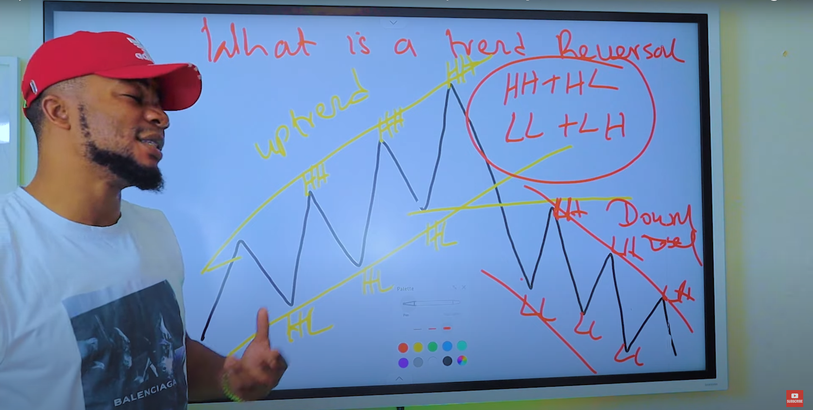

### Forex TimeFrames

Forex timeframes depends on your patience levels, your availability & most importantly on your psychology.

Since chart is graphical representation of the price over the peirod of time do analyse, execute & manage the single timeframe itself & master that timeframe.

Analysis can be done on any kind of timeframes but the higher timeframe we choose we get less noise and we have cleaner charts.

**TimeFrames according to types of traders :-**

- **Scalping :-**

    Scalping is high frequency trading on smaller time frames for trades from seconds to minutes and we just get out of trade.

    For Scalping you can use 1m, 5m, 15m timeframes for taking traders in short trends.

- **Intraday :-**

    Intraday is also an type of high frequency trading but intraday trade can be half hour till the whole day till the end of the day.

    For intraday we can use 30m, 1h, 2h etc for taking intraday trades.

- **Swing :-**
    
    Swing trading is an type of trading where you hold the trades for days or weeks & months until you reach your expected prices.

    For Swing trading we can use 4h timeframe, 8h timeframe etc.

- **Investing :-**

    Investing trading is an type of trading where you hold the trades for even years or months.

    For Investing purpose we can prefer Daily, Weekly monthly timeframes.


**Importance about different timeframes :-**

If we have experience & idea about all the timeframes we can choose the timeframes according to our availablity, The importances are as folowed.

On the shorter timeframes we can figure out the early signs for market reversals as well as with the bigger timeframes we can have clear understanding about the market-directions & noisefree analysis on higher time frames.

### Best TimeFrames for trading

`Best timeframe depens on every individual` depending on the factors benifits, PROS & CONS of every timeframe.

Flexibility, Transactional Cost, Trding opportunities & ease of entry are the most important factos on which we are going to analyze on every kind of time frames as mentioned below.

**Types of traders :-**

- **Scalpers :-**

    Scalpers are the community of traders which takes the trades for the shortest period of times with for minutes or for seconds.

    Scalpers Use `M1,M5 & M15` timeframes.

    **Factors :-**

    - **Flexibility -**  `No Flexibilility` due to watching out on trades for manaing the trades.

    - **Transactional Cost -** `Very Very High Transactional cost` due to multiple trades in perticular period of time.

    - **Trading Opportunities :-** `Many Trading opportunities` due to smaller time frame.

    - **Ease of entry :-** `Not For Scalpers` Due to much noise on lower timeframes beginners entry is not easy.
    
- **Intraday Traders :-**
  
    Intraday traders are the community of traders which whos trades lasts for hours or minutes which lasts up to one day.

    Intraday Traders uses `30M, 1H, 2H` timeframes.

    **Factors :-**

    - **Flexibility :-** `Minimal Flexibility` due to watching out on trades for managing the trades which are hourly basis.
  
    - **Transactional Cost :-** `High Transactional Cost` due to multiple trades in single day.
    
    - **Trading Opportunities :-** `High Trading Opportunites` due to lower timeframes.
    
    - **Ease of entry :-** `Not Easy Entries` entries are not easy due to high noise on smaller time frames.

- **Swing Traders :-**
    
    Swing traders are the commuinity of traders whos trades lasts upto days of weeks until it meets the targets.

    Swing traders use `4h` timeframe most of the time. This

    **Factors :-**

    - **Flexibitliy :-** `High Flexibility` due to longer period of trades.
    
    - **Transactional Cost :-** `Low Transactional Cost` due to less number of trades.
    
    - **Trading Opportunities :-** `High Trading Opportunities` due to many support levels, visible trendlines & other stable technicals.
    
    - **Ease of entry :-** `Easiest Entries` due to clarity of charts & Clear understanding of markets without too much noise.
 
- **Long Term / Investor :-**

    Long Term traders & investors are the community of traders whos trades lasts upto months & years.

    **Factors :-**

    - **Flexibitliy :-** `Very Very High Flexibitliy` as you take trades for very longer period of times.
    
    - **Transactional Cost :-** `Very Low` due to minimal number of trades over the period of time.
    
    - **Trding Opportunities :- :-** `LOW Trading opportunities` due to higher time frames it takes very longer times for forming setups.
    
    - **Ease of entry :-** `Easier Entries` due to less noise on charts & clear understanding about the markets due to patient analysis.


By considering above timeframes & circumstances and factors matters to our trading `4h` timeframes is best overall timeframe where we have benifits over all the important factors & also it doesnt drive us emotionally & psychologically due to less attention to it.

## Advance Forex Trading

### Multiple trading Accounts

Having multiple trading accounts not from the multiple brokers but the multiple trading accounts from single broker.

Why we should have multiple trading accounts? `For Diversification of capital`

We would be able to diversify our trading capital into multiple categories as mentioned below.

- News Trading
- Sentimental Trading
- Swing trading
- Investing
- Scalping
- Tecnical Trading (For specific setups or strategies)

If we create the multiple accounts for their different purposes we can analyze the accounts, trades, and the growth of each categories more effectively.

**Key Benifits of having multiple accounts :-**

- **Flexibility :-**
  
  We have flexibility of switching from one category of forex trading to another according to current events and scope of trading category.
  
- **Organisation :-**

    When we have multiple accounts our capital & trades are more organised by having same nature of trades on whole account.

- **Psychological Switch :-**
  
    When we switch from one category of trading to another we get switched psychologically as well by having totally different enviornment which leads to good trading decisions.
  
- **Detailed Analysis :-**
    
    We can analyze the trades, capital, growth & losses on account level itself & we would be able to know which of our account is growing great and which category is not working that great.

- **Know your weakness & strengths :-**
    
    By analysing your different trading areas & categories in details you get to konw your strenghts & weaknesses of your forex trading areas.

    By identifying your strengths & weakness you can focus on your weakness & improve them over the period of time.

This are the most important benifits of having multiple trading account and this standard is followed by Big level traders of the big players as well so you also should build the habits for same.

### News Trading

News trading is 2 sided sword in forex trading, in news trading market moves drasitcally in either of sides, as we are talking about advance foerx trading this can be opportunity for people who knows how to trade news & this can also blow up the accounts as well of retail traders.

**Major News Events which affects USD**

- **NFP :-**

- **CPI :-**

- **Unemployement Rate :-**
  
- **ADP NFEA :-**

- **GDP :-**


In news trading we checkout the major news events and their impact areas with on currency pairs and those currency pairs will get huge volatility during those news events. 

**3 types of data in news trading :-**

- **Previous Data :-** Previous Release data related to any of the major news.
  
- **Forecast Data :-** Forcase data is the data predicted by banks & financial institutions etc.

- **Actual Data :-** The data came after new release for that perticular news event.

**Trading Opportunities based on above data types :-**

1. When the `Actual data > Forecast data` realted to affected currency pair & affected currency is the `base currency then market will go up`. In the same situation if currency is `quote (secondary) currency then market will go down.`  

2. When the `Actual Data < Forecast data` related to affected currency pair & affected currency is `base currency then market will go down`. In the same situtaion if the currency is `quote (secondary) currency then market will go up.` 
 
3. When the `Actual Data = Forecast Value` related to affected currency then its better you should stay out of the market. In such scenario market will move drastically in both direction & will hit you entries along with eating your stop losses.


**Worst times to trade news :-**

As their are best times to trade news along with our data analysis, there are some scenarios where we should be better to stay out of the market.  

We get thousands of opportunities in forex market so in such scenarios when you are not able to predict if market will go up & down its better to stay out of the market. This

- **2 Major news event affecting same currency releases at same time :-**

    For Ex `USD = GDP Event` & `USD = Employment rate` which both compliments the movemnt of USD in the market, But both of the news released at the same time, Then there is no surity which event will drive the market. 

    In this scenario we dont have any clarity where the market will move then its better to stay away out of the market.


- **2 Major news event affecting both of the currency in pair at same time :-**

    For ex `USD = NFP Event` & `CAD = Employement Rate` which compiments 2 different currency paris at the same time, It will be worst scenario to trade a currency pair which will include this both of the currencies.

    In such case both news events driving the movment of currency pairs in 2 different direction for which its better to stay away at this times.

    `Note :- In such news scenarios we can trade the currency pairs which only includes either of currency affected with news & checkout if news is positive and currency is base currency then market will go up else go down vice versa.`


**Stratagies for News Trading :-**

1. **STRADDLES STRATEGY :-**

2. **DIRECTIONAL BIAS Strategy :-**

    **How to predict the news direction (DIRECTIONAL BIAS STRATEGY) :-**

    Look for the aggregate of past news events occured and analyze if the data is on the positive side or negative side. 

    If the majoriry of the news events was on positive side then there is high probability that upcoming news event would also be positive.

    For example if we are checking out on NFP & CPI which are major market drivers we can lookout for other news events result if those was positive such as Unemployement rate, ADP NFEA, GDP was on positive side then there is high probability that upcoming NFP & CPI would be on positive side.

    If our impacted currency in an Base impacted currency on perticular currency pair and if the news is postive regarding our impacted currency pair then market will go up on the pairs we have impacted currencies as base currencies.

    If our impacted currency is an secondary currency on perticular currency paris and if the news is postive regarding our impacted currency pair then market will go down as our impacted currency pair in secondary currency.

    **How to trade news after analysis (DIRECTIONAL BIAS STRATEGY) :-**

    If the news is positive then it will moves the market in uptrend or if the news is on negative side then it will move the market in downtrend in terms of impacted areas.

    Before the news releases we can place the limit orders like `BUY STOP or SELL STOP` in the direction we predicted & we can exit the trade when the moementum reaches to our target levels.

3. **Correction Strategy :-**
   
    Sometimes we miss the major news event and the momentum caused due to it, but we dont need to worry about it. We have this correction strategy in which we can trade even after news is alreday released.

    Correction strategy states thtat whenever market takes drastic moves due to major news events corrections occurs on the same levels before normalizing the market momentum.


    **How To trade :-**

    If you have missed the momentum candle of news event in the current trend checkout for reversal candlestick, chart pattern & take entry on that pattern by keeping stoploss above the pattrn levels or according to pattern rules.

    Set the take profit on the levels from where market grabbed momentum and keep triling stop loss levels on retracements or new levels formation, You can add more quantiy as well with the same to maximize the benifits.


### Difference between professional & Profitable trader

Professional trader does have knowledge about trading & technicals but not making consistant profits. 

Profitable forex trader is trader which makes the profits the consistantly with his setup & strategy.

Profitablity comes with experience & learning from the mistakes throughout our trading journey.

### Risk to Reward

Risk to reward ratio is the most important part in trading which leads us to profitality.

We have risk to reward ratio of `1:1, 1:2, 1:3, 1:4 & 1:5` and so on as per our setups & strategies.

**Risk to Reward ratios & percentage of accuracy to be profitable :-**

- **1:1 :-**

    

    With the risk to reward of 1:1 we need to be accuracy of atleast 50% to even have breakeven but still we will be in loss due to comission, brokerage & all the charges.

    For being profitable we need to be accurate atleast 60% of the times then only we would be able to be profitable in forex trading.

    It is strictly unadvisable to trade with 1:1 reward untill & unless you having 80-90% of accuracy with your trading setup & strategy.

- **1:2 :-**

    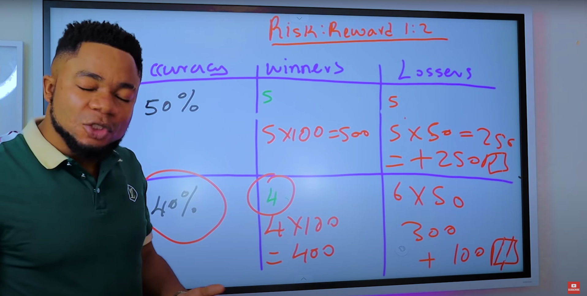

    With the risk to reward of 1:2 we need accuracy of atleast 40% for being an profitable trader as we can see above in the picture.

    Even after lossing 6 trades out of 10 still we are profitable with 
    $100, due to same we should keep the RTR of atleast `1:2` before entering into trade.

- **1:3 :-**

    

    With the risk to reward of 1:3 if we are right even the 30% of time we are still profirtable trader as we can see above in th picture.

    Even afte lossing 7 trades out of 10 trades still we are profitable with $100, due to same we should take the quality trades rather than quantity trades.


As we have understood that risk to reward defines a lot about profitablity as forex trader so we should prepare our trading system according to this that which would be able to find us quality trades over the quantity which would lead us to profitability.


  


    


