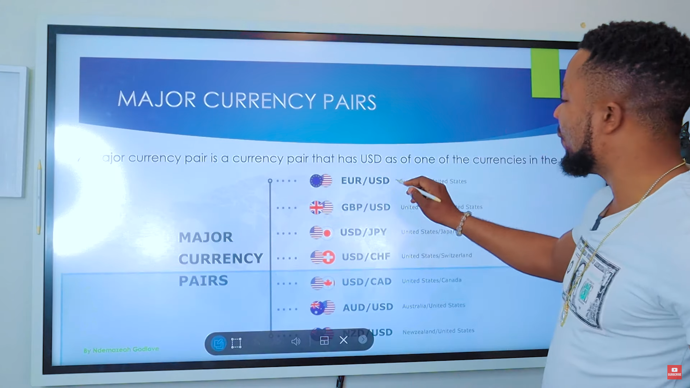

# FOREX
If we breakdown the word For Ex stands for For Exchange which menas exchange of currencies from one to another. In the forex we trade in currencies and its pairs.

**Benifits Over other markets :-**
- 24 x 5 market timings means 24hours we can trade on weekdays.
- Highest liquidity market in the world.
- Most Volatile market in the world.
- Low trading costs as per equity markets.

### Currency Structure

In the currency symbol the world have standard to represent their currencies in 3 letters which followed by all countries.

`Ex : - USD, GBP. EUR`

In the currency symbol the first letter indicates to country name and last letter represents the currency which is dollar, euro, yen etc.

### Major currencies

In the forex market there are 180+ currencies but we should only trade in major currencies due to their high liquidity and low swap. If you trade in another currencies you can blow up your account due to high swap, expensive charges and due to not that much liquidity.

We should only trade in majour currencies in the market as like mentioned below.'

**Currencies :-**
1. USD - Us dollar
2. EUR - European euro
3. GBP - Great britan pound
4. CHF - Swiss Franc
5. AUD - Australian Dollar 
6. CAD - Canadian Dollar
7. NZD - New Zealand Dollar
8. JPY - Japanese Yen


The forex traders as welll have their Nicknames to not other people know about their talkings bro. So the code words for the currencies would be as like mentioned below.

**Currencies with Nick names :-**
1. USD - Buck
2. EUR - Fibre
3. GBP - Cable
4. CHF - Swissy
5. AUD - Aussie
6. CAD - Loonie
7. NZD - Kiwi
8. JPY - Yen

### Currency Pair
Its combination of 2 different currencies, The exchange rate between currencies is between `first(base)` and `second currency(quoted)`.


### Difference between currency structure and currency pair structure

In the currency symbol like `USD` first 2 charecters are the country and last character is its currency.

But in the currency Pair symbol first currency called as base currency, and the second currency called as quoted currency.

Buying and selling currency pair is the buying one currency and selling another or selling one currency and buying other. Currency transaction can't be unidireactional so we can only trade in currency pairs due to bidirectional transaction in between 2 currencies.

**EURUSD**

- `Buy :-` In the EURUSD buying means buying EUR and selling USD.

- `Sell :-` In the EURUSD selling means selling EUR and buying USD.

### Major Currency Pairs

Major currency pairs are the most commonly traded currency pairs in the forex market. They consist of the currencies of the world's largest economies and are highly liquid, with tight bid-ask spreads and low volatility compared to exotic currency pairs. The major currency pairs are:



**Major Currency Pairs :-**
- EUR/USD (Euro/U.S. Dollar)
- USD/JPY (U.S. Dollar/Japanese Yen)
- GBP/USD (Great British Pound/U.S. Dollar)
- USD/CHF (U.S. Dollar/Swiss Franc)
- AUD/USD (Australian Dollar/U.S. Dollar)
- USD/CAD (U.S. Dollar/Canadian Dollar)
- NZD/USD (New Zealand Dollar/U.S. Dollar)

These currency pairs are widely traded by forex traders and are often used as a benchmark to compare the performance of other currency pairs. 

### Cross Currency Pairs
Cross currency pairs, also known as minor currency pairs, are currency pairs that do not involve the U.S. dollar as either the base or quote currency. In other words, they represent the exchange rate between two non-U.S. dollar currencies.


**Examples of Cross Currency Pairs :-**

- EUR/GBP (Euro/Great British Pound)
- GBP/JPY (Great British Pound/Japanese Yen)
- EUR/JPY (Euro/Japanese Yen)
- AUD/CAD (Australian Dollar/Canadian Dollar)
- NZD/JPY (New Zealand Dollar/Japanese Yen)
- CAD/CHF (Canadian Dollar/Swiss Franc)

Cross currency pairs tend to have wider bid-ask spreads and higher volatility compared to major currency pairs, due to their lower liquidity and market depth. 

### Exotic Currency Pairs
Exotic currency pairs are currency pairs that include one major currency and one currency from an emerging or less developed economy. These currency pairs are less frequently traded in the forex market compared to major currency pairs, and they typically have wider bid-ask spreads and higher volatility.

**Examples of exotic currency pairs include :-**

- USD/MXN (U.S. dollar/Mexican peso)
- USD/BRL (U.S. dollar/Brazilian real)
- USD/ZAR (U.S. dollar/South African rand)
- USD/TRY (U.S. dollar/Turkish lira)
- USD/HKD (U.S. dollar/Hong Kong dollar)

Exotic currency pairs can offer higher potential returns, but they also come with greater risk due to their lower liquidity and higher volatility. As a result, traders should exercise caution when trading exotic currency pairs and should carefully manage their risk exposure.

### Exchange Rate

Exchange rates are the rates which we need to pay for purchasing one instance of a currency.

**Ex :-** 

- If we want to buy one USD with the payment in euro and exchange rate is `1.212` then we need to pay `1.212` Euro for purchasing 1 USD, which means exchnage rate is the price which we need to pay to buy or sell once instance of an currency.

**How Exchange rate determines and how it moves :-**

The exchange rates are determined by the demans and supply of currencies. In the currency pairs price movements totally depends on base currency.

**Ex :-** 

- `USDCHF` if usd's demand is increasing then the exchange rates would be increased and if supply would be increased then the exchange rates would be decreased.

**Fixed Exchange Rate :-**

Some of the currencies have their fixed exchange rates like zimbwaain dollar is having `100 trillion` on its single note and its exchange rate supposed to be 1 billion then no matter how demand or supply gets increased, The exchange rate would be still same.

### Fun facts of exchange rates

There are some unlogical fun facts as well regarding the exchange rates are as mentioned below.

- The Most valuable currency in the world is `KWD (kuwaiti dinar)` where `1 KWD` worth of `$3.30`.

- `GBP (British Pound)` Even after being used most currencies is USD which is most demanded currency in the world is worlds's is 10th strongest currency.

- The least valuable currency in the world is Iranian Rial, where `1 USD = 43000 IRR`

- The British pound sterling is the oldest currency in the world.


### 90/90/90 Rule

90% of people loose their 90% of account balance in first 90 days.
BID PRICE.  
### Fundamentals of forex

There are some terminologies used in forex market for different concepts as follwing.

- **Quote :-**

    Quote is the exchange rate to exchage quote currency into base currency.

    In simple words How much we need to pay of quote currency to purchase 1 instance of base currency as like mentioned below.

    `USDCAD = 1.20300` In this quote For purchasing 1 USD we need to pay 1.20300 times of CAD and thats called as quote of USDCAD.

- **BID Price & ASK Price :-**

    The price on which buyers want to buy the currency pair is called as `BID PRICE.`

    The price on on which sellers want to sell the currency pair is called as `ASK PRICE`.


    ```
    Symbol     Quote     Bid price  Ask price
    USDEUR     1.20323   1.20320    1.20325
    ```

    In the above Quote current exchange rate is `1.20323` but liquidity is present on `1.20320` and `1.20325`.

    When you will market buy you will buy the currency Market price rate you will end up buying on the current bid price rather than current exchange rage, And when you sell the currency pair you will be selling at the current ask price which would be the current exchange rate most probably.

- **Spread :-**

    The difference between the bid price and the ask price is called as `spread` which is in terms of `PIPS`.

- **Pips :-**

    Pips are the smallest price movement in exchange rate of currency pair.

    Its the unit of denoting movement in the currency pair.


**Positions :-**

- **Long position :-**

    When you buy the currency pair then you are holding will be called as `Long position`.

- **Short position :-**

    When you sell the currency pair then you are holding will be called as `Short position`.

- **Flat position :-**

    When you not holding any position like buying or selling in trade is called as `Flat position`.

### Pips and points (Pippets or Fractional Pips)

Pips are the smallest price movement in exchange rate of currency pair which is used to denote the movement in exchange rate in quote.

`Ex : 1.2012 or 1123.20`

In the above example pips breakdown is as follwing.

**1.2012 :-**

Below order we taken from last decimal.
- **2** - 2 pips
- **1 :-** 10 pips
- **0 :-** 100 pips
- **2 :-** 2000 pips
- **1 :-** 10000 pips

**1123.20 :-**

Below order we taken from last decimal.

- **0 :-** 0 pips
- **2 :-** 20 pips
- **3 :-** 300 pips
- **2 :-** 2000 pips
- **1 :-** 10000 pips
- **1 :-** 100000 pips


**Points (Fractional Pips or Pippets) :-**

When the smallest movement in the quote exchange rate is not in the pips its even smaller than pip then its called as Points which moves on ever tick.

`Ex : 240.123 or 1.42567`

**240.123 :-**

Below order we taken from last decimal.

- **3 :-** 3 points or 0.3 pips
- **2 :-** 2 pips
- **1 :-** 10 pips
- **0 :-** 100 pips
- **4 :-** 4000 pips
- **2 :-** 20000 pips


**1.42567 :-**

Below order we taken from last decimal.

- **7 :-** 7 points or 0.3 pips
- **6 :-** 6 pips
- **5 :-** 50 pips
- **2 :-** 200 pips
- **4 :-** 4000 pips
- **1 :-** 10000 pips


**How to calculate pips over points :-**

`Pips = points / 10` 

EX : `10 Pips = 100 points / 10 `


**How to calculate points over pips :-**

`Points = pips * 10` 

EX : `100 points = 10 pips * 10 `

There is `1:10 Ratio for Pips to points` and `10:1 Ratio for points to pip`

### Lot Size

