# Institutional Trading

Institutional trading is the study of SMART MONEY CONCEPTS & the way of trading in the instituional way.

## ICT WENT SERIES
### Swing Points

Swing points are the points where we can get to know the where the swing has ended in uptrend or downtrend.

**Swing High :-**

In swing high middle 3 candles setup in which middle candle is higher one, and lower high on left & lower high on right candle to it as mentioned below.

**Swing Low :-**

In swing low middle candle setup in which middle candle is lower candle, and higher low on left & higher low on right candles to it.

**Chart Analysis :-**

Draw horizontal lines of the range of swing low & swing high pattern, dont missout any swing high's & lows' it will lead to market reversal which would not be planned by you.

**Rules :-**

- If any levels are matching nearby avoid remarking that level with tiny difference.

- If any new swing high & low forms within the marked range then we dont need to redraw again because we are considering major swing high & low points. the newly swing high & low formed within the range could be considered as secondary points.

**Importance :-**

There is importance of open, high, low & close of 3 of the candles in swing high & swing low pattern, those are the important & sensitive price levels to which price reacts & respects.

### Excercise 1

**Analysis :-**

- Mark the daily & weekly swing low's & high's on the chart where support & resistance levels are overlapping.

- Turn on daily & weekly time sepration on the chart.

**Actions :-**

- Buy on daily & weekly lows with 1:1 ratio of 20 pips.  
  
- Sell on daily & weekly highs with 1:1 ratio of 20 pips.

This excersice builds the acceptance of looses & builds the discipling required for waiting for our setups.

Analyze the trades & checkout how much profit & loss you have booked for the month.

### Market Structure

Before studying market structure we need to have our framework for our analysis, Which depends on your trading style.

We get overwhelmed when we analyze the things on multiple time frames but according to our trading style we should analyze the market structure by using 3 timeframes only as mentioned below.

**Purpose of multiple-timeframes :-**

- **Bigger timeframe : -** 
    
  We use bigger timeframes to analyze the market direction & moves.

- **Medium timeframe :-** 
  
  We use Medium timeframe to manage our trade like adjusting stoplosses etc.

- **Smaller timeframe :-** 
  
  We use smaller timeframe for our entries & checking out the early reversal signals through it & booking our profits accordingly.

**Uptrend Market Structure :-**

We look for market strucuture we checkout on bigger timeframe in our framework, and Whenever is pricing moving up it makes consolidation to grab some more buy orders & it continues its strucutre to upwards as mentioned above.

The market structure will be respected to major supply zone on bigger timeframe, and when it breaks previous 2 swing low's it does mean price got reversed.

**Downtrend Market Structure :-**

We look for market strucuture we checkout on bigger timeframe in our framework, and Whenever is pricing moving down it makes consolidation to grab some more sell orders & it continues its strucutre to downwards as mentioned above.

The market structure will be respected to major demand zone on bigger timeframe, and when it breaks previous 2 swing high's it does mean price got reversed.

**Break of structure :-**

When the price reached some demand zone & some important levels & price reverses and break the previous swing low then its confirmation of market versal.

The broken down level of previous `swing low (Uptrend reversal)` & `swing high (Downtrend reversal)` acts as retracement level.

**Long term High/Low :-**

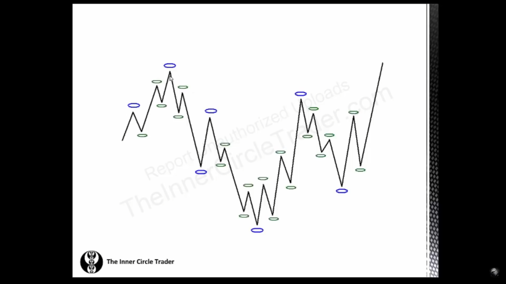

When a High has lower high's on both of side & even lower high's of long swing then its an long term high.

When a low has higher low on both of the side & even higher lows of long swings then its long term low.

**Kill Zone and Key S & R Level :-**

When you identify the price action on bigger timeframe of your framework, You dont enter into trade at any point.

You checkout your bigger timeframe bias what your pricing is telling, either bu llish or bearish. And you wait for the kill zone at the key support & resistance levels and then you can take entry with market or pending orders.

**Market Structure Strategy :-**

- Find high & low on the bigger timeframes(Monthly) of your setup & calibrate your high's & low's on weekly chart.

- Mark the range where the market is heading on bigger timeframe(Monthly) & colour it according to buy or sell.

- From the low's wait for break of structure & find out the retracement from `low to newer high (In terms of Uptrend directional bias)` & `High to newer low (In terms of Downtrend directional bias)`

- Wait for price to retrace in your golden zone & wait for reversal signs.

- Take the trades only in long term directional bias direction (Long term trend).

- Continue to the setup of finding the retracement from `long term low (In terms of Uptrend directional bias)` & `long term high (In terms of Downtrend directional bias)` to structured braked `Newer High (In terms of Uptrend directional bias)` & `Newer Low (In terms of Downtrend directional bias)` to grab entries at fibbonacci golden zone & set the targets previous swing levels.

### Support & Resistance

Trading Horizontal Support & Resistance levels doesnt tells us exactly buy to sell but moreon it tells us what levels price can react.

All the indicators are lagging which means they are indicating the signals behind the price thats why in the backtesting it performs well but in the live market it gives us late signals which will lead us to losses.

We should not look for support & resistance levels around the patterns we are looking for instead we should wait for price to reach at those important levels & then we should look for patterns or any other indications which tells us the reversal or continuation of the trend.

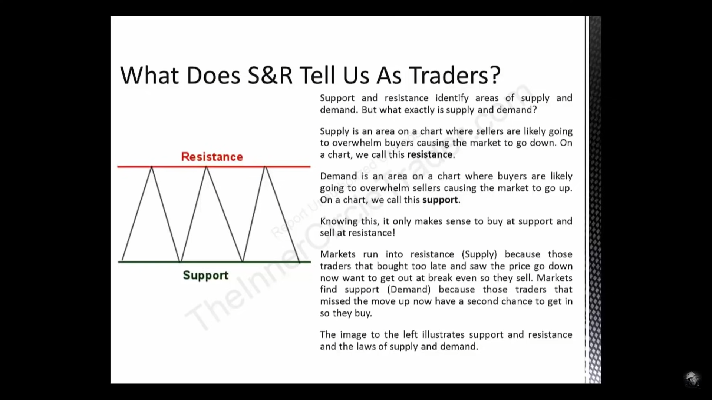

**What Support Resistance tells us :-**

**Support :-**

  Support identifies an area where there buyers going to overwhelm the sellers & waiting for the buy opportunity on that perticular levels.

  Sometimes market makers moves the markets below the support levels as well to collect the pending orders or hit the stoplosses of retail traders & to fill their huge orders by existing retail traders out there.

**Resistance :-**

  Resistance indentifies an area where sellers going to overwhelm the buyers & they were waiting for the sell opportunity on that perticular levels.

  Sometomes market makers moves the market above the resistance levels as well to collect the pending orders or to hit stoplosses of retail traders so they will get exited out of trade & to fill their huge orders.

**Strength of the trend & levels :-**

When price breaks resistance levels frequently & respects support levels then its very good indication of bullish behaviour.

When the price breaks support levels & respects resistance levels then its very good indication of bearish behaviour.

The more times support & resistance levels respected then its more valid levels.

**Types of Support & Resistance Levels :-**

1. **Natural S&R Levels :-**
   
   We have Natural S&R Levels like in the hirarchyfrom session, daily, highly, weekly, monthly, quaterly, & 12 Month.

   - **12 Month High's Low's :-**

    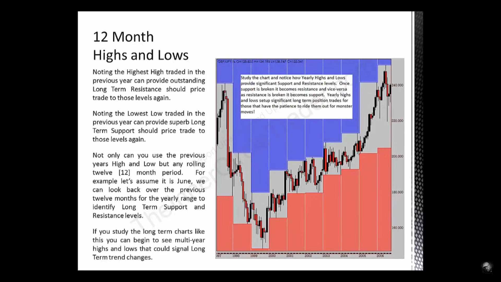

    12 Month High's Low's dont makes setup whole lot but we need to keep a note of yearly high's & low's for longer term directional bias.
  
  - **Quaterly High's Low's :-**

    

    Quaterly high's & low's are most important ones for long term swing trades & highly respected as well. We need to keep note of Quaterly high's & low's in our swing trades as its plays very important roles in it.

  - **Monthly High's Low's :-**

      

    Multiple opportunities given with the help of monthly high's & low's. We find a lot of setup for swing trades with the help of monthly high's & lows which will gives great returns even without spending a lot of time in front of screen.

  - **Weekly High's Low's :-**

    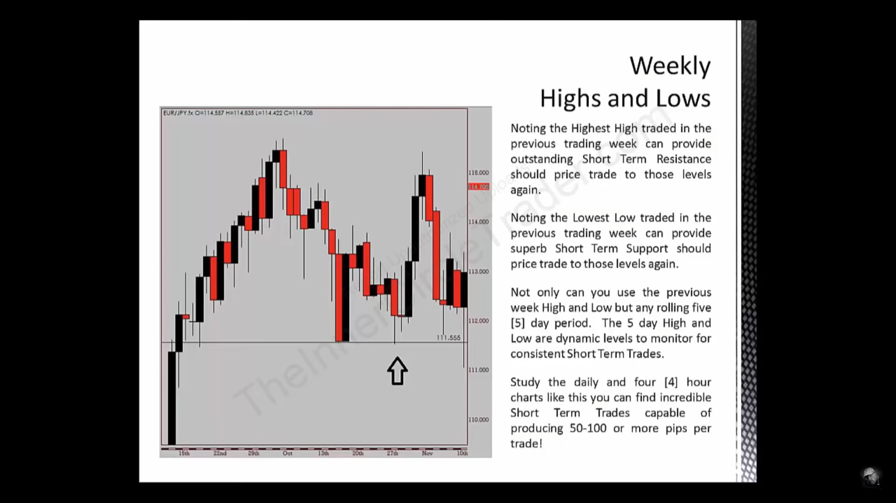

    Weekly high's low's are the levels we look frequently in our swing trades as price respects those levels obidiently. We can catch great moves with the help of weekly high's low's without spending much of time in front of screen.

  - **Daily High's Low's :-**
  
    

    We look for minimum of 3 days of data while considering daily high's low's which gives us the good key levels for intraday trading.

  - **Asian High's & Low's :-**

    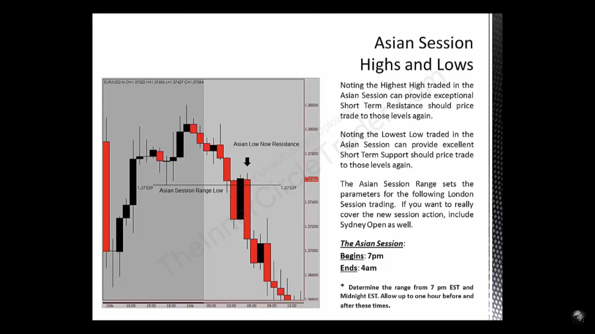

    Asian session high's & low's are very important levels for intraday trading & Scalping.

    On this levels price reacts very well and the asian session high's & low's are specially usefull for London & New York session traders.

    Asian session high's & low's are formed in between `6:30AM to 2:30PM` as per Indian Standard Time.

  - **London session High's & Low's :-**
  
    

    London session high's and low's are very influential for New york session traders, There are lot of opportunities forms within london sessions.

    London session high's and low's are formed in between `12:30PM to 8:30PM` as per Indian Standard time.
  
  - **New York session High's & Low's :-**

    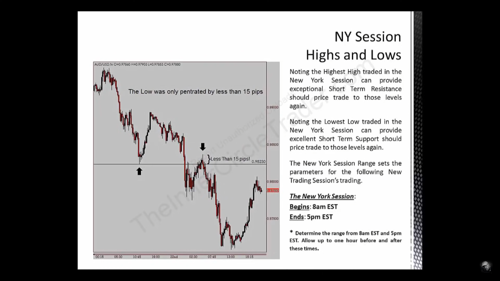

    New York session high's & low's are important for New day upcoming Asian session. Asian sessions requires refrences high's & low's for previous New York session & London session.

    New York session high's & low's are formed in between `5:30PM to 2:30AM` as per Indian Standard Time.

`Note :- We look for at least 2 previous sessions high's & low's while trading in any kind of session. When we are looking as per bigger timeframe we should look for atleast 2 greater high's & low's In Example if we are looking on daily chart we should look for weekly & monthly high's low's.`
  
 
2. **Implied S&R Levels :-**

  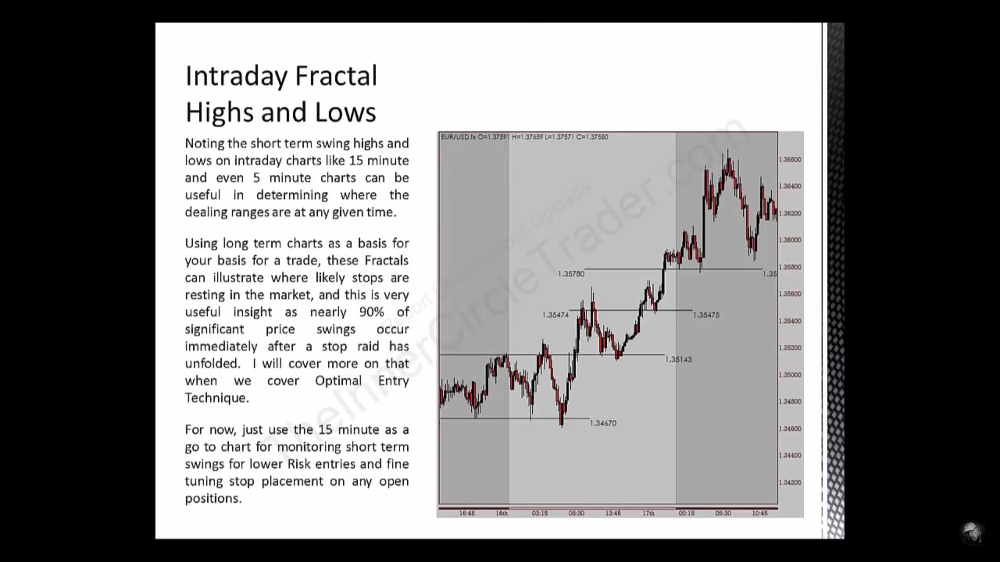 

   We have Implied S&R Levels like in the hirarchyfrom session like fibonacci retracements, fibonacci extensions, Pivot points on intrdaday charts like 5m or 15m etc.
  
  When Natural S&R levels & Implied S&R Levels are collapsing or near around each other then its high probability S&R levels which would be respected most of the times.  

**Institutional Price Levels :-**

  Institutional Price Levels are not odd number price levels in the market, they are round number levels with 100-300 pips of range like in terms of GBPUSD it would be as mentioned above in the picture.

  They use `.20`, `.50` and `.80` levles for managing the trades and their exits.

  Thats why our price sometimes penetrates through our support & resistance levels on odd price points, it goes till these institutions levels then it reverses or reacts.

### How Commercials Trade

Commercials trade in different way, they are long term trader and if they are getting the things at less price they buy, and buy and more buy untill market reaches to important support level.

When the trends reverses then they start selling in the market due to which the retracements forms in ongoing trend due to their profit booking.

**COT Analysis :-**

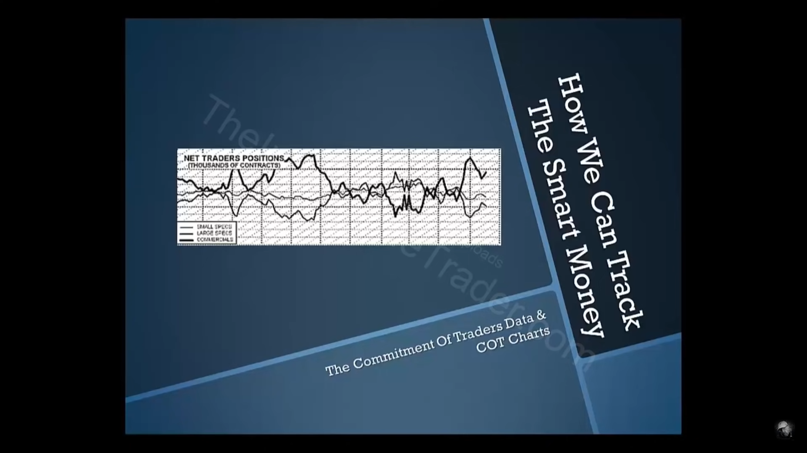

COT Chart is the combined chart of commercial, institutional & retail traders Where it explains the their net buying positions range & net Selling position range with actual data of their transactions.

**How to Read Chart :-**

**Thicker Line :-**

  Thicker line represents the commercial traders & their positions with above and below the 0 level.

**Medium Line :-**

  Medium line represents the financial institutions & their positions with above and below the 0 levels.

**Thinner Line :-**

  Thinner line represents the retail traders & their positions with above and below the 0 levels.

Here we only do care about the commercial traders, We know that commercial traders buy when the market is falling so they get the contracts at better prices & they sell when contract prices rises to book their profits.

**Commercial COT :-**

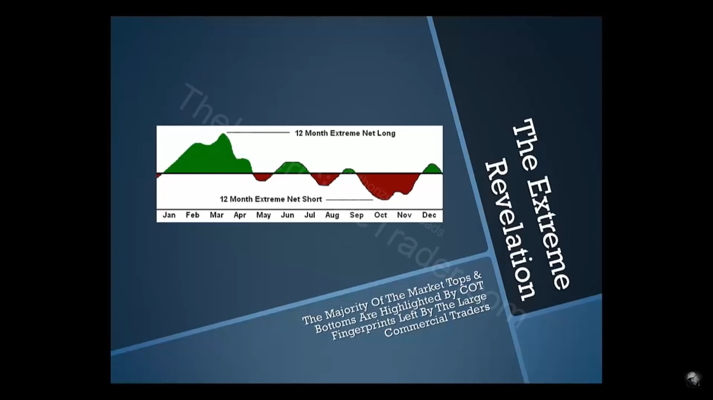

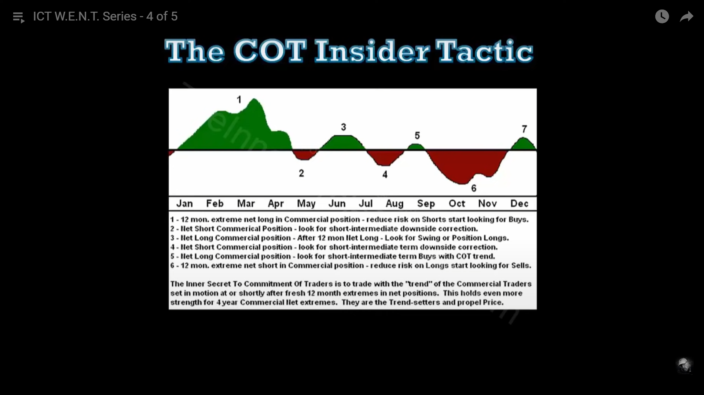

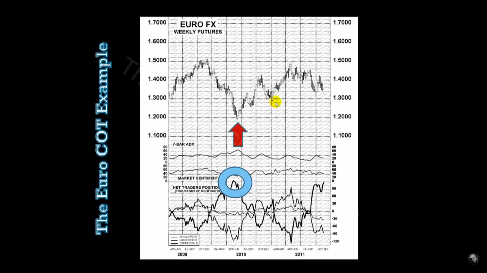

In the above chart we can see 12 Month extreme Net long & 12 months extreme net short where posisible market reversal happens.

We dont look for only this COT data to make our decision but we combine support & resistance along with it where we get to know price reached at support level & commercial traders also done with buying.

When the price reverses & commercials start booking profits market retraces in the ongoing trend and thats where we exactly look for sniper entries.

When we notice the short downtrend of commercial orders at point 2 at may month it doesnt means market got reversed but the smaller corrections is happening for collecting for more buy order.

At the point 5 and in the month of september it means commercials done with their buying & when their buying trend is loosing it strength and you can notice when the cot chart goes down to 0 then its huge moment comes in and thats when we put out most our leaverage in. `We look for this kind of opportunities in the market as ict traders.`

**COT Strategy :-**

1. Trade in the direction of most recent 12 months commitment of traders.

2. Wait for price to form intermidiate term swings retracements and then take entry.
   
3. Use OTE (Optimal Trade Entry) pattern to enter into trade with the help of fibonacci.

4. Take only Buy positions when COT reaches fresh 12 months and or 4 year extremes on commercial net short positions.

5. Take only Sell positions when COT reaches fresh 12 months and or 4 year extremes on commercial net long positions.

6. Combine retracement with support & resistance in the direction of COT guides.

### Weekly High & Low's Importance

Weekly high & low's are the important levels for swing trades with 15m chartsEven simply if you buy at weekly low & sell at weekly high then still you would be profitable.

Weekly High's form in bearish environments in tuesday's or wednsday's london session opening.

Weekly Low's form in bullish enviornments in tuesday's or wednsday's london session opening.

### ICT Kill Zones

ICT kill zones are the time zones from 24 hours of forex markets where highest probabilities trade setup forms.

There are 4 types of kill zones introduced by ICT which are as followed.

**Types of Kill Zones :-**

- **Asian Kill Zone :-**

  `EST - 8pm TO 12am` `IST - 6:30am - 10:30am` is the Asian kill zone is high volatility zone for AUD, NZD & JPY pairs are ideal to trade. According to volatility we can trade `AUD/JPY & NZD/JPY` in Asian kill zone.

  Its charecteristics is the consolidation phase of market & major currency paris which leads to potential trend continuation or reversal.

- **London Open Kill Zone :-**
  
  `EST - 2am TO 5am` `IST - 12:30pm - 3:30pm` is the London Open kill zone is volatility zone for `EUR/USD & GBP/USD` pairs. 

  Its main charecteristics is to create low of the day in bullish market & high of the day in bearish market.

- **New York Kill Zone :-**
  
  `EST - 7am TO 10am` `IST - 5:30pm - 8:30pm` is the New York Kill zone is volatility zone for major pairs coupled with USD like `USD/CHF, USD/CAD, USD/JPY, XAU/USD & XAG/USD` etc.

  Its main charecteristics is either the continuation of london move or complete reversal of it.

- **London Close Kill Zone :-**

  `EST - 10am to 12pm` `IST - 8:30pm - 10:30pm` is the London close kill zone is volatility zone for EUR, GBP, USD coupled pairs.

  Its main charecteristics is to retracement of daily high's or low's & its major area for the change in direction of weekly & daily trend.

- **London Close Kill Zone :-**

### USD Index Corelation with Commodity, Stocks & Currencies

USD Index indirectly indicates the direction of Forex Market such as comodity, stocks & currencies direction if analyzed on higher time frame like 1d & 4h.

When the USD index is up then eveverything else will goes down which is called as `RISK OFF` & when the USD index goes down then everything else will go up and its called as `RISK ON`.

Whenever we start for analysis for forex we should start with USD index on higher timeframe & its swing direction.

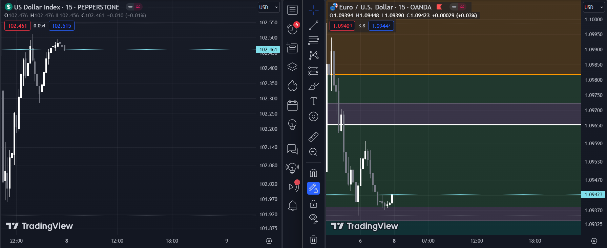

You can checkout the EUR/USD Movement directly related to usd index, Both are moving in identical manner but in reverse order.

Nearly Exact respected currencies with respect to USD INDEX are as mentioend below.

- EUR/USD
- GBP/USD
- XAU/USD
- XAG/USD
- USD/CHF

**London Kill Zone Strategy with USD index :-**
- Check out the USD Index move & analyze the market move for your currency pair for today either up day or down day.
- Mark the London open line or london kill zone on chart to check where it breaks fake outs previous swing level.
- Mark the fibs for the high & low of the new trading day swing
- Find the `day high in terms of downtrend day` and `day low in terms of uptrend day`  with the Fibonacci retracement in golden zone & fake out of the previous swing `high in terms of down day` & `low (in terms of up day)`.
- Keep the stop loss of 30 pips above your founded low & high because we are already keeping 1/3 or stop loss of the daily average range of 100 pips even at its highest point.
- Take `SELL trade in terms of down day` and `BUY trade in terms of up day`.
  
We can use 9 and 18 moving average crossovers as well to check long term directional bias & we can mark the zone with appropriate color which will indicate sell directions which we are going to take.

## ICT FOREX SCOUT SNIPER SERIES

### Sniper setups trades classfication

Sniper setups trades are the trades we derive in advance already and we plan everything before trade like entry points, stop loss levels & even take profit levels.

Sniper trade setups can be classified as mainly the setups with advance before time analysis and limit orders for the trade with SL, TP and entry point.

**Factors to be considered while preparing sniper setups :-**
1. Precision Point Entry Prices - Applicable for use of Limit Order.
2. Utilization of specific time of day critiria.
3. Advance knowledge of target prices for positive exit points.
4. Employement of strict risk management protocols.
5. Calm & disciplinary trading without emotions and impatience.

### Swing Points

Swing points are the High's & low's points sourrounded with `Low's having higher 2 high's on both side` & `high's having 2 lower low's on both side` are called as swing points.

We can use the indicator as well for the same in MT5 for it. Insert > Indicators > Bill Williams > Fractals.

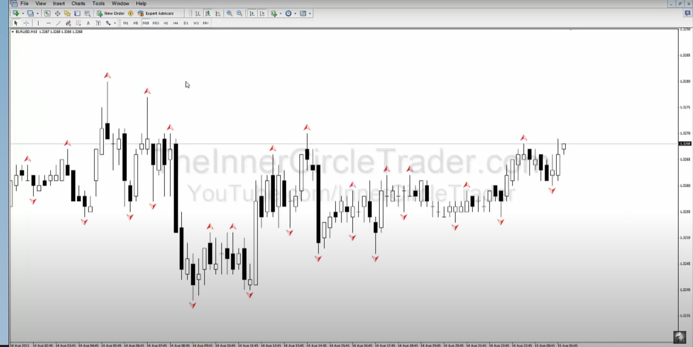

**Excercise with swing points to understand price action :-**
1. Take any pair of your choice in forex market & turn on daily timeframe sepration with `Ctrl + Y`.
2. Mark any week in mt5 & move to a 15m timeframe.
3. Checkout for every swing point in the selected sample data & at what time of day it is formed.
4. Check out the direction of which made the most in terms of pips.
5. Check out the characteristics that were synonymous in terms of every single swing point.

### Importance of Higher timeframe support & Resistance levels

Only motive of large institutions is get the entry at good price, which are also an round number around the supprt and resistance levels.

Flow of institutional sposershiop in market which we called as Smart money move can be understood with higher timeframe bias itself.

We never get clarity & move of the market by checking out on intraday timeframes, because structure is being formed at lower timeframes is the directional bias on higher timeframe.

In the above picture you can notice the support & resistance levels drawn on the chart on daily timeframe, when we brakedown this movemnt & levels into intraday timeframes that provides us the optimal entry points in current direction.

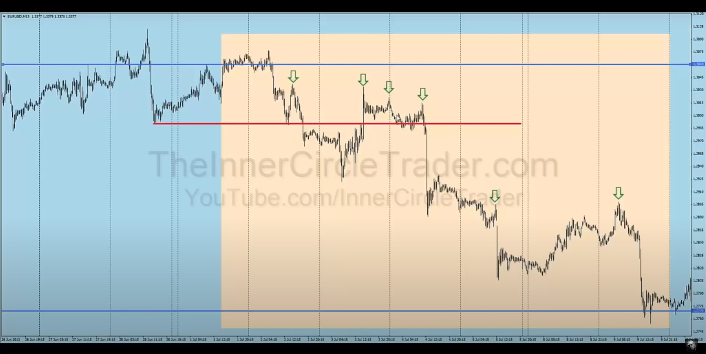

When we know that on higher timeframe price is approaching to support or resistance levels then we only find out optimal trade entries in that directios only on intraday timeframe.

In tha above chart you can notice when price breakouts previous high levlels big moves appears to the downside, if we brakedown the timings of those moves mostly are in london kill zone & new york kill zones.

**Clarity of movements on higher timeframe :-**

In the above structure we have marked support & resistance levels which are being respected, and its follwing market structure very well that when resistance is being broken its becoming support & price going for new move from those after retracement.

But if you can notice the upper circuit formed where price has consolidated we are not able to identify it before the time, but if you can notice on higher timeframe there is resistance level exists as mentioned above in second chart, at that price point from where price got reversed as changed the direction of market.

**Excercise for higher timeframe directional bias :-**
1. Mark the recent support & resistance level on daily & 4h timeframe.
2. Notice how price fails to continue the trend as those levels and how does it reacts on those levels.

**Steps to understand higher timeframe directional bias :-**
1. Checkout the trend on higher timeframe such as daily & 4h.
2. Mark the recent support & resistance level on daily & 4h timeframe.
3. Draw he fibs from the higher timeframe swing low to swing high and try to understand price is in continuation phase or retracement phase.
4. And on the smaller timeframe find the setups accordingly.
5. We need to find the setups only in the direction of price's current state of direction.
6. Thats how we get to know directional premise.

### Reaction levels

Reactions levels are the important price levels from higher timeframe which are crucial on lower timefrmae such as 15m etc.

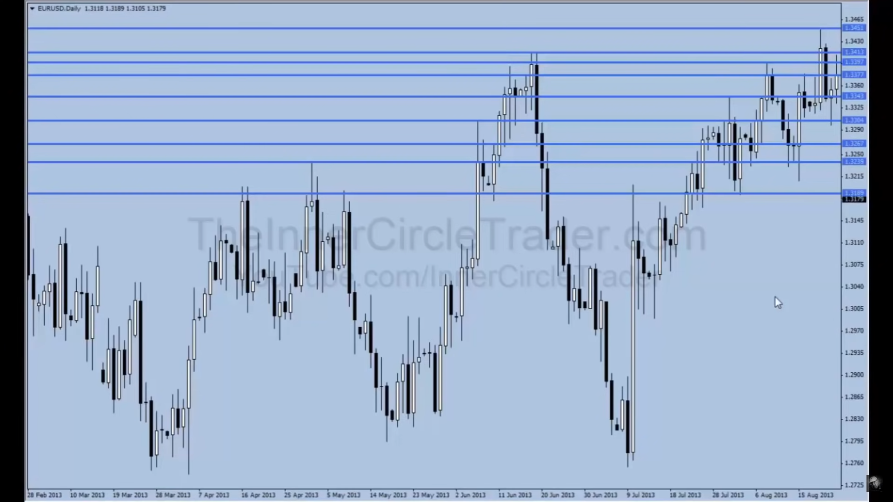

As you can see above images first chart is daily timeframe chart & below chart is 15m timeframe chart.

We have drawn important levels such as support, resistance, swing points on daily timeframe but those are beautifully getting respected on 15m timeframe, This is how we figure out potential price reaction levels

<!-- ### 10 Year T Note & Yeild Data for direction of currency market.-->

Most of the traders get excited when the any currency pair is volatile, or moving in huge ranges but no one gets excited in the conslidation, but instituional sponsership gets in when the consolidation is happening in any currency pair.

Goal is to take position in consolidating market before everyone gets involved and take benifits of the big rallies which happens after conslidation.

On large range days the open tends to be at the opposite extreme of the daily range oppose to the close.

You can checkout in the above example notice how much time it happens where open tends to be at the opposite extreme of the daily range, Even if we are able to catch the move then we are still profitable.

`We consider new day from 12:00AM in midnight & 2:000PM according to EST timeframe.` according to instituaional sponsership.

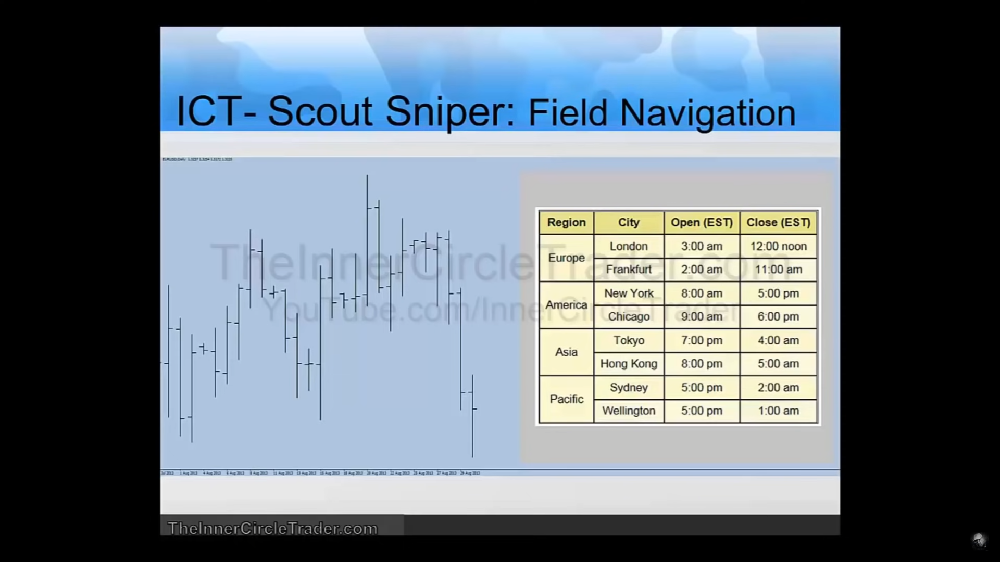

You can checkout how price made its daily low around 2AM EST & closed higher around 18:00 EST which is london close as mentioned in the image above for sessoion timings according to EST.

Even if we enter in daily high of down day and close in new york session ending which will create low of day then we can it will lead us to profitablity in our trading journey.

### POWER OF THREE 

There are 3 stages in a trading day in forex market, `Accumulation, Manipulation & Distribution` as mentioned below in buy & sell model for market markers.

Buy models happens at daily timeframe support levels & sell models occur on daily timeframe resistance levels. We can look into its details by switching to intraday timeframes as well such as 1h & 15m.

**Excercise for power of three :-**

### Market Orders & Institutional Orders

Market price reaches to an key level, where we are expecting reaction on that price level But market have couple of orders near that levels as menitoned below.

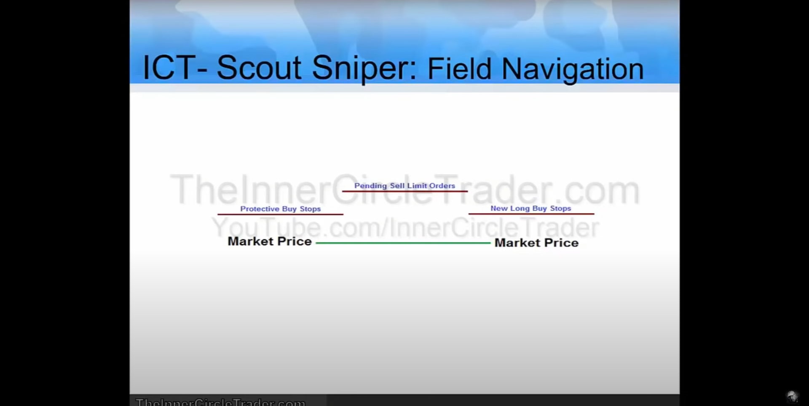

Resistance Ex : Let's consider price is reaching to key resistance levels then it would have existing buy TP orders & stop loss orders above that level who sold on that important level, new buy orders on that level as mentioned above.

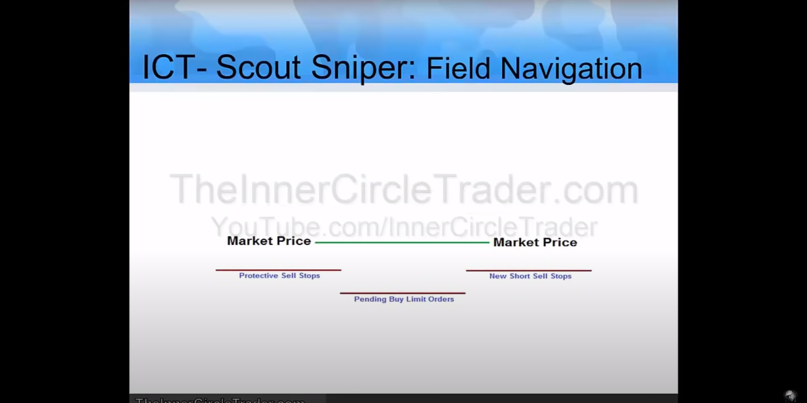

Support Ex : Let's consider price is reaching to key support levels then it would have TP levels who already sold, new buy orders and SL orders who placed pending buy orders at that important level as mentioned above.

**Market Makers Order Pairing :-**

Market orders gets executed at round numbers around important levels such as 20, 50, 80 & 100's.

Market moves in the direction or pattern around the important levels such that they take out all the retail traders.

**Order pairing at resistance levels :-**

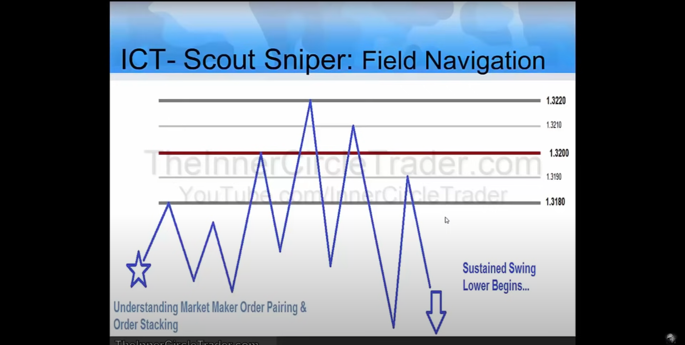

- When price reacts to `1.3180` level retailers thinks its resistance levels & place their sell orders which is having stop loss around 1.3190.

- Market makers make the second swing to down side to give confirmation to sell orders & to more retailers should get in.

- When retailers gets in with sell orders market makers sweeps thruogh the `1.3180 & 1.3190` which takes out stop losses or previous sell orders & price reacts to `1.3200` levels.

- When price reacts to `1.3200` retailers who waiting for major figure to react sells at the price point & in the next swing price takes through `1.3200` to take out their stop losses.

- When market reached to `1.3220` after sweeping through `1.3200` retailer doesnt takes entry as market went 2 times against them already & break of structure happens for previous swing low.

- When price retraces after breaking the structure after taking retailers out of the market and eating up their stop losses `thats where we should enter into sell trade.`

**Orders Pairing at support levels :-**

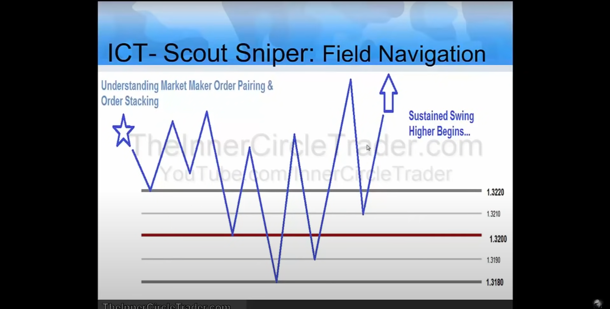

- When price reacts to `1.3220` level retailers thinks price got reversed from support levels & take the buy trades by placing stop loss below `1.3200`.

- Market makers makes second swing to upside to give confirmation of price reversal from support & to more retailers to get in for buy trade.

- When retailers gets in with buy orders market sweeps down `1.3220` level & takes out stop losses of retailers & reacts to `1.3200` level.

- When price reacts to `1.3200` major level major level traders thinks its the reversal & enters into buy trades but in next swing market sweeps down to `1.3200` level & takes out major level retailers stop losses.

- When price sweeps `1.3200` level & reached to `1.3180` levels retails doesn't enters into trade due to previous as market already went 2 times against them & break of structure happens for previous swing high.

- When the price retraces after breaking the structure after taking all the retailers our of the market eating up their stoplosses `thats where we should enter into buy trade.`

### Directional Bias (SNIPER SERIES)

We give most priority to daily timeframe in directional bias.

We use 2 moving averages on daily timeframe which are `9 & 18`. When the 9 moving average is trading up of 18 moving averages then we will only look for buy trades & when the 9 moving average is trading down of 18 moving averages then we will look for sell trades.

We importantly look for retracements in kill zones for the entry, lets say 9 moving average is trading up of 18 moving averages & we get an retracement to ote on fib level in specific kill zone then its an high probability buy trade and vice versa sell trade will work.

**Moving Average Strategy for swing trading :-**

`ICT says based on the moving averages draw your bullish or bearish trading zones & checkout out the fractals from the Indicators > trend > fracts in MT4. When there is break of structure means previous high broken out in bullish env & retest on it then take the trade. repeat the process until there is break of structure to downside where previous low taken out by the price.`

### Order Block

Institutions doesn't chase the price in the trend, institutions only buys when the price is falling down & sells it when the price is rising up. With the help of order block we can find entries or possible institutions entries which will cause drastic moves to either or upside or to downside.

Order block is the area where institutions accumulates the orders before moving aggresively to upside or downside. Institutions wants to get the entry at the discounted price & moves the price purposely to that level or area to add more quantity to their order before moving agressively.

Price retraces to that order block before moving more higher or before giving bigger move this is the charecteristics of order block. When the order block collapses with `fibonacci OTE zone (62, 70.5 or 79)` then it have more higher probabilities to be an reversal in the ongoing direction.

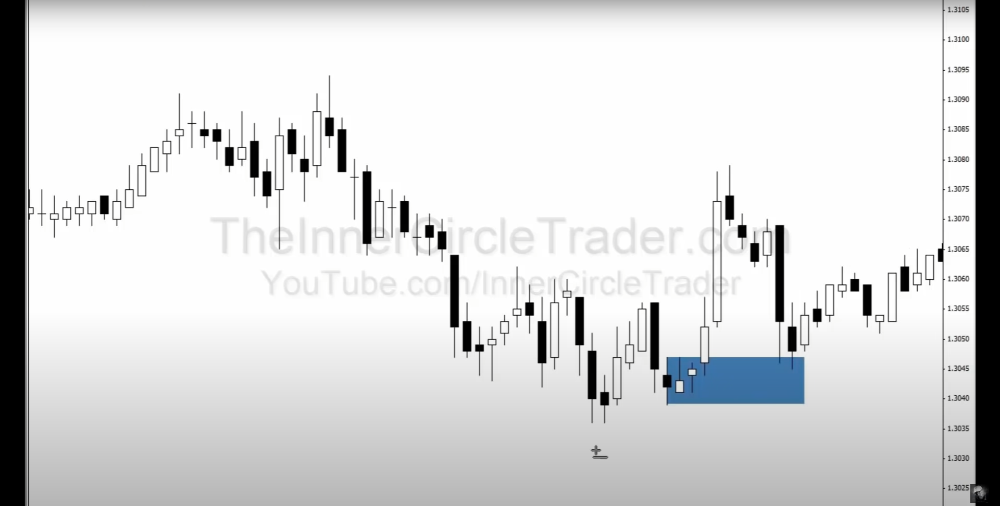

**How to find valid order block :-**

- There should be trend going on either upside or downside on higher timeframe, not the consolidation to find the valid order block.

- Price should be at important support or resistance level of higher timeframe charts such as 1h, 4h or daily timeframe.

- Price should give break of structure to previous swing's high (In terms of uptrend directional premise) and to previous swing's low (In terms of downtrend directional premise) with the help of 9 & 18 moving averages.

- `Area of Inverse directional Candle before the aggresive move to any side which caused break of structure is an order block.` 

**Optimal Trade Entry (Strategy) with order block :-**

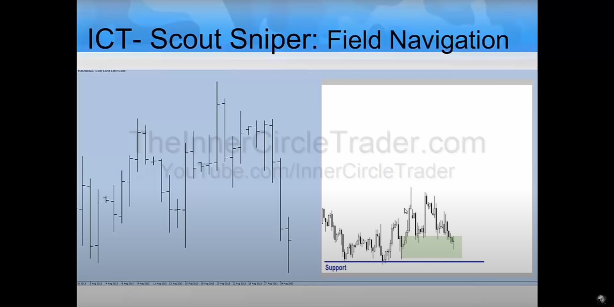

- Most important things are price should be in trend either uptrend or downtrend according to higher timeframe directional bias with the help of 9 & 18 moving averages.

- Price should be at important support or resistance level of higher timeframe charts such as 1h, 4h or on daily timeframe.

- Mark the area of inverse directional candle before an aggresive move to any side which caused break of structure of previous swings high(Uptrend) or swing low(downtrend).

- Mark the fibonacci levels from swing low & new swing high(uptrend) or low(downtrend) which caused break of structure. (Checkout for the important price level to draw fibs such as 00, 20, 50, 80)'s.

- If order block levels follows the OTE setup in `fibonacci OTE zone (62, 70.5 or 79)` then take the entry keeping 20-30 pips stoploss & targetting previous swings high(uptrend) or low(downtrend).

### ICT Range Finding

Sometimes our analysis is right, trade goes our way but our take profit levels doen't hit & price reverses the direction & winning trade turns into lossing trade.

Thats because we knew the entry but not the apppropriate exit or the price range for swing direction of our trade.

Range finding is mostly used for finding the range to book the profit in the direction of your trade, it indicates direction of our trade will reach to what price levels before reversal against our direction of our trade.

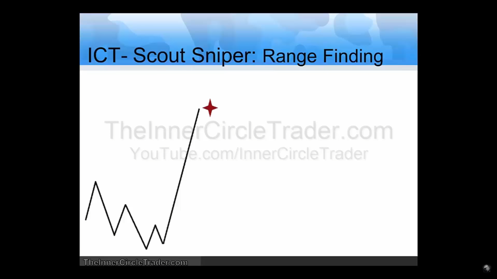
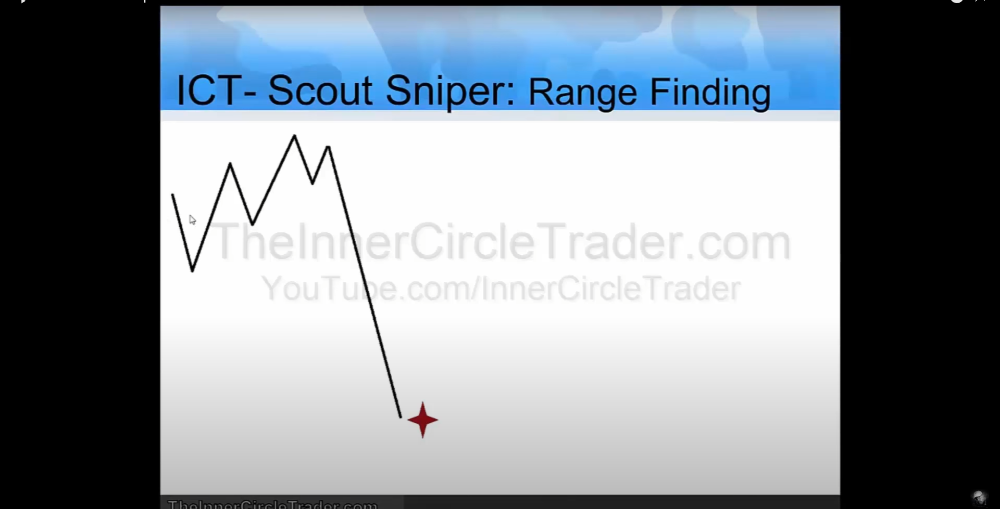

Above mentioned image shows that when price breaks out or breaks down some swing, it goes downs by the broken down swing high range.

ie. first swings high range is the distance price goes down that much when its broken down its low, price moves down the same amount as much its high was.

It is not necessary that price will got to same amount of `breakout swings low(in terms of breakout)` or `breakdown swings high(in terms of breakdown)` always but there is very high probability that it will goes up to `1.27% & 1.62%` of that range. We can figure out its 1.27% & 1.62 levels by reversing the fibonacci levels such as `high to low (uptrend)` & `low to high(downtrend)`.

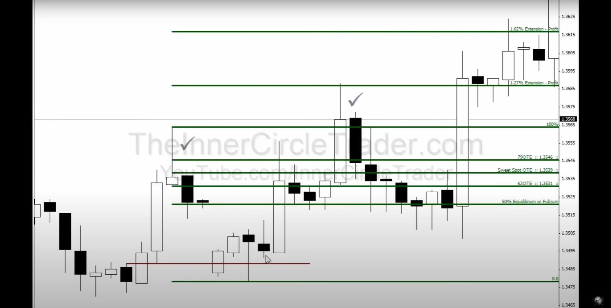

**How to get exit points with fibs :-**

**Bullish Range :-**

In the above example we have figured out the entry when price retraced in order block & consider that we have took the entry already.

Draw fibs from retracement swing high to retracement swing low to figure out the tp levels on fibs such as `1.27 & 1.62`. When price reaches to 1.27 we can shift our stoploss to `1.27` so we can secure the profit & we can wait for price to hit the next target for `1.62` & same process to do furhter till `2.00`.

**Bearish Range :-**

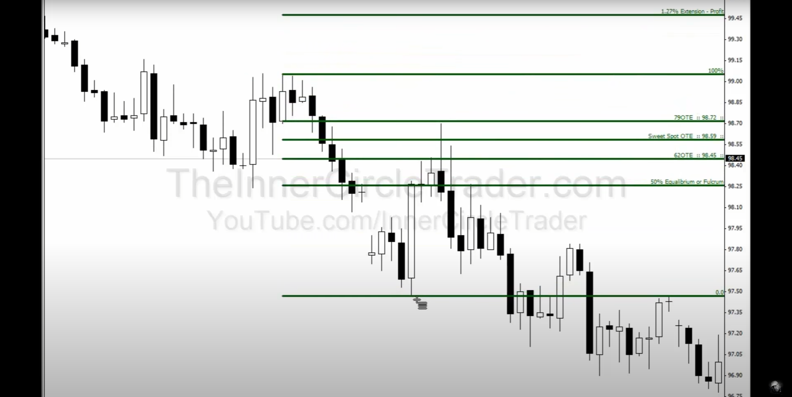

In the above example we have figured out the entry when price retraced in order block & consider that we have took the entry already.

Draw fibs from retracement swing low to retracement swing high to figure out the tp levels on fibs such as `1.27 & 1.62`. When price reaches to `1.27` we can shift our stoploss to `1.27` so we can secure the profit & we can wait for price to hit the next target for `1.62` & same process to do further till `2.00`.

### Risk Management

When we are beginner in the trading we should focus on protecting our capital rather than profits. Once we are able to protect our capital we will automatically lead to profitability.

There is an market standard of `2%` risk per trade but as an beginner trader we should keep `1% risk` per trade, even the most professional traders or even ict himself keep the risk per trade is upto `3%` of his equity.

3% per trade is the highest risk in terms of trading when you are an professional forex trader with years of experience.

We should keep `30pips of initial stoploss` or we should keep the stoploos below 2 swing high's(downtrend) & low's(uptrend) levels & keep the stoploss away from that levels by 10-15 pips.

15m timeframes gives clarity of whole week prespective, focus on tuesday's or wednesday's london for weekly high(downtrend) & weekly low(uptrend).

**Time Stops :-**

Time stops are the amount of time we should wait before cutting any trade which is not going in our direction. below mentioned waiting time limits before collapsing the trades when it goes against you.

- **Daily Setup :-** `3 Days`

- **4hr setup :-** `1 day`

- **1hr chart :-** `2 session tops.`

**Triggerting Stoploss :-**

Never rush to trigger the stop to breakeven.

When price starts to move in your way cut it by 30%, When price reached to first target reduce it even more 30% & when market reached to tp2 then move to breakeven.

When another break of structure happens on important level, we shift our stoploss to recent 2 swings low.

**Target Expectations :-**

In the intraday scalping, when trade will be in your favor & it should be minimum of `15-20 pips` in intraday, `60-70 pips` in weekly range.

Do not take the trade if your setup does not satisfy your intraday or weekly target expectations.

**InSync trades & OutSync trades :-**

In Sync trade are the trades which are in sync with your higher timeframe such as `daily ,4h timeframes` directional bias & outsync is your trades based on intraday timeframes such as `1hr, 15m, 5m timeframes`.

ICT suggests always trade in sync with higher timeframes, you can make some pips or profits by trading against the market buttt we are looking for bigger moves & consistant profitablity for which we will need to in sync with higher timeframes.

### ICT Split Gains Ratio

Its important to take out some money out of the trade when its going in your direction. Set your targets in 2-3 levels & book your profits in slots, when price hits to tp1, tp2 & tp3 accordingly.

We take out the profits out of trades according to the ratios mentioned in the above image.

**Intermediate Term Ratios :-**

- **20-20-20-20-20 :-** We set up 5 target levels in which we book our profits on each level by `20%`.

- **25-25-25-25 :-** We set up 4 target levels in which we book our profits on each elvels by `25%`.

- **20-40-40 :-** We set up 3 target levels in which we book our profits on tp1 `20%` and further `40%` on tp2 & tp3.

- **40-10-10-10-10 :-** We set up 6 target levels in which we book our profit on tp1 `40%` and further `10%` on each tp levels.

- **50-30-10-10 :-** We set up 4 target levels in which we book our profit `50%` on tp 1, `30%` on tp 2, and `10%` on futher 2 tp levels.

- **60-20-20 :-** We set up 3 target levels in which we book our profit on tp1 `60%` and further `20%` on each tp levels.

**Short Term Ratios :-**
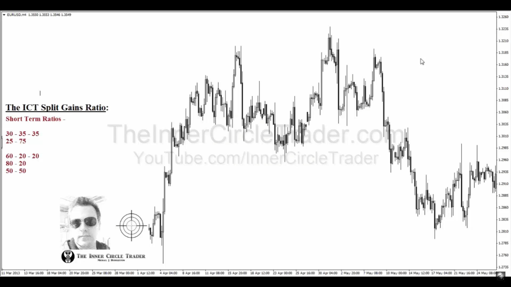

- **30-35-35 :-** We set up 3 target levels in which we book our profit on tp1 `30%` and further `35%` on each tp levels.

- **25-75 :-** We set up 2 target levels in which we book our profit on tp1 `25%` and further `75%` on each tp levels.

- **60-20-20 :-** We set up 3 target levels in which we book our profits on tp1 `60%` & `20%` on further tp levels.

- **80-20 :-** We set up 2 target levels in which we book our profits on tp1 `80%` & `20%` on second tp level.

- **50-50 :-** We setup only 2 target levels in which we book profit by `50%` on each level.

**Intraday Ratios :-**
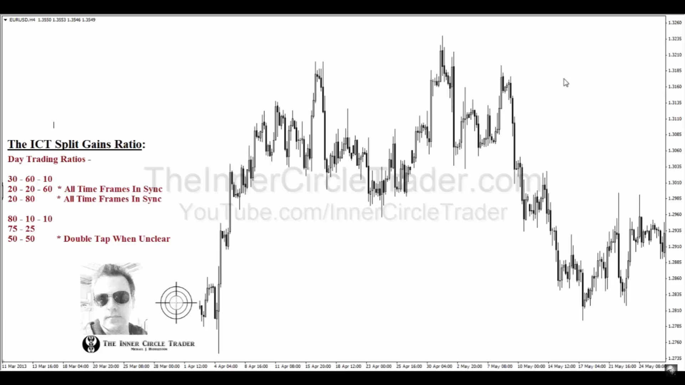

- **30-60-10 :-** We setup 3 target levels in which we book our profit by `30%` on tp1 & `60%` on second tp level 7  `10%` on thrid tp levels.

- **20-20-60 :-** When we are synced with higher timeframe directional bias then we setup 3 target levels in which we book `20%` on first 2 tp levels & `60%` in last tp level.

- **20-80 :-** When we are synced with higher timeframe directional bias then we setup 2 target levels in which we book `20%` on first& `80%` in last tp level.

- **80-10-10 :-** We setup 3 target levels in which we book `80%` on first & `10%` in further tp levels.

- **75-25 :-** We setup 2 target levels in which we book `75%` on first & `25%` in last tp level.

- **50-50 :-** We setup 2 target levels in which we book `50%` on each tp levels.

**Scalping Ratios :-**

- **50-50 :-** When we are scalping then we setup 2 target levels in which we book `50%` on each tp level.

- **Watch your six :-** If you are not confirmed on your trade then reduce your position by `50%`.

### Summary of Sniper Series

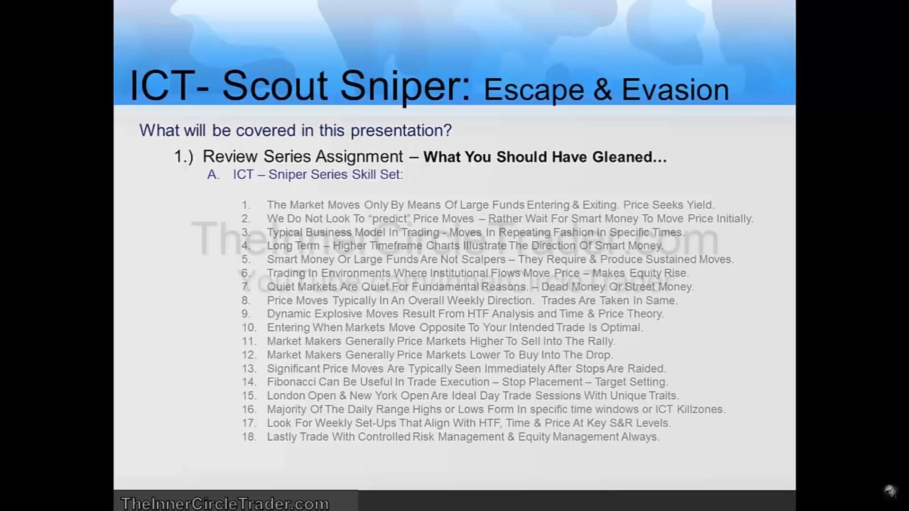

We have learned that so far in sniper series is that directional moves in the market happens when `smart money (Large institutions & Banks) gets into market` and we as a trader not trying to predict the market direction, instead we are spoting the traces of entry of smart money & follow with them to get some small profits.

We can identify the direction of smart money with higher timeframe charts & smart money operates in weekly range, when they want to enter into market they moves the price downward to buy at discounted price & they move market upwards to sell their large number of orders.

Sudden & explosive moves happens when stops at important levels are blown out, when stops trigger of retail traders, orders get released into market so smart money can grab maximum of the orders consumed by the retailers. When orders are accumulated at some important levels then explosive moves comes into market due to smart money's entry in it.

We use fibonacci & order blocks to find the retracements in explosive moves & to continue with instituional rally. we can place the stops of 30 pips standard & we can trail the stops to below 10-15 pips below low of previous 2 swings. We use fibonacci also for target setting with their levels such as `1, 1.27,1.62 & 2`.

We focus on new york & london sessions which both have their special charecteristics & daily high's in downtrend market & daily low's in uptrend market occurs into london kill zone & new york eiter continues the rally or price gets reversed in it.

We mostly focus on swing trading as weekly setups with the help of higher timeframes such as `4h & daily` as prices have weekly directions where we can get same amount of profits rahter than looking for daily setups.

**Daily Timeframe Checklist :-**

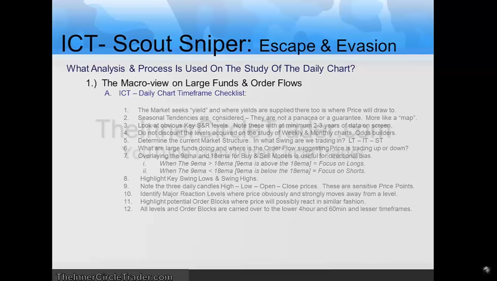

- The direction of 10 years yeild data, market moves in that direction.
- Obvious key support & resitance levels with 2-3 years of data either on daily or weekly timeframes.
- Current market structure, Long-term or Intermediate term or maybe long term.
- Order flow where instituions trading to upside or downside.
- EMA setup of 9 & 18 ema.
- Swing highs & lows with minimum 1 candles on each side.
- Potential order blocks on daily or 4h or 1h timeframe.
- previous 3 daily candles high, low open & close levels are sensitive.

**4h Timeframe Checklist :-**

- Daily timeframe directional bias.
- Only look for buy trades if daily bias in buy model
- Only look for sell trades if daily bias in sell model
- Order blocks retracements with fibonacci confirmations by keeping daily bias in mind.
- Keep eye on daily timeframe reaction levels.
- 4h Timeframe analysis will be carries forward to 1hr timeframe.

**1h Timeframe Checklist :-**

- daily bias we keep in mind for analysis of 1h chart.
- Order blocks on 4h timeframe & daily timeframe should be focused first.
- View weekly range on 1h timeframe to figure out the swing points.
- Weekly high's & low's forms in mon-wed in the week.
- We are not lokking for daily trades, we are looking for one solid setup for week.
- 1h timeframe analysis will carry forward to 15 & 5m timeframe.

**15m & 5m timeframe Checklist :-**

- Daily bias should be kept in mind.
- Mark day seprator to have idea about the whole week.
- Note asian range high & low to refer in london sessions to important price points.
- Daily high's & low's forms after sharp fake moves in opposite directoins which is called as juda's swings.
- spot OTE setups with combination of time, price & analysis breakdown from higher timeframe to lower timeframe.
- Use fibs to fine tune order blocks & ote retracements.
- Dont trade new york open if the price is trading on important level because its charistcis to have reversals in new york sessions.
- Dont rush the entry & wait patiently for setups to be formed.
- Focus 1hr timeframe levels for profit booking with atleast 1:3 & higher.

`Note :- Stay Patient, Slow & Steady wins the race!!!`

## ICT Precision Trading Concept Series

### Weekly Orderblock & Order Flow

Order blocks which are found on weekly-chart overlooked by new traders but with those  orderblocks we can plan low risk-high probability trade.

Low-risk & High probability setups derived from higher time frame perspectives. The large institutions and banks are basing the majority of their trades from these charts.

There is lot of more fundamental & major news required to change the direction in the weekly charts.

We use 9 EMA & 18 EMA to identify the directional bias on weekly timeframe, when the 9 EMA is trading above the 18 EMA & the gap is opening widely then its the bullish directional bias & bullish order flow. Same vice versa for the when 9 EMA is trading below the 18 EMA & opening wide gap then its bearish directional bias & bearish order flow.

We avoid long wicked candles for orderblock, there should be enough body to the candle to forma an orderblock.

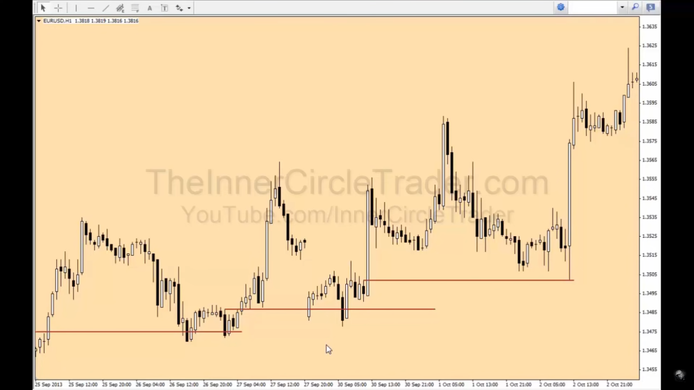

Even if our orderblocks got taken out you can checkout the confluence of important support & resistance level & we need to keep in mind that price heads towards where liquidity resides not our line or orderblopck or support level exists. So we should accept it & lookout for next opportunities.

USD/CHF is the king of volatility pair but it trades in most of the ranges, we can find multiple setups in USDCHF wiht the help of orderblocks strategy.

If the price retraces below than 79% retracement level & not entered into orderblock yet then we should avoid that retracemnt as its an invalid retracement level which is already retraced around `79%` but still not reached orderblock yet.

We can trade the each & every range in the market no matter what is the long term directional bias is but the only thing we need to know that it increased the trade opportunities as well as our loosing trades as well. So its always better to trade into the directional of higher timeframe directional bias.

## Market Maker Primer Series

### Liquidity Pools

Before understanding liquidity we should know that `how the market moves?` normally market moves towards the liquidity, where the stoploss order resides of retail traders to take them out & take their huge contracts get executed after taken out the retailers who holding the contracts.

In the traditional methods or in the books it teaches us the retail patterns such as double tops or double bottom where we should take buy trade & sell trade at double top etc.

But the market looking the support resistance in the different ways. From retail prespective we see the levels as support & resistance levels but institutions look those levels for liquidity to move the market.

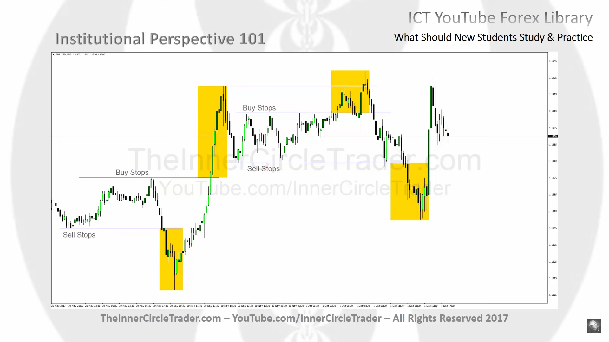

As we can see above in the image below the support levels `sell stops(Stoploss of long positions)` & `Buy Stops (Stoploss of short positions)` and thats we called as liquidity. Where insitutions can take out the retailers to take entry in the market with full potential & to move the market in its reverse direction to book their profits by exiting their quantities.

Liquidity can be the area below the support & above resistance levels by 20-30 pips of area.

**Strategy Using Liquidity :-**

We can use liquidity in our setups to identify where the price likely to move to grab the liquidity. We can `combine liquidity with orderblock + ICT OTE Entry + TP levels with fibs` for scalping on intraday 15m timeframe targetingn 20-25 pips.

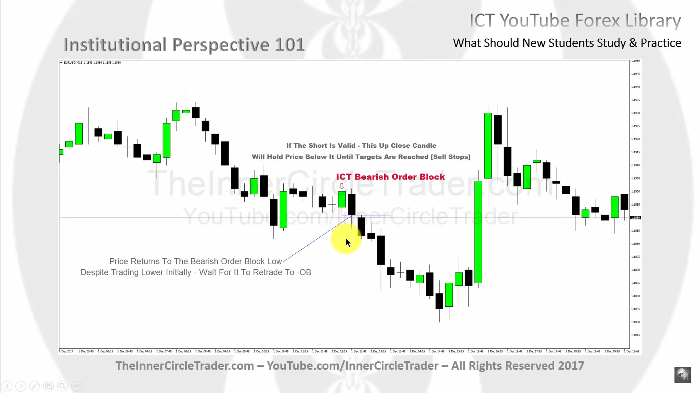
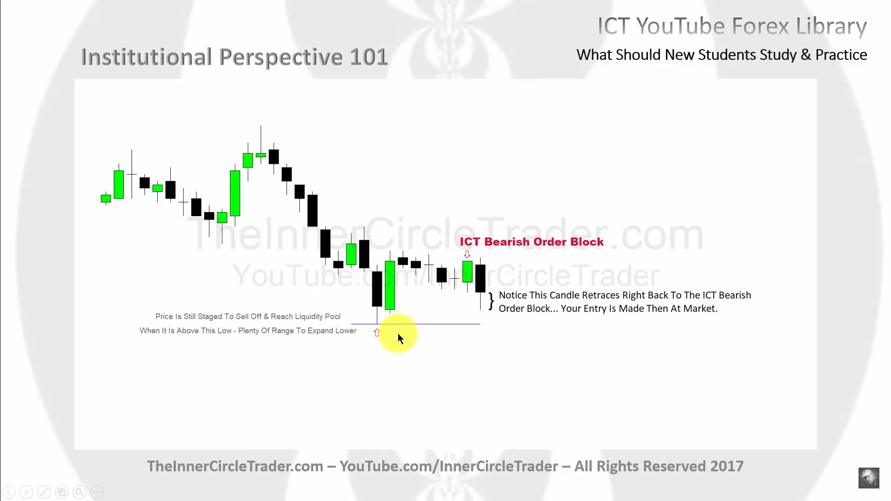

The area we are able to see above in images is the zoomed area of retracement of price on support level from first image in this section.

As you can see bearish orderblock formed after before an down move is an bearish ordrblock which could be possibly entry of market makers. If the orderblock will be valid it will hold the price below of it until it reaches the liquidity pool below support levels.

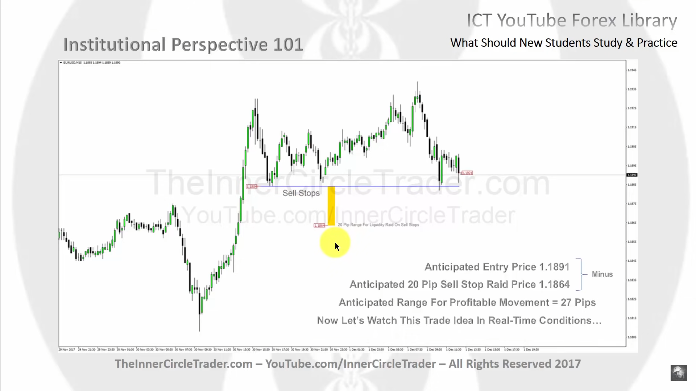

When price retraces to that orderblock again we take entry setting take profits towars the liquidity below support levels by 20pips & by keeping the stoploss above the orderblock by 10-15 pips as mentioned in the image above.

**Results of above entry :-**

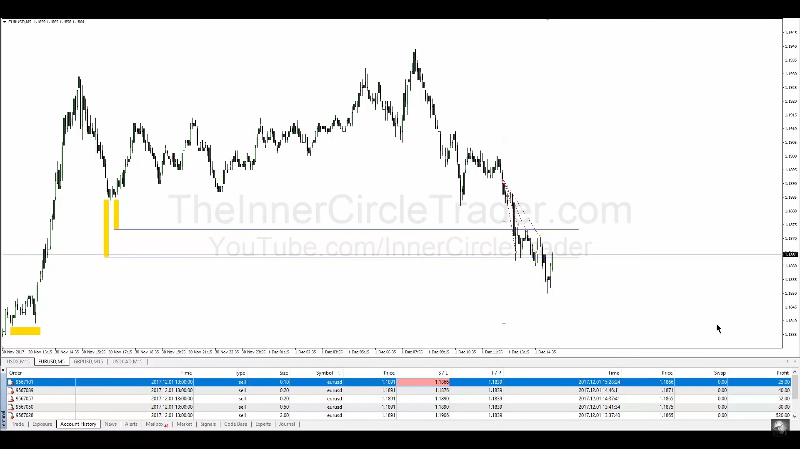

As you can see above in the image price has breached our 20pip levels after our entry & hit our tp levels. We tookout profits partially for splitting our gains.

### Consideration in Risk Management

Trading is not about making profits, but its all about surviving in the market when you are not winning, and managing your capital accordinng to it. Those who survives leads to profitability.

Lets consider we have $10000 account in this section.

- **10% risk per trade :-**

Even if we loose 8 trades in row & if we are are risking `10%` per trade then it can lead us to `$5,217` in loss which is approx `52.17%` of our total capital. Its very usual to having loosing streak of 8 trades in row even we can loose 8 trades in single day.

It does not only affect our capital but it also affects our mental health as well.

Its very dangerous to keep 10% per trade.

- **5% risk per trade :-**

Even if you are a risk taker and if you keep 5% percent risk per trade you will be loosing `$3016.63` which is `30.17%` which can be easily happen if you have loosing trades in row. 

Its not advised to risk even 5% per trade.

- **2% risk per trade :-**

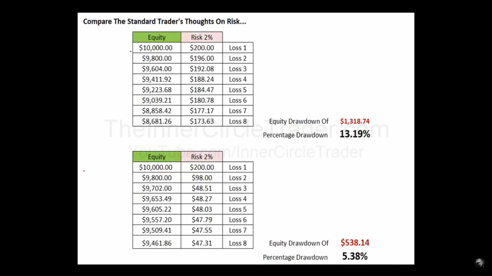

In the image above lets consider we have 2 traders keeping `2% risk per trade` but 2nd trader loose only `$538.14` which is `5.38%` of his equity & first trader lost `$1,318.74` which is `13.19%` of total equieity.

Let understand how second trader managed to loose only `5.38%` even after loosing 8 trades in row.

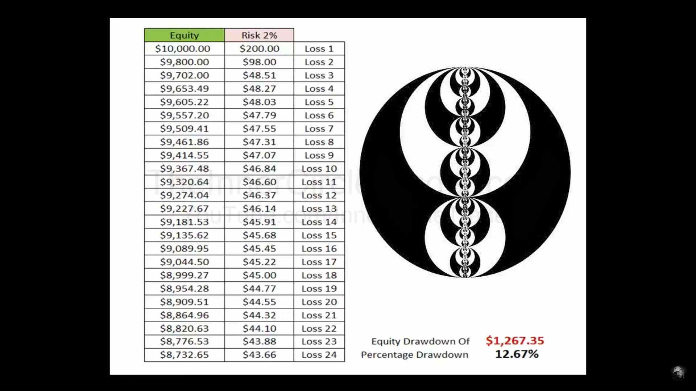

Let's consider second trader had even 16 more loosing trades stil he is only `12.67%` down which is `1,267.35` which is less than first trades 8 loosing streak loss.

How?????

First trader cut down his losses every time hee makes losses till he reaches `0.25% or 0.50%`.

Lets understand in more details, in first trade with the `2%` he lost `$200` then he cut down his risk to `1%` when he took second trade again he cut down risk to `0.5%` and he continued with `0.5%` risk per trade.

**How to ideally we should manage risk :-**

If we are new in the game we should keep `0.25 to 0.50%` risk per trade until you lead to your profitability of atleast start to see some profits.

Even if we start with 1% according to our experience & condfidence we should cut down our risk per trade when we get losses till we reach `0.25%` of your equity. 

When you gain or make profit till 50% of your loss amount which yout took with suppose `0.50%` risk then you should increase your risk by doubling it in reverse manner as we did when we lost the trades.

`Note :- Trading is all about shilding yourself from big institutions and profitable traders until you reach to the level of profitablity and to survive enough in the market till then. If you fail to follow risk management you will end up blowing more money than you can afford which will lead to mental drawdown due to which you will not be able to focus on trading anymore. So keep this in mind, game is all about survival not about getting rich in one night.`

### Essentials to Market Structure

Before entering into market structure you need to decide what type of trading personality you have which means either position trader, swing trader, short term trader & Day trades or scalping.

Because at least 3 timeframes should be used for analyzing the market structure according to higher timeframe directional premise.

In the above image according to your personality type you should choose your trading style & on the highest timeframe you should be analyzing where the market is heading, in the middle timeframe you are going to manage your trade & shortest timeframe should be used for your entry & exits.

**Types of market structure :-**

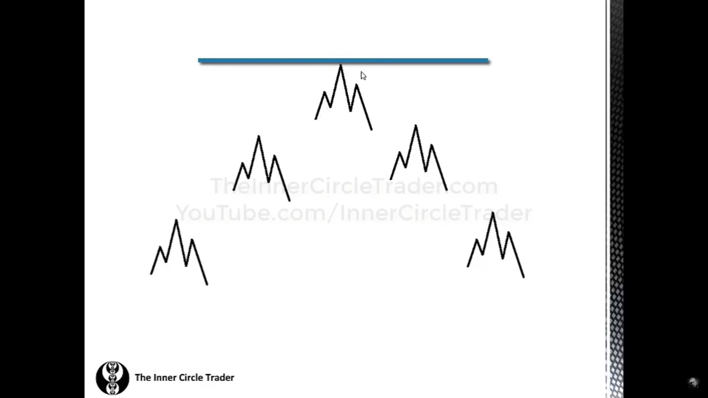
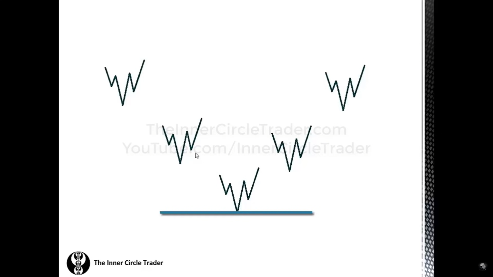

Price never moves in straight upwards or downwards. It moves up consolidates, moves up consolidates & when price moves at the key resistance levels it gives break of strucute against your previous swing lows on your `highest timeframe` which indicates the reversal in the market.

Price moves towards the key support on resistance levels because thats where the liquidy resides and price moves towards the liquidity, smart money moves the market towards the liquidity so that they can take out retailers & get maximum positions in the market before giving an move either towards upward or downward.

When the price gets to an important key support or resistance level we wait for the break of strucute & we zoom into that area by switching to smaller timeframe for looking out for entries with the help of ICT Optimal trade entry with fib retracement of `32%, 70.5% & 79%` retracement levels along with other confluences.

In the bullish market structure we look out for support is being respected & resistance is being broken & be comfortable if your supports taken out its grabbing liquidity to move even higher untill it reaches to important key support & resistance on your highest timeframe and in terms of bearish market structure resistance will be respected & support will be broken untill it reaches to important key support & resistance.

We mostly trade the setups in the consolidations happening before gaps with ote & with our other confluences & anticipate the move based on higher timeframe market structure.

**Long term & Intermediate Swing Points :-**

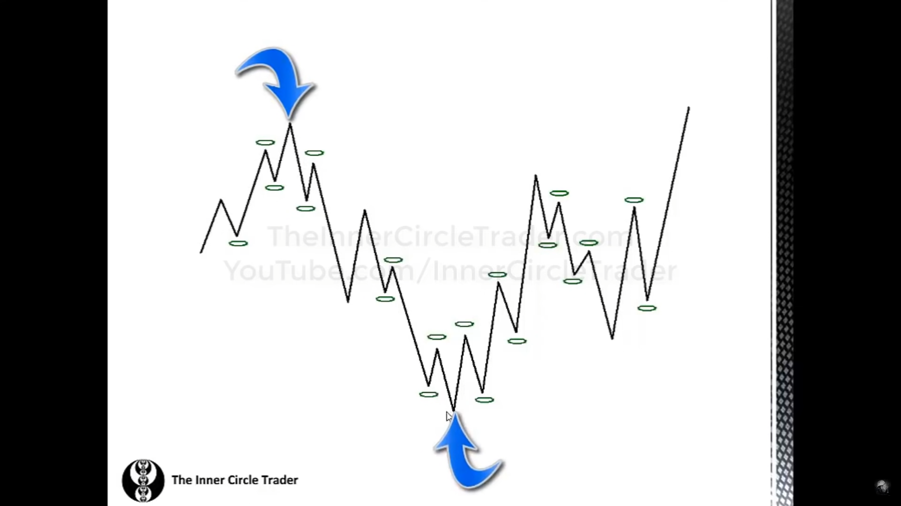
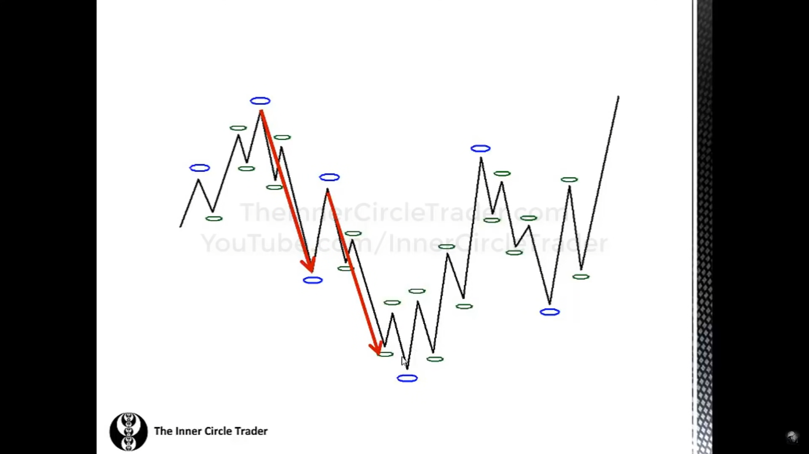

Long term & intermediate swing points are the points where there is high probability of big moves and that points gets respected by price most of the times.

Intermediate swing points can be identified by the point with `high's(at support level)` & `low's (at resistance)` on both side. And we try to catch the big move which is expected from that swing points.

**Time Price theory :-**

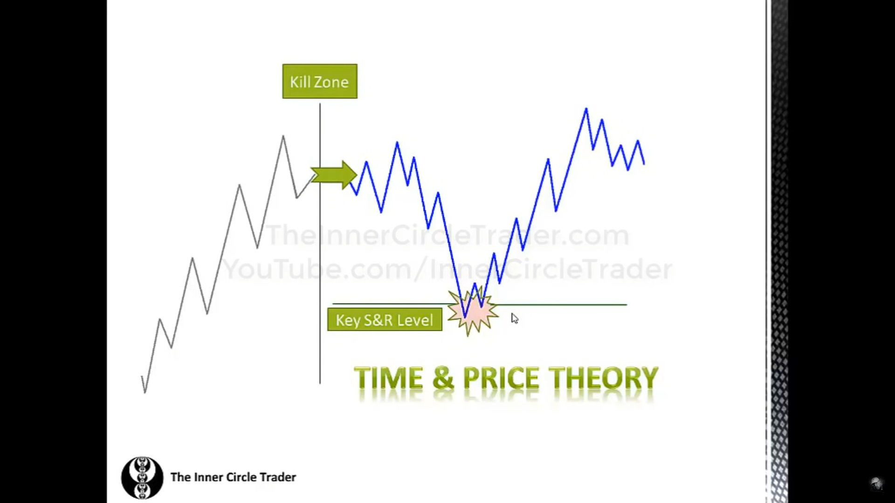

We need to start our analysis froim higher timeframe with key support & resistance levels, If your all timeframes confluences collapsing key support and resistance levels.

We look for the setup at specific time period of day on our smaller or medium timeframe according to their charecteristics. When price comes to your key support & resistance levels in the kill zones thats when you seek for entries.

We need to allign our higher timeframe market structure with key support & resistance levels & setups confirmation with multiple confluences is what the optimal trade entry is.

**Avoid Overcomplicating :-**

Not always our directional bias bcomes correct, it does not guarantee direction or results of our trade.

In the bullish directional bias bearish trader can make money or even in bearish one buyer can make money its just probability of the movement not the direction, thats what called grey area whre you expect to things happen your analysis but there is no such guarantee about it.

### ICT KillZones

Killzones are the specific period of times in day at which its advised to look for opportunities and to trade with repetative patterns of their charecteristics.

- **Asian Kill Zone :-**

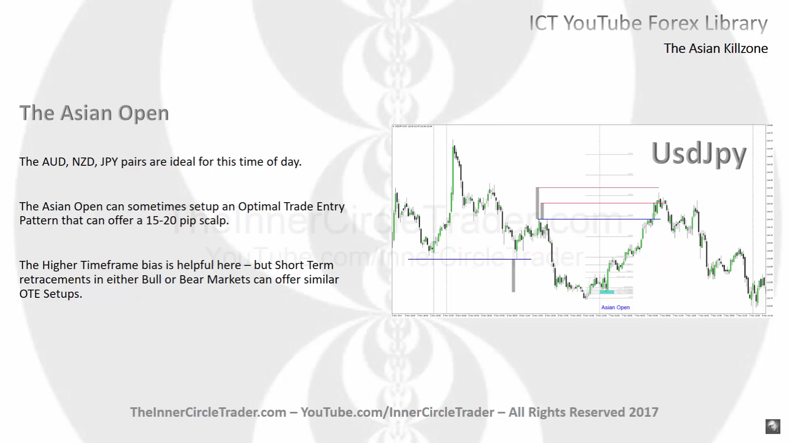

`EST - 8pm TO 12am` `IST - 6:30am - 10:30am` is the Asian kill zone is high volatility zone for AUD, NZD & JPY pairs are ideal to trade. According to volatility we can trade `AUD/JPY & NZD/JPY` in Asian kill zone.

Asian kill zone is 2hr pocket in which AUD, NZD & JPY pairs give some best setups according to their price actions.

Asian open can sometimes gives OTE scalp setups which offers 15-20 pipss & it can be drawn with higher timeframe of your setup, and fibs OTE retracement and other confirmation confluences.

  - **Charecteristics of asian session :-**

  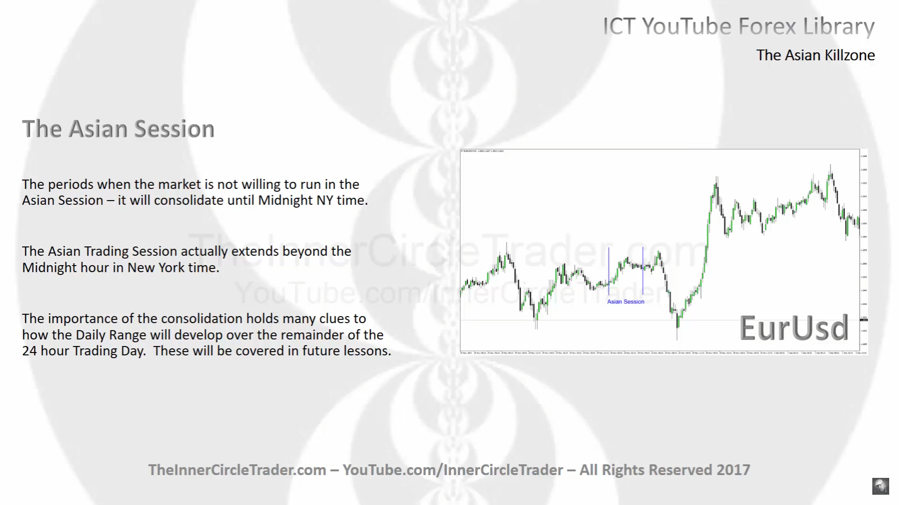
  

  In this session market is not willing run mostly, it will be consolidation phase before the move of the day.

  But importantly asian session is important to find the probability of direction of the day & it extends to new york midnight times.

  In the asian session currency pairs including `USD` are not likely to moving, most probably those will be consolidating but the currencies are exotic currencies or including active pairs of the session such as `AUDJPY, NZDJPY, GBPAUD` etc.

  It provides much of OTE setups in the cross currencies & if you are some trader who does have time only in this session then you should take benifits of charecteristics in this session.

  In this timeperiod of day `USDX` USD Dollar Index is not active ther is no manipulation done in this session with USD but it will be done with other currencies and if we pair maojor currency pairs like `EUR` ,`GBP` with weaker currencies like `CHF`, `AUD, NZD`, `JPY` we can find OTE scalp setups for profitability.

- **London Open Kill Zone :-**  
  
  

  London Kill zone collides with the timing of the various news events, economics and all. London kill zone is `EST 2AM to 5AM ` which is `IST 12:30PM to 3:30PM`.

  The special charecteristics of london kill zone is it creates day high in downtrend & day low in uptrend. It helps us to determine the best entry point at low in uptrend & day high in downtrend direction.

  When it breaks up or breaks down `GMT 12AM` swing high or low which is `IST 5:30AM` it have great accuracy to form an OTE when it breaks out in downtrend & breaks down in uptrend direction.

  In this session  the forex pairs coupled with `EUR & GBP` are best pairs to trade.

  
  - **Charecteristics of London Session :-**
  
    
    

    In the london session biggest move of the day is most likely to be formed in whole 24hours of the day, Most of the volumne & action does happen in london session.

    It has higher volume in terms of the order execution. If the biggest move of day doesnt happen in this session it continues & occurs in beginning of the new york session, If we had the trending move already in london session then we are likely to have less active new york session but if london doesnt gives any trending move then its more likely to happen in start of the new york session.

- **New York Kill Zone :-**

  

  New york kill zone opens at `EST 7:00AM TO 9:00AM` which is `IST 5:30PM  TO 7:30PM`
  In the New York Kill kill zone you get a setup daily in USD cross pairs for optimal entry.

  It offers scalp setup with minimum of 20-30 pips daily and new york session are the easiest session to trade & to find setups.

  - **New york session :-**

    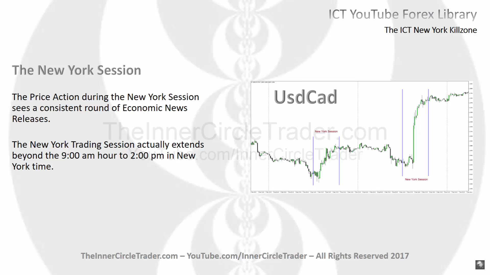

    Most of the economical news comes in the new york timings, & new york session can extends upto `EST 9:00PM TO 2:00PM` which is `IST 7:30PM TO 12:30PM`.

  - **Charecteristics of New York session -**
  
    New york session either continues the higher timeframe direction with an retracement or sometimes it can occur reversals in the market. 

    If the daily bias is bullish & in the london kill zone already formed day low then its most likely to have an small retracement in new york kill zone & trend continuation occurs. For the reversals it takes a lot of insights of the market which we will look further ahead.

- **London Close Kill Zone :-**

    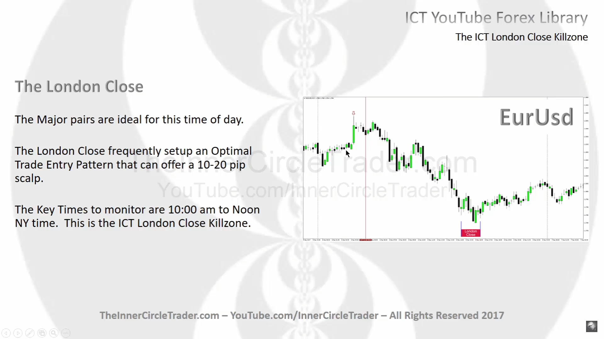
    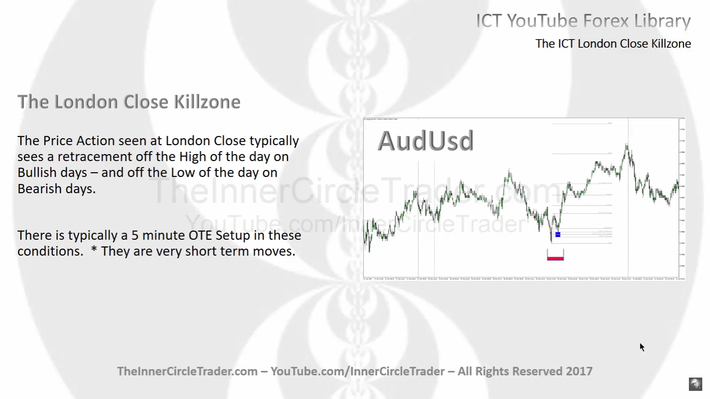

    London close kill zone happens in `EST 10:00AM TO 12:00PM` which is `IST 8:30PM TO 10:30PM`. Major pairs such as `EURUSD, GBPUSD` or the other major pairs are ideal to trade in this kill zone.
    
    In the london close kill zone we get an optimal trade entry setups that can offer easily 10-20pips scalp.

    In the london close kill zone gives an retracement of the of day high on bullish days & retracement of day low on bearish days. It offers 5m OTE setups which is very shortterm move.

    We have to follow 5m timeframes in london close kill zone for finding OTE, anything higher than 5m timeframes will not provide you.

  - **Charecteristics Of London Close Kill Zone :-**
  
    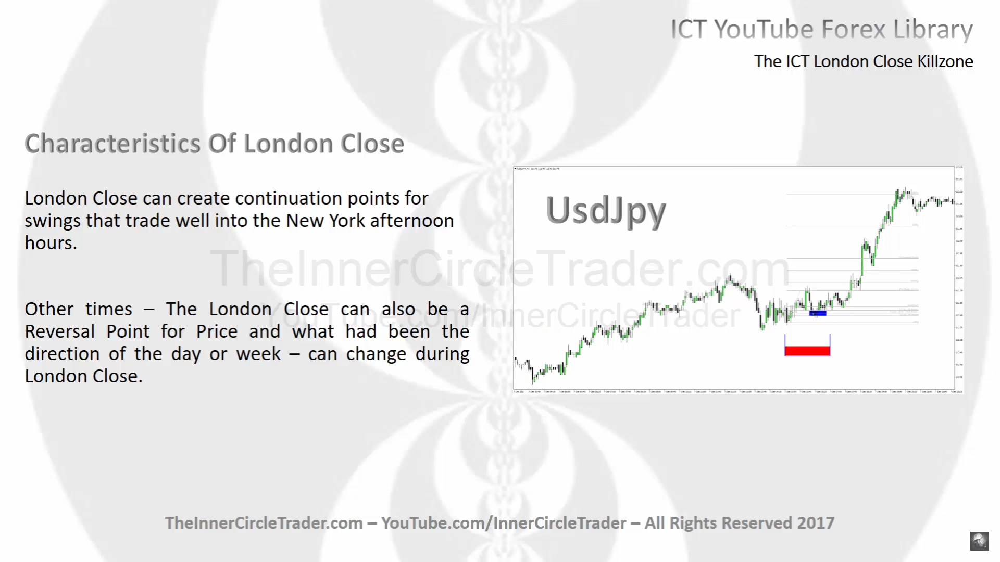

    It creates continuation points for the trend of new york session swings. There is possibility of reversal of the daily & weekly trend as well in the london close for the direction of day or week.
    
    Highest point of the day is more likely to form in london close & Lowest point of the day is more likely to form in london close session but it can form in new york session as well.

### Weekly Bias for Short Term trading

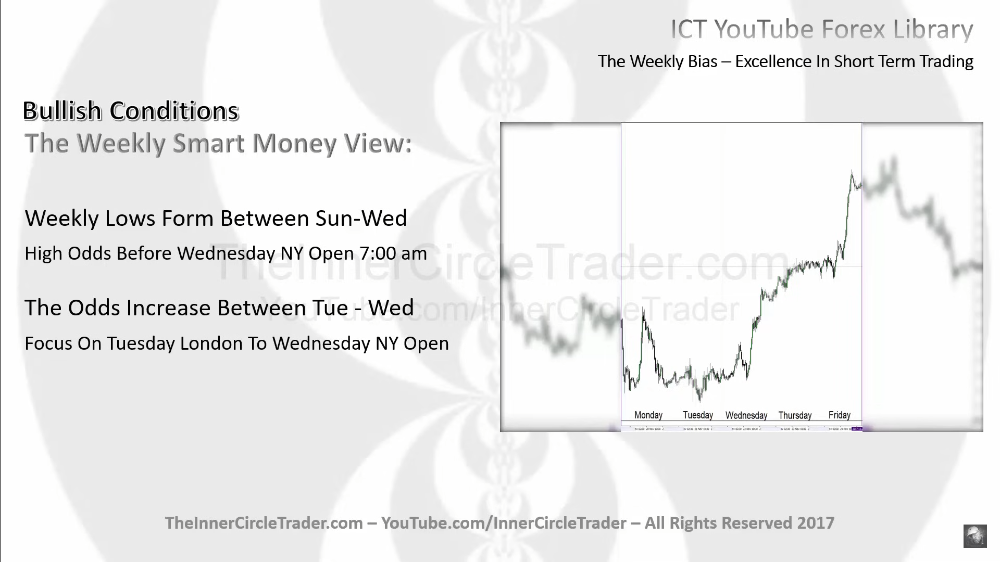

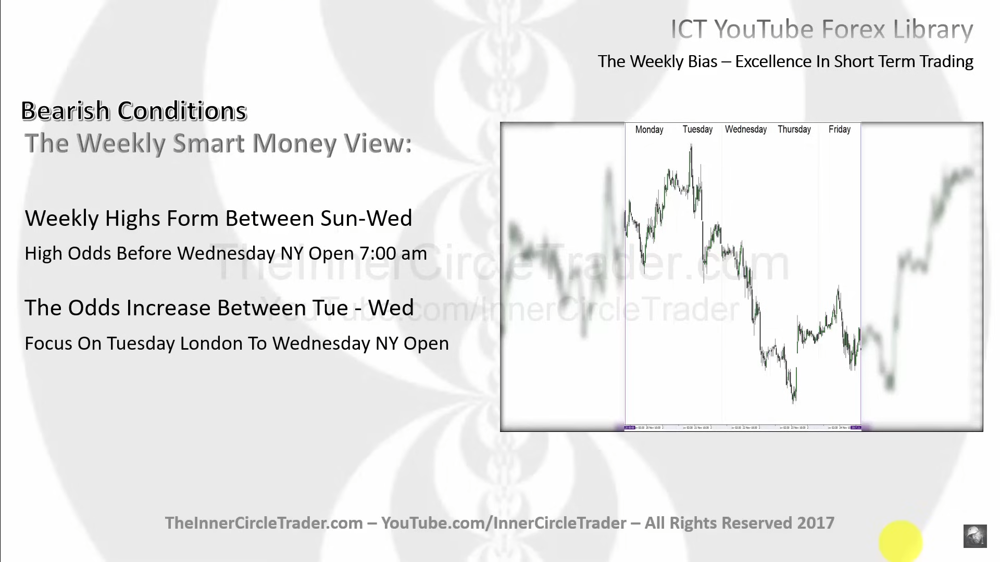

As we know the charecteristics of london open for forming daily low in bullish & daily high in bearish environments we can find the weekly low & weekly high as well so take short term weekly trades to grab the weekly trend.

In this module we would be focusing on finding the weekly low in bullsih enviornments & weekly high in bearish enviornments. We will be consuming weekly bias for specifying our entry point at low's & high to get maximum benifit out of weekly range.

`Weekly low(bullish Enviornments)` & `Weekly High(Bearish Enviornments)` forms most probably in between sunday open to wednsday new york open. The higher probability it will happen in between tuesdays london open to wendsday's new york open.

When week starts market markers moves the price in false direction for let people think is market is going lower and the people had bought on the opening price of the week will gets stopped out due to same.

When this false move engineered by the algorithm so the market makers & smart money can enter into the market on discounted price which is buying lower or selling higher than opening price & to drive that price in right direction whole week so they can book handsome amount of profits.

We can go in such as way that buy below `30pips` of opening price of week & keep the stop loss of `150pips` & target for `150-300` pips in it as an standard if you are not able to identify weekly low's or high's according to technical analysis.

`Note :- Price retraces on sunday opening on wednesday once & its expected but if price reaches again to sundays opening again we should better take exit of trade because its gonna be quiet or consolidating week.`

**How to know if low of the week formed on monday :-**

If the low of the week has been already formed on monday it will ride ahead of opening price. 

**Weekly bias bullish :-**

You can notice in the above image in the bullish week our weekly low has formed on tuesday london open & if we miss the london open low on tuesday it gives an retracement in wednsday' new york open for an second opportunity.

When we enter the position in either of the days we need to hold the trade until the end of the week or previous important level to reach on weekly or daily range to exit.

We can buy some quantity on monday's low, tuesday's low & wednsday's low and we can ride that trades till the end of week until we are able to figure out weekly high's & low's according to technical analysis.

**Weekly Bias Bearish :-**

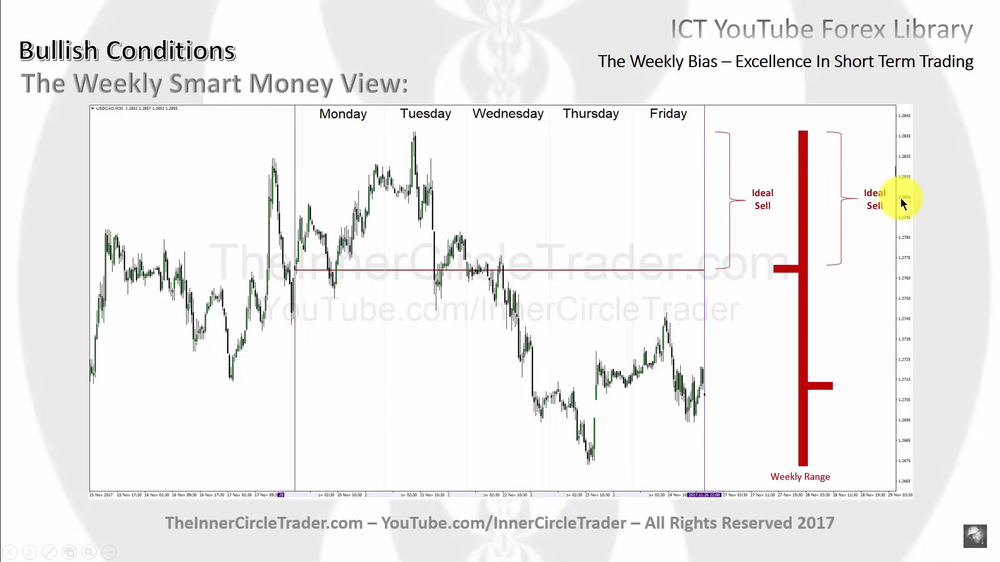

You can notice in the above image in the bearish week our weekly low has formed on tuesday london open & if we miss the london open low on tuesday it gives an retracement in wednsday' new york open for an second opportunity.

When we enter the position in either of the days we need to hold the trade until the end of the week or previous important level to reach on weekly or daily range to exit.

We can sell some quantity on monday's low, tuesday's low & wednsday's low and we can ride that trades till the end of week until we are able to figure out weekly high's & low's according to technical analysis.

### ICT TIME & PRICE THEORY

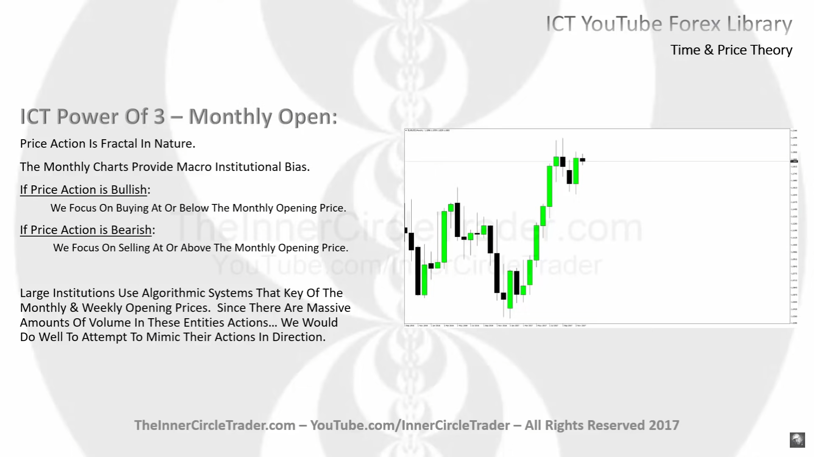

Monthly charts provides us the greater institutional bias, we will focusing on monthly opening price and our goal would be buying below monthly opening in bullsih scenario's & selling above monthly opening in bearish scenario's.

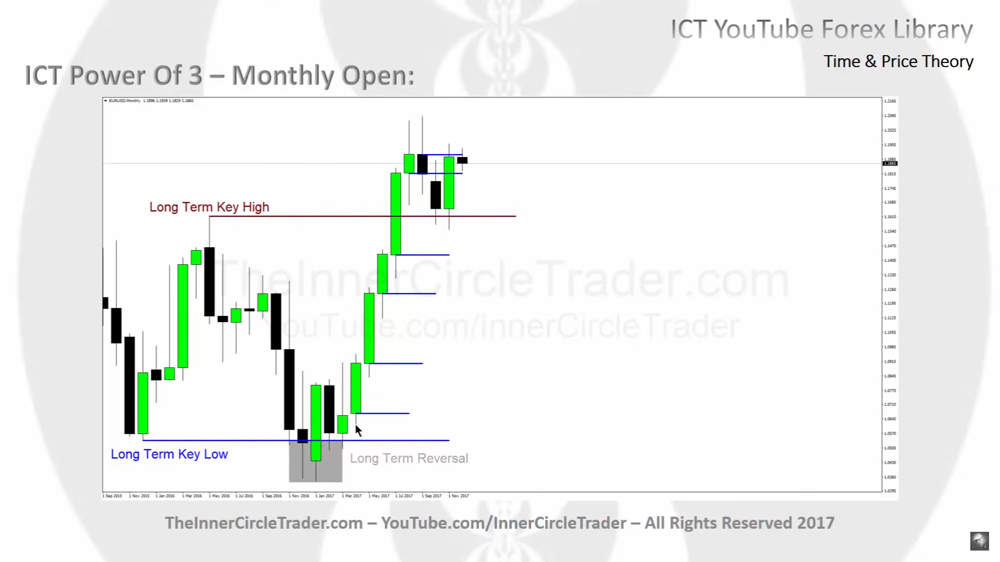
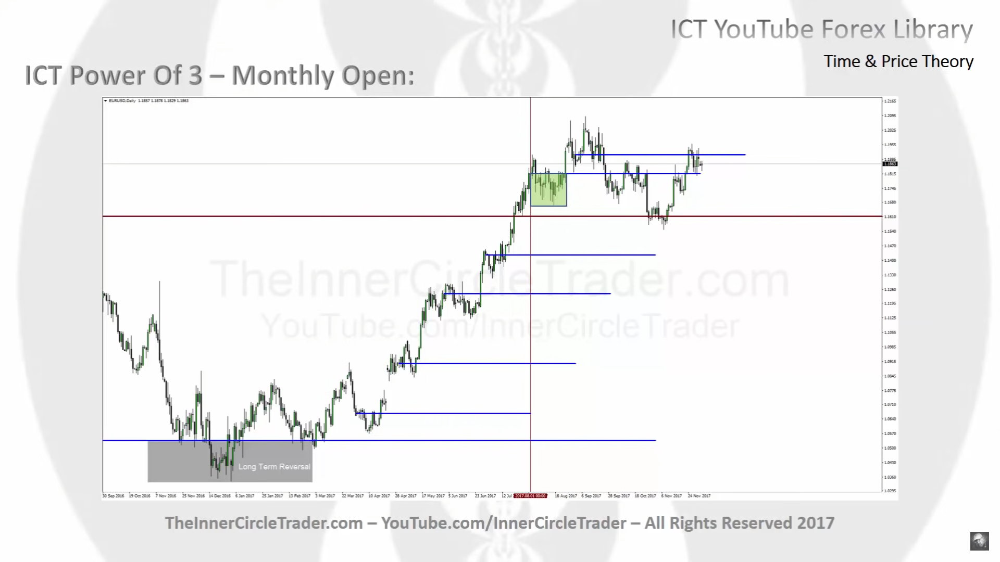

Some people not able to do the intradat & short term trading due to their circumstances, business & etc so ict have analysis on monthly basis as well by which we can do long term trading. 

In the monthly analysis we are looking for price trading below the monthly opening price & give some sort of pattern or setup which we can figure out to plan the trades & when it comes to daily timeframe we are looking to buy at or below opening price in bullish env & selling above opening price in bearish enviornment.

Large institutions use the daily timeframe for their entries but we as intraday & scalpers look at the daily timeframe as higher timeframe.

This promotes the understanding of we should go from higher timeframe to lower timeframe & checking out if lower timeframes are also supporting the direction of higher timeframe bias & then to planning the trades in the according direction.

### Power of three (Accumulation, Manipulation & Distribution)

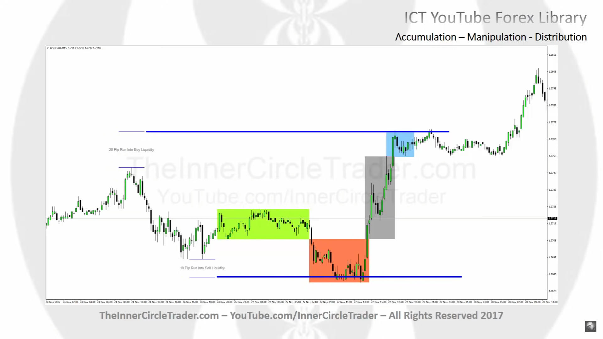

Power of three is cycle of daily range from opening to closing of that timeperiod. This concepts can be considered for any timeframe candles, we need to focus on open, high, low and close pricings.

- **Accumulation :-**
  
  
  

  Accumulation is the phase where order get collected below the opening price in bullish enviornment & above the opening price in bearish enviornment.

- **Manipulation :-**
  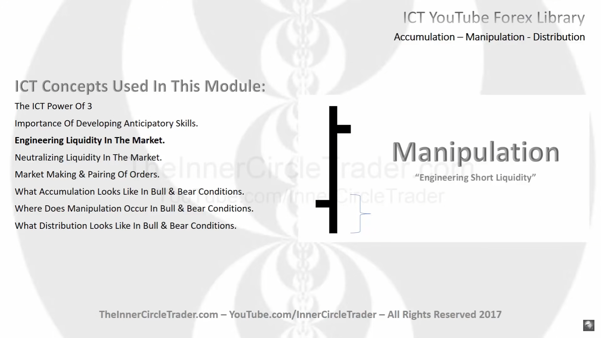
  

  One way and purpose of manipulation is the process of driving the market in the downside direction so smart money can buy at cheaper prices below than opening prices & in terms of bearish enviornments selling above the opening price they drive the market to the upside.

  Another way and purpose of manipulation is to knock out the retail traders who bought at the opening prices in bullish enviornments & who sold at the opening prices in bearish enviornments so smart money can have maximum position before the big move happes in day, month or according to your timeframes single candle.

- **Distribution :-**

  
  

  Distribution cycle where the smart money exists their orders by creating such a movement that retails traders will possibly willing to buy such as they will breakout the previous high in bullish environments or previous low in bearish environments so the retails traders will rush into buying because its an breakout of previous levels.

  Or the retail traders are planning to sell on those breakouts by taking out their stop losses which are buy stop orders smart money will exit from the market for their long positions.

### Importance of Asian Range

Asian range can possibly provide the direction in terms of intraday time period, When we can combine the directional bias with the asian range we can identify the direction of the day.

It is the consolidation period before impulse move starts for the day in london session.

**Implementing Asian range :-**

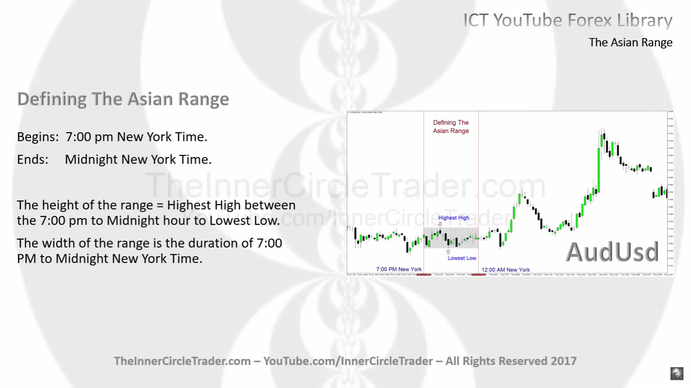

Its begins at `EST 7:00PM to 12:00AM` which is `IST 4:30AM to 9:30AM` & in the asian range there is accumulation phase is going on.

If we draw the high or the asian range & low of the asian range there will be some buyers on the breakout of asian range & there will be some sellers on breakdown of the asian range so algorithm is designed in such a way that it will take the positions of buyers and sellers into wrong direction and continues its rally according to higher timeframe directional bias.

Price delivery algorithm of central banks get reset at the midnight, so after midnight price runs where the liquidity is. Its intensions are clearly to stop out the pending market orders above & below the asian ranges. 

**Utilization in bullish conditions :-**

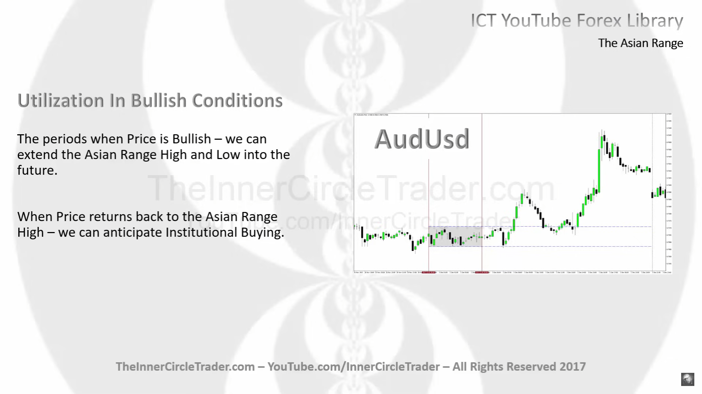

We can extend the high & low of the asian range to future and there is very high probability when price will retraces in asian range high after breakdown thats where instutions gets involved in it.

In the bullish enviornment it will touch high of the asian range to trigger buy orders and then it runs towards their stoploss which are resting below the low of asian ranges. whne those stops are triggered and those retails traders got out of the market then it starts its bullish move to the upside.

  **Entries in bullish conditions :-**

  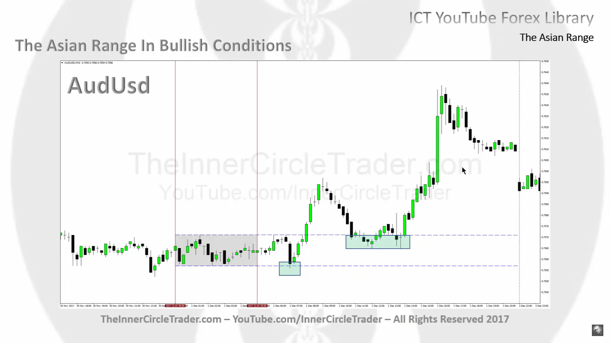

  If price has already given the breakdown of asian range to the false directions below the `EST 12:00AM` midnight open price and if higher timeframe directional bias is also on bullish side then we can take entry at that fake out of the asian range to grab the low of the day in bullsih enviornments.

  If you have missed the opportunity by any chance on the false breakdown and then it went into bullish direction still if that price retraces on asian range high level you can take entry in same and to wait for let it run in its direction.

**Utilization in bearish conditions :-**

We can extend the high & low of the asian range to future and there is very high probability when price will retraces in asian range low after breakout thats where instutions get involved in it.

In the bearish enviornments it will touch the high of the asian range to trigger the buy orders and then it runs down to their stops and those who entered into sell positions at the touch of high of the asian range those will taken out by giving the huge breakout to asian range high and thats when it will start its real move to downside after taking out both direction traders.

  **Entries in bearish conditions :-**

  If the price has already taken out the retail traders by stopping them out by giving breakout to upside and also above the opening price of `EST 12:00AM` midnight open price and if higher timeframe directional bias is also bearish then we can take entry at the fakeout of high of the asian range to grab the high of the day in bearish enviornments.

  If you have missed the opportunity by any chance on the false breakout of asian range high and then went into bearish direction still if the price retraces to asian range low levle then we can take our entry in same to wait for let it run to its direction.

**Finding Till what level price can go for manipulation :-**

Mark the asian range and you can stack the the same area of asian range above in bearish enviornments & below in bullish environments and there is possiblity that price can go upto the double of asian range either or upside or downside.

**Finding till what level price can go for distribution :-**

Mark the range of judas swing and price goes 3 times of the judas swing upside in bullsih enviornments & downside in bearish enviornments.

### ICT JUDAS SWING

Juda swing is the price swing happens in london session which sets the high & low of the london session. Run on stops means for stop loss hunting or retracing to key price level causes the juda swing in the london session.

It begins `EST 12:00AM TO 5:00AM` which is IST `9:30AM to 2:30PM` and its an false price direction swing to trick the traders for direction of the day which are lacking into higher timeframe directional bias.

**Charecteristics of judas swing :-**

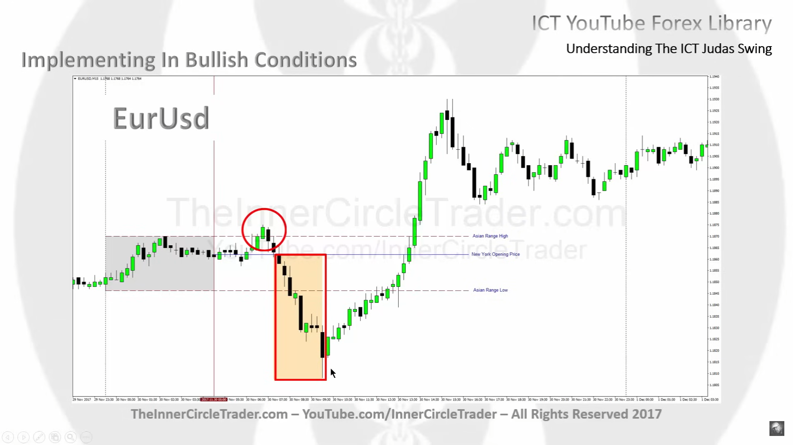
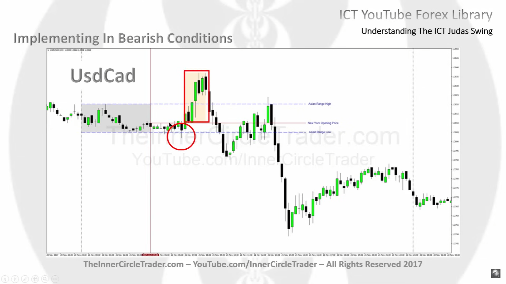

In bullish enviornments bearish false move after giving breakout to asian range high is bulliish juda swing.

In bearish enviornments bullish false move after breakdown to asian range low is bearish juda swing.

### Essentials to trading daily bias

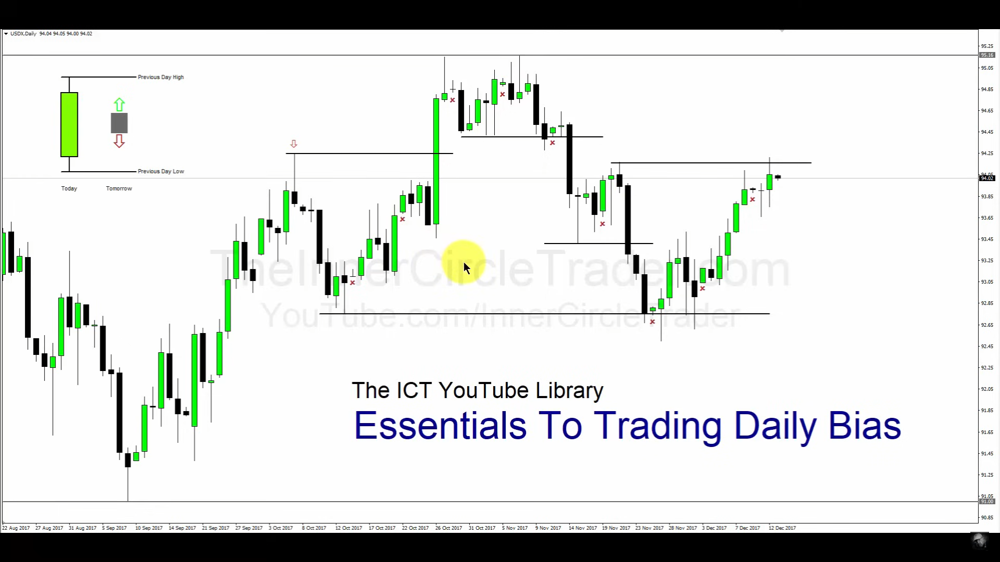

Most probably market be in 3 situations, uptrend, downtrend and range bound or consolidating in which market moves in between range.

Intermediate short term high's and lows are the levels where we plot the support and resistance and when the market is in the range bound phase or consolidation phase It possibility that when market given an breakout to any level by closing candles above it will possibly lead towards the next resistance level. And market fails to break some levels or not able to close daily the candle above or below it there is probability that there could be possibly reversal.

We should focus on previous day's high & low because in bullish enviornment market will keep piercing through & move towards previous day's high by respeting previous day's low until it reaches some intermediate level or swing point and in bearish enviornment market will keep piercing throgh & move towards previous day's low by respecting previous day's high until it reaches some intermediate level or swing point.

When market takes out previous day's high as well as low its possibly reversal because in the trending environments either it targets for previous day's high or previous day's low either.

### Engineering Daily Range (Trading key swing points)

**Asian Open :-**

  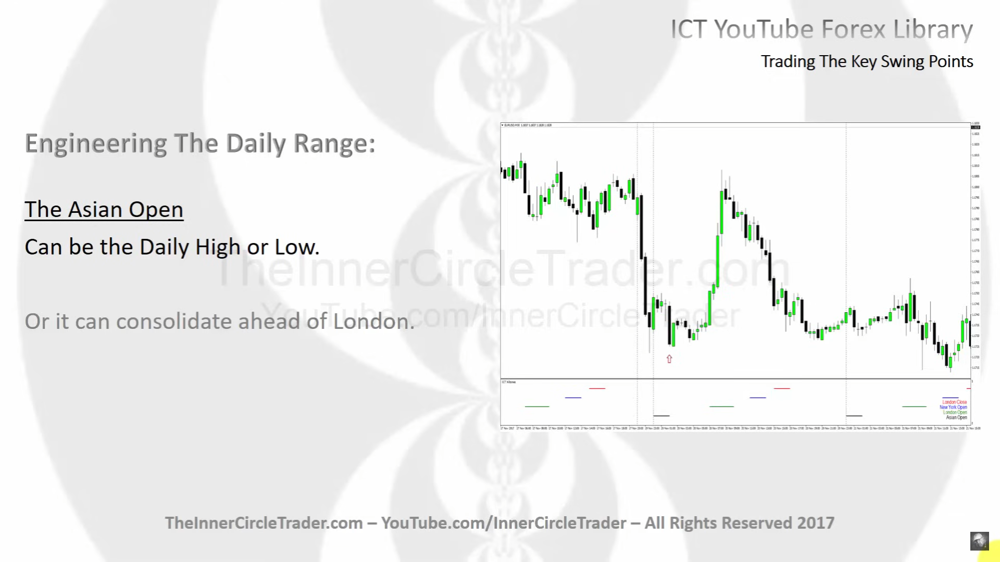

  As we have discussed earlier in power of three asian range gives us consolidation after london close of previous day and thats not the case always.

  Asia can create an low or high of the day as well, when there is impulsive or trending unidirectional move in asian range we can consider that asia might can create high in bearish enviornments & low of the day in bullish enviornments as mentioned above.

**London Open :-**

  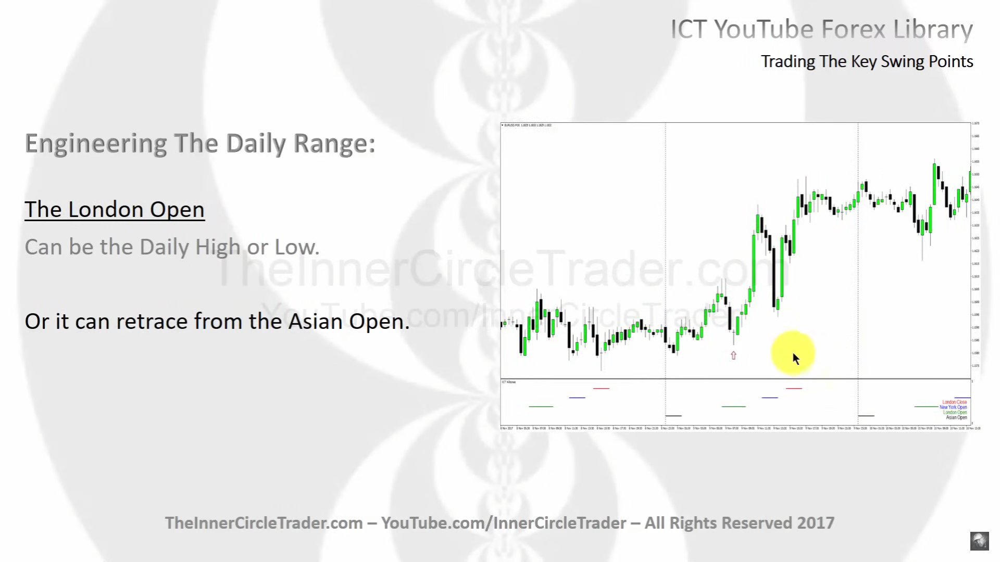

  As we have discussed earlier in power of three london open gives us the manipulation range in which it will gives us an false move with juda swing but its not the case always.

  When asian range had its trending move and already created the low in bullish enviornments & high in bearish enviornments then london open gives us and retracement to asian range after which the trend of the day continues ahead as mentioned above.

**New york Open :-**

  

  As we have discussed earlier in power of three new york open gives us an retracement to london range and then continues in directional rally but its not the case always.

  when the price is bit consolidating in throughout day even in asian & london session it can create high of the day in bearish environments & low of the day in bullish enviornements as mentioned above.

**London Close :-**

  

  As we have discussed earlier in power of three london close either gives us the reversal of daily range or continuation of daily range but its not the case always.

  When the price is consolidating in huge range in the london close we can see an impulsive move which can create the high or low of the day.

When some important levles collapses with any kind kill zones along with their charecteristics such as for an example if you have bullish day & price have reached at important key swing point from the higher timeframe in the london close kill zone which is having high probability of reversal then we can have the sell trade over there which would be high probability trade.

When we combine the higher timeframe levels with other conflences along with sessions or morever with timings thats where high probability trading setups forms.

### Money Management

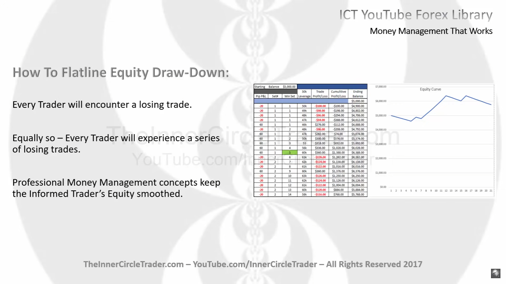

Every trader faces the lineup of loosing trades but that every traders make the mistake to recover those losses, increases their lot size, overleaverages and they make the situation even worse that thy blow their account.

Very first step of money management is to stop the bleeding, we need to identify the wrong trades before placing the next trades and we need to resolve the mistake before placing the next trades.

To stop the bleeding we can reduce the lot size to half whatever it was perviously and we can increase the lot size whne you have high probability setups thats how we are going to reduce the amount of lossing trades & increase the amount of profitable trades.

**Reducing Losses & Increasing profits :-**

**Model 1 :-**

  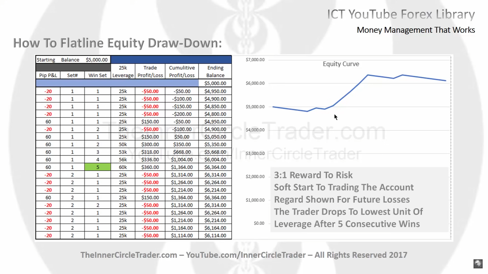

  In the Model 1 we do small start such as with minimum leaverage or lot size according your trading plan and whenever we are winning we are adding 2% more risk or leaverage & when we win 5 consecutive trade in row we reduce our lotsize & leaverage to the minimum for preparing the next upcoming drawdown.

**Model 2 :-**

  

  In the Model 2 we do modest or medium start with medium leaverage and lot size according your trading plan and whenever we are winning we are adding 2% more risk or leaverage & when we win 5 consecutive trade in row or if we have loosing trade we reduce lotsize & leaverage to the minimum for preparing the next upcoming drawdown.

`Note :- This is the best money management model which we can use to cut down leaverage and lot size after loosing trade & increasing it when winning.`

**Comparision money management & without money management :-**

Both of the traders on left as well as on the right side have same risk to reward ratio but the equity curve of trader on right side only having difference is he is reducing the risk when he gets an loosing trade.

When we reduce our risk after loosing trades we are preventing our profits until our next win rally starts to kick in. as soon as we get an loss we are preparing for lossing streak with the help of which money is growing drastically but reducing very slowly.

When money grows drastically and reducing slowly thats when we turn into profitable trader. In this trading journey we might face more losses than winnings so we should be prepared for taking loosing streaks by cutting down losses.

### Smart Money Technique (SMT)

There are co-relation in betwee forex pairs & USD index which is USDX and forex pairs such as `AUDUSD, GBPUSD, EURUSD, USDCHF` etc.

Now if you can notice in the above image lets consider crud price action in red color is usdx & blue is AUDUSD, as they are opposing pairs their natural behaviour should be when usdx is making higher high's audusd should be making lower low's and vice versa when usdx is making lower low's audusd supposed to make higher high's.

**SMT Divergence in bullish enviornment :-**

If audusd is making lower low's and usdx is making higher high's but suddenly audusd failes to make lower low's which means there is accumulation going in audusd & usdx failes to make higher high which means huge distribution going in the usdx due to which usdx is not able to make higher high.

If usdx failing to make higer high or audusd is failing to making lower low's both indicates to bullish possibility in audusd.

**SMT Divergence in bearish enviornment :-**

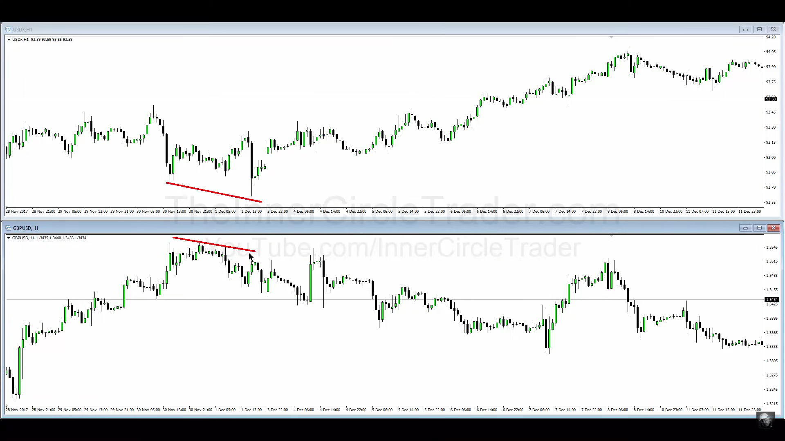

If audusd is making higher high & usdx is making lower lows and if audusdx failes to make higher high's or usdx fails to make lower low's then which means there is huge possibility that bearish trend can occur in audusd due to ongoing bearish accumulatoin in audusd & distribution in usdx due to which it failed to make higher high.

`NOTE :- SMT divergence can be very useful to identify the reversal in the markets where price action is also showing weakness in current trend and also there is confluence of divergence in usdx which could lead to possible reversals.`

When there is weakness is going on either in uptrend or downtrend in usdx then we searcch for the major currencies shows the divergence & weakness according to usdx divergence and we look for entry in that pairs.

### ATM Method 

This is an standalone price action pattern occurs on stop runs which forms on 1h timeframe.

**Bearish Enviornment :-**

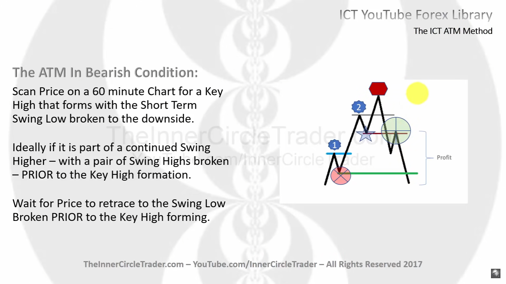

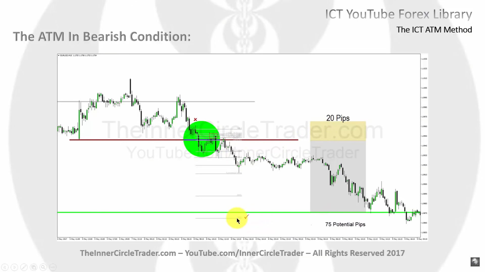

When price breaks out previous high in uptrend as mentioned by star in the above image and take reversal and breaks down previous low and retraces it thats when we can plan for entry.

Majorly when short term low is broken down & retraced to that level after bullish enviornment then we can plan the trade by targetting previous swing low and by keeping SL above 5-10 pips of swing high.

We can zero down our stop loss on 15m timeframe by analyzing the chart.

**Bullish Enviornment** 

When price breaks down previous swing low in downtrend & as mentioned by star in the above image and take reversal and breaks out previous low and retraces it thats when we can plan for entry.

Majorly when short term high is broken out and retraced to that level in after bearish enviornment then we can can plan the trade by targetting previous swing high and by keeping SL above 5-10 pips of swing low.

We can zero down our stop loss on 15m timeframe by analyzing the chart.

### Optimal Trade Entry (OTE)

Optimal trade entry is the way to get entry into trending market when it retraces.

There are some important factors to consider while practicing optimal trade entry is the direction of your trade should be with higher timeframe direction, the price you are drawing fibs should given an break of structure and we should consider OTE's on higher timeframes as it gives us clear idea about the direction of the market.

We have specific retracement levels along with take profits levels as well for our OTE models as mentioned below.

**Fibonacci retracement levels :-**
- **62% -** 0.618
- **70.5% -** 0.705
- **0.79% -** 0.79

**Take Profits Levels :-**
- **1.27 (TP 1) -** -0.27
- **1.62 (TP 2) -** -0.62
- **2 (TP 3) -** -1

Every broker can manipulate the price by little up or down move so its better to mark the fib from body to body levels due to which you will be able to cop up with their sweep movements based on brokers.

### Target Selection & Profit Objectives

We can find the profit objective levels for weekly by checking out the multiple confluence to one of the important levels with multiple price swings overlapping its important price levels.

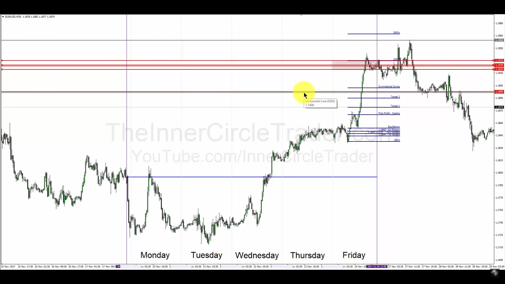

You can checkout in the above image for bullish enviornment `1.1924 to 1.1935` we are having multiple fibonacci expansion levels overlapping which makes it high probability area for getting out of the trade and book the profits for the weekly trades. 

You can checkout in the above image for bearish enviornment `1.2689 to 1.2682` we are having multiple fibonacci expansion levels overlapping which makes it high probability area for getting out of the trade and book the profits for the weekly range or trades.

We can get exit on any instituional level in that range but its better to get out of the trade from the bottom till middle level so we are not trying to catch the top of the market & we will be exit of the trade even if we will be having higher spreads.

### Trade Psychology

**Major Psychological Barriers :-**

- **Fear of missing moves :-** 
  
    We should not fear of missing moves because in the market there are 100's of opportunities which are tradeable, so we should not fear if we have missed the moves either we should focuing on trading quality setups.

- **Fear of loosing :-**

    You need to reduce your risk because even if you loose with low risk it wont impact you much but even after reducing your risk to minimum and still you are afraid then trading is not for you.

- **Impatience between setups :-**

    when you are waiting for some level but you are entering into trade before it reaches to your level, but it can be dealt with by the experience.

    Whenever we win the trade we are impatient to enter into next setups most specially when you win the trade we trade those setups which aren't your setups its not advised to trade until and unless your setups is into the picture.

- **Fear of not being good enough :-** 

    This factors comes from social media by comparing us to others because there must be possibility you must be comparing yourself with more experienced trader or the one who already spent more time than yours.

    You should only care about your trade journal in terms of are you seeing the improvements and work for reducing your mistakes and refining your setups.

- **Fear of loosing streaks & Draw down :-**

    Fear of loosing streaks & draw down is all about the money management as we have discussed in above models, if you are afraid of loosing streak reduce the amount of your risk 

- **Lack of discipline & follwing rules :-**

    By human nature we are habitual to do the things which we are not suppopsed to do, but we can overcome this things by just follwing the rules.

- **Searching for next best thing :-**

    People follows the crowd, some fancy guru's comes with new things up and then but we need to follow our setup for long enough to see the results by refining it over the period.

    When we know the timings of happening our setups then we are not searching for next better things of afraid of loosing opportunities because we know very well at what timings our setups can form and we dont need to keep looking at charts.

**Effective Journaling :-**

  - **Daily Entry Logs & Weekly Log Reviews :-**
  
    We need to enter our trades daily into your trade journals and we need to review it weekly and need to check out the mistakes we have made and what was the best things we have followed.

  - **How you felt going into the trading day :-**
  
    Whatever we brings to the market in terms of emotions such as if you are already depressed, anxiety or emotioal damage our psyhology we are going to make mistakes due to that emotional stage of ours so its better to be away from the market when you are in such scenarios for protecting yourself to getting involved into more emotions due to your trades.

  - **Record any concerns or fears you had in price action :-**

    Whatever we feel before entering or after entering trade by seeing charts and all we need to record those emotions and need to record how much times it hit your stoploss, how you handelled it and what was the resultant of it.

    When in future where you are going to have same feeling you would be knowing already how you handelled that and what are its impacts etc.

  - **Contrast your personal expectations vs actual result :-**
  
    Write your expectations vs what was the actual results of your expectations after the trades which gives you an idea of what you did right whenever you were winning and what wrong things you been doing when you were loosing and how you tackled it.

  - **Detail where you felt uncertanity & how you coped :-**
  
    How many times price altered with your limit order levels, how many times your stoploss is about to hit or how many times how early you trailed your stoploss when its going into your way you need to record this uncertainities and how you coped with it such as you went for walk when you were having anxiety, you followed your trading plan by avoiding uncertainities and how you distracted yourself for letting it execute how its supposed to be.

  - **Use positive words for those things you did well on :-**
  
    We need to record how we followed our plan, how we followed our plan, how we followed our trading rules and money management you need to record those in good words so we should feel prod about ourselves.

    We need to appriciate ourselves when we are doing things how we supposed to do no matter if the trade is loosing & winning you need to follow through your trading plan, trading rules &  money management.

  - **Avoid negatively charged words where you strugggled :-**
  
    Do not use negative words when you made mistakes or not followed your trading plan and system, write it down in such way that when ever you are reading through journal you should be feel to resolve those mistakes. It should not be stressfull where you will not able to focus on problem rahter than your negative sentences which will bring you down in your mind.

### COT (Commitment of traders) Insights for effective price action

COT(Commitment of traders) data is the data of `Commertical traders (Banks, Headge funds, Fund managers)`, `Small Speculators (Retail Traders like small traders like us)` & `Large Speculators (Pvt Tradres, Big traders with funds)`.

Normally this Commercial traders have idea about where market navigates to upside or downside according to the actions of commercial traders.

**How to Navigate to COT data :-**

- Go to barcharts.com
- Select our currency in dropdown named as `select commodity` aside of searchbar.

  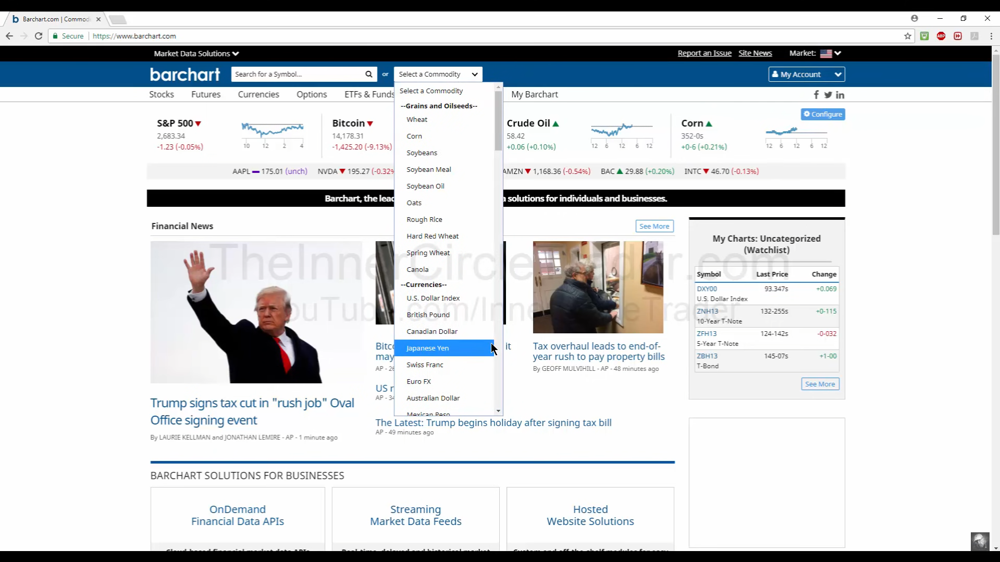

- Select the chart with most open intrest as like mentioned below.

  

- Click on technical Chart

- Scroll down to bottom of the page & do the follwing settings.

  - Change OHLC to Candlesticks.
  - Turn Contract volume off.
  - Uncheck the price box.
  - Select period as Weekly contract.
  - select period of 3 years or maximum period.
  - add technical study for Commitment of traders.
  - select study size & chart size large
  - Finally click on draw chart.

**COT Analysis :-**

We need to focus on `Commercial traders & Large Speculators` the `0 line which indicates neutral`, `commercial traders move above 0 line is bullish` and `commercial traders move below 0 line is bearish`.

Whenever commercial traders are long market moves upwards & when they are short market moves downwards.

For the currency we are analysing the cot chart if its base currency in currency pair then its will be moving in the same direction and when the currency we analysing is quote currency then currency price will be moving in inverse direction.

We need to get into the same direction of commercial traders because we will be in the sync of smart money move then.

Whenever equal got lows taken out we can see an big move towards the upside & when equal high's get taken out then we can expect big move towards downside.

### How to find explosive move before they happen

We are going to focus on cot report and weekly range contractions & daily range contractions.

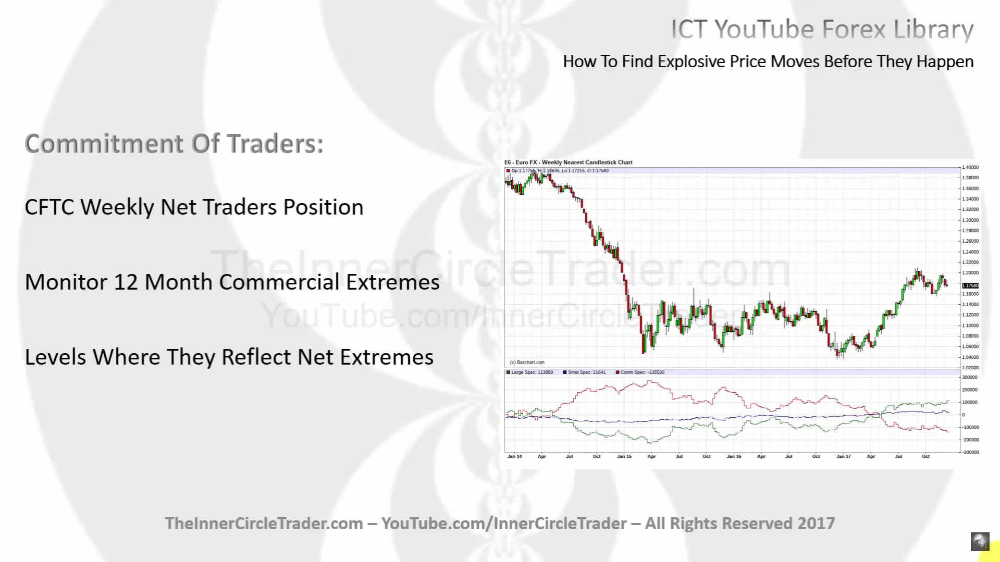

We are observing cot data for euro on weekly timeframe on which we will be going to focus on the moves of the commercial traders.

Checkout when the price was falling commercials was buying means they were accumulating the orders & in the second image you can see near `1.04000` there are equal lows means potential support zone is getting created and formed with respect to commercial traders intrest.

Now you can notice after 3rd touch on the support line commercials went into selling which means there is possiblity that uptrend move is having high probability because commercials already started selling as we know they buy when market is falling & they sell when market is raising.

**Weekly Range Contractions :-**

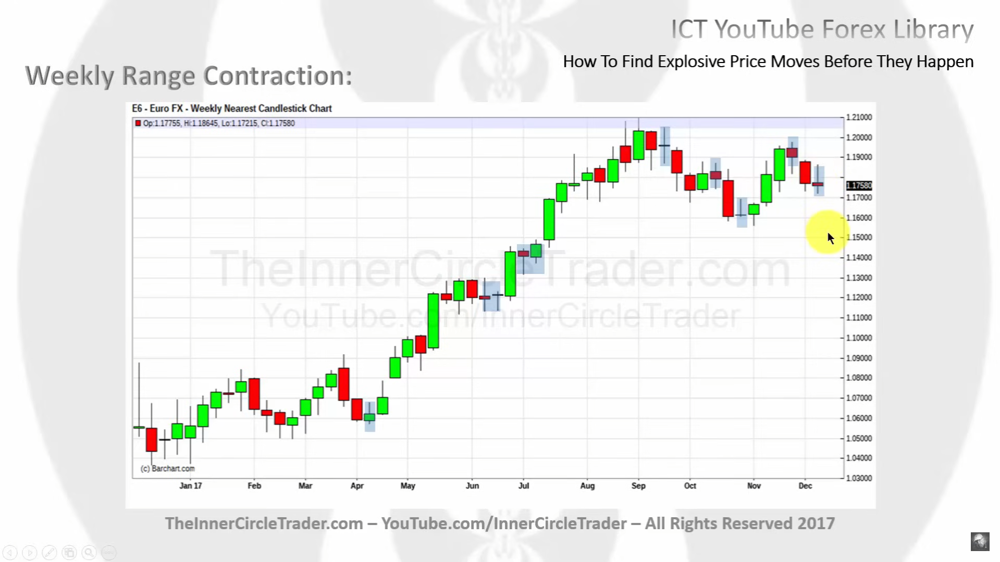

In weekly range contractions we will be focusing on power of 3 of weekly range and we will be looking for contractions in weekly range such as bodies or candles getting small which indicates prior candle to big move.

Lets consider if Monday was accumulation, tuesday was manipulation & we are able to see small body candle on wednesday which means there is high probability that thursday can be having large candle or bigger move.

**Daily Range Contraction :-**

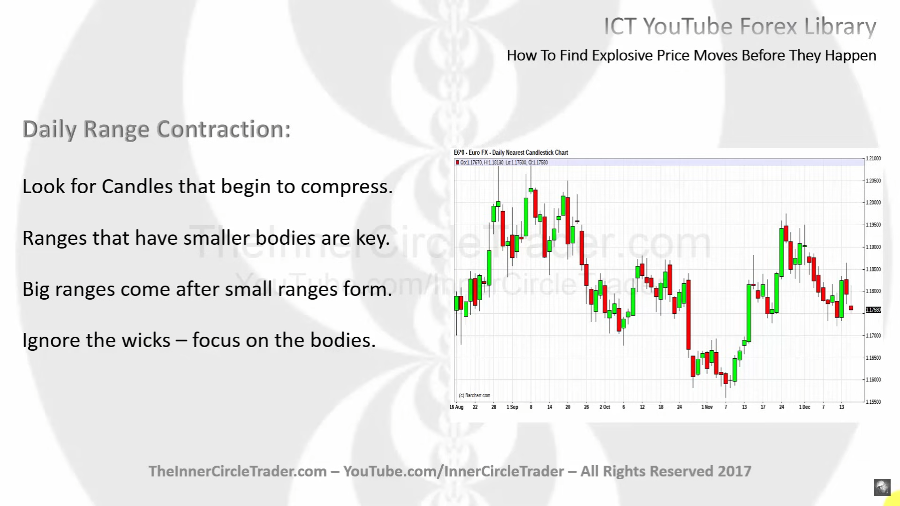

In the daily range as well will be focusing on power of theree in which we will be focusing on contractions such as small body candles in the daily chart wihch indicates prior candle to big move or big day next.

Retail traders get boring and no one notices the small moves or it seems boring to them but we as ict traders wants to get into the market before the big moves happens rather than chasing when big move is happening like retailers. And with the help of daily & weekly range contraction we can find opprotunities with other confluences.

### Higher timeframe concepts

In this section we will be focusing on higher timeframe price action such as key levels on higher timeframe as mentioned in the image above & Price rejections on those important levels.

What we are going to do is we analyze `USDX` very first in wich we try to get the direction of usdx according to its price action & market structure and then we checkout the major pairs one by one which are complementing the direction of `USDX` acording the place of USD as base or quote.

We can mark these important levels on our charts for the currency pair we are having clarity of direction according to its key levels, and we patiently wait for the setups to form on those key levels with taking out liquidity above and below these levles and we enter into position for targetting next key level as like mentioned below.

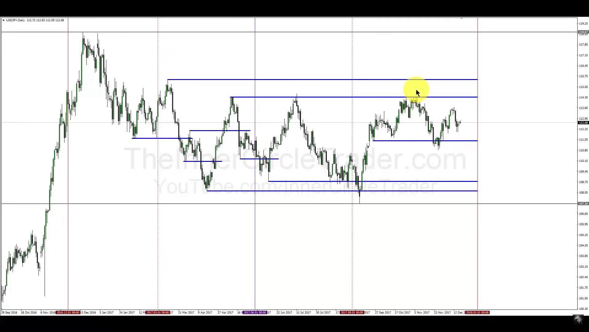

As you can see above we have marked yearly range into our frame & we have divided quaters into 4 different parts in which we have marked the key levels for yearly, quaterly, monthly and when price gets to key resistance zone we will be taking entry for sell & buy for vice versa.

Because market reaches for large and institutional liquidity pools thats why price trade towards this key levels.

### Secrets to forex trading

We will be focusing on buy & sell conditions mapping and implementing the OTE setups.

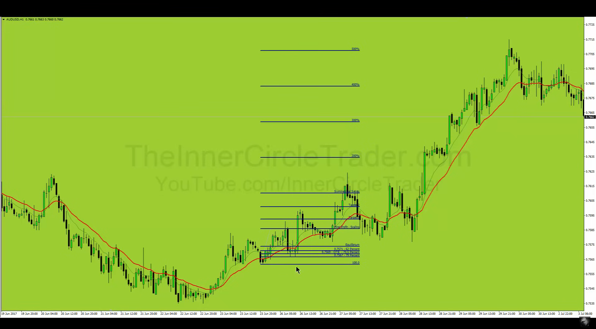
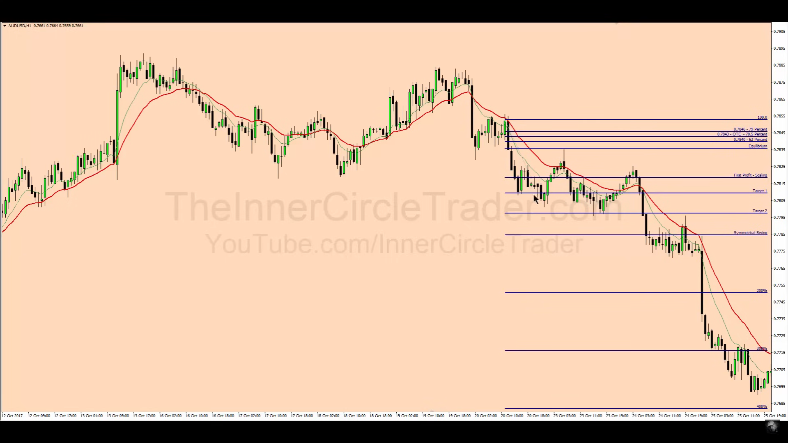

When we are hunting for setups first condition is `9 & 18` or `10 & 20` moving averages should be in bullish on daily, 4h and also on 1h timeframe. there is possiblity that on 1h timeframe price can pierce through moving averages but the averages should not cross over to each other of any of the timeframe.

The reason we use & consider moving averages in institional trading moving averages are used by large funds and they are trend following in nature which even instituional traders use for their entries.

When we are marking the fibs in ote setup remember that we should mark the fibs from the lowest body to the highest body. not from the recent swing low means lowest wick to highest wick.

We need to filter out our setups to the best ones, and we should not rush for finding the setups.

`Note :- If the ideal scneario on higher timeframe bearish but if we are having bullish moving averages on 1h timeframe and we are able to find the bullish setup we can trade that setup but in the intraday point of view which we need to keep in mind. If our objective is swing trade then we need to wait for setups in the direction of higher timeframe moving averages direction and till all moving averages get lined up in same direction.`

# Market Marker Series

### Macros of market maker

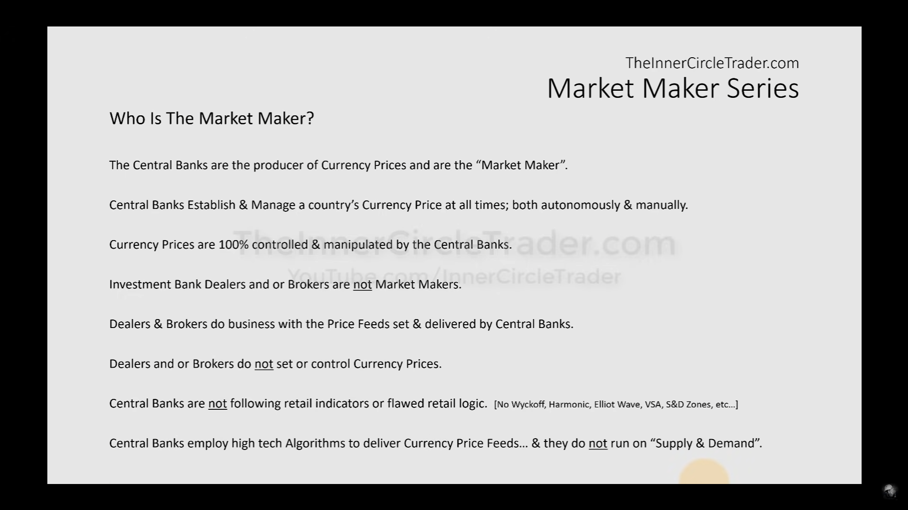

Who is market maker?

Market makers are the central banks and those are producers of currency prices thats why they are the market makers and curreny prices are whole and solly managed by central banks.

Investment funds, Investment banks, dealers are not the market makers, they acts as an broker who consumes the price produced by market makers and they do business with central banks.

Central banks are not follwing any indicators such as Support & Demand Zone, Stocastic etc, they work with high tech algorithms to deliver the currency prices relatime which cause the movement in price realtime.

**Quantitative Analysis :-**

Quantitative analysis is stastical & data based analysis which means indirectly the fundamental analysis.

What drives the forex market, we can refer to 2 importnat things which are as mentioned below along with their resources.

**Global Intrest Rates :-** 

  `https://www.global-rates.com/en/interest-rates/central-banks/`

  In the global intrest rate we look for differential, which means difference between one countries intrest rate between another.

  On the central banks level they are always seeking for yeild which means returns, lets take an example would we be in country which have intrest rate of 5% or would we choose country which have 2%, obviously 5% because you will get higher retruns in the same way central banks thinks.

  Central banks get to know about the intrest rates or highest yield from global rates itself, they look for highest intrest rate currency & lowest intrest rate pair coupled together they trade.

  Higher intrest rate currency have positive differential & lower intrest rate currency pair have negative differential.

**Commitment of Trades :-** 

  `www.barchart.com > select commodity > select highest open intrest > open interactive chart > +study > cot > add`

With the help of this 2 parameters we can perform fundamental analysis on forex market & we can plan for buy or sell programme.

**Analysis based on this both factors :-**

Lets consider the JPY & USD intrest rates from the above pictures from which we are able to know that JPY having negative differential & USD is having higher differential by keeping this in mind lets switch to COT data for this currencies.

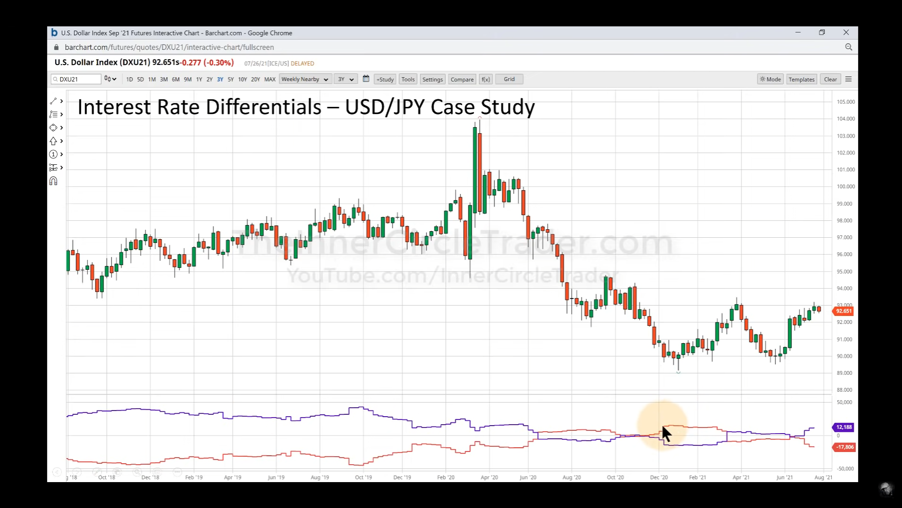

Now when we have jumped to COT data we are looking for most highest point where commercials went long & most lowest point where commercials went short, as you can see in picture in between dec & feb commercials went long with highest cot representation which itself gives an bullish signal

BUT

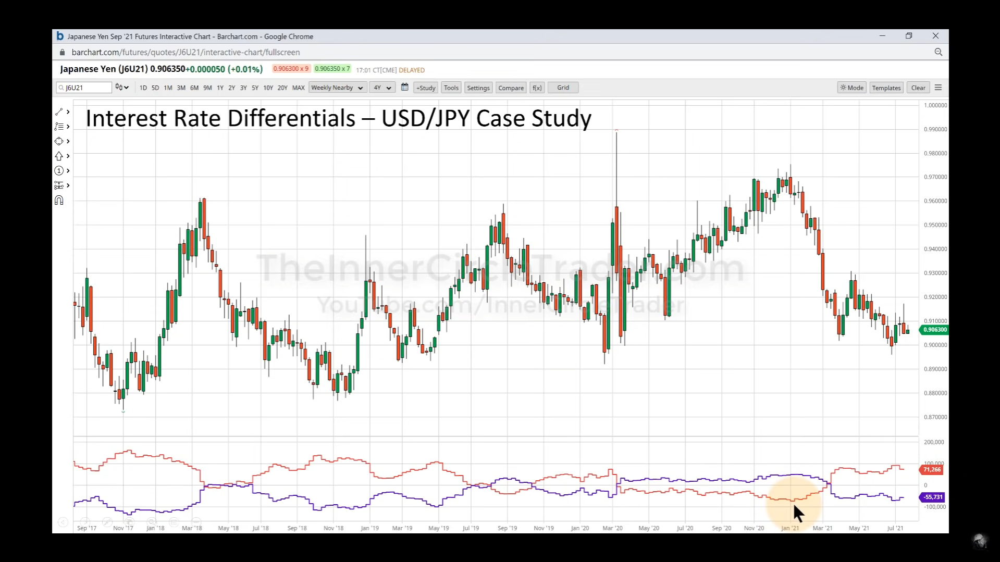

You can notice in between nov & feb or in january commercials went to net short position with extreme down of cot data and they never been bearish that much below 0 line till yet by itself doesn't mean to anything, But you need to see an break in market structure which means price breaks the market structure by breaking its recent swing low or high which we can see above in the above in second picture.

Now everything comes into line up such as commercails are bearish on yen, bullish on dollar & intrest rates are also higher on dollar & bearish on yen and thats when algorithm reprices as we can see above aftre breaking market strcuture jpy moved sharply to downside.

**Conclusion on forex pair :-**

We have saw that commercials went long in usdx & net short in usdjpy, jpy also given break in market structure and also our intrest rates are directing us in the same way.

Now in USDJPY USD is base currency and in dollar commercials went net long so you can expect bullish rally in USDJPY.

As you can see in the chart for usdjpy above near around january it given brake of structure after which it rallyed up according to our analysis derived based on intrest rates & cot data.

`Note :- We dont decide our bias based on only intrest rates but we wait for central banks movement to get aligned into the direction of intrest rates and thats when we also plan for entries.`

