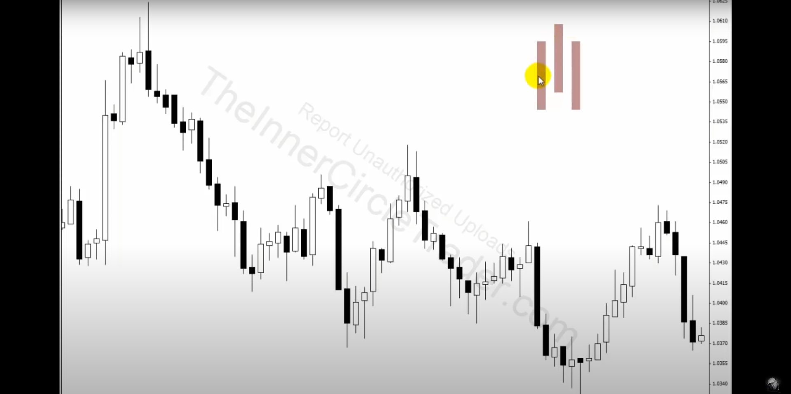
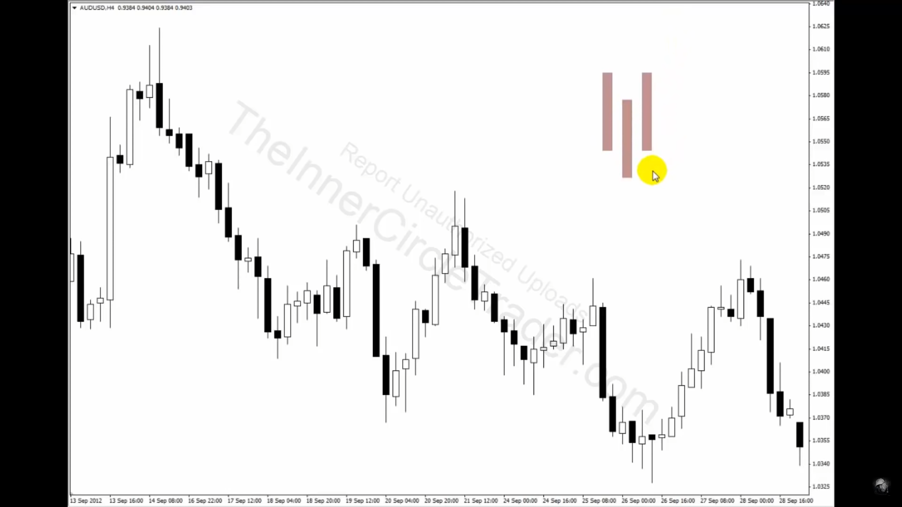
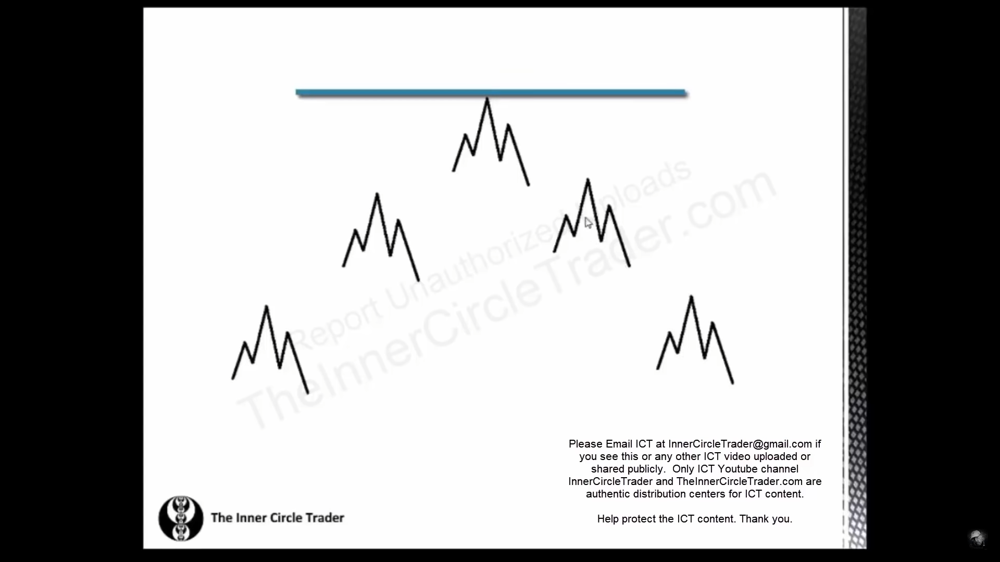
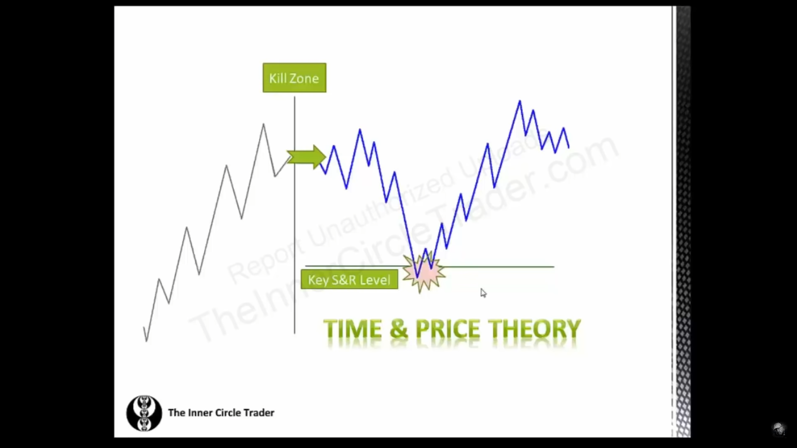

# Institutional Trading

Institutional trading is the study of SMART MONEY CONCEPTS & the way of trading in the instituional way.

### Swing Points

Swing points are the points where we can get to know the where the swing has ended in uptrend or downtrend.

**Swing High :-**

In swing high middle 3 candles setup in which middle candle is higher one, and lower high on left & lower high on right candle to it as mentioned below.

**Swing Low :-**

In swing low middle candle setup in which middle candle is lower candle, and higher low on left & higher low on right candles to it.

**Chart Analysis :-**

Draw horizontal lines of the range of swing low & swing high pattern, dont missout any swing high's & lows' it will lead to market reversal which would not be planned by you.

**Rules :-**

- If any levels are matching nearby avoid remarking that level with tiny difference.

- If any new swing high & low forms within the marked range then we dont need to redraw again because we are considering major swing high & low points. the newly swing high & low formed within the range could be considered as secondary points.

**Importance :-**

There is importance of open, high, low & close of 3 of the candles in swing high & swing low pattern, those are the important & sensitive price levels to which price reacts & respects.

### Excercise 1

**Analysis :-**

- Mark the daily & weekly swing low's & high's on the chart where support & resistance levels are overlapping.

- Turn on daily & weekly time sepration on the chart.

**Actions :-**

- Buy on daily & weekly lows with 1:1 ratio of 20 pips.  
  
- Sell on daily & weekly highs with 1:1 ratio of 20 pips.

This excersice builds the acceptance of looses & builds the discipling required for waiting for our setups.

Analyze the trades & checkout how much profit & loss you have booked for the month.

### Market Structure

Before studying market structure we need to have our framework for our analysis, Which depends on your trading style.

We get overwhelmed when we analyze the things on multiple time frames but according to our trading style we should analyze the market structure by using 3 timeframes only as mentioned below.

**Purpose of multiple-timeframes :-**

- **Bigger timeframe : -** 
  
  We use bigger timeframes to analyze the market direction & moves.

- **Medium timeframe :-** 
  
  We use Medium timeframe to manage our trade like adjusting stoplosses etc.

- **Smaller timeframe :-** 
  
  We use smaller timeframe for our entries & checking out the early reversal signals through it & booking our profits accordingly.

**Uptrend Market Structure :-**

We look for market strucuture we checkout on bigger timeframe in our framework, and Whenever is pricing moving up it makes consolidation to grab some more buy orders & it continues its strucutre to upwards as mentioned above.

The market structure will be respected to major supply zone on bigger timeframe, and when it breaks previous 2 swing low's it does mean price got reversed.

**Downtrend Market Structure :-**

We look for market strucuture we checkout on bigger timeframe in our framework, and Whenever is pricing moving down it makes consolidation to grab some more sell orders & it continues its strucutre to downwards as mentioned above.

The market structure will be respected to major demand zone on bigger timeframe, and when it breaks previous 2 swing high's it does mean price got reversed.

**Break of structure :-**

When the price reached some demand zone & some important levels & price reverses and break the previous swing low then its confirmation of market versal.

The broken down level of previous `swing low (Uptrend reversal)` & `swing high (Downtrend reversal)` acts as retracement level.

**Long term High/Low :-**

When a High has lower high's on both of side & even lower high's of long swing then its an long term high.

When a low has higher low on both of the side & even higher lows of long swings then its long term low.

**Kill Zone and Key S & R Level :-**

When you identify the price action on bigger timeframe of your framework, You dont enter into trade at any point.

You checkout your bigger timeframe bias what your pricing is telling, either bullish or bearish. And you wait for the kill zone at the key support & resistance levels and then you can take entry with market or pending orders.

**Market Analysis Based on Market Structure :-**

- Find high & low on the bigger timeframes(Monthly) of your setup & calibrate your high's & low's on weekly chart.

- Mark the range where the market is heading on bigger timeframe(Monthly) & colour it according to buy or sell.

- From the low's wait for break of structure & find out the retracement from `low to newer high (In terms of Uptrend directional bias)` & `High to newer low (In terms of Downtrend directional bias)`

- Wait for price to retrace in your golden zone & wait for reversal signs.

- Take the trades only in long term directional bias direction (Long term trend).

- Continue to the setup of finding the retracement from `long term low (In terms of Uptrend directional bias)` & `long term high (In terms of Downtrend directional bias)` to structured braked `Newer High (In terms of Uptrend directional bias)` & `Newer Low (In terms of Downtrend directional bias)` to grab entries at fibbonacci golden zone & set the targets previous swing levels.