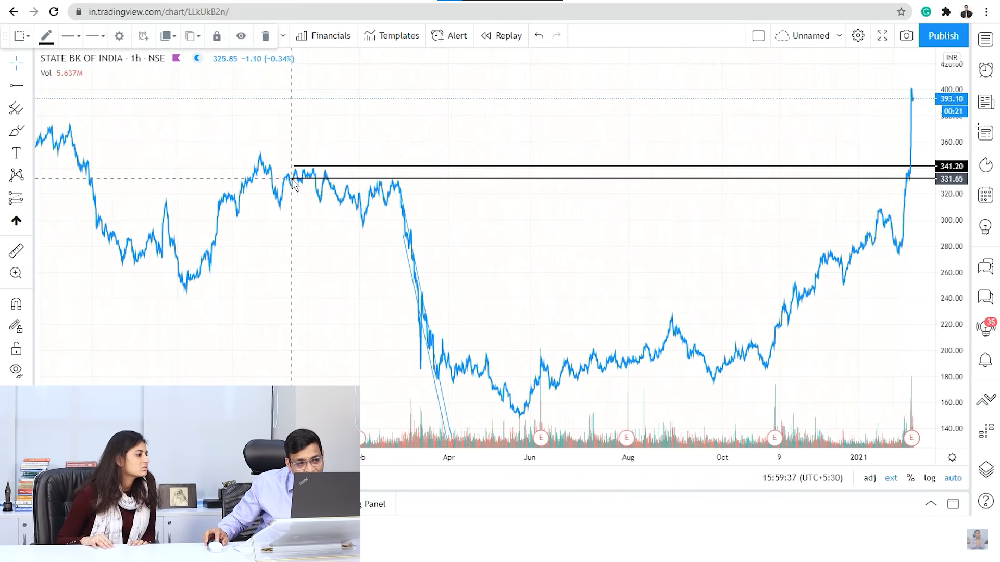
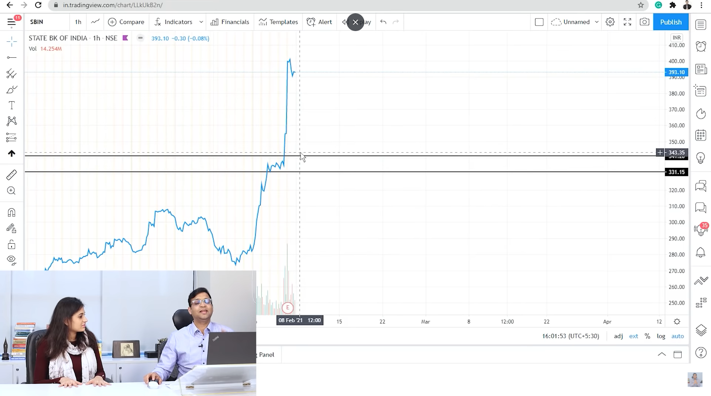

# Trading

Trading is just selling when the price down and buying it when the price can go up in the simple words.

**Types of trades :-** 
- **Intraday :-** 
When we want to buy and sell in the short amount of period and we can say in a day soo the trade is called as intraday.

Fot intrady trading we can see **1hrs and 5mins closing chart**.

- **Swing Trade :-** When we want to hold the position for 2-3-5 days as per the profit margin and our expectiations is called as swing trade.

For swing trading we see the last 3-4-6 months **daily charts** to see the whats the company doing and about his gains and performances.

### Software setups
- **Trading view :-** For advanced technical analysis.

### Technical Analysis
Study of price and volume simultaneously is the technical analysis.

### Types of movements and trends

- **Breakout :-** When trade and prices goes high by breaking previous high point.

- **Breakdown :-** When trade and prices goes low by braking the lowest base point.

- **consolidation :-** when trade rest and thinks for some time.

### Tenure of tread
Which chart to prefer for your trade is depends upon the your specific time and tenure of your tread bcoz 5 mins of charts can define a consolidated trend or downward trend but when you see the same thing in the 1 day chart it can be a upward which can be confusing soo

**You need to choose the char on the basis of your trade tenure and we can take the trade as per the chart.**

### How to identify trends

Whenever we some stocks chart our first work is to see is it in uptrend or downtrend and it will defines the price will goes up or down.

**Most Imp :- The trend can differ as per your chart timings means if you have 1 hr chart which will show you it will go uptrend soo its going in uptrend in the 1 hr.**

**Uptred :-** When the highs and lows making the movement towards upward by joining at least 2 points then the trend is uptrend and if its joining more than 2 points then its a major trend and strong signal about the uptrend.


**Uptrend Breakout :-** When chart lines or graph goes upward than uptrend or crosses the line and as well as it shows the volume of buying soo the stock can start new up trend from there.


**Downtrend :-** When the highs and lows making the movement towards downward by joining atleast 2 points and if joining more than 2 points then its a major trend and strong signal about the  downtrend.


**Downtrend Breakout :-** When chart lines or graph goes downward than  crosses the line and as well as it shows the volume of selling soo the stock can start new down trend from there.


### Support and resistance

There are buyers and sellers in the stock market and there are some price points at which there are soo many sellers or buyers which will preserve it to go down than that or go up than that soo it will call as buyers zone and sellers zone.

- **Support :-** The zone and price point at which there are buyers over their who will not let the stock down more than that and it creates support 
to the stock soo its called as support.

**How to identify demand zone :-**

We need to draw the lined on which price point stock hitting it again and again but not able to break that soo that point will become `support`.

And the line near around it with the same hitting point again and again and the difference between those lines become supply zone.


- **Resistance :-** The zone and price point at which there are sellers over there who will not let the stock go up than that price is called as resistance.

**How to identify sypply zone :-**

We need to draw the lined on which price point stock hitting it again and again but not able to break that soo that point will become `resistance`.

And the line near around it with the same hitting point again and again and the difference between those lines become supply zone.



### Right price of the stock



In this above image stock is already breaked out and its bit higher than the breakout price but we cant enter in trade in every price point soo we can buy when it will come around 345 which was breakout point and it can be now the support for it and the risk is lower soo it will breakdown immedietly.

### Research

We can do research about those stocks in which risk and reward is favorable at the evening and we can analize that stocks in the next day for the trade opportunity.

### Trading Terminal and Softwares Terms

- **Trading symbol :-** 

    Trading symbol is the name of the companies by which that stocks are represented.

- **Bid Quantity :-**

    How much quantity people wants to buy that stock is called as bid quantity.

- **Bid rate or price :-**

    On which price people wants to buy this stock.

- **Ask Rate or Price :-**

    On which price people wants to sell that stock.

- **Ask Quantity :-**

    On how much quantity people wants to sell the stock on that price.

- **LTP :-**

    Latest traded price will be the ltp. and the ltp changes with the `5paisa` which is tick size of the indian stock market.

- **Market Price :-**

    Buying and selling on the market price which is current price in the market.

- **Impact Cose :-**

    Difference between bid and ask rate is called as impact cost which is the amount of rate.

- **Liquidity :-**

    Liquidity means ability of selling and buying it soo more liquidity will be there then your orders will be quickly sold or bought.

    `MOST IMP :- If liquidity will be less dont participate in that kind of stocks bcoz there will be no buyer at that price point soo you can bear a huge loss due to liquidity.`

- **Depth :-**

    Market depth means amount of buying and selling transactions about that stock. soo more depth means more exchange and less depth means less exchange.


- **SegMents :-**

    `NSE (National stock exchange)` - have more market depth, more volume and more liquidity.

    `BSE (Bombay stock exchange)` - have same depth, volume and liquidiy but less as compared to the NSE.


- **Average Trade Price :-**

    Average trade price is that price point on which trades happened at the highest volume.

    We can know the the big bulls and bears in the market are trading on that price points and if we go with their trades we can also book our profits.

    In intraday trading there is the huge role of the ATP soo we are going to learn about it further.

- **Volume :-**

    Number of shares get traded.

- **Open :-**

    On which price today stock is opened.

- **Prev Close :-**

    On which price stock was closed yesterday.

- **High :-**

    Highest price stock touched today.

- **Low :-**

    Lowest price stock touched today.

- **52 Week High :-**

    Highest price of the stock in 1 year.

    If stock getting traded near 52 week high price three are more bulls presents over there.


- **52 Week Low :-**

    Lowest price of the stock in 1 year.

    If the stock getting traded near 52 week low price that means there are more bears presents over there.

- **Market Cap :-**

    Number of stocks availabel in the market x ltp.

    And the leaders of the industry will have the highest market cap.

### How to Choose Stocks

The simple logic behind the stocks picking is like friendship as like friends help us and we choose the friends with the same mindset soo same about the stocks we should select the stocks with the same wavelength.

**Ways to choose stocks :-**

- The stocks we consume, we see around and listen about it.

- Scaning the stocks and identifying the momentum.

- Watch the leaders of the industries.


**Watchlist Stocks Picking :-**

- We need to choose the stocks in our wishlist which we consume in our daily life.

- Then identify it should be in nifty 500 stocks list else avoid that stock.

- Then when you get some information about some stock from your collegue which is working in that ferm and know the reason of growth of some company you should add that stocks in your watchlist.

- And add the leaders of that sectors in your watchlist as banking sector leader is HDFC.

- Add the watchlist in the stockedge as well as in the tradingview soo your setup will be the same and you can work on that stocks.


### Trading View Chart Tracking

Firstly start with only some few thing soo you can focus on it.

- **Chart :-**
    
    Choose your chart type in which you want to trade and focus on it only.

- **Time Frame :-**

    Choose your time frame on the basis of your trade like for swing trading `1 hr` chart and for intraday  like `5 mins` chart as per our trade timing.

- **Compare :-**

    In the market every triggering of some stockes is triggering the other stocks as well like compatitors soo we can add the tradeline of multiple stocks in the same charts.

- **Technical Indicators :-**

    Technical indicators are like speedometers of the price nd charecter of price and it will decide the upcoming price of that stock.

    Indicators are indicators of price and the details about the price and gives us the information regarding the price.


### Demand Zone in Chart

Demand zone is the price zone in which there are the buyers are waiting over there to buy the stocks at that price points and the demand zone line or trend line should connect with atleast 2 points and if it indicates more than 3-4 points then its very strong demand zone over there.

### Supply Zone in Chart

Supply zone is the price zone in which there are the sellers are waiting over there to sell the stocks at that price points and the supply zone line or trend line should connect with atleast 2 points and if it indicates more than 3-4 points then its very strong supply zone over there.

### ShortSelling

**Rules :-**

1. When the price will breakdown the major demand zone then you should shortsell.

2. When the price will retrace till a point in the downtreand then you should shortsell the stock.

### Risk and Reward Ratio

**In the risk reward ratio should first think about the loss and then profit.**

Find the trade in which there are less amount too the loss and more amount towards the profit then only you should take that trade.

Ex : -


1. In the above example down line is the demand zone and upline is the supply zone.

2. Current stock price is `2162.00` and the trend is downtrend soo if we think about the shortsell at the current price it can only got max till the demand zone which is `2120.00` soo the profit will be only `Rs.40` and if the stock bounces upside till the supply zone then the loss will be `Rs.210` soo in this trade the loss hits then we can loose huge money soo this kind of trade we should avoid in which the risk is higher then the profit.

BUTTTTT

3. If the current price `2162.00` breaks down the demand zone on `2120.00` and reach till the `2110` soo the demand zone will be turned into the supply zone after breakdown and the till the supply zone the loss would be only `Rs.10` but it can go far down bcoz its breaked the demand zone soo this kind of trade we should take.

**Most Imp :- The risk is to reward ratio should be 1 is to 2 soo your profit booked should be (risk price x 2) and your target price should be double as your loss price soo you can square off from the position with the safe trade.**


### How to derive stocks from High Volatile sectors

First of all you can derive the stocks form the sectors from stockedge as per your choice but if you want to derive the latest stocks which are performing very well in the market then we need to derive the latest stocks through indices.

**Steps To Find Stocks With current Trend :-** 
- Go to Stockedge and enter in indices. 
- Go to Top Gainers and losers according to the goal.
- As we want to do swing trading Sort the indices with 1 week filter.
- And Check the Stocks in that indices which are performing very well.

### Moving Average

Moving Average is the oldest indicators for price action indications.

Moving Average is the last some trend weighed average which gives more weightage to latest price actions more tells us the behaviour of the price for a stock which compliments the price action.

Moving Average `tells us very well about the supports and its also an trend identifier`,By the Moving Average we can guess the movement of the stock by combining moving average with indicator like super trend which tells the trend we can combine super trend and moving average for getting more and more confirmations for our trade.

**Most Important Numbers in moving Exponential average (Weighted Average) :-**
- **21 :-** Trading Days in 1 month.
- **55 :-** Trading Days in 3 months (QUATER). 
- **100 :-** Trading Days in 6 month (HALF YEAR).
- **200 :-** Trading Days in 1 year (YEARLY).

**Most Imp :- These above numbers are most importants in moving Average which are also a fibonaci numbers soo we need to plot moving averages on this length.**

**How to Apply Moving Average :-**
- On Chart Go to indicators.
- Search For `Moving Exponential Average` and apply it.
- Click on lines setting and change its lenth to 21,55,100,200.

### Volume And Delivery (Stock Oprators moves)

**Most Imp :- Volume, Delivery, Open Intrest and Price Actions are the gods of the market and if we master this we have stock market in our fist.**

- **Volume :-**
    Volume is a number of trades taken on a perticular price and the summation of all the trades taken in a time frame candle in between open, high and low, close.

    Normally Stock oprators are those group of people or a person whon can manipulate stock price by purchasing it or selling it in a huge quantity and that can be easily visible in the volume and price behaviour, And `Volume tells us about the stock oprators movements.`

    Volume Candles colour depends on the is more buying happened or selling happen in that time period and if buying been more in that time volume candle will be green and vise versa it will be red if more selling happend in that time frame.

- **Delivery :-**

    Delivery is also most important indicator which combines perfectly with volume and which can tell us The amount of stock has got delivered at that day. Delivery taking is a risk carrying capacity which normal people cant afford soo it indicates stock people took delivery of that much stocks can be stock oprators.

    We can have study of daily delivery in the stockedge where we can see pictorial representation on which day delivery has been done in huge amount and on its `Volume Weighted Average Price` which is `Weighted Average price of all deliveries happened in that day`.

    BUT BUT 

    We cant say by just seeing delivery of that day is buying happend at that day. We need to Identify is buying happend on that day or selling happend on that day and we can identify that by `INTRADAY PRICE MOVEMENT ALONG WITH VOLUME CANDLES ON INTRADAY FRAME OF 15 MINS, OR 30 MINS.` 

    **Identify Demand Zone or supply zone from VWAP :-**

    Draw a horizontal line on that VWAP and if more selling happend in that day on delivery then its a demand zone and if selling happend then its an supply zone and thats an important line for us.

    We need to daily draw a line for VWAP and those line would be very important for us as oprators move and when you get to know if oprator price is taking support again and again on one price point then its an major demand zone on which stock oprator buys again and again.

### Open Intrest

Normally We have delivery in equity and cash market but we dont have delivery in futures and derivatives soo how we can track moves of oprators in the derivatives and we can achieve that thing with open intrest which indicates oprators moves very well.

Basically Delivery does not happens in derivatives and exchange decides to give us a lot of 100 stocks at some price and it happen thruogh contract and that contract get exchanged in the market in between traders and that is an open intrest for that stocks.

**How to track OI of Futures of stock :-**
- Go to stockedge
- Go to furtures OI tab
- In that tab OI and count of stocks is given graphically in which red, and green candles are there which indicates buying and selling of open intrest.

**Most Imp :- And thats how we an derive the oprators intent through OI by combinig with price action, delivery and open intrest.**

### Combining Trend, Price Action, Moving Average, Volume & Delivery and Open intrest for your setup

The above mentioned topics are the most important topics for identifying the stock and oprators movement in which we can follow a procedure step by step as like mentioned below.

- First Identify Trend By drwing trend lines.
- Check the moving average and price movement with it.
- Check Is volume is moving along with price and check for the delivery in the stockedge if any huge delivery happend and draw that VWAP line on chart.
- Then Check For Open Intrest soo you will get an handsome idea about the stock movement.

**Most Imp :- Give more weightage to price action, and volume and delivery and not every stock has open intrest because stocks only with futures contracts have the open intrest.**

### Fibonacci Retracement

Fibonacci are the most natural numbers which applicable everywhere naturally in the world and we can get some special or different charecteristics on this numbers.

We Can derive the retracement as well as gaining with the `fibonacci retracement` and `fibonacci Extension` in the trading view.

**Most Imp :- Fibonacci Retracement and the extensions will give the most accurate retracements when they got plotted correctly and accurately. Fibonacci always get plotted on last swing of stock.**

**How to Apply Most Accurate Fibonacci Retracement :-**
- See the Trend in chart.
- Find the Last Swing in stock.
- Start Plot fibonacci retracement on low of swing start candle.
- Stop Plot fibonacci retracement on High of trend.
- Then we will get the retracement points.

### Stop Loss
Stop is the Amount in rupees which we can bare as loss. soo

- **Capital Based Stop Loss :-**
    In capital based stop loss we calculate stop loss on our `capital per stock / price` which gives us quantity and form which we can buy how much quantity and bases on that quantity we need to divide our `loss per trade / quantity`
    ```
    Capital = 50000
    Amount you want to invest for a single stock = 20% * capital = 10000
    Max Loss you can bare per trade = 2% * 50000 = 1000


    // Stock Price
    Price = 500
    stocks we should buy = 10000/500 = 20 stocks
    soo our stop loss should be = 51
    ```

- **Price Action Based Stop Loss :-**

    In price based stop loss our `quantity get atjusted` we decide stop loss Price actions as like mentioned below.

    - **Price Actions Based Stop loss possibilities :-**
        - Low of purchased candle of that time frame.
        - Low of that purchased week.
        - Vwap of the week.

- **Indicator driven Stop loss :-**

    In the indicator based stop loss we can derive the stop loss bases on the indicator as like mentioned below.

    - **Exponential Moving Avergae :-**
        - 55 days moving average
        - 100 days moving average
        - 200 days moving average for long term trades.
        
- **Low of entry candle or previous candle low :-**

    We can make the low of entry candle as stoploss or the previous candles low as per our risk apetite.


**Most Imp :- The more stop loss would be you can get more profit but our quantity gets reduced along with huge stop loss.**

### CandleSticks

Candle stick is the graphical representation of open, high, low and close of a time frame which tells us the stock has opened in that time frame it hitted the upper point and closed at some point means it tells us the what happend in that time frame exactly as like example mentioned below.

Ex :
A candle have high of 132 and low of 125 and open got around 128 and closed at 130 soo it means buyers became heavy on the sellers and they pushed its closing to the 130 soo it means buyers was more active in that time frame.

**Importance Of the candleStick in the setup :-**

- First we can identify the important candle of the day for the intraday which will tells us the oprators entry in the stock or oprators exit of the stock because its actions will clearly reflect in the candle.

- That importance candles low and high can become demand zone and supply zone for us and we can identify the suppy zone and demand zone range by combining one or more highs together and we can draw 2 lines on them which will define us the range of demand zone.

- We can identify the stocks which are performing betters which appread candle stick pattern in the stockedge and which can have attnetion in that stock for its indications.


- Mostly Keep Watch on 1 day chart and 2 hrs chart for understanding what happend on that day and inside that day as well by seeing  the intraday chart which can give us information about what happend inside that candle.


**Most Imp :- You cant take trades just on the basis of candlesticks patterns which will not be accurate in every stock but you can use candlestick as an indication and passing one more quality parameter if the indication is also same in the terms of candle sticks as well.**

### Relative strenth index (RSI)
We can derive some stocks strenth by knowing its capability how it performs but in the trading there is no use of its capablities of stock because we are not going to hold the stock for long.

For the trading we measure the strength of performance of any stock by comparing it with `Nifty 50 index` and its sector index `Sector Index like Nifty Auto, Nifty Bank` etc.

If the stock performance and change in price is equal to `Nifty 50 index` its called as its `BETA`.

If the stock performance and change in price is greater than to `Nifty 50 index` and its outperforming its sector index then its called as its creating more `ALPHA`.

We can checkout any stock's performance with its sector index and `Nifty 50` in stockedge by going in its technicals tab.

We can see its performance according to time frame like 1 day, last 5 days, week month etc as like mentioned below.


---
- **How to derive Relative Strength of any stock :-**

    - The formula for relative strength is `Stock Price / Index Price` which we can do in tradingview as well by doing `TATAMOTORS/NIFTY50` in tradingview search which will represent us a graph of its result value.

    - We have a indicator built for the same purpose which shows us relative strength of stock with its corresponding index. The indicator name is `MAVERICK RELATIVE STRENGTH` which we can apply in setup. We can do techical analysis on the RSI as well and it will look in our system as like mentioned below. 

        

        In the the mentioned image the below line chart is RSI which tells us is stock outpeforming its sector and index.

        If the stock price goes up the RSI also wil go up and if it takes support on trend line which means it will keep outperfoming nifty.

- **Decision Helping Factor :-**

    The setup which we built till the date we can derive a decision for an entry with all available parameters.

    1. First we can check Trend with the help of supertrend.

    2. Then we can verify the trend with help of moving averages if short term moving averrage `21 days` is trading above `55 days` then its indication of stock is in uptrend.

    3. Then we can checkout Volume for identifying big movements like operators entry and exit.

    4. Then we can verify if RSI is outperfoming index and moving upwards which indicates us continuation of uptrend of stock if its taking support no some levels.

    5. Finally we can analyse the price and the breakout or breakdown and we can take entry in the stock while breakout or breakdown or while at the retracement price derived by the fibbonacci level, By setting stop loss low of the entry candle or low of previous candel based on the risk apetite. 
    
### Volatility


### Options
Options are the contracts for having an right to buying or selling some stock at some price point in futures for which you need to pay some premium price. Options

Options buying is the thing where the loss is limited which is the premium amount but the profit is unlimited.

For options we have 2 categories where you need to buy for bid of increasing price as well as for bid of decreasing price and that can be done through `CE(profit if price increases)` and `PE(Buy for selling if price decreases)`.

**Types of options :-**

1. **Call (CE):-**

    Call is the category of options where you pay the premium for having an right to buy the stock at some price point in futures.

    When you buy CE options you make profit if the option price increases.

    **Vice versa**

    If you sell the CE option you make profit if the option price decreases.


2. **Put (PE) :-**

    Call is the category of options where you pay the premium for having an right to sell the stock at some price point in futures.

    When you buy CE options you make profit if the option price decreases.

    **Vice versa**

    If you sell the PE option you make profit if the option price increses.
    

**Strike Price :-**

Strike price is the price of the option for the stock for which we want to have the right to buy or sell.

The nearset strike price for the option called as **at the money.**

When the strike price is less then the current price is called **is in the money**.
    
When the strike price is greater then the current price is called **Out of money**.

**Premium :-**

Premium is the amount which we need to pay for that stock for the choosed strike price for which you want to have right to buy or sell.
