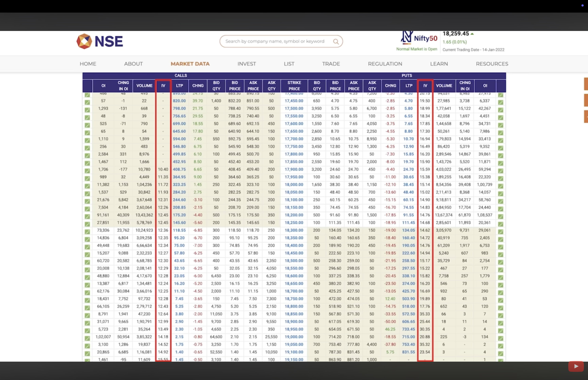

# Options Trading

Options is the way to book price today of things we want to purchase in future but we afraid that its price will increase, to book that price we pay some premium or little money against that benifit.

**Ex :-**
Lets consider we want to purchase a car after a year but we are afraid price of car might increase but we want to book that price today. To do that we agree to pay a certain premium for it which gives us right to buy the car at todays price despite its increased price in future.

### Contract Expiry
As we have discussed option is right to buy asset in future due to which its called as `Contract`.

When you want to purchase the car in next 6 months then you buy its option contract of 6months from today, when the day arrives you need to go to dealership and purchase the car.

**Contract Expiry in Indian Markets :-**
- **Stocks :-** Stock option contracts expires on last thursday of the month.
- **Indices :-** Earlier Indices used to have weekly expiry but due to new SEBI guidelines even indices option contracts have monthly expiry now and its last thursday of the month.

    `Note - If the expiry day is holiday then it shifts 1 trading day back, ie if your contract expiry is 25th dec but its holiday so your contracts will expire on 24th even if its wednsday`

### Types of Options
There are 2 types of options in the financial markets, one is `Call | Put`, This both be can be longed at shorting based on what we want to achieve.

**Option Buying :-**

When we have less capital we usually do option buying but probability of winning is very less in it & it depends on multiple factors.

`Note - Loss is limited in option buying & Profit can be unlimited therotically.`

- `Call (Buying)` - When we believe market will go up then we buy call options.
- `Put (Buying)` - When we believe market will go down then we buy put options.

**Option Selling**

When we have more capital but we want high probability of winning then we can do the option selling & also its profitability depends on multiple factors. 

`Note - Profit is limited in option selling & Loss can be unlimited therotically.`

- `Put (Selling)` - When we believe market will go up then we sell the put options.
- `Call (Selling)` - When we believe market will go down we sell call options.

### Category of option contracts

Option contracts are categories in 3 types, `ITM(In the money) | ATM (At the money) | OTM (Ouf of money)`.

**Types :-**

- **ATM (At the money) :-** 
  
  If we are buying option contract as current price its called as ATM option contract.

- **ITM (In the money) :-**
  
  If we are buying option ontract Less than current price its called as ITM option contract.

- **OTM (Ouf of the money) :-**

    If we are buying option contract More then current price its called as OTM option contract.

### (Theta | Time) Decay  - Reason we loose money in options even if price is same of asset?

Theta or Time decay is you can consider monthly rent from your option contract premium to hold your contract intact. ie Dealership gets timely payment or rent for his benifit lock price for your even despite market prices of that car.

The more time passes more rent or intrest goes to dealership and value of your options becomes less, when the expiry arrives price of your option contract can go to zero as well.

- **Theta | Time decay in indian markets :-**

    If we consider example of stock option, lets consider we buy option of next 3 months as the time passes or get near to expiry your option contract values also reduces time by time But `The more close we get to expiry theta decay becomes more stronger & option contract price drop also strongly as it gets near to expiry`

    **Ex :-**
    If Reliance is trading at `1000` and we believe price of it will increase in next 2 days due to some event or news but Reliance have not moved from that price and still at `1000` after 3 days, but we started loosing money in our position. 

    WHY????

    Its due to the Theta decay.

### Delta - How much profit we can generate if options reach its strike price?

In our car dealership example if car price increases `10L - 11L` then we will be having benifit of 1L and its called as Delta. 

We knew earlier that as the time will pass option contract value will decrease but how much??? That answer comes from the metric called as delta.

Delta is unit to know how much option premium will increase or decrease when option contract expires.

- **Delta corresponding to option contract category**
  - **ATM (At the money) = 0.5 :-** Delta at ATM option contracts is `0.5`
  - **ITM (In the money) = 1 :-** As price goes in the money it increases near to `1`
  - **OTM (Out of the money) = Near to 0 :-** As price goes out of the money it decreases near to `0`.

- **Delta in indian markets :-**

    If Reliance is trading at `1000` & we have bought ITM option at `INR. 500 premium` and so if our share price moves by `200` we can find price difference for option premium with `Option Premium Difference = 0.5 * 200 = 100 (0.5 * change in asset price)`, if price is increases by 200 to 1200 then our option premium will be `500 + 100 = 600 (Option premium you paid + option premium difference)` & if price decreases by 200 to 8000 then our option premium will be `500 - 200 = 300 (Option premium you paid - Option premium differnce)`. 

    `Risk Disclaimer - If your option premium was 100 then it would have doubled with 100 differnce positively & if it would have decreased by 100 then it would have went to 0 and this is the risk involved with option trading.`

- **Which option category to choose?**

    OTM Option contracts are cheaper but delta is less, ATM option contracts are medium delta is also median & ITM option contracts are expensive but delta is near to 1. 

    Its better to trade with ATM options majorly because premium & delta is also balanced, If you have low capital you can go with OTM options & If you have extra capital then you can go ITM options for more delta which leads to more profit.

### Gamma - When OTM options become ATM why option prices increases faster?

In our car dealership example if car price exponentially increases from `10L - 13L` then we will be having benifit of 13L speed in change or asset price and its effect on our option premium is called as gamma.

As we learned earlier `ATM delta = 0.5, ITM delta = 1, OTM delta = 0.1-0` but when price moves from `ATM to ITM` then our delta also increases from `0.5 - 0.9` because latest price becomes `ATM` and how much delta will increases or decrease Gamma will tells us that.

- **Gamma in indian markets :-**

    If Reliance is trading at `1000` & we have bought OTM option of strike price 1500 at `INR. 20 premium` and so if our share price moves by `500` as our delta of OTM was 0.1 so `0.1 * 20 = 2 | option premium = 20 + 2 = 22` but our delta will also increase `0.1 -> 0.5` as our option became ATM so our newer delta & option premium will be according to ATM `0.5 * 20 = 10 | option premium = 20 + 10 = 30`. 

    The price difference in option premium was 2 earlier called as delta & it increased to 10 with difference of 8 so 8 is our gamma.

    Whenever price increases or asset for which we have purchases option contract price change in its premium is addition of `delta + gamma`.

### Vega (IV - Implied volatility) - When market gaps up or gaps down due to volatility why option premiums shoots up more?

In our car dealership example if we had bought option at premium of `100` and price of car suddenly increases from `10L -> 15L` then car dealer gets cautious and he increases the price of option premium for new customers to `120`, but as dealer increases price for new customer existing option contract valued earlier at `100` also increases to `120` and this price difference is called as Vega.

**Vega in indian market :-**
If Volatility comes in the market due to event or any reason option price also increases rapidly, Its most benifitial for existing buyers as they get additional benifit on option premium.

`Note - If IV is less than 10 then we can look to that option for buying considering if volatility comes in we will get more profit & if IV is more than 20 then we can look to sell that option because that volatility will calm down in some time and option prices will be decrases and we will get its benifit in option selling.`

### RHO (Intrest Rate)

In car dealership example if government suddenly announces new policy increasing taxes on cars, dealer increases the option premium prices and option prices of existing customers also increased due to it, the difference is called as RHO.

When our government or institutions increases the intrest rate in country which impacts on whole economy which also impacts options.

That impacts also shows on options but its very less. 

**RHO in indian markets :-**

When intrest rates are increased call option prices are also increased than normal, and put options price are decreased than normal price, ie call options have positive `+RHO` & put options are `-RHO`.

### How to use Option Greeks in our trades?

**What to Buy? (With help of Delta) :-**
- We need to refer delta while choosing strike price, through delta we can clearly see which strike is having better delta `>0.5` and will gives us more return as compared to asset price movement.

**How to find SL & Tp? (With help of delta & theta) :-**
Through theta we can see how much value it will loose due to time decay.

- **Stoploss -** We need to add the theta value in our SL like if we are considering sl of `10` & if theta is `2.7` then we need to keep sl as `12.7`.

We can avoid sl hit even if price not moved against us in expectecd price value of assets & riding to our TP situation by adding theta in SL.

- **Take Profit -** We need to deduct the theta value form our TP, if we are considering TP as `30` and theta is `2.7` then we need to keep TP as `27.3`.

We can avoid tp not hitting even if price moved in our favour with expected value & reversal to sl situation by deducting theta from TP.