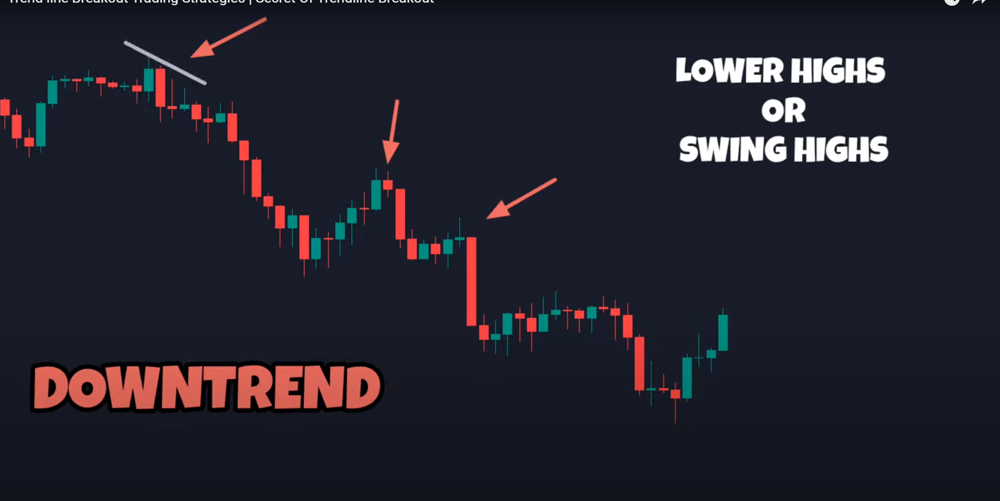
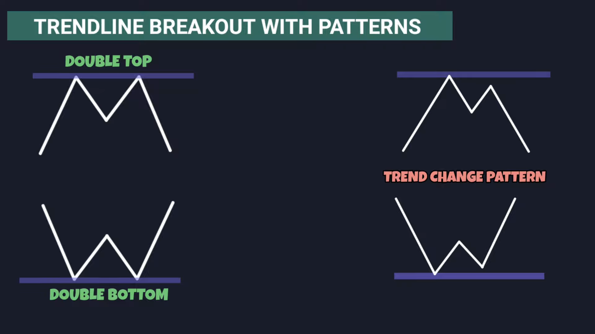
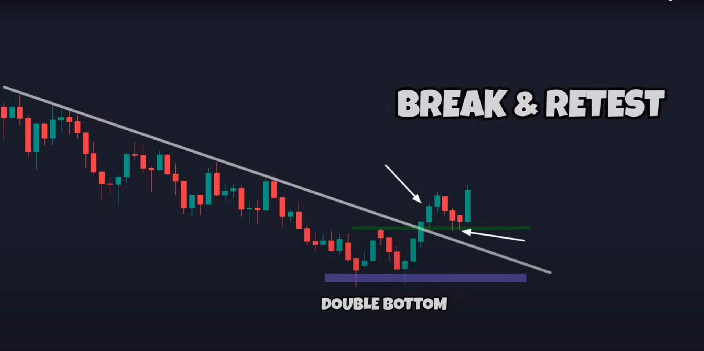
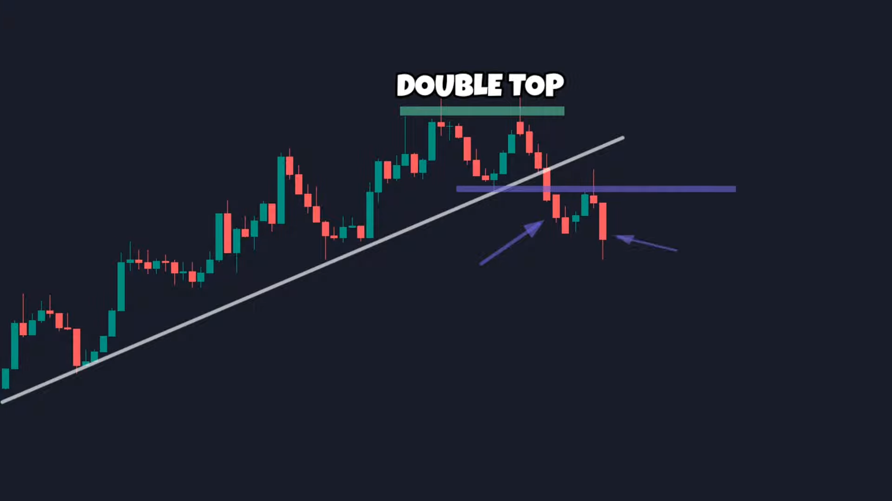
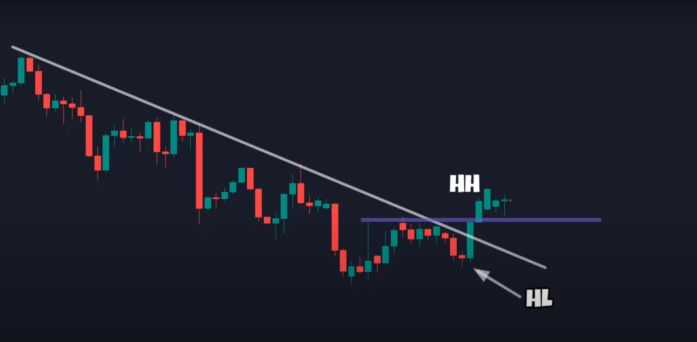
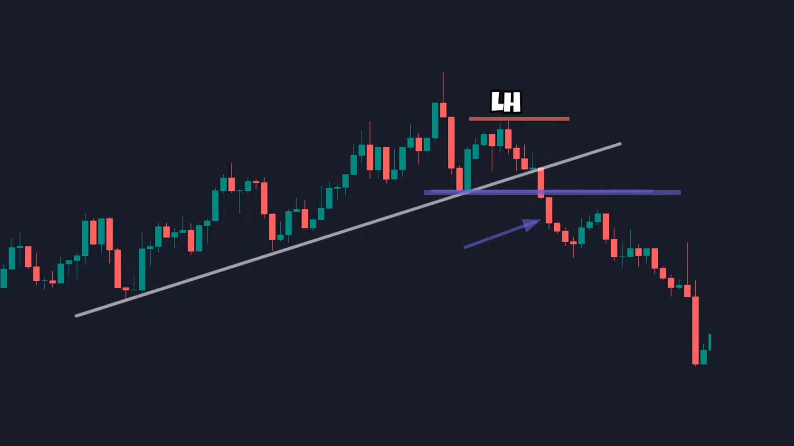

### setup

Setup is basically our way of market-analysis which works for our psychology, patience & trade time.

**Scalping Setup Step by step:-**

1. 15min timeframe for plotting current trend on bigger timeframe.

2. 30min Verify trend plotted with trendlines.
  
3. 1min timeframe for catching chart patterns & Horizontal support & resistance levels.
  
4. 5min timeframe for verifying chart patterns & Horizontal support & resistance levels.

### Falling Wedge trendline Breakout with support & resistance levels. 

**Setup :-**

   - Go to 15mins timeframe & plot trend lines with strict higher highs, any high in between should not penetrate trendline.
     
   - Verify the trendline on 30min timeframe setup.

   - Go to 1min timeframe Zoomout the screen so you will be able to see more candles and plot the trendlines with current trend & Plot the horizontal support & resistance devels.

    **Note :- Current trend should have minimum of 3 touches on trendlines.**

   - Verify the trend on 5min timeframe.

**Entry :-**  

Entry can be confirmed by there support zone near below the breakout so price can retest on it & continue rising.

- Take the entry if trendline gives breakout & if bullish candle closes above the trendline.

**Stop Loss :-**

Below the lower trendline by giving breathing speace to it.

**Target :-**

Keep the target strict as Risk to reward ratio of strict `1:2` so even if you have around 34% accuracy of your trades still you will be profitable.

**Tested Forex Pairs :-**

- `NZDJPY`

### Trendline Breakout Strategy

Trendline breakout strategy does fails sometimes but the reason behind its failure is level of confirmations. We only look for trendline breakout & enter into trade which leads to victim stoploss hunting and trap trading and market reverses against you.

We are going through trendline breakout strategy in details with the follwing setup & rules for them.

**Setup :-**

- First draw trendlines as zones not the single trendlines with minimum of 2-3 touches in zones then only its an valid trendlines as like mentioned below.
  
  
  

- We will look for 2 types of important patterns for breakout which are `double bottoms/tops & trend change` patterns.
  
   

   Trendchange pattern means if ther is ongoing uptrend and price fails to make higher high or low which is called as trend change pattern and

**Entry :-**

We can take entry for breakouts with 2 methods, first is breakout follwing candle closes in reverse direction and second is we wait till retest and we take entry on rejection candle's base.

**Double Bottom / Tops Pattern :-**

   **Double bottom formation (For Downtrend line breakout) :-**

   We observe support zone & resistance zone of previous recent candles.

   

   In the above setup at the support levels of recent candles there is double bottom formation before the breakout which indicating the potential reversal and also its breaking out the trendline as well as resistance levels of last higher candle for current downtrend.

   In the above setup we can take entry on breakouts next candles close if its bullish or we wait for the retest on its last candles resistance levels.

   **Double top formation (For Uptrend line breakout) :-**

   We observe support zone & resistance zone of previous recent candles.

   

   In the above setup at the resistance levels it there is double top formation which indicates potential reversal & also breaking down current trendline as well as last lower candles support levels for current downtrend.

   In the above setup we can take entry on breakdowns next candles close if its bearish candle or we wait for retest on its last higher candles support levels.

**Trend Change Pattern :-**

   We observe for lower high & lower low formation of breakout swing.

   **Trend Change Formation (For Uptrend line breakout) :-**

   

   In the above setup high & low formation of breakout swing is changed and it formed higher high which indicates the potential trend reversal & also breaking out the trendline as well as resistance levels of last higher candle for current downtrend.

   In the above setup we can take entry on breakouts next candles close if its forms bullish or we wait for retest on its last lower candles resistance levels.

   **Trend Change Formation (For Downtrend line breakdown) :-**

   

   In the above setup high & low formation of brekdown swing is chnaged it formed lower high which indiecated the potential trend reversal & also breaking down the trendline as well as support levels or last lower candles for current uptrend.

   In the above setup we take entry on breakdowns next candles close if its forms bullish or we can wait for retest on its last lower candles support levels.

**Confirmations :-**

1. Checkout if breakout approaching strongly to trendline.

2. Checkout if there was any reversal candle from where the price has turned.

3. Checkout if Distance between breakout/breakdown & last swing should be small.

4. Volume at the breakout candle should be high from its past volumes.

6. If you are using rsi RSI should also indicate `breakout/brekdown` & rsi should also indicate the trend in same direction, there should be no divergence in rsi & breakout.

