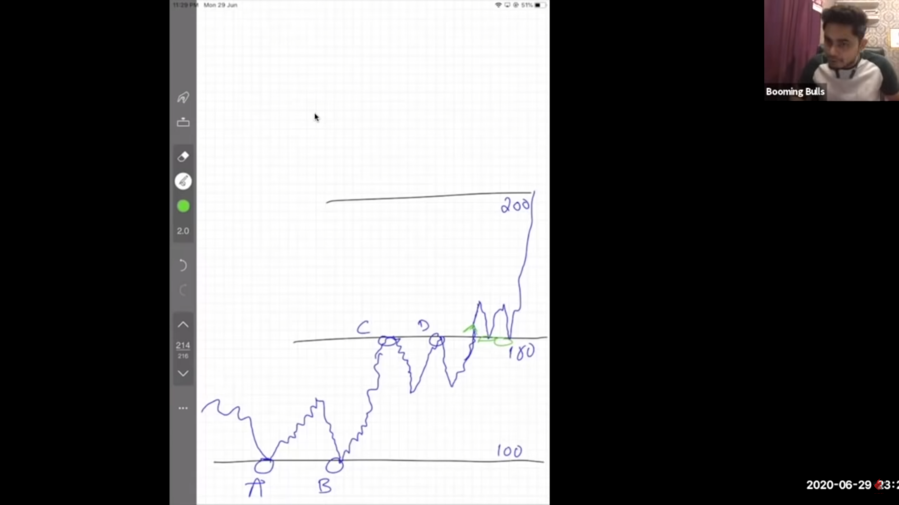
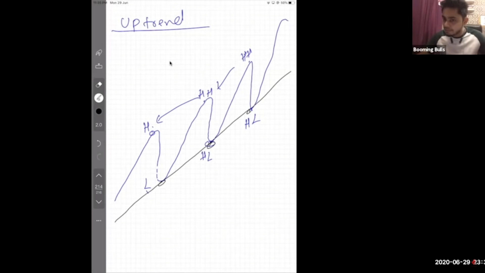
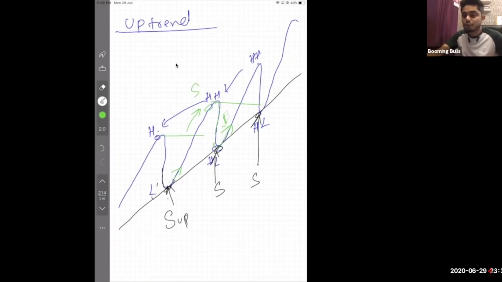
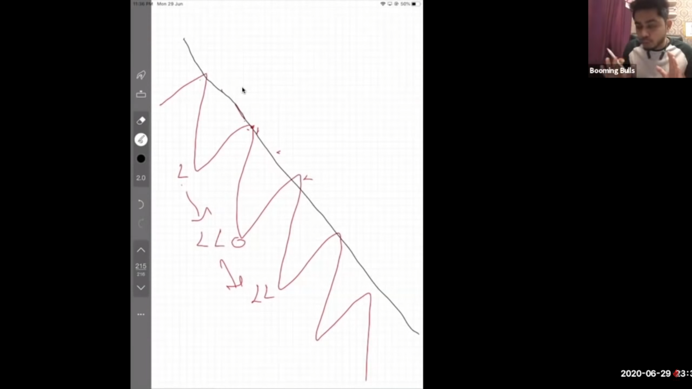
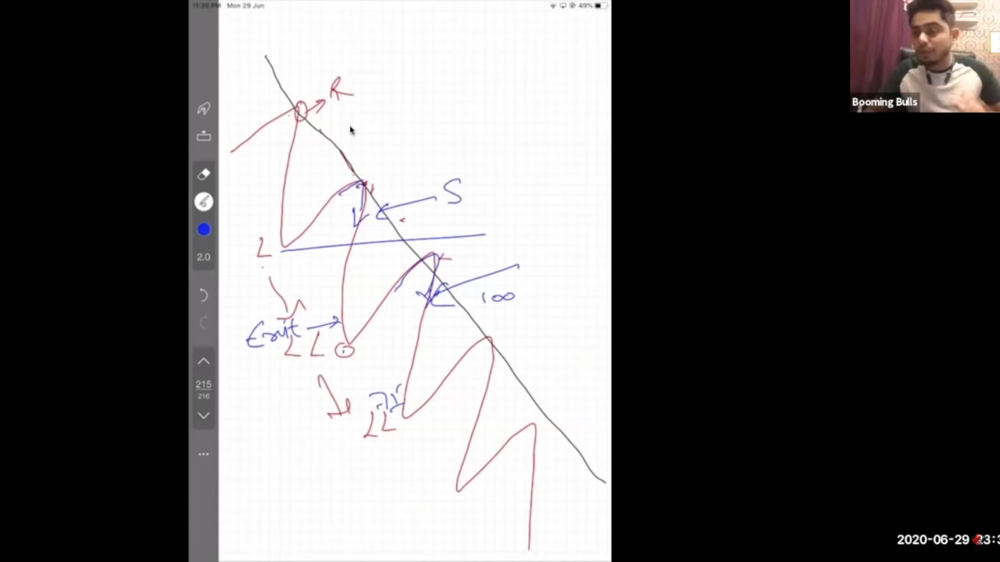
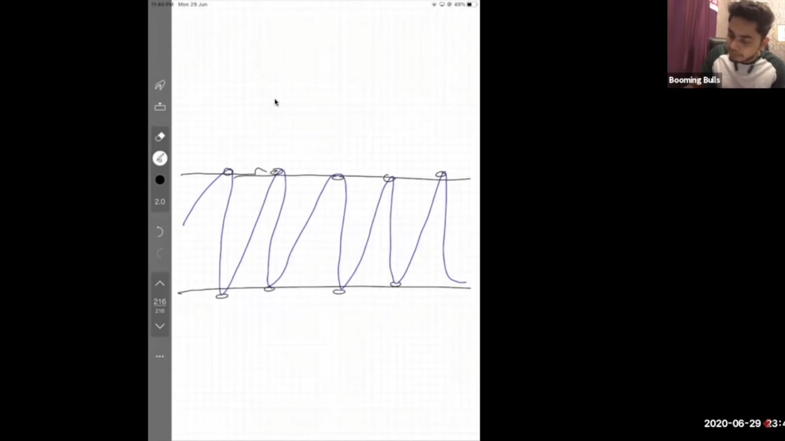

# Technicals
Technicals is the study of charts to predict the future of price of stocks, futures, indexes etc.

# Price Actions

Price actions is the study of stock prices action for some previous time period by identifying trends, Supports and Resistances on the charts and predicting either it will go up or down is called as price action.

- **Support & Resistance :-**

    

    - **Support :-**

        The zone on chart on which downtrend price not going below that level or zone and reversing the the trend into uptrend is called as support.

        In the above image `A` & `B` are the support levels from which price is not going below and trend is being uptrend.

    - **Resistance :-**

        The zone on chart on which uptrend price is not going above that level and reversing the trend into downtrend is called as resistance.

        In the above image `C` & `D` are the resistance levels above which price was not going upward and trend was being downtrend.
    
    **Note :- Support and Resistance are not the permanent fixed zones, those are identified as support and resistance based on last swings, `after having any breakout and resistance becomes support` & `after having breakdown support becomes resistance` and thats how terms get changed based on the recent swings.**

- **Uptrend & Downtrend :-**

    - **Uptrend :-**

        In trading price doesn't moves directly upward or downward it swings upside or downside when the price swings upside by making higher high's and lower high's then its called as uptrend.
        
        By Connecting the lower high's we can draw trendline on chart with the help of trendline tool on trading view.

        

        **How to trade in uptrend :-**

        

        As mentioned in the above image if stocks comes down to trendline and takes support and again starts moving up then you buy it.

    - **Dopwntrend :-**

        In trading price doesn't moves directly upward or downward it swings upside or downside when the price swings downside by making higher low's and lower low's then its called as uptrend.
        
        By Connecting the lower high's we can draw trendline on chart with the help of trendline tool on trading view.

            

        **How to trde in downtrend :-**

        

        As mentioned in the above image if stocks comes up till to trendline and It resists to move upward and again starts moving down then you sell it.

    - **sideways :-**

        In trading sometimes prices moves in some certain range in which it moves upward and downward again and again but doesnt crosses that range thats called as sideways trend or consolidation.

        By connecting all low's and all high's in single horizontal line you can identify sideways trend.

        

        **How to trade in sideways trend :-**

        

        As mentioned above image if stocks comes down to support level and start growing again then buy it and sell it on its resistance levels or vice versa. 

- **Breakout & Breakdown :-**

    - **Breakout :-**

    - **Breakdown :-**

