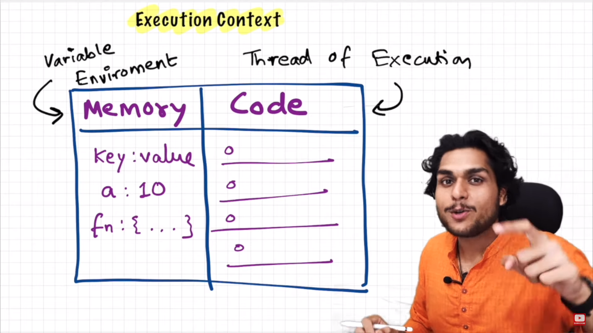
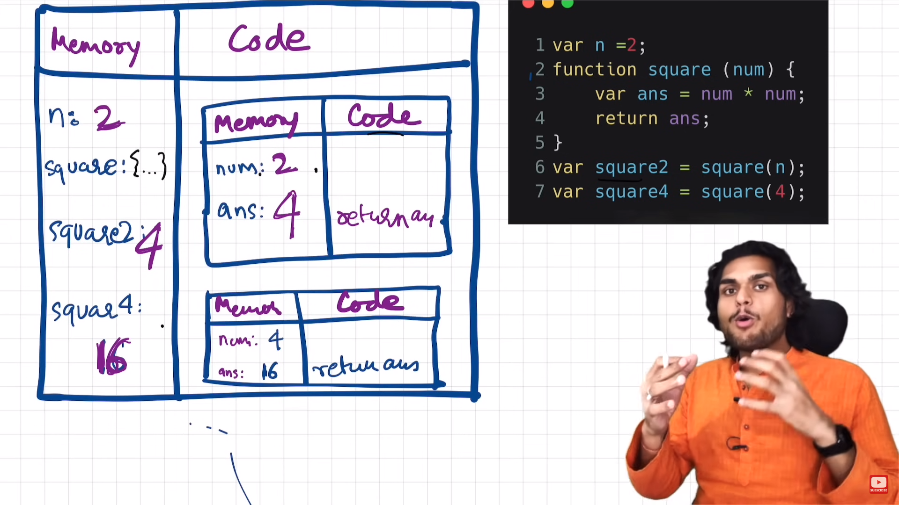
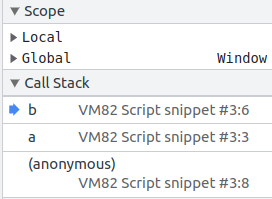
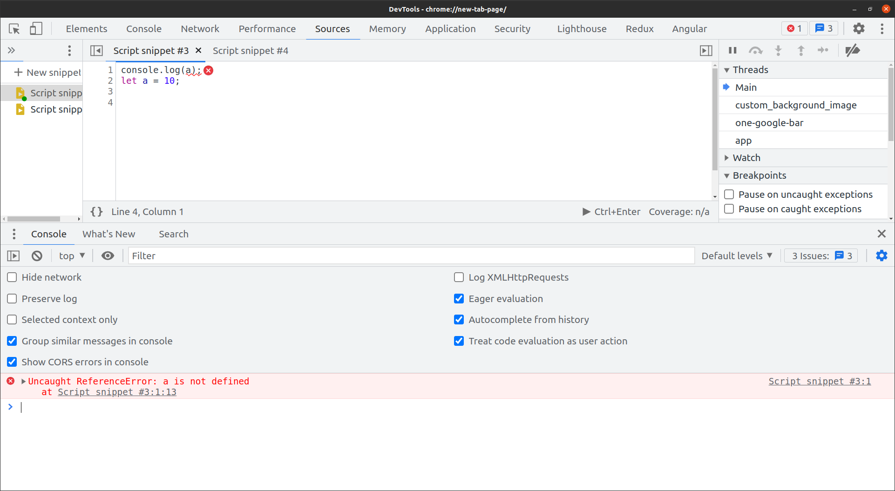
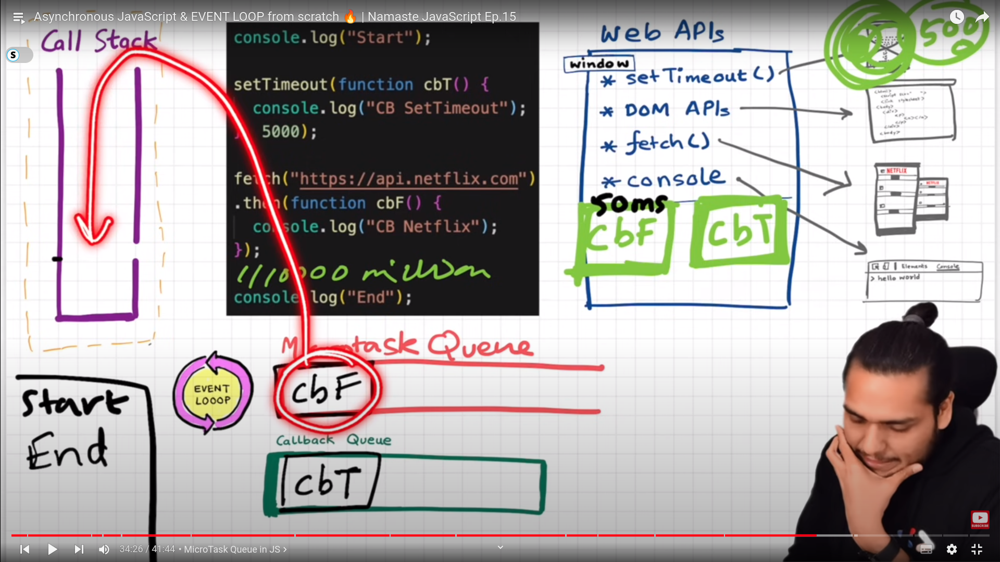

# Java-Script

javaScript is scripting language made for interpretate the some logic at the browser side soo reduce the traffic to the server for the small small task and to reduce the run time of the website.

### Variables

We declare the variables in the javascript with the keyword "var".

**Ways to declare the variables in the javascript** -

1. var
2. let
3. const 

### Data Types 

There are 2 types of datatypes in javascript.

- **Premetive** - Those datatypes are the root datatypes of the languauge which stores in the stack in memory.

- **Non-Premetive** - Derived data types which get stored in the Heap space.

**Premetive Data types** : -

1. string = "" written in this symbol which are basically the alphabates.

2. number = 12 normally written in the numeric values.

3. Boolean = these data types only contains only 2 values like true and false which are conditional data types.

4. Undefined = Undefiend represents variable declaration but the value is undefined.

5. NULL = Null represents no value at all.

**Non-Premetive Data Types** : -

1. array = ["a",b,c] combination of data types grouped together to store in single variable is called as array.

2. Object = {key:value} Object are basically the key value pair in which we can store the data related to real world like the details of the person and all together.

3. Regular Expression = Represents regualr expression.

### Functions 

If we need to repeat any functionality again and again in the certain task or project you just group that functionality in a block make it dynamic soo it will be worked in the same logic but in the different situations.

We declare function as mentioned below :

```
function thisFunc(){
    // Code
    return code;
}
```

The function declaration is done with the keyword **"function"** and **thisfunc** is the name associated with the function and and in the **(parameters)** we pass the parameters which we going to use inside the function.

The return written in the function returns the value to the function but whenever the return keyword is used we need to assign the function to the variable or we need to do the **console.log(function)** then only we can get the result.
### String Concatination 

We can concat the strings in the javascript with the many ways but we most usable is with console.log("string",var) and with the **"" + ""**.

### Incremental and decremental oprators 

1. **Pre and Post increment oprators**

- ++value :- It will increment the value first and then print

- value++ :- It will print the value first and then it will print it.

### Arithmatic Oprators

- **+** :- Additional oprators used for addition and concatination.

- **-** :- Substraction oprator used for substraction.

- **"*"** :- Multiplication oprator used for multiplication.

- **/** :- Divide oprator used for divisional oprations.

- **%** :- Its modulus oprator which gives us the remainder of the division.

### Assignment oprators

- **=** :- This is the assignment oprator in the javascript which assigns the values to the variables or else.

- **+=** :- This oprators add the asasigned value to the variable.

- **-=** :- This oprators substracts the assigned value to the variable.

- ***=**  :- This oprators Mutiplies the assigned value to the variable.

- **/=**  :- This oprators divides the assigned value to the variable.

### Ternary Oprators

`condition ? true : false`

Ternary oprators which have 3 values in it thats why its called as ternary oprator and its used to do the small comparison based on true false statements.

**We can use it single line if else statements**

Ex : `a>6 ? console.log(true) : console.log(false)` = It will returns true.

### Logical and comparision oprators
	
- `==`	**Equal to** :- true if the operands are equal.


    Ex : 	5==5; //true
 
- `!=`	**Not equal to** :- true if the operands are not equal	

    Ex: 5!=5; // false
 
- `===`	**Strict equal to** : -  true if the operands are equal and of the same - datatype	

    Ex : 5==='5'; //false
 
- `!==`	**Strict not equal to** :- true if the operands are equal but of  different type or not equal at all	

    Ex : 5!=='5'; //true
 
- `">"`	**Greater than** :- true if the left operand is greater than the  right operand	

    Ex : 3>2; //true
 
- `>=`	**Greater than or equal to** :- true if the left operand is greater - than or equal to the right operand	

    Ex : 3>=3; //true
 
- `<`	**Less than** :- true if the left operand is less than the right - operand	

    Ex : 3<2; //false
 
- `<=`	**Less than or equal to** :- true if the left operand is less than or equal to the right operand	
    
    Ex : 2<=2; //true

### Conditional (and, or, not) oprator

- `&&` :- And oprator used to check the mutiple true conditions in if else statements.

- `||` :- Or oprator used to check the at least one true conditions in if else statements.

- `!` :- Not oprator is used to inverse the output of the statement.

### If else statments

If else statements in the javascript is used to check the conditions in our code and what we want to execute if some specific condition get executed and if not then what to execute as like mentioned below.

Ex :
```
let name = "shiv";
if(name=="shiv"){
    conosle.log("this is the right person")
} 
else if{
    conosle.log("this is not the right person")
}
else{
    console.log("Not Found")
}
``` 
In the above example we are checking the name and executing the right code if it will be true and what if it will be false.

**Returning True and False :-**

In the traditional method if you want to return true of false by checking with the logical oprators `if( value=="shiv" ){ return true }else{ return false}` it will return true or false But we can do with something advanced.


Rahter than returning `true and false` in if else statement by checking the condition we can write the function return statement with logical oprator as like mentioned below.
 
```
function isLess(a, b) {
  // Only change code below this line
    return a<b;
  
  // Only change code above this line
}

isLess(10, 15); // true
```

```
function isLess(a, b) {
  // Only change code below this line
    return a<b;
  
  // Only change code above this line
}

isLess(10, 15);
```

### Switch Statements

Switch case is also conditional functionality in the javascript which checks the multiple conditions and gives us the result.

Difference between if else and switch statement is `if else ` statement becomes lengthy if there would be multiple conditions soo there `switch` statement is used.

**Structure :-**

- `switch(){}` - we define the switch case with the help of it.

- `case <condition>:` - we define our condition to check in front of case and checks with strict `===` oprator.

- `default:` - It will work as else statement in the switch case.
- `break :-` stops the conditional checking if matched with any case.

We can see the whole structure in the mentioned below.

**Most Imp :- we cant check the values like `value=='somevalue'` in the switch statement either case itself checks the condition with `===` strict equality oprator.** 

EX : 

```
let val = 5

switch(val){
    case 1:
        console.log("One")
        break;
    case 2 :
        console.log("Two")
        break;
    case 3 : 
        console.log("Three")
        break;
    default:
        console.log("Name Not Found")
        break;
}
```
**Switch statement with multiple input with same output:-** 

If the break statement is omitted from a switch statement's case, the following case statement(s) are executed until a break is encountered. If you have multiple inputs with the same output, you can represent them in a switch statement like this:

```
let result = "";
switch(val) {
  case 1:
  case 2:
  case 3:
    result = "1, 2, or 3";
    break;
  case 4:
    result = "4 alone";
}
```
**Switch statement with logical oprators :-**

If we need to use the logical oprators and we need to check some different conditons with our own we can use `switch(true){}` soo it can check the our written conditions.

```
function sequentialSizes(val) {
    let answer = "";
    // Only change code below this line
  
    switch(true){
        
      case val>=1 && val<=3:
        answer = "Low"
        break;

      case val>=4 && val<=6:
        answer = "Med"
        break;
      
      case val>=7 && val>=9:
        answer = "High"
        break;
  
    }
  
    // Only change code above this line
    return answer;
  }
  
  console.log(sequentialSizes(1));
```


**Usecase :-**

Only use switch case statement when you need to check the multiple conditions with `===` like `if(value==='shiv'){console.log("Shiv is here")}
` then only use the switch statement like `swich(val){case "shiv" : console.log("Shiv is here")}` to reduce the syntax and keep it simple.


### Ways of outputs 

1. **Console Output**  - We can get the output in the console by  using conosle methods like `conosle.log("hi there")`.

2. **Document Output** - We can get the output on our webpage by using document methods like `document.write("hi there")`.

3. **Alert** - We can get output in the alert as which appers on the webpage on the top like a pop up by using methods `alert("hi there")`.

4. **Dynamic content on the webpage (innerHTML)** - We can show the dynamic data on the website in the perticular element as well through the javascript by using the `document.getElementById("")`


### Inputs of outputs

1. **Window Input** - We can take window input from the alert by using ` let output = window.prompt("Enter the name : ")`.

2. **HTML Form** - We can take input by using HTML form and by using `input.value` and this is the best and ideal way to take input from the user in the feild of web developement.
 

### Arrays 

- **How to acess the values of array** :- 

    In the arrays we can acess the values of array by its own index in the array.
    ```
    var hobbies = ["reading","swiming"]
    console.log(hobbies[0]) // It wil return the reading.
    ```

-  **Array Properteis** - 

    1. `arr.length` - return the length of the array.

    2. `arr.concat(anotherArray)` - It will concat the array on which the method is called.

 -  **Array methods** - 
    
    1. `arr.push()` - It will push the value in the array at the end of the array.

    2. `arr.pop()` - It will remove the last element of the array.

    3. `arr.toString()` - It will convert the arry with its specific index in a single string.

    4. `arr.find(()=>{})` - The find() method returns the first element in the provided array that satisfies the provided testing function. If no values satisfy the testing function, undefined is returned.

    5. `arr.filter(()=>{})` - It creates a new array which pass the conditions like mentioned below.
        ```
        let arr = [10,11,22,45,65,87,231,12]

        let mature = arr.filter(res=>{
            return res>=18 
        })
        console.log(arr)
        console.log(mature)
        ```
    6. `arr.map(()=>{})` - It can create the new array by applying modificatinos to it soo too fetch the already available data we use the filter and if we wanna update the data and return it to new array we need to use the map function.
        ```
        let arr = [10,11,22,45,65,87,231,12]

        let agesUpdatedFilter = arr.filter(res=> res+5)
        let agesUpdatedMap = arr.map(res=> res+5)

        console.log(agesUpdatedFilter) // It will return the new array as it is bcoz we cant update the existing the values in the filter method.
        console.log(agesUpdatedMap)// It will return the new array with addition of 5.        
        ```
    7. `arr.sort((a,b)=>a-b)` - It will sort the numerical values and we can use the plain sort function for the alphabetical sorting.
        ```
        // Alphabetical sorting
        let words= ['aasdf','sdf','zxcv'];
        let sortedWords = words.sort();

        console.log(sortedWords); // 'aasdf', 'sdf', 'zxcv'

        let arr = [10,11,22,45,65,87,231,12]

        let sorted = arr.sort((a,b)=>a-b)

        console.log(sorted) // [10, 11, 12, 22,45, 65, 87, 231]

        ```
    
    8. `arr.reverse()` - It will reverses the values of the array.
        
    9.  `arr.slice(start,end)` - It will return a new array with the sliced elements without affecting the orignal array where end is not inluded.


### Objects
Object is the non premetive data type in the javascript which holds the key value pairs in it `const person = {name:"shiv",age:10}` and soo on.
We can use any dataype.

**How to create objects :-**

- `let user = new Object(); // "object constructor" syntax` 
- `let user = {};  // "object literal" syntax` 

**How to acess the values inside the obj :-**

- `person.name // We can acess the values with the obj.property name`

- `person["name"] // We can acess the values with the Obj['property']`

    When we use `.notation` the property should be available there and it will works like adress of something else it throws error but when we use `obj["property"]` it will not check the property exists there are not.

**Objects properties and methdos :-**

- `"age" in user` - This will check if the property exists in user on not and return true and false.

- `Object.assign(new obj)` - It will assign the value and properteis of our new object to the object which we want to assign and we will get a single obj with all the properties and values of both of objects.

- `Object.freeze(obj)` - It will freeze that object soo other code cannot delete and change the properties.

- `Objecty.keys(obj)` - This will return the array off obj keys.

- `Objecty.values(obj)` - This will return the array off obj values.

### Classes 
Classes are the real world things or objects which holds their properties and their functionalities calles as methods are called as objects.

We can declare a class by using the below syntax : 
```
class Employee{
    constructor(name,salary){
        // properties
        this.name = name, 
        this.salary = salary
    }

    // Methods
    greet(){
        console.log("Good Morning",this.name)
    }
}
```
- we declare the classes with the keyword `class`.

- `constructor(){}` is the things which assign the external values to the class dynamically by using keyword `this` keyword to the obj whos its property of.

-  When we write the function in the class we dont need to use the keyword `function` we can decalre the methods like `greet () {conosle.log(name)}`.
 

### Loops 

- **Simple For Loop :-** 

    A for loop repeats until a specified condition evaluates to false. The JavaScript for loop is similar to the Java and C for loop.

    For loop Structure : 
    ```
    for ([initialExpression]; [conditionExpression]; [incrementExpression]){
        // Code
    }
    ```

    Ex : 
    ```
    for(let i =0;i<10;i++){
    console.log(i)
    }
    ```
- **Do while loop :-**
  
    Do while loop is when we want to run the loop at least once.

    Do While Loop Structure : 
  ```
  let i = 0;
    do {
    i += 1;
    console.log(i);
    } while (i < 5);
  ```

- **while loop :-**

    While Loop is the same as for loop.

    Code Structure for while loop : 

    ```
    let i = 0;
    while(i<10){
        console.log(i)
        i++;
    } // It will print the values till the 9 as 10 will be the exclusive.
    ```

### ES6 for loops

- **For in Loop :-**
  
  We can use the for-in loop on objects and strings to acess their properties and values as like mentioned below.

  ```
  for (key in obj){
      console.log(key)
  }
  // It will return the keys of objects
  ```
  We can acess the values by using the for-in loop as like mentioned below:
  ```
  for(key in obj){
      console.log(obj[key])
  }// It will return the values as we are acessing the value like Obj[key]
  ```
  
- **For-in loop on string :-**
  
  In the terms of string it returns the index of the each charecter soo we can use with `string[index]`.

  ```
  let str = "This is a demo string"
  for(i in str){
      console.log(str[i])
  }
  ```  

- **For of loop : -**
  
  We can use the for of loop only on **itrable** datatpe only like String , Array , TypedArray , Map , and Set.

    **For of returns directly the value instead of index on any iterable datatype and we cant use the for-of loop on obj bcoz its not an iterable data type**

**For of loop on array** - 
```
let arr = ['a','b','c','d']
for(a  of arr){
    console.log(a)
}// It will return a,b,c,d in new line.
```

**For of loop on string** - 
  ```
  let str = "This is a demo string"
  for(i of str){
      console.log(i) T,h,i,s ...
  }
  ```
### Premetive DataTypes and Refrence Data types

Premetive data types copied by value and refrence data types copied by the adress of refrence.

**Premetive Example : -**
Ex : 
```
let name = "Shiv"
let personName = name

name = "Sai"
console.log(name) // Sai
console.log(personName) // Shiv bcoz its copied the value from the variable.
```
**Non Premetive Example : -**

Ex : 
```
let obj = {name:"shiv"}

let firstName = obj

obj.name = "Sai"

console.log(obj.name) // "Sai"
console.log(firstName.name) // "Sai"
```
### JSON

JSON is the data format in which we can transport the data on network and  in the todays era most of the api returns the data in JSON format rahter than XML like before.

**IN the JSON we need to use the `""` strictly for the properties of the obj and we can strore the values as per the datatype. And extra at the ending qomma `,` is stricly not allowed in the json.**

In javascript we can parse the json data to obj and we can stringify the object to transfer on the local network.

**Parse the json data to obj** - 

In javascript we have `JSON.parse(obj)` method which returns us the data in object format in the javascript.

Ex : 
```
let jsonData = {
    "name":"shiv",
    "age":15
}

parsedJson = JSON.parse(jsonData)
console.log(parsedJson) // It will return us the obj.
```

**Stringify the data** -

We can convert the object into the string for the transportation in the javascript with the help ob `JSON.stringify(obj)` and it will convert the obj into string And we can use all the stering methods on it.

```
let jsonData = {
    name:"shiv",
    age:15
}

parsedJson = JSON.stringify(jsonData)
console.log(parsedJson) // It will return string of object.
```

### Strings and Methods 

Str is the datatype in which we store the collection of charecters in `"abc"` or insiide the ` `This is string` `like this and string obj like `let str = new String("This is the string")`.

**Acessing the Charecters :-**
- We can acess the charecters by 2 methods.
    - `str[index]`
    - `str.charAt(index)`

**String properties and methods:-**

-  `string.length` - Gives us the string length.

- `string.toUpperCase()` - It converts the string to uppercase.

- `string.toLowerCase()` - It converts the string to Lowercase.

- `string.split(seprater)` - It will seprate the string with the seprator and returs an array.

- `string.slice(startIndex,stopIndex)` - It will slice the string and return us string in between the indexes which we given where stopIndex is exluded.

- `string.indexOf("char",startIndex)` - It will returns us the index of the first char by defualt but when we give the startIndex it will search ahead of that index and returns the first occurance from that index only.

### Math Object 

Math is the class in the javascript which have all static methods.

**Math usefull methods :-**

- `Math.sqrt(number)` - It will gives us the square root of the number.

- `Math.sign()` - It takes arguements as any number & returns  `1 for positive`, `-1 for negative` & `0` for the zeros.

- `Math.floor(number)` - It will returns us the natural number of the decimal number in points like 456546546.131223123.

- `Math.random()` - It wil returns the random number between 0 and 1 and we can get the numbers between the ranges of our input by multiplying it to it. 
ex: 
```
let a = Math.random() *100
console.log(a) // It will return the random number under the 100 in decimal.

// If we will do Math.floor(a) it will the natural number.
```

### Dates and Time 

Dates are one of the most important concept in the javascript. We can get the date by creating `new Date()` and we can acesss that its methods and properteis mentioned below.

**Dates methods and properties : -**

- `let today = new Date()` - It will returns us the full date.

- `let day = new Date().day()` - It will returns us the day in between 0-6 & its zero based value.

- `let date = new Date().date()` - It will returns us the date of the month between 1-31.

- `let month = new Date().month()+1`  - It will return the month in between 0-11 & as its 0 based value we need to add +1 for accesing current month.

**How to manipulate Date time format :-**

- `Default Format (Mon Dec 26 2022)` - This is the date string without formatting & we can do this with `date.toDateString()`.

- `Custom Format with Locale (Saturday, September 17, 2016)` - For getting dates according to locale formats with use `date.toLocaleDateString(locale,options)` as mentioned below.
    ```
    var options = { weekday: 'long', year: 'numeric', month: 'long', day: 'numeric' };
    var today  = new Date();

    console.log(today.toLocaleDateString("en-US")); // 9/17/2016
    console.log(today.toLocaleDateString("en-US", options)); // Saturday, September 17, 2016
    console.log(today.toLocaleDateString("hi-IN", options)); // शनिवार, 17 सितंबर 2016
    ```
    - **Locales :-** We have locales such as `en-US` etc.
    - **Options :-** We need to declare options object with predeclared values as mentioned below.
    ```
        Option          Values          Sample output
        ----------------------------------------------------
        weekday         'narrow'        'M'
                        'short'         'Mon'
                        'long'          'Monday'

        year            '2-digit'       '01'
                        'numeric'       '2001'

        month           '2-digit'       '01'
                        'numeric'       '1'
                        'narrow'        'J'
                        'short'         'Jan'
                        'long'          'January'

        day             '2-digit'       '01'
                        'numeric'       '1'

        hour            '2-digit'       '12 AM'
                        'numeric'       '12 AM'

        minute          '2-digit'       '0'
                        'numeric'       '0'

        second          '2-digit'       '0'
                        'numeric'       '0'

        timeZoneName    'short'         '1/1/2001 GMT+00:00'
                        'long'          '1/1/2001 GMT+00:00'
    ```

### Es6 JavaScript

- **Difference between let and const :-**  
Basically the only difference between let,var,const is mentioned below : 
```
// We can declare the variable with the same name multiple times with var
var a = "string";
console.log(a)

var a = {value:"string"}
console.log(a)

// We can't declare the variable with the same name multiple times with let it will throw error.
let a = "string";
console.log(a)

let a = {value:"string"}
console.log(a)

// We cant manipulate the value of const variable at any cost.
const a = "string";
console.log(a)

a = "string2"
console.log(a)
```

### Arrow Functions

Arrow function is the shorter syntax of declaring the function in the ES6.

We can declare the function by using `let or const` and then the function will be `const sum = (a+b)=>{a+b}` and we need to use the return keyword if the code will be multiple lines as like mentioned below : 
```
// Multiline arrow function
const sum = (a,b)=>{
    console.log("This is the function which will sum the 2 values");
    return a + b
}
```

- **Difference Between normal and arrow functions :-** 

    Normal Functions can be executed before its declaration but arrow functions cant be executed before initialization bcoz while hoisting functions get declared in the first stage and we can execute the functions like that but

    Arrow functions act as variable and variables initializations happens in the second stage and in that stage if we call the function before its value intialization it will throw an error.


- **Variations in the arrow functions :-**

    **Ideal Version** - `let a = (args)=>{code}`

    1. When we only passing only one parameter and single line. `let a = a=>console.log(a)`
        - When we have only one argument to the function we dont need to give the parameters in the banana braces `()`

    2. When we have only single line of return statement. `let greet = ()=>console.log("Good Morning")`
        - Brace `{}`  brackets are only required when we have code of multiple lines. 

    3. When we want to return then it must be in `{return something}`. 
    ```
    let greet = (name)=>{
        return "Hello, Good Morning" + name
    }
    ```

### Backtics ` `` ` in ES6
Backtics are used to use variables and javascript variables and expression inside the strings as like mentioned below.

```
let userName = "Shivprasad"
let a = `My name is ${userName}`
```


### DOM Manipulation
In the dom manipulation we target the HTML elements by `let btn = document.getElementById('btn')` and we can manipulate the HTML element like we can change the following things with it.

- Dynamic Data
- Btn Clicks
- Behaviours
- etc 

### Getting form values

The forms are the most important source to get the data from the user through the javascript soo the forms are the most important concepts in the javascript and HTML.

- **How to acess the values of the forms :-** 

    In the javascript we can acess the forms values with the `<input name="" >` attribute in the HTML and we give the name to the form as well like `<form name="login">` and with the help of the this things we can acess the values of forms through `document.forms["login"]["fieldname"].value` property as like mentioned below.

    ```
    console.log("This JS file is connected...")

    function getData(){
        let fname = document.forms["login"]["name"].value
        let email = document.forms["login"]["email"].value
        let pass = document.forms["login"]["password"].value

        console.log("firstName :-",fname);
        console.log("email :-",email);
        console.log("password :-",pass);
    }
    ```
### Regular Expression

With the help of Regular expresssion we can check a specifc pattern in the paragraph or the string.

`let regex = \\` - Regular expression written in the `\\` in the javascript.

--- Remaining from Youtube ---

### This keyword

In the global scope this refers to the browser window and in the function scope the this will be undefined but in the classes this will be pointout the class in which its property of.

`console.log(this)` will return the whole window object in the global scope.

And here its used in he objects : 
```
let car = {
    brand:"BMW",
    getBrand:function(){
        console.log("Car Brand is : ",this.brand)
    }
}
car.getBrand() // It will return "Car Brand is : BMW"
```

### Spread and rest oprators

There is huge difference between spread and rest oprators which will depend upon the type of chalenge in front of us as like mentioned below : 

1. **Spread Oprator** : It spreads the values of any group datatype to seprate values.
```
let arr = [1,3]
function sum(a,b){
    console.log(a + b);
}

sum(...arr) // it will return the sum of them.
// IN this above functions we need the 2 args seprate but we have array of 2 values soo we are spreading its values while passing to the function.
```

2. **Rest Oprator** : It combines the multiple arguements in the array for the function.

```
function sum(...args){
    console.log(args)
    for(let arg of args){
        console.log(arg)
    }
}

sum(1,2,4,5,78) // ...args is the array of inputs and its rest oprator
// We need to loop through the values as per our functionality requirement.
```

### Browser Storage

1. **Local Storage :-**

2. **Session Storage :-**

3. **Cookies :-** Cookies are small chunks of data which is stored by the user like name,value and those are used for authenticating,session tracking and remembering some information.

**Cookies is bit old topic but normally we use mostly localstorage and session storage for the production.**

 - **Storage of cookies :-** Storage of cookies happen in string data type with key and value pair but string only as like mentioned below.
 ```
 document.cookie = "key1 = value; key2 = value2;"
 ```

- **Reading cookies :-** We can read cookies by spliting into array as its an strign soo we will get an array out of it with the help of `split(';')` method.
```
let cookies = document.cookie;
let cookies_arr = cookies.split(";")
// Returns us array with cookies data.
```

### IIFE

Immeditly invoked functions are the functions without names or identity noone can call it but we call the such kind of functions as soon as it invoked soo it works as like **ngOnInit(){}** in angular.

We need to take care of on thing while creating the anonomus function is we need to put the all function in the bracket as like mentioned below :-
```
// IIFE Without name
(function(){
    console.log("Good Morning Shiv...")
}());

// IIFE With name
(function greet(){
    console.log("Good Morning Shiv...")
}());
```
### Asynchronus javascript

When we want to perform multiple tasks but if some task requires some amount of time but we dont want to stop our rest of the tasks to complete then the asynchronus javascript comes into picture.

With the help of asynchronus javascript we can achieve this level of performing taks by 2 methods as like mentioned below.


- **Promises :-**
    Promise helps us to handle asynchronus oprations in javascript.
    Promise is an object returned by the asynchronus function.
    


    1. **Producing promise :-** We perform some task and return the promise as per it is reolved or rejected.
        ```
        let promise = new Promise((res,rej)=>{
            let sum = 5+5
            if(sum==10){
                res() // this will never prints anything in the console
                console.log("Promise resolved")
            }
            else{
                // It will return its value in the catch block in the err and if the promise not resolved by the user it will still prints its statement as like error in console.
                
                rej("Something went wrong...") 


                console.log("Promise rejected")
            }
        })
        ```

    2. **Consuming and resolving promise :-**

        1. `promise.then` - This will execute the code under the callback function when the promise gets resolved.

        2. `promise.catch` - This will get executed the code undeder the callback function when the promise gets rejected.

        3. `promise.finally` - This will get executed the code under the callback function either promise will get rejected or resovled it will still execute at any how.
            
        ```
        promise.then(()=>{
        console.log("2. Promise resolved sucessfully")
        })
        .catch(e=>{console.log("Error",e)}).
        .finally(()=>{console.log("Promise completed...")});
        ```
    **How to let code wait for any kind of opration :-**

    We need to execute the further statements in the then block as like after resolving the the promise as like mentioned below.
    ```
    console.log("1. This is line 1")

    const prepareData = () => {
        return new Promise((res, rej) => {
            setTimeout(() => {
                res("2. This is line 2")
            }, 3000);
        })
    }

    prepareData().then((res)=>{
        console.log(res)
        console.log("Line Three...")
    }
    )
    .catch((e)=>console.log(e))
    ```
    
- **async and await :-**
    Asynchronus function returns the promomise and it can consist of the await statements which means we need to wait till the completion of await statement and then only code goes further.

    **How to let code wait for any kind of opration :-**

    await have only control for the async funtion block and we can stop only the things inside running in that block.

    Soo we need to use the await in the async function block and we need to execute the further code below the await.

    `Most IMP :- Code below the await will not run if the promise not get resolved.`

    **How to resolve promise with await :-** 

    And we can use await like `.then(()=>{})` soo it will run the below code only if promise get resolved else it will throw error.

    ```
    
    async function generatePromise(){
        return "String"
    }

    (async function(){
        let result = await generatePromise() // resolving promise
        console.log(result)
    })();
    ```

    **Returning promise with new Promise and waiting till the opration complete in async and await function :-**
    Ex : 
    ```
    const uno = () => {
    return "1";
    };
    const dos = () => {
    return new Promise((resolve, reject) => {
        setTimeout(() => {
        resolve("2");
        }, 3000);
    });
    };
    const tres = () => {
    return "3";
    };

    const callAll = async () => {
    let one = uno();
    console.log(one);

    let two = await dos();
    console.log(two);

    let three = tres();
    console.log(three);
    };
    callAll();

    // Output
    1
    2 // it will wait for it
    3
    ```

### How to generate the promise and solve with async and await

- **Returning promise with async function :-**
    ```
    
    async function generatePromise(){
        return "String"
    } // Returns promise
    ```
- **Resolving promise with async function itself :-**

    ```
        (async function(){
        let result = await generatePromise()
        console.log(result)
    })();
    ```
### Fetch API

In the javascript we have `fetch()` method which returns the promise and we can get the data by resolving the promise in the javascript as like mentioned below.
```

let fetData = fetch('https://192.168.0/api/docs/va.101010') // returns the promise
fetData.then(res=>res.JSON()) // It will returns one more promise
.then(data=>console.log(data)) // It will returns the pure data
```

### Callback functions

We can control the execution of code with the callbacks and we can stop the code as well without even using the await just with the callbacks as like mentioned below.

Basically call back is calling another function inside the function or passing a function to the function as parameter.

```
function one(){
    console.log("one")
}
one()
function two(){
    setTimeout(()=>{
        console.log("two");
        three()
    },3000)
    
}
two()

function three(){
    console.log("three")
}
// one 
// Waits for 3 seconds
// two
// three
```

### TimeOut and Interval

- **`setTimeOut` :-** With the help of the set timeout we can perform task after some delay or after some specific wait asynchronusly.

```
setTimeOut(()=>{
    console.log("This is after 3 seconds.")
},3000)
```

- **`setInterval` :-** With the help of `setInterval` we can do somethings repetadely after some amount of time as like mentioned below.

```
setInterval(()=>{
    console.log("This will print repeadly after some 2 seconds.")
},2000)
```

**How to pass ready 
made function to timeout and interval with arguements :-**

Normally we can pass the function like `setTimeOut(func(),timeout)`.

But with arguments we can pass the function like `setTimeOut(func(),timeout,arg1,arg2, args...)`.


### Try Catch and Finally

As like every other programming javascript also have error handelling with try catch and finally block as like mentioned below.

- **`try{}` :-** Try block runs the code and if any error occurs it will throw it and the interpretator enters directly in catch block by ignoring the below code.

- **`catch(e){}` :-** Catch block catches the error and can print it without breaking the code and can perform the further usecases.

- **`finally{}` :-** Finally block runs anyhow if the try block runs sucessfully without having any error or if it will get any kind of error as well.

Ex :

```
try{
    console.log(1)
    throw new Error("This have got some error")
    console.log(3) // This line will never get executed bcoz it got error on the previous line and it will directly enters in the catch block.
}catch(e){
    console.log(e)
}finally{
    console.log("Process completed.")
}
```

### Sets

Set is the datatype available in the javascirpt same as like array which stores only the unique value and removes the duplicates from the passed array.

**Opearations :-**

- **Creation :-**

    We can create the set with new keyword as like mentioned below `let set = new Set()` which returns empty set.

- **Add Value :-**

    We can add the value in set with `.add()` method like `set.add(value)` which retuns set with added value.

- **Remove Value :-**

    We can remove the value form set with `.delete(value)` from set which returns true or false.

- **Clear Values :-**

    We can clear the set with `.clear()` method like `set.clear()` which removes all values from set.

- **Entries :-**

    In set there are no keys concept so we have value as key as well as values.

    `set.entries()` reurns an iterator object like `{value1=>value1,value2=>value2,value3=>value3}` on which we can run the forLoop like arrays and we can acess the single item of it which looks like `[value,value]` as both values same as key and values.

    ```
    let set = new Set([1,2,3,4,5])
    // Type is Object 
    console.log(set.entries(), "Type :",typeof set.entries())
    
    // [1,1],[2,2]...
    for(let item of set.entries()){
        console.log(item)
    }
    ```

- **Check Value :-**

    In set we can check item by ites value like `set.has(value)` which returns true or false by checking in it.

- **Ways of Iteration on Sets :-**

    We can iterate over sets with `set.forEach(cb)` which takes callback function as arguement in which we can get `(value, key, set)` as like mentioned below.

    As the key and values are same in the set you will receive the same value in the key as well as value as like mentioned below.

    ```
    let set = new Set([1,2,3,4,5])

    set.forEach((value,key,set)=>{
        console.log("Key",key)
        console.log("Value",value)
        console.log("Set",set)
    })
    ```

- **Get Keys and Values :-**

    In the set we keys and values are the same itself.

    We can get its keys and values which returns keys and values object as like mentioned below.

    ```
    let set = new Set([1,2,3,4,5])
    console.log("Keys:", set.keys())
    console.log("Value:", set.values())
    ```

# Advanced Javascript
### How javascript works?
Everything in JavaScript execution happens inside the box like container named as execution context.

There are 2 components in execution context in which first is  `Memory(variable enviornment)` in which variables and funcition declarations are done where in second component named as `Code(thread of execution)` javaScript code executes line by line synchronously.




### How JavaScript execution works?
In javascript execution which happens inside the box like container named as execution context which we saw above.

It contains 2 phases in which first phase called as `memory allocation` in which memory will be allocated for variables with special value `undefined` and funcition declarations with their whole code, And the code execution phase in which code get executed and values will be assigned on the places of undefined in the memory allocation.

As soon as code starts execution it creates execution context in which above 2 phases will be executed.

Functions works differently in javascript execution where whole new execution context will be created for function block code and in which same 2 steps will be repeted for memory allocation with undefined and execution and values will be assigned on the places of undefined, After completion of the execution of every line when the return keyword is executed it takes the value form the memory for mentioned variable and handover the returned value where function was invoked and execution context will be destroyed for function.

After execution of every line global execution context also will be destroyed and execution ends.



The tidious job of managing the execution context's even nested execution context's done by `call stack`. Whenever the javascript execution happens global execution context will be pushed to call stack and new execution context will be pushed into same call stack.

When the work gets done with child execution contexts it returns the control and value to global execution context and after completion of javascript code global execution context also will be destroyed and call stack gets empty.

### Hoisting

Hoisting is the ablitiy of the javascript to acess the functions and variables even before their declartions.

```
console.log(x)
log()

var x =  10;
function log(){
    console.log("Hello");
}

// Execution will be as mentioned below.
undefined
Hello
```
**How does it work ? :-**

- As we saw above when the javascript code executes it creates container called as execution context and code get executed in 2 phase, memory allocation and code execution in memory and code block.

- In the above code memory allocation phase is done even before the execution starts and it allocated memory to x with special value `undefined` and `log()` stored the whole log funtion code inside the log().

- Above we are trying to acess the value of `conosle.log(x)` for which space got allocated but value didn't got assigned, which happens in execution phase and thats why we are getting `undefined` for `console.log(x)`.

- For function as we know it acts differently in javascript rather than variables in the phase of memory allocation it assigned the whole code in log and as we know when function is invoked it creates new execution context for it and code gets executed over there and returns values if returned. So function executes smoothly even before its declaration due to its indepenence execution context and execution phase.


**Acessing values which not declared :-**

```
console.log(x)
log()

function log(){
    console.log("Hello");
}

// Execution will be as mentioned below.
RefrenceError X : x is not defined.
Hello
```

In the above code as we know that in the memory allocation phase in execution context it assigns the memory to variables with special value undefined, but here x is not even declarared and we are trying to acess the value of x so it throws the exception for x is not declared.

**Hoisting about arrow functions :-**

```
console.log(x)
log()

var x =  10;

// Declared arrow function
var log = ()=>{
    console.log("Hello");
}

// Arrow function can be declared as like this as well.
var log = function (){
    console.log("Hello");
}

// Execution will be as mentioned below.
undefined
undefined
```
In the above case x will be undefined as we saw earlier but we had received undefined for the function as well.

**Why ? :-**

When the function is declared with arrow function syntax javascript considers the function as variable itself and in the memory allocation phase it assigns the special value `undefined` value to log as well.

And while execution we are trying to access the function where the code of funcitions is considered as value and it not even assigned which will be done in the execution phase, Due to the same we are not able to invoke the function before its declaration when its declared as arrow function.

### Scope 

There are 2 types of scope in the javascript as followed :

- **Global Scope** -
  
  When the javascript code executes as we know first global execution context will be creates with `memory block(varialbe env)` and `code block(execution thread)` and the glbally declared variables will be stored in global execution context's memory which will be accesible throught the whole file.

  Global scope is in which our variables will get stored in our memory and we can use them throughout the code.

- **Local Scope** -

  When the javascript code executes as we know first global execution context will be created and whenever we invoke any funciton it will create new execution context consists of `memory block(Variable env)` and `Code block (execution thread)`, Inside the function's execution context in the memory allocation phase it allocates the space in its memory not the global execution context's memory block. That memory scope created for perticular function or method is called as local scope.

  Local scope is the block scope in which the variables will not get stored in the memory they will be limited to its **scope {}** like they will be temp variable just to perform the functionality and it will be accesible in that blocks only or inside the function.

**How Block and Global scope will behave when both used for same property names :-**

```
var x = 1;
a();
b();
console.log(x)

function a(){
    var x = 100;
    console.log(x);
}

function b(){
    var x = 1000;
    console.log(x);
}

// Execution Order
100
1000
1
```
when we acess the variable in code not within in any function it will search that variable in global execution context memory space. when we create variables in functions, in their own execution context memory it get declared and when we try to acess it within funcition it will first it searches in its local memory and if its not able to found then it will search in the global memory and use or logs the values. If in function scope variable declared in its block scope itself it will use it and will not look for global variables.

### Window Object (Shortest programme in javascript)

```

```
The shortest program in javascript is no code and executing its file, Even if we have no code in file still javascript v8 engine will create its execution context along with its memory and code block which will be get destroyed immediately.

Along with execution context it creates an global object as well which differs platform to platform where the javascript is executing exactly.

On the browser it creates `window` object which is global object and whatever variables and functions we create will be automatically appended to window object. And its reference denoted as `this` keyword in javascript.

```
var x = 10;

console.log(window.x);
console.log(this.x);
console.log(x);

// Exeuction Order
10
10
10
```

Variables and functions declared any `block scope (function blocks)` are called as global variables and which can be accessed with `window, this and variable itself.`

```
function log(){
    var x = 10;
}

console.log(x);

// Exeuction
Refrence ErrorX : x is not defined.
```

In above code x is declared in block scope and we are trying to acess the variable globally but in declared in its block scope memory which is not accessible outside its scope.


### null vs undefined vs not defined

- **null :-**
    It is a primitive value assigned to a variable when you want to indicate that it has no value or does not point to any object which shows the absence of any value to that variable.
- **undefined :-**

    As we know when we declare variables in the memory allocation phase it allocates the memory to variable with special placeholder `undefined`.

- **not defined :-** And When we try to access the variables which are not even declared and not have any memory associated then it throws an exception `Uncaught RefrenceError variable : variable is not defined` which means you are trying to acess the variable which is not yet created.

Difference between `undefined` and `not defined` is undefined tells variable is present in the memory but didnt assigned any value to it whereas not defined tells variable not created nor any memory associated to that variable.

**Note :- We should not assing the value as undefined, which already happens in memory allocation phase.**

### Loosely Typed (Dynamicly Typed) vs Strictly Typed (Staticly Typed) language

Loosely typed and strictly typed languages are two different approaches to type checking in programming languages.

Loosely typed languages, also known as dynamically typed languages, allow variables to be declared without specifying their type, and the type can be changed at runtime. The type of a variable is determined by the value assigned to it. This allows for more flexibility and ease of use, but also increases the possibility of runtime errors.

Strictly typed languages, also known as statically typed languages, require variables to be declared with a specific type before they can be used. The type of a variable cannot be changed during runtime. This approach provides more safety and reliability, as type errors are caught at compile time instead of at runtime.

Here are some key differences between loosely typed and strictly typed languages:

In loosely typed languages, variables can be declared without specifying their type, whereas in strictly typed languages, variables must be declared with a specific type.
Loosely typed languages perform type checking at runtime, while strictly typed languages perform type checking at compile time.
Loosely typed languages allow for more flexibility and ease of use, but may lead to more runtime errors. Strictly typed languages provide more safety and reliability, but require more code to be written and may be less flexible.
Examples of `loosely typed languages include JavaScript, Python, and Ruby`, while examples of `strictly typed languages include Java, C++, and Swift`.

### Lexical Environment, Scope & Scope Chain

- **Scope :-**
    Scope means accesiblity of variables and methods in its current execution context or at certain part of code.

- **Lexical Enviornment :-**

    Lexical environment is the term which means current execution context's memory along with its lexical parent's execution context's memory ie for functions.'

    In simple words we get refrence of parents memory as well in child execution contexts memory and that's called as lexical environment.

    

- **Scope Chain :-**

    The chain of local scope and parent's lexical env towards the global execution context called as scope chain.

    In simple word the nested refrences of current scope as well as parent's lexical env is called as scope chain.

While acessing the variable b it searches first the local scope and then it searches in its parent's scope if not its searches in global scope and if still not able to found the variable or method then it raises exception for `refrence error : not defined`

Normally variable and methods can be accessed in the nested function from its parent's scope and global scope but in global scope we cant acess the variables and methods from its childs lexical env.

```
function a(){
  var x = 10;
  b()
  function b(){
    console.log(x)
  }
}
a()
```

In the above example it finds the x in its parent's lexical env so it consoles the value of x.

### Temporal Dead Zone

In javascript `let and const` also get hoisted in the memory allocation phase of execution context but they don't get saved in global memory they get memory allocated in different space named as `script` from which we cant acess them until and unless thay got assigned value to them.


The time duration of memory allocation to let and const until some value gets assigned to them is called as `Temporal Dead Zone`.

- **Var features :-**

    - We can acess the variable even before its initialisation due to hoisting in global scope.
    - We can redeclare the variable with same name.
    - Attaches the variable to global object of browser which is window.


- **let Limitations :-**

    - We can't acess the variable before assigning the value which gives refrence error.
    - We can't redeclare the variable with same name.
    - Doesn't attaches the variables to global object or browser which is window.
    - Allocates the memory in different space.

- **const Limitations :-**

    - We cant declare the variable with const without initialising value it gives syntax error.
    - We cant assign new value to constant which gives typerror for assigning value to constant type.
    
### Block & Scope

Block is the way to combine multiple statements into single place where javascript expects single statement.

```
// Here is an example where javascript expects single statement
if(true) console.log("Single statement")

// We can deal with multiple statements with the help of block scope.
if(true){
    let a = 5;
    console.log(a)
}
```

Block scope is accessiblility of variable and functions inside the block.

when we declare variables with `let and const` in block scope that while memory allocation it will not be declared in global memory instead it will be stored in totally different memory names as `script` and that variables will not be accesible out of that block.

```
{
    let a = 5;
    const b = 10;
}
console.log(a)
console.log(b)

// Execution
Uncaught ReferenceError: a is not defined
Uncaught ReferenceError: b is not defined
```

### Shadowing

When we declare the variables with same name inside the block scope and outside the block scope when we acess the variable inside the block it will refer to block scope variable.

**Shadowing with var :-**

```
var a = 5;
{
    var a = 100;
}
console.log(a);
```
When we shadow a variable with `var` both vars get memory allocated inside the global scope and when we declare the variable inside the block scope due to referring to same memory it udpates the variable with block value.

Due to the updation even if we acess the value of b outside the block scope we will still get `b=100`.

**Shadowing with let & const :-**

```
let a = 5;
const b = 2;
{
    let a = 100;
    console.log(a)
}
console.log(a)

// Execution
100
5
```
As we know when we declare the variables with `let and const` it allocates the memory insdie the `script` block and when we declare the variable's inside the block scope with `let and const` it allocates the memory inside block scope.

when we acess value of a and b inside the `block scope` it acess from the `block scope which is 100 & 200` and when we acess the value outside the block scope it acess from `script scope` which is `5 & 2` and we get both values separately.

**Illegal Shadowing :-**

When we declare non-repeatable variables with let and const outside the scope and try to redeclare it in global scope with var then its illegal shadowing, javascript throws an exceptions as like mentioned below.

```
let a = 100;
{
    var a = 5;
}
// Execution
Uncaught SyntaxError: Identifier 'a' has already been declared
```

```
const a = 100;
{
    var a = 5;
}
// Execution
Uncaught SyntaxError: Identifier 'a' has already been declared
```
As we know the limitations of const and let that will be applied if we try to redeclare the variable inside the block scope with var but we are trying to redeclare it globally with var so.

### Closures
Functution bundles with its lexical environment forms an closure.

Which means that even function already returned outside of some function where its parent function's execution context already destroyed with its memroy still the returned function will remember the variables from its lexical environment which consists of its memory along with its parents memory.

```
function x(){
    let a = 10;
    function y(){
        let b = 20;
        function z(){
            console.log("a =>",a);
            console.log("b =>",b);
        }
        z()
    }
    y();
    
}
x();
```


In the above image when we are in z function and in its call stack we can see the closures formed for x and y containing its lexical scope wiht its function.

**Advanced Closures :-**

Javascript is tricky enough where we can pass the functions to another function as arguement as well as we can return functions from functions.

```
function x(){
    let a = 10;
    function y(){
            console.log("a =>",a);
    }
    return y;
    
}
x();
```
In the above code we have returned the function outside its execution context and its lexical env but it still will be able to remember its parent's variable due to closures which is function bundled with it's lexical environment.

**Advantages of closures :-**
- Data Privacy and Encapsulation: Closures allow you to create private variables and functions that are not accessible from outside the scope of the closure. 
- Persistent State: Closures retain their lexical environment, even after the outer function has finished executing. This allows you to preserve the state of variables across multiple function calls.

**Disadvantages of closures :-**
- Memory Consumption: Closures retain the variables and scope chain of their outer function, which can result in increased memory usage.
- Complexity and Readability: Improper or excessive use of closures can make code more complex and harder to read, especially when dealing with deeply nested closures. 

### setTimeout with closures
When we use `setTimeout(function(){})`in the event loop it waits for the mentioned time and then sends it to callback queue to execute.

With the help of closures it will be able to remember its parent's variables even after certain amount of mentioned time.

**How to print 1-5 on that much seconds of time interval :-**
```
function exe(){
    console.log("Function Execution started...");
    for(var i=0; i<=3;i++){
        setTimeout(()=>{
            console.log(i)
        },i*1000)
    }
}
exe();

// Execution
Function execution started...

4  // After 1 second
4 // After 2 seconds
4 // After 3 seconds
```
If you think the same like above code will print the 1-3 on that much seconds of time interval.

If we notice that javascript is executing its for loop and sending the timeouts to event loop to rest until its timer complete but when their timer completes until the javascript loop has been executed already and in the last execution of value `3` it has incremented the value to `4`.

In the setTimeout functions we are able to remember the parent's lexical env variables with the help of closures but most Importantly we are having its refrence not the values and at the time of execution the refrence have value of `4` in each setTimeout callback.

**How to solve such scenarios :-**

We can solve the above scenario by having different block scopes for each variables in which it will store the value seprately.

We can achieve this thing with the help of `let` or we can achive this thing with `var` as well with the help of closures.

- **let :-**
    ```
    function exe(){
        console.log("Function Execution started...");
        for(let i=0; i<=3;i++){
            setTimeout(()=>{
                console.log(i)
            },i*1000)
        }
    }
    exe();
    ```
    Due to the `script scope` in the closures we are able to use its value stored with let.

- **var :-**

    ```
    function exe(){
        console.log("Function Execution started...");

        for(var i=0; i<=3;i++){

            function inner(val){
                setTimeout(()=>{
                    console.log(val)
                },val*1000)
            }

            inner(i)
        }
    }
    exe();
    ```

    In the above code even though we have used the `var` but in the closures of each function we are passing the current value of `i` and it storing the new instance for each callback.

### Data privacy with closures
    
We can achieve data privacy with the help of closures as well as functions have ability to access and remember the variable of their their parent's lexical enviornment.

```
function counter() {
    let count = 0;
    console.log("Please call increse or decrease to manipulate counter ",count);
    function increment(){
        count++;
        console.log("Count Increased to =>",count);
    }
  
    function decrement(){
        count--;
        console.log("Count decreased to =>",count);
    }
  
  return {increment,decrement}
}
console.log(count)
let createCounter = counter();
createCounter.increment();
createCounter.increment();
createCounter.increment();

createCounter.decrement();
createCounter.decrement();
createCounter.decrement();


// Execution
Error : count not defined

Please call increse or decrease to manipulate counter 0

Count Increased to => 1
Count Increased to => 2
Count Increased to => 3

Count decreased to => 2
Count decreased to => 1
Count decreased to => 0
```
If we declare the variable in global scope either with `let, var, const` it will be accesible to whole global scope due to scope chain, But we have declared count inside `count()` which will be parf of the closure of `increment and decrement` and that variable will not be destroyed as well as closures remember its values until script ended.

### Garbage Collector

Garbage collector is handelled by the javascript engine to free up the memory for the variables which are no longer in the use by checking its refrence in the whole script.

```
function one(){
    let x = 1;
    console.log(x);
}
one();
```
In the above example when the execution ends for `one()` then the garbage collector cleans it up from the memory as its no longer have any refrence in script.

**Garbage Collectors with closures :-**
```
function one(){
    let x = 1;
    return two(){
        console.log(x);
    }
}

let two = one();
two();


two();
```
If you noticed in the above code function two forms closures with its parent's lexical enviornment and its returned out of it so it can be called anywhere in the script again so it doesn't cleans up the memory in the terms of variables which are consists in some functions closures.

### Smart garbage Collectors
In the smart garbage collectors in the terms of closures it forms the closures only the variables refrence used in child functions else it will consider the other variable garbage collected.

```
function one(){
    let x = 1;
    let z = 0;
    return two(){
        console.log(x);
    }
}

let two = one();
two();


two();
```
In the above code in child function we have used refrence of x but not the refrence of z so it gets garbage collected by the smart garbage collectors.

### Functions in depth

Functions are very important in javascript which creates its own execution context after getting inside script.

- **Func Declaration :-**

    Function Statment and function declaration is the way to declaring an function in normal way with `function` keyword and with its name as like mentioned below.

    Function statements and functions declarated functions are get hoisted in javascript.

    ```
    function a(){
        console.log("a called");
    }
    ```

- **Func Expression :-**

    Function expression is the way to assigning a function to variable is called as func expression.

    **Note :- Function expressions doesn't get hoisted in javascript, We can use this function for data retrival or prepration and when we want to execute its dependant features only after its declaration.**

    ```
    var b  = function (){
        console.log("b called");
    }
    ```

- **Named function expression :-**

    Named function is function expression (where functino used as value) with the name and also assigned to variable is called as named function expression.

    ```
    var b = function xyz(){
        console.log("b called");
    }
    b() // b called
    xyz() // xyz is not defined.
    ```

    **Note :- xyz is not declared in the global scope as its declared with b in global scope and funciton is used as value so it creates the local variable and function can be used inside the function itself.**

    ```
    let counter = 0;
    var b = function xyz(){
        console.log("b called");
        counter++;
        if(counter<=3) xyz();
        

    }
    b();
    // Execution order
    b called //Outer function call.
    b called //Recursion for call 1
    b called //Recursion for call 2
    b called //Recursion for call 3
    ```

- **Anonymus Functions :-**

    Anonymus functions are the functions without names which only used for assigning function as value, the functions used as values are called as anonymus function.

    ```
    var anonym = function (){
        console.log("anonym called");
    }
    anonym();
    ```

    Anonomus function without assigned to any variable cant be invoked and throws an expection for name.
    ```
    // Throws Error
    function (){
        console.log("anonomus called");
    }
    ```

- **Function parameters & Function arguements :-**

    Parameters are the local variables which we takes as input in the function declaration as like mentioned below.

    ```
    function log(one, two, three){ // Parameters (Input with function declarations)
        console.log("log called");
    }
    ```

    Arguements are the values which we pass with the function invokation like `log('one','two','three') // Arguements (Passed with function invokation)`

- **First class functions (First class citizens) :-**

    The ablility of the functions to get used as value is known as first class functions.

    By using the term as function getting used as value means passing functions as an arguments and returning the functions from some functions is calld as first class funcitons.
    
    ```
    // First Class functions (Passing functions as arguements)
    function logger(childfunction){
        childfunction();
    }

    logger(function (){
        console.log("Child function called");
    })
    
    ```


    ```
    // First Class functions (Which is already taking funciton as an arguement & Returning functions from functions)
    function logger(childfunction){
	childfunction();
	return function (){
		console.warn("Returned function is called");
        }
    }

    const returnedFunction = logger(function (){
        console.log("Child function called");
    });

    returnedFunction();

    ```

- **Immedietly invoked function :-**

    The functions invokes as soon as its created are called as IIFE.

    ```
    (function (){
        console.log("IIFE Called);
    })(); // IIFE Called
    ```


- **Contructor Functions :-**


    Constructor functions used to create the objects in javascript till the es5 until the syntax came for the classes.

    ```
    function counter() {
    let count = 0;
    console.log("Please call increse or decrease to manipulate counter ", count);
    function increment() {
        count++;
        console.log("Count Increased to =>", count);
    }

    function decrement() {
        count--;
        console.log("Count decreased to =>", count);
    }
    this.increment = increment;
    this.decrement = decrement;
    }

    let createCounter = new counter();
    createCounter.increment();
    createCounter.increment();
    createCounter.increment();

    // Execution
    Please call increse or decrease to manipulate counter  0
    Count Increased to => 1
    Count Increased to => 2
    Count Increased to => 3
    ```

    Constructor functions are used to create the objects earlier as like mentioned below.

    ```
    function Car(make, model, year) {
    this.make = make;
    this.model = model;
    this.year = year;
    this.start = function() {
        console.log("Engine started.");
    };
    }

    // Create a new instance of Car
    const myCar = new Car("Toyota", "Corolla", 2021);

    console.log(myCar.make); // "Toyota"
    console.log(myCar.model); // "Corolla"
    console.log(myCar.year); // 2021

    myCar.start(); // "Engine started."
    ```
- **Generator functions :-**

    Generator functions are the special type of functions which can be paused and resumed. They allow us to write algorithm to return the multiple values from functions where normal functions only can return single value.

    ```
    function* numberGenerator(start, end) {
    for (let i = start; i <= end; i++) {
        yield i;
    }
    }

    // Create a generator object
    const generator = numberGenerator(1, 5);

    // Iterate over the generated values
    console.log(generator.next().value); // 1
    console.log(generator.next().value); // 2
    console.log(generator.next().value); // 3
    console.log(generator.next().value); // 4
    console.log(generator.next().value); // 5
    ```

    We can use the generator functinos while working on large datasets without storing the whole data we can work with data asynchronusly in the chunks of data.


- **Arrow functions :-**
    Arrow functions are the concise(shorter) syntax of functions to declaring the functions rather than traditional syntax.

    ```
    // We cam write functions in single lines itself.
    const log  = (messgae) => console.log(messgae);
    ```

- **Callback functions :-**

    First class functions passed as arguments to functions are called as callback functions.

    And it can be invoked from within the parent function whenever its required.

    ```
    function x(y){
        cnosole.log('x called);
        y();
    }

    x(function (){
        console.log('Y called')
    }) 

    // Execution
    x called
    y called
    ```


### Main Thread & Main thread blocking

As we know javascript is single threaded synchronous language which executes the code line by line and the thread which executes everything in javascript is the main thread and called as `Call Stack.`

When we block that main thread by keeping it occupied with some heavy operation is called as `main thread blocking`.

### Event Loop
Browser is fullfilled with lot of features which is not own javascripts but thaose are the web api's provided by the browser with the help of which we can use them in javascript with the help of `window` object.

We can acess them like `window.setTimeOut(cb,1000)` but due to the global object we can acess them directly without window object like `setTimeOut(cb,1000)`.

- location
- localStorage
- console
- setTimeOut
- fetch

As we know javascript is single threaded synchronus language by behaviour which executes everything in call stack line by line which is also called as `Main thread`. Callstack just executes every thing quicky whenever if anything would be pushed into it.

But

If we need to wait for something `Asynchronus Code` in our javascript code for getting something from web api then the Event Loop comes in to pictures.

**Concepts :-**

- **Call stack :-**

    Call stack is the main thread of javascript where everything gets executed in the linear manner as per its stack order.

- **MicroTask Queue :-**
    MicroTask queue is the queue in which callbacks returned from promises and mutation observers are gets inside in microtask queue where it waits for callstack to get empty.

    **Note :- Microtask queue has higher priority than callback queue in which case callback queue needs to wait for the completion of microtask queue callbacks execution.**

- **Callback Queue :-**

    When web api return callbacks form their enviornment after completinng their role like after finishing timeout of theree seconds in code `setTimeOut(()=>{console.log("Three Seconds Completed")},3000)` those returned into callback queue where it waits for the call stack to be empty and callbacks to execute inside the microtask queue.

- **Event Loop :-** 

    Event loop is the infinite loop which contineously watches on call stack to be get empty and pushes `microtask queue callbacks` and then `callback queue callbacks` inside the call stack to execute those callbacks.

**Execution of event Loop :-**


1. As you can see above in the first main execution context will be created in which code get executes line by line.

2. Where ever we used web apis as like mentioned below and it needs some time to to execute it continues running till the end of script.

3. The web api's which requires some time like `setTimeout()` & `fetch()` will returns the callback into `callback queue` & `microtask queue` where it waits to completion of callstack execution.

4. Whenever callstack execution get completed the callbacks from microtask queue will be given first priority and all callbacks will be moved to call stack to get executed with the help of event loop.

5. After completion of microtask queues execution event event loop moves callbacks from callback queue to call stack to get it executed.

**Advanced Concepts in event loop :-**

- **Mutatino Observer :-**

    A MutationObserver is a built-in JavaScript object that provides a way to watch for changes in the DOM (Document Object Model). It can monitor changes to a specified DOM element and react when certain conditions are met, such as when child elements are added or removed, attributes are modified, or text content is altered.

    ```
    // Select the node that will be observed for mutations
    const targetNode = document.getElementById('myElement');

    // Options for the observer (which mutations to observe)
    const config = { attributes: true, childList: true, subtree: true };

    // Callback function to execute when mutations are observed
    const callback = function(mutationsList, observer) {
        for(let mutation of mutationsList) {
            if (mutation.type === 'childList') {
                console.log('A child node has been added or removed.');
            }
            else if (mutation.type === 'attributes') {
                console.log('The ' + mutation.attributeName + ' attribute was modified.');
            }
        }
    };

    // Create an observer instance linked to the callback function
    const observer = new MutationObserver(callback);

    // Start observing the target node for configured mutations
    observer.observe(targetNode, config);

    // Later, you can stop observing
    // observer.disconnect();
    ```

    The callback function which we are passing to mutation observer gets added in microtask queue which have higher priority than callback queue.

- **Starvation () :-**

    Starvation in the context of the event loop in JavaScript (or any asynchronous environment) refers to a situation where tasks are indefinitely delayed from being executed because other tasks keep the event loop busy. This can happen when the event loop is constantly processing higher-priority tasks, preventing lower-priority tasks from ever being executed.

    ```
    function continuousMicrotask() {
    Promise.resolve().then(continuousMicrotask);
    }

    continuousMicrotask();

    setTimeout(() => {
        console.log("This won't run if microtasks keep executing!");
    }, 1000);
    ```

### Event Bubbling

Event bubbling is a concept in the DOM (Document Object Model) event model where an event triggered on a specific element first runs the handlers on that element and then moves up the DOM tree, triggering handlers on parent elements in succession until it reaches the document object.

**How Event Bubbling Works: :-**

Triggering Event: When an event occurs on an element, such as a click on a button, the event is first handled by the event listeners attached to that specific element.

Propagation Up the DOM Tree: After the event is handled on the element, it then "bubbles up" to the parent element, triggering any event listeners attached to that parent. This process continues until the event reaches the top of the DOM tree, typically the document object.

Default Behavior: Bubbling is the default behavior for most events like `click, focus, blur` etc., unless explicitly stopped.

```
<div id="parent">
    <button id="child">Click me!</button>
</div>

<script>
document.getElementById("parent").addEventListener("click", () => {
    console.log("Parent clicked!");
});

document.getElementById("child").addEventListener("click", () => {
    console.log("Child clicked!");
});
</script>
```

**Stopping Event bubbling :-**

If you want to prevent an event from bubbling up to parent elements, you can use the stopPropagation() method on the event object.

```
document.getElementById("child").addEventListener("click", (event) => {
    event.stopPropagation();
    console.log("Child clicked!");
});
```
In this case, only the "Child clicked!" message will be logged, and the parent's click handler will not be triggered.

### Event Deligation

Event delegation is a technique in JavaScript that involves using a single event listener to manage events for multiple child elements within a parent element. Instead of attaching separate event listeners to each child element, you attach one listener to the parent, which can handle events for all the child elements through event bubbling.

```
<ul id="list">
    <li>Item 1</li>
    <li>Item 2</li>
    <li>Item 3</li>
</ul>

<script>
document.getElementById("list").addEventListener("click", (event) => {
    if (event.target.tagName === "LI") {
        console.log("You clicked on " + event.target.textContent);  // You clicked on Item 1
    }
});
</script>
```
**How Event Delegation Works :-**

Event Listener on Parent: You attach an event listener to a parent element that contains multiple child elements.

Event Bubbling: When an event occurs on a child element, it bubbles up to the parent element, where the event listener is attached.

Handling Specific Events: Inside the event listener, you can determine which child element triggered the event by using properties like event.target or event.currentTarget, and then execute specific logic based on the element that triggered the event.

**Advantages of Event Delegation :-**

Efficiency: Reduces the number of event listeners needed, improving performance, especially when dealing with a large number of elements.
Dynamic Content Handling: It handles events for elements that are dynamically added to the DOM after the event listener has been attached.

### Event Capturing

Event capturing (also known as event trickling) is one of the phases of event propagation in the DOM. It describes how events move through the DOM from the topmost element (typically the window or document) down to the target element that triggered the event.

```
<div id="parent">
  <button id="child">Click me</button>
</div>

<script>
document.getElementById('parent').addEventListener('click', () => {
    console.log('Parent element clicked');
}, true); // Capture phase

document.getElementById('child').addEventListener('click', () => {
    console.log('Child element clicked');
});
</script>

// Parent element clicked
// Child element clicked
```
**How Event Capturing Works: :-**

Top-Down Propagation: When an event occurs, it first travels from the root of the DOM (e.g., document or window) down through each ancestor of the target element until it reaches the target element itself. This is the capturing phase.

Event Listener on Capture Phase: If an event listener is added with the { capture: true } option, it will respond to the event during the capturing phase before it reaches the target element.

**Event Propagation Phases: :-**

Capturing Phase (Event Capturing): The event moves down the DOM tree from the root to the target element.
Target Phase: The event reaches the target element, where it can be handled directly.
Bubbling Phase (Event Bubbling): After reaching the target, the event bubbles up through the ancestors from the target element back to the root.